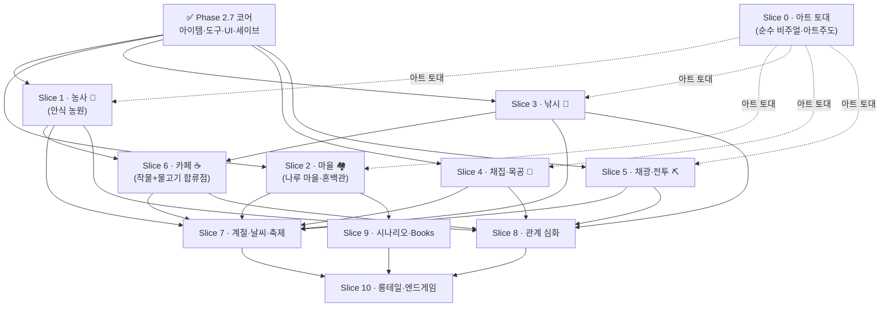

# 나라카 밸리 — 개발 로드맵

> **비전:** 나라카(저승 컨셉카페) 세계관의 **진짜 스타듀밸리형** 게임 (농사·낚시·채광·관계). Godot · Steam/PC.
> **핵심 원칙:** ① 한 시스템을 100%로 끝내고 다음으로. ② 빌드 = **시스템별 "그레이박스 메카닉→아트" 인터리브**([ADR-0028](./docs/adr/0028-build-workflow-greybox-art-interleave-no-fun-gate.md)). ③ 설계 먼저 굳히고(전수 그릴 — **2026-06-29 큐 소진**) 빌드. ④ **무조건 출시 = 재미 게이트(go/no-go) 폐지**([ADR-0028]).
> 상세 용어는 [CONTEXT.md](./CONTEXT.md), 핵심 결정은 [docs/adr/](./docs/adr/) 참조.

> ✅ **2026-06-29 — 전면 재배치 완료.** 스타듀 위키 전수 그릴로 **전 시스템 grill 큐가 소진**됐다(②~⑩, [ADR-0029](./docs/adr/0029-cafe-relationship-stage-domain-aligned-rewards.md)~[ADR-0034](./docs/adr/0034-books-narrative-discovery-okja-lost-books-mechanic-track.md), [stardew-systems-catalog](./docs/design/stardew-systems-catalog.md)). 그 결과를 빌드 순서로 정렬한 **[빌드 슬라이스 계획](#빌드-슬라이스-계획--adr-0028-인터리브-2026-06-29-전면-재배치)** 이 forward 진실원천이다.
> - **위 Phase 1·1.5·2.5·2.7 + Phase 2.8 T0–T3 = 완료 기록(역사·불변).** 단 Phase 2 캐릭터/룩 에셋은 아트 피벗([ADR-0026] 스타듀 룩 전면 교체)으로 *재작업 대상*(→ Slice 0).
> - **옛 Phase 2.8 T4~·Phase 3 백로그 = 상세 레퍼런스로 보존**(ADR·game-loops 링크). **착수 순서·내용은 [빌드 슬라이스 계획]이 대체**한다.
> - 모델 = ADR-0028 *시스템별 그레이박스 메카닉→아트 수직 슬라이스*(수평 레이어 폐기)·**재미 게이트 폐지**(무조건 출시).

> **이 로드맵 읽는 법**
> - 각 작업은 `- [ ] T1.1 — 작업명` 형태의 **1~2일 내 완료·검증 가능한 원자 단위**다.
> - `완료기준:` = 이 줄을 만족하면 그 작업은 끝난 것. `의존:` = 먼저 끝나 있어야 할 선행 작업.
> - 각 Sprint 끝의 **▶ 플레이 산출물** = 그 2주가 끝나면 **직접 플레이되는 무언가**(파트타임 동력 유지 규칙).
> - 여기 작업 분해는 shrimp-task-manager에도 동일하게 등록되어 있다(진행 추적용).
> - ⚠️ Phase 1은 **회색 도형(그레이박스)만** 쓴다. 도트·초상화·사운드 에셋은 재미 게이트 통과 후 Phase 2에서만 입힌다(ADR-0001).
> - ⚠️ `.claude/rules/`의 웹(Next.js/Supabase) 규칙은 **게임 본체에 적용하지 않는다.** 게임은 Godot/GDScript다(ADR-0002).

---

## Phase 1 — 그레이박스 재미검증 프로토타입 (목표: 약 8주 / 파트타임)

**가용 시간:** 평일 저녁 + 주말 = 주 ~20h. 아래 스프린트는 각 **약 2주** 분량.
**목표:** 회색 도형만으로 첫 수직 슬라이스(**농사 코어 + 미호 + 14일**)를 끝까지 굴려, **"재밌나?"를 그래픽 없이 검증.**
**게이트:** Phase 1 끝 = 직접 플레이테스트 → 재미 판정 → 통과 시 Phase 2, 실패 시 루프 재설계.

### Sprint 1 (~2주) — Godot 학습 + 기술 스파이크  ⚠️ 최대 리스크 구간

- [x] **T1.1 — Godot 설치 + 첫 튜토리얼 완주**
  - 완료기준: 공식 입문 튜토리얼 게임이 실행되고, 노드·시그널·`_process`의 역할을 본인 말로 설명할 수 있다.
  - 의존: 없음 · 메모: 에셋 제작 금지(ADR-0001), 학습용 코드만.
- [x] **T1.2 — 320×180 정수배 스케일 뷰포트 설정**
  - 완료기준: 창 크기를 바꿔도 픽셀이 정수배(2x/3x/4x)로만 확대되고 가장자리 뭉개짐이 없다.
  - 의존: T1.1 · 메모: ADR-0003 픽셀규격. 이후 모든 화면 작업의 기준.
  - 산출물: 게임 본체 프로젝트 `game/` 생성(`stretch/scale_mode=integer` + Nearest 필터 + 픽셀 스냅). 검증 씬(체커보드·대각선·배율 readout)으로 정수배 확인.
- [x] **T1.3 — 캐릭터 그레이박스 이동 + 충돌**
  - 완료기준: 회색 캐릭터(16×32 자리)가 탑다운 4방향으로 부드럽게 움직이고 벽을 통과하지 못한다.
  - 의존: T1.2 · 메모: 대각선 이동 정규화. 회색 도형만.
- [x] **T1.4 — 16×16 타일맵 더미 맵 1개**
  - 완료기준: 캐릭터가 더미 맵을 돌아다니며 밭·집·카페 구역을 시각적으로 구분할 수 있다.
  - 의존: T1.3 · 메모: 온보딩 동선(도착→집→밭→카페)을 염두에 둔 배치.
  - 산출물: `TileMapLayer` + 코드 조립 TileSet(단색 6종, ADR-0001 그레이박스). 40×24 맵 + 추적 카메라, 집·카페=벽+문/밭=열린 구역, WALL 타일 충돌, readout 구역 판정.
- [x] **T1.5 — 하루 사이클 + 취침 진행 (회색 UI)**
  - 완료기준: 시간이 흐르고, 취침하면 날짜가 +1 되며 시간이 아침으로 리셋된다.
  - 의존: T1.4 · 메모: 혼력 회복·작물 성장의 트리거가 됨.
  - 산출물: `clock.gd`(`GameClock` 노드) — 06:00~24:00 시계, 90초/일. `minute_ticked`/`day_advanced`/`collapsed` 시그널로 후속 시스템(혼력·작물) 훅 노출. 집 구역 Enter 취침(페이드 연출)·24:00 강제 취침. 우상단 `Day N HH:MM 단계` 회색 UI.
- [x] **T1.6 — ⚠️ Sprint 1 리스크 게이트 (Godot 확신 판정)**
  - 완료기준: T1.2~T1.5 통합 빌드가 돌아가고, "Godot으로 이게 되겠다"는 진행/재조정 결정을 근거와 함께 내렸다.
  - 의존: T1.5 · 메모: 최대 리스크 구간. **확신 안 서면 정직하게 일정 재조정** — 번아웃 방지가 우선.
  - **판정: 진행(GO) → Sprint 2.** 근거: ① 통합 빌드 클린(헤드리스 임포트+구동, 에러·경고 0). ② 스타듀 코어 원시요소(타일 월드·이동/충돌·시간/날짜·UI)를 Sprint 1에서 모두 구현 — 잔여 Phase 1은 새 Godot 난관이 아니라 이 원시요소들의 **조합**. ③ 비자명 API 직접 조립(런타임 TileSet+물리 레이어, 시그널 디커플링, Tween) + 헤드리스 검증·단위테스트 워크플로우 확립. · 주의(추적): 세이브/로드(T2.5) 직렬화 미검증 — Sprint 2 잔여 최대 리스크. 번아웃 방지 원칙 유지.

**▶ 플레이 산출물:** 회색 캐릭터로 더미 맵을 돌아다니다 잠들면 다음 날이 된다.

### Sprint 2 (~2주) — 농사 코어 + 혼력 + 세이브

- [x] **T2.1 — 밭 칸 상호작용: 괭이질 → 심기 → 물주기**
  - 완료기준: 한 칸에서 괭이질→심기→물주기가 순서대로 되고 칸 상태(미경작/경작/심김/젖음)가 시각적으로 바뀐다.
  - 의존: T1.6 · 메모: 그레이박스 플레이스홀더. **구현: `field.gd`(`FarmField` 노드, 단일 책임+`tile_changed` 시그널) + `main`의 오버레이 타일·앞칸 커서·`E` 단일키 흐름. 순서는 `next_action()`이 강제. 헤드리스 단위검증 통과.**
- [x] **T2.2 — 저승 작물 3종 데이터 정의**
  - 완료기준: 혼령초(빠름·저수익)/피안화(중간)/영혼 호박(느림·고수익) 3종이 데이터로 정의되고 성장일수가 빠름<중간<느림으로 구분된다.
  - 의존: T1.6 (T2.1과 병렬 가능) · 메모: [CONTEXT](./CONTEXT.md) '저승 작물' 용어 그대로. **구현: `crops.gd`(`CropCatalog`) — 정적 참조 데이터(씬 노드 아닌 `static const`+`class_name`). `id`(코드·세이브)↔`name_ko`(표시) 분리, `growth_days` 3<5<8, `seed_cost`/`sell_price`로 저수익(+10)<고수익(+110). T2.3 성장이 붙을 조회 API 노출. 헤드리스 단위검증 통과.**
- [x] **T2.3 — 작물 성장(일수 경과) 연결**
  - 완료기준: 심은 작물이 날이 지나며 단계가 오르고, 다 자라면 수확 가능 표시가 뜬다.
  - 의존: T2.1, T2.2, T1.5 · 메모: 취침 시 성장 카운터 갱신(물 준 경우 등 규칙). **구현: `GameClock.day_advanced` → `FarmField.advance_day()`(시그널 디커플링). 스타듀 규칙 — 물 준(`watered`) 칸만 `grown_days +1`, 그 뒤 모든 칸은 아침에 마름. 칸에 `crop`/`grown_days` 추가(상태), 성장일수는 `CropCatalog` 조회(데이터 분리). `next_action`에 수확 추가(괭이질→심기→물주기→수확), `Q`로 작물 순환 선택. 오버레이 8타일(씨앗/새싹/수확가능-황금). 헤드리스 단위검증+통합빌드 클린 통과.**
- [x] **T2.4 — 혼력(에너지) 행동당 소모 + 취침 회복**
  - 완료기준: 행동 시 혼력이 줄고, 0이면 행동이 막히며, 취침하면 가득 찬다.
  - 의존: T2.1 · 메모: 단순 고정값으로 시작, 밸런싱은 후속(CONTEXT '혼력'). **구현: `energy.gd`(`SoulEnergy` 노드, 단일 책임+`changed`/`depleted` 시그널). 행동당 고정 소모(`COST_PER_ACTION` 10), `MAX`(100)가 COST 배수라 딱 10회 행동 후 정확히 0→`can_act()` false로 `main`이 `interact` 차단(음수 방지). 회복은 `GameClock.day_advanced`→`refill()`(작물 성장과 같은 훅, 시그널 디커플링). 좌상단 `혼력 NN/100` HUD + 바닥 시 안내 전환. 헤드리스 단위검증(가득→0→막힘→회복) + 통합빌드 클린 통과.**
- [x] **T2.5 — 세이브/로드 최소 직렬화**
  - 완료기준: 저장 후 게임을 껐다 켜도 날짜·밭·작물·혼력·골드가 그대로 복원된다.
  - 의존: T2.3, T2.4 · 메모: 단일 슬롯. 다중 슬롯·암호화는 후속(범위 폭주 방지). **구현: `save.gd`(`SaveManager` 노드, 파일 IO 단일 책임) — `user://save.dat` 단일 슬롯. `var_to_str`/`str_to_var`로 직렬화(밭 `_tiles`의 Vector2i 키를 타입째 라운드트립 — JSON 회피). 각 노드 `to_save()`/`load_save()`가 자기 상태만 직렬화(`GameClock` 날짜·분, `SoulEnergy` 혼력, `FarmField` 밭 Dictionary), `main`이 수집·분배 조율. `FarmField.load_save`는 칸마다 `tile_changed` 발화로 오버레이 동기화(로드도 시그널 디커플링). 취침 시 자동 저장 + `F5` 수동 저장, 시작 시 `has_save()`면 자동 로드 + `F9` 수동 로드 → "껐다 켜도 그대로" 성립. 손상·버전 불일치 방어(`{}` → 새 게임), 혼력 clamp. **골드는 T3.1에서 `main`에 한 줄 추가로 직렬화**(`SaveManager`는 IO만이라 불변). 헤드리스 단위검증(노드별 라운드트립·파일 경유 Vector2i 키 보존·복원 시 `tile_changed` 수·손상/버전 방어)+통합빌드 클린 통과.**

**▶ 플레이 산출물:** 심고-물주고-키워서 수확하는 한 사이클이 돌고, 저장·복원된다.

### Sprint 3 (~2주) — 경제 + 미호 + 관계 루프

- [x] **T3.1 — 카페 출하대: 수확물 → 골드 → 씨앗 재구매**
  - 완료기준: 수확물을 팔아 골드를 얻고 그 골드로 씨앗을 사서 다시 심는 한 바퀴가 돈다(작은 순환 폐쇄).
  - 의존: T2.5 · 메모: 회색 UI. **구현: `wallet.gd`(`Wallet` 노드, 골드 단일 책임+`changed` 시그널)·`inventory.gd`(`Inventory` 노드, 수확물·씨앗 재고+`changed`). 둘 다 `energy.gd`/`field.gd`와 같은 결(순수 Dictionary 상태·시그널 디커플링·`to_save`/`load_save`). 순환: 심기 시 `inventory.take_seed`(씨앗 1 소모)·수확 시 `add_harvest`(`crop_of`로 거둘 id 미리 확보) → 카페 구역 안 `E`로 출하대 패널 토글, `S`=수확물 전량 판매(`sell_price` 합산→`wallet.earn`)·`B`=선택 작물 씨앗 구매(`seed_cost`→`wallet.spend`). 가격은 `CropCatalog.seed_cost`/`sell_price` 헬퍼로 조회(데이터 분리). 종잣돈은 골드(START_GOLD 0)가 아니라 시작 씨앗(`START_SEEDS` 혼령초 3)으로 줘 첫 수확→판매로 골드가 처음 생기는 자연스러운 폐쇄. 씨앗 0이면 심기 막힘·"카페에서 구매" 안내. 세이브는 `main`이 `wallet`/`inventory` 두 조각 추가(설계대로 `SaveManager`는 불변). 헤드리스 단위검증(골드 earn/spend·음수 방지·clamp / 재고 누적·소모·0키 삭제·카탈로그 검증·손상 방어 / 시작 씨앗 / 순환 폐쇄 시나리오)+통합 임포트·구동 클린(에러·경고 0).**
- [x] **T3.2 — 미호 NPC 배치 + 대화 텍스트박스**
  - 완료기준: 미호에게 말 걸면 텍스트박스가 뜨고 끝까지 넘기면 닫힌다.
  - 의존: T2.5 · 메모: 초상화 일러스트는 Phase 2. 지금은 회색 박스+텍스트만. **구현: `miho.gd`(`Miho` 노드, Node2D) — `player.gd`처럼 16×32 회색 자리를 `_draw`로 그리되 따뜻한 톤+여우귀 뿔로 구분. 대사(`LINES`)는 캐릭터가 들고 옴(ADR-0005: 서사는 캐릭터에만), 밝은 멘토+"파괴의 불→양육의 불" 속죄(ADR-0004)를 담되 메인 플롯 비의존 온보딩성. `dialogue.gd`(`DialogueBox` 노드)는 화자·줄·열림만 들고 `start`/`advance`/`is_last`/`progress` + `changed`/`finished` 시그널을 내는 **순수 진행기**(누구 대사든 모름 → 멜·바나 재사용). 대화는 일시 상태라 세이브 안 함(호감도는 T3.3). `main`: 미호는 밭 남쪽 입구 칸(`MIHO_TILE 20,14`)에 세워 길에서 위를 보면 바로 향하게(멘토가 문 앞에서 맞이) + 그 칸은 `_is_farmable`에서 제외해 밭 동작과 충돌 방지. 바라보는 칸이 미호면 `E`로 `dialogue.start`(밭 동작보다 우선), 대화 중엔 player 물리를 꺼 이동 잠금 후 `E`로 한 줄씩 넘기고 끝나면 패널 숨김+이동 잠금 해제. 패널은 `changed` 시그널로 갱신(시그널 디커플링), 하단 프롬프트 우선순위에 "[E] 미호와 대화" 추가. 헤드리스 단위검증(빈 대사 무시·시작 시 첫 줄·열린 중 재시작 무시·줄 넘김·마지막 판정·끝까지 넘기면 닫힘+`finished` 1회·`changed`=줄 수·닫힌 뒤 advance 무시·미호 대사/이름)+통합 임포트·구동 클린(에러·경고 0).**
- [x] **T3.3 — 호감도(하트): 일일 대화 + 선물**
  - 완료기준: 일일 대화(하루 1회 소폭)와 선물(영혼 호박 선호)로 호감도가 오르고 하트 단계가 UI에 반영된다.
  - 의존: T3.2, T3.1 · 메모: CONTEXT '호감도' 이중보상. **구현: `affinity.gd`(`Affinity` 노드, energy·wallet과 같은 결 — "미호 호감도 수치" 단일 책임 + `changed` 시그널). 두 채널로 오른다 — ㉠ 일일 대화(`daily_talk`, +5 소폭, 느린 채널) ㉡ 선물(`gift`, 일반 +15 / 선호 영혼 호박 +40, 빠른 채널). 둘 다 게임 날짜(`GameClock.day`)로 "하루 1회" 게이팅(`can_daily_talk`/`can_gift` — 같은 날 중복 보상 방지). 하트 = 점수 / `POINTS_PER_HEART`(50) 내림, `MAX_HEARTS`(5)에서 멈춤(`clampi`). 트리거(말걸기·G 선물)·HUD·여우불 연동(T3.4)은 `main`이 맡고 노드는 상태+시그널만(시그널 디커플링). `main`: 미호 바라보고 `E`면 `_start_dialogue`가 `affinity.daily_talk(clock.day)`로 오늘 첫 대화에만 소폭 지급 + 그 결과(first_today)·현재 하트로 `miho.lines(hearts, first_today)`가 대사 묶음을 고름(ADR-0005: 서사는 캐릭터에만 — 하트0 온보딩 / 1~2 속죄 한 토막 '방화→양육' / 3+ 더 깊은 토막 + 여우불 떡밥 / 오늘 두번째면 짧은 인사). `G`면 `_try_gift`가 선택 작물(`_selected_crop`) 수확물 1개를 `inventory.take_harvest`로 소모하고 `affinity.gift` 적용(없음·중복선물 방어 + notice). HUD: 좌상단 `미호 ♥♥♡♡♡ N/5` 하트 막대(`heart_bar`) — **하트 단계가 UI에 반영**(완료기준). 프롬프트 `[E] 대화  [G] OO 선물`. 세이브: `main._save_game`에 `affinity` 한 조각 추가(점수·마지막 대화날·마지막 선물날 정수 셋 — `SaveManager` 불변), 복원 시 점수 [0,MAX] clamp·게이팅 날짜 보존. 헤드리스 단위검증(시작0·하트0·빈 막대 / 선호 판정 / 일일 대화 소폭·같은날 중복 금지·이튿날 재지급 / 선물 일반15·선호40·같은날 중복 금지 / 55점→1하트·막대 / MAX clamp / 세이브 라운드트립·게이팅 유지·손상/음수 방어 / `take_harvest` 소모·0키 삭제·없음 실패 / 미호 대사 하트단계·첫대화 분기)+통합 임포트·구동 클린(에러·경고 0).**
- [x] **T3.4 — 여우불 성장 촉진 (A 방식: 관계 보상형)**
  - 완료기준: 미호 호감도가 높을수록 작물이 더 빨리/넓게 자라는 차이가 체감된다.
  - 의존: T3.3, T2.3 · 메모: ADR-0004 속죄 테마(미호: 방화→양육). 관계와 농사 루프가 한 몸. **구현: `foxfire.gd`(`Foxfire` — crops.gd처럼 static class_name 규칙, 세이브 상태 아님). 여우불 세기는 호감도 하트에서 매번 파생되므로 자체 상태가 없다 → 세이브할 게 없다(`SaveManager`·main 세이브 불변). 두 축으로 돕고 둘 다 하트와 함께 큰다('빨리'·'넓게' 분리 체감): ㉠ 가속(`accel`, 하트 2칸당 +1 → 0/0/1/1/2/2) — 물 준 칸이 하룻밤에 `+1+accel` 자란다 ㉡ 범위(`reach`, 하트당 1칸 → 0..5) — 물 못 준 심긴 칸을 reach개까지 여우불이 대신 `+1` 돌본다(양육의 불). 하트0이면 둘 다 0 = 여우불 잠듦(순수 스타듀 성장 — 보상이 관계에 게이팅, 방식 A). 입력 하트는 [0,MAX]로 자름(방어). `field.gd`: `advance_day(accel:=0, reach:=0)`로 인자화(기본 0 = 기존 T2.3 동작 그대로). 범위 후보는 마름 전(밤 상태)에 (y,x) 정렬 순으로 골라 결정적(헤드리스 재현성)이고, 물 준 칸은 후보에서 빠져 가속·범위 이중적용을 막는다. `_grow`가 성장일수를 작물 한계(`growth_days`)까지만 잰다(가속 과성장 방지). `field.gd`는 `Foxfire`/`Affinity`를 모르고 값만 받아 적용(디커플링). `main`: `_on_day_advanced`가 `affinity.hearts()`로 `Foxfire.accel/reach`를 파생해 `farm.advance_day(...)`에 넘긴다. HUD: `Foxfire.summary(hearts)` 한 줄(`여우불: N칸 돌봄 · 자람 +M` / 하트0이면 `여우불: 잠듦 — 미호와 친해지면 깨어난다`)로 관계→농사 보상을 눈에 보이게(체감). 헤드리스 단위검증(accel/reach 하트별 매핑·음수/초과 clamp·is_awake·summary 텍스트 / 가속0=기존 스타듀 / 가속2 단번 성숙 / 가속 과성장 방지 / 범위 정렬 순 선택·한도 / 물 준 칸 이중적용 없음 / 성숙 칸 제외)+통합 임포트·구동 클린(에러·경고 0).**
- [x] **T3.5 — 수확 시 사연 한 줄 표시**
  - 완료기준: 수확할 때마다 그 영혼의 생전 사연 한 줄(플레이버 텍스트)이 팝업으로 표시된다.
  - 의존: T3.4 · 메모: 텍스트 한 줄로 세계관 깊이를 더하는 저비용 장치. **구현: `flavor.gd`(`SoulMemory` — crops.gd·foxfire.gd처럼 static class_name 규칙, 세이브 상태 아님). 작물 id별 생전 사연 묶음(각 5줄)을 한 곳에 모은다. 작물 톤은 CONTEXT '저승 작물'을 따름(혼령초=소박·무명 / 피안화=이별·기다림 / 영혼 호박=핼러윈·축제 — CONTEXT 예시 "핼러윈을 가장 좋아했대"도 포함). ADR-0005 경계: 사연 한 줄은 메인 서사(미결의 죄·옥자 인연)도 캐릭터 속죄 서사도 아닌, 작물이 된 익명 영혼들의 가벼운 양념 → 메인 플롯에 의존하지 않는 자기완결 장치라 데이터를 캐릭터가 아니라 작물 쪽(`flavor.gd`)에 둠. `line(crop_id, index)`가 index를 줄 수로 나눈 나머지로 결정적 선택(난수 없음 → 헤드리스 재현 가능, 음수 index도 `posmod`로 안전), 없는/빈 id면 ""(표시 생략). `main`: 수확 시 `_show_flavor`가 작물별 수확 누적 횟수(`_harvest_seen`, 일시 표시용이라 세이브 안 함 — 대화와 같은 결)를 index로 넘겨 한 줄을 골라 `_notice(line, FLAVOR_SECS)`로 팝업(`_notice`에 지속시간 인자 추가 — 사연은 3.5초로 읽을 시간↑, 저장됨 등은 2초). `main`이 `SoulMemory`를 알되 표시 방식은 main이 정함(데이터 디커플링). 새 노드 없이 기존 알림 라벨 재사용(저비용). 헤드리스 단위검증(작물별 사연 존재·없는/빈 id count 0 / 카탈로그 작물 모두 사연 보유 / 묶음 안 0..4 서로 다른 줄 / index 순환(5==0,6==1)·결정성·음수 posmod / 없는·빈 id 빈 문자열 / 핼러윈 예시 포함 / 수확 카운터 순환 시뮬레이션)+통합 임포트·구동 클린(에러·경고 0).**

**▶ 플레이 산출물:** "친해질수록 농사 잘 됨"의 이중 보상이 체감되고, 경제 순환이 닫힌다.

### Sprint 4 (~2주) — 온보딩 + 폴리시 + ★재미 게이트

- [x] **T4.1 — 온보딩 흐름: 도착 → 옥자 통보 → 미호 멘토 → 튜토리얼 → 첫 수확**
  - 완료기준: 신규 시작 시 도착부터 첫 수확까지 안내가 끊김 없이 이어진다.
  - 의존: T3.5 · 메모: 옥자는 오프닝에 잠깐 등장(CONTEXT '온보딩'). **구현: `onboarding.gd`(`Onboarding` 노드 — affinity처럼 상태+시그널)가 단계 머신(`NOTICE→MEET_MIHO→TILL→PLANT→WATER→GROW→HARVEST→DONE`)을 들고, 각 사건은 그 단계일 때만 전진(`_advance_from` 가드 → 순서·멱등 안전, 행동을 막지 않고 안내만). 단계가 `field.next_action`의 강제 순서에 매핑돼 안내가 자연히 끊김 없이 이어진다. 옥자 통보 대사는 `okja.gd`(`Okja`)가 듦(ADR-0005: 서사는 캐릭터에 — 종신계약 통보+밭 일 떠넘김+미호 소개+'미결의 죄' 떡밥, 죄목은 봉인). 옥자는 상시 NPC 아닌 오프닝 컷신용 — `main`이 스폰 앞 칸에 통보 때만 세우고 끝나면 숨김(CONTEXT '옥자': 잠깐 등장), 미호와 대비되게 어둡게 그림. 옥자·미호 모두 같은 `DialogueBox` 재사용 — 끝났을 때 어떤 대화였는지는 현재 단계로 가름(NOTICE=옥자/MEET_MIHO=미호, 이후 일상 대화는 단계 가드로 no-op). 밭 동작 직후 `main._advance_onboarding(action)`가 단계를 넘기고, 취침으로 `farm.any_mature()`면 `GROW→HARVEST`. 상단 중앙 `OnboardingLabel` 배너가 `onboarding.guidance()`를 매 프레임 폴링(대화·상점 패널 뜨면 숨김, NOTICE/DONE은 ""). 세이브에 단계 한 조각 추가([NOTICE,DONE] clamp) → 재생 방지·중도 재개·신규는 NOTICE에서 옥자 컷신 자동. 헤드리스 단위검증(시작 NOTICE·정상 7전이·단계별 안내·엉뚱/중복/DONE 정지·세이브 라운드트립·clamp·옥자 대사·any_mature)+통합 임포트·구동 클린(에러·경고 0).**
- [x] **T4.2 — 14일 분량으로 묶어 시작~끝 플레이**
  - 완료기준: 처음부터 14일 끝까지 한 번도 막히지 않고 플레이되고, 14일 종료 시 마무리 화면이 뜬다.
  - 의존: T4.1 · 메모: Phase 1 수직 슬라이스 = 농사 코어+미호+14일. **구현: `summary.gd`(`RunSummary` — crops.gd·foxfire.gd·flavor.gd처럼 static class_name, 세이브 상태 아님). 슬라이스 분량 `RUN_DAYS=14` 한 곳에 두고, 끝남은 이미 저장되는 `GameClock.day`에서 파생한다(`is_over(day)` = day>14 → 15일째 아침이 끝) → 별도 finished 플래그 불필요(재현·재개 안전). 마무리 점수판 문구(`text`)도 여기서 조립 — 살아낸 날(`days_survived`, [0,14] clamp)·미호 하트 막대·골드·거둔 영혼 총수. ADR-0005 경계: 점수판은 메인 서사도 캐릭터 속죄 서사도 아닌 슬라이스를 닫는 메타 화면이라 플롯 비의존(가벼운 마무리 톤만). `main`: `_on_day_advanced`가 취침으로 15일째가 오면 성장·회복을 생략하고 `_end_run`(시계 정지·이동 잠금·전체화면 `EndingPanel`에 점수판 표시, `_run_over` 가드로 멱등). `_on_sleep_done`은 `_run_over`면 이동 잠금을 풀지 않고, `_process`는 맨 앞에서 early-return해 모든 게임 입력을 막는다. `_ready`는 로드 후 `RunSummary.is_over(clock.day)`면 옥자 컷신 대신 바로 `_end_run`(이어받은 14일 완료 세이브 → 마무리 화면). 점수판의 '거둔 영혼' 총수는 main이 `_run_harvested`(수확마다 +1, 세이브 — 일시 표시용 `_harvest_seen`과 달리 재개에도 맞아야 함)로 누적, 음수 손상 방어. 무막힘은 구조로 보장 — 혼령초 sell(20)≥seed(10)+START_SEEDS 3이라 수확 1회로 씨앗 재구매(소순환 폐쇄). 헤드리스 단위검증(RUN_DAYS·is_over 경계 13/14/15·초과·days_survived clamp·점수판 문구 / 혼령초 경제 무막힘 불변식·시작 씨앗 / 실제 시스템 노드로 하트0(여우불 없음, 최악) 14일 풀 시뮬레이션 — soft-lock 0일·수확 발생·15일째 도달)+통합 임포트·구동 클린(에러·경고 0).**
- [x] **T4.3 — 밸런싱 1차 + 버그 잡기**
  - 완료기준: 작물 가격·성장일·혼력 소모가 조정되어 14일이 지루/불가능하지 않고, 알려진 크래시 버그가 없다.
  - 의존: T4.2 · 메모: 원칙 "끝까지 플레이되는 것 > 기능 많음 > 예쁨". 정밀 밸런싱은 후속. **구현: 스타듀밸리와 농사 루프를 3층(일일/선택/성장곡선)으로 비교(`docs/design/game-loops.md` — 넓이의 청사진)한 결과, 14일 슬라이스에서 우상향 엔진은 사실상 여우불(관계 보상) 하나뿐인데 그게 안 열리는 게 최대 '지루' 요인 → 1차 밸런싱은 여우불 곡선 켜기에 집중. 헤드리스 시뮬로 진단: 현재 수치는 대화만 시 ♡1=D10(목표 D5의 2배 느림), 경제 정상 운영 시 선물 잉여가 없어 선물 채널이 죽음. 조정: `affinity.gd` 일일대화 `5→8`·하트임계 `50→40` → 목표 곡선(♡1≈D5·♡2≈D10·♡3≈D14, `miho-heart-arc.md`) 달성. **대화만으로 ♡2(여우불 '번짐'=가속+1·2칸)까지 보장**, ♡3은 선물이 밀어 올림(영혼 호박 1개=40점=1하트). `foxfire.gd`(♡1점화→♡2번짐→♡3만개)·작물 수익 곡선(느릴수록 일당효율↑)은 유지(회귀 확인). 버그: 코드 정독상 방어적 가드 일관(clamp/has_crop/can_act/can_afford)이라 크래시 0 — 헤드리스 단위검증 48단언으로 확인. 소프트락(수확물 전량 선물)은 정상 판매로 무막힘 보장되는 비정상 플레이라 안전망 미설치(범위 보호). 헤드리스 단위검증(호감도 곡선 D5·D10·중복대화·선물·만렙200 clamp·세이브 / 여우불 매핑·clamp·♡2가속 / 경제 무막힘·일당효율 / 슬라이스 경계 / 14일 통합시뮬 대화만 ♡2도달·soft-lock0·수확발생)+통합 임포트·구동 클린(에러·경고 0).**
- [x] **T4.4 — ★ 재미 게이트: 14일 직접 플레이테스트 판정**
  - 완료기준: 직접(가능하면 1~2인) 14일을 플레이테스트하고 "또 하고 싶나?"에 대한 통과/재설계 결정을 근거와 함께 내렸다.
  - 의존: T4.3 · 메모: **통과 → Phase 2(에셋), 실패 → 루프 재설계.** 정직한 판정이 전체 방향을 가른다. **구현: 봇으로 근거 수집 + 판정 초안. `playtest/playtest_bot.gd`(헤드리스 자동 플레이어 — T4.2/T4.3 시뮬과 같은 결, 실제 시스템 노드 직접 구동)가 핵심 3종 페르소나(Talker 대화만 / Gifter 선물 집중 / Farmer 관계 무시·경제)로 14일을 완주시켜 일별 지표(골드·하트·여우불·수확·혼력) 수집. 봇은 재미를 못 느끼므로 '또 하고 싶나'(주관)는 판정하지 않고 재미의 전제조건만 정량 검증 — 전제조건 5/5 ✓: ①무막힘(세 전략 소프트락 0일) ②우상향 엔진(대화만으로 D5 여우불 점화·D10 ♡2) ③페이싱(♡1=D5·♡2=D10, miho-heart-arc 목표 부합) ④선택의 가치(골드 160 vs 40 vs 70·하트 2/5·5/5·0/5 세 갈래) ⑤대조군(관계 무시 Farmer는 밭 2배 굴려도 여우불 잠듦·골드는 Talker 절반 — '노동량보다 관계가 강한 엔진' 정량 입증). 판정: 기술적 GO 권고(조건부) — 14일이 끝까지 굴러가고 핵심 가설('친해질수록 농사 잘 됨')이 수치로 켜짐. 최종 '또 하고 싶나'는 사람이 직접 플레이로 도장(특히 미호 외면 경로의 밋밋함=위험 A 체감 확인). 관찰된 위험 3종(A 밋밋함 / B ♡5 조기 만렙 / C 영혼 호박 14일 함정) 기록. 상세 판정서 [docs/design/t4.4-fun-gate-verdict.md](./docs/design/t4.4-fun-gate-verdict.md). ★ 사람 최종 판정(직접 플레이): **보류 — 단일 농사 루프로는 재미 판정 불가, 핵심 3루프 통합으로 게이트 확장**([ADR-0006](./docs/adr/0006-fun-gate-multi-loop.md) · Phase 1.5). 통합 임포트·구동 클린(에러·경고 0).**

**▶ 플레이 산출물:** 시작부터 14일 엔딩까지 완주되는, 재미를 판정할 수 있는 그레이박스 슬라이스.

> **★ 재미 게이트 결과(T4.4):** 봇 전제조건은 5/5 통과했으나, **직접 플레이 결과 "14일 단일 농사 루프만으로는 '또 하고 싶나'를 판정할 수 없다 — 여러 루프가 직조될 때 재미가 드러난다"**로 결론. 게이트는 **통과도 재설계도 아닌 "판정 보류 — 범위 확장"**으로 종결하고, 핵심 3캐릭터 루프 통합 그레이박스로 판정 대상을 넓힌다([ADR-0006](./docs/adr/0006-fun-gate-multi-loop.md)). → **Phase 1.5.**

---

## Phase 1.5 — 핵심 3루프 통합 그레이박스 (재미 게이트 재도전)

> **왜:** 스타듀형 재미는 단일 루프가 아니라 **루프들의 직조**에서 나온다([game-loops](./docs/design/game-loops.md) 0·5절). 농사(1층만 완성·3층은 여우불 하나)만으로는 평평해 게이트를 정직히 판정할 수 없었다(ADR-0006). 세 속죄 캐릭터(미호·멜·바나)의 활동 루프가 **낮↔밤으로 어우러지는** 그레이박스 슬라이스 위에서 재판정한다.
> **범위 통제(ADR-0006 — 게이트 손절 기능 보존):** 멜·바나는 **1층 MVP + 관계 보상축 + 직조까지만**. 순수활동(낚시·채광·전투)·합류점(가공)·**에셋은 통합 게이트 통과 후**(Phase 2·3 유지). "한 번에 한 루프 끝까지" 원칙 유지(멜 → 바나 → 직조 순차, 동시 X).
> **성장 모델·매크로 목표(Sprint 5 착수 grill):** 관계 = *게이트가 아니라 곱셈기*(♡0에서도 base 메카닉 굴러감), 곱셈기 종류 분화(미호=자동화·멜=마진·바나=보호), 이야기만 게이트 — [ADR-0008](./docs/adr/0008-growth-model-relationship-multiplier.md). 루프들이 향하는 매크로 목표 = "카페 명소 일구기"(멀티루프 마일스톤 = 커뮤니티 센터 번들 대응), 통합 게이트에 1단 그레이박스 — [ADR-0009](./docs/adr/0009-macro-goal-build-the-cafe.md).
> ⚠️ 각 Sprint 착수 시 **grill 세션**으로 game-loops 4절 '서랍'(멜·바나 관계 보상축 *내용*·직조 방식·MVP 범위)을 먼저 채우고 원자 분해한다(세부 T번호는 그때 확정). 아래는 Sprint 골격이다.

### Sprint 5 (~2주) — 멜: 카페 운영 루프 1층 MVP

> **착수 grill 완료([ADR-0007](./docs/adr/0007-mel-cafe-operation-loop.md)):** 원안 "카페 경제·회계(돈 관리)"는 *추상 금융은 재미가 안 난다*(예금·투기·대출 다 기각 — 돈은 활동이 아니라 활동의 결과)는 결론으로, 멜 루프를 **플레이어가 직접 하는 "카페 운영 활동"**(손님 응대·서빙 + 출하대 + 정산)으로 재정의했다. **정체성 격상이 아니라 멀티루프에 루프 하나 추가**(농사 강등 없음, ADR-0002 불변). **그레이박스 최소부터**, 깊은 층(체키·손님 다양성·메뉴 가공·시세)은 통합 게이트 후. 멜=옥자 '사실' 조각(ADR-0005), 손님=가벼운 단골(서사·호감도 없음).

> **1층 메카닉 grill 확정(2026-06-20):** 서빙 = **좌석 착석형**(손님 착석 → 플레이어가 자리로 걸어가 `E`). 주문 = **아무 재료 1회**(특정 작물 요구·손님 다양성은 2층), 서빙 시 보유 재료 1개 **자동 소모**. 경제 = **정액 서빙가 P**(재료 무관), `P > raw 판매가`라 "raw 덤프(즉시·적게) vs 시간 내 서빙(많게)"가 공급사슬 긴장(희소성=시간, ADR-0008). **인내심 바**(제때 못 가면 이탈=매출 손실, 벌칙·누적 이탈 없음 → 무막힘; 바나 '응대 보호' seam의 자리). **하루 3슬롯:** 06–15 밭일 / **15–19 카페 영업(멜)** / 19–24 빈 밤(Sprint 6 바나 바가 채움) / 24:00 취침. 멜 마진 = **단가 배수**(♡0 ×1.0 → ♡2 ×1.4 → ♡5 ×2.0). 멜 선호 선물 = **피안화**(미호=영혼 호박과 분산). **seam(코드베이스 시그니처):** 서빙 수익 `base_P × margin(♡)` 한 값 + 인내심을 파라미터(기본값)로 소싱 → T5.5 마진·Sprint 6 바나 보호가 `advance_day(accel,reach)`·바나 `{격퇴,약탈량}` 계약처럼 *구현 교체*로 얹힘. `cafe.gd`는 **세이브 무상태**(손님=일시적, dialogue 결), 세이브 추가분은 멜 affinity 한 조각뿐(`SaveManager` 불변). 새 ADR·CONTEXT 변경 불요(되돌리기 쌈 그레이박스 선택·시간 수치는 밸런싱).

- [x] **T5.1 — 멜 NPC 카페 배치 + 대화 텍스트박스**
  - 완료기준: 멜이 카페 안에 서 있고, 말 걸면 텍스트박스로 대사가 뜨고 끝까지 넘기면 닫힌다.
  - 의존: T4.3 · 메모: `miho.gd`/`dialogue.gd` 틀 재사용. 강시 그레이박스(회색 + 모티프 암시). 대사는 캐릭터가 듦(ADR-0005). 밝은 미호와 대비되는 멜 톤. **구현: `mel.gd`(강시 청록 그레이박스 + 이마 부적·청 관모 모티프, 시크·건조 톤, 역할·가벼운 속죄 암시 — '사실 조각'은 ♡4+ T5.2로 봉인). `main`이 카페 뒷벽 카운터 칸(`MEL_TILE 33,5`)에 상주 배치 + `facing_mel` E 대화(`dialogue.gd` 재사용, 카페 출하대보다 우선). 온보딩 전진을 화자(`_talking_to`)로 가드 — 멜이 미호 멘토 단계 도중 말 걸려도 오전진 방지. 헤드리스 임포트+부팅 클린.**
- [x] **T5.2 — 멜 호감도(하트): 일일 대화 + 선물**
  - 완료기준: 일일 대화(하루 1회 소폭)와 선물로 멜 호감도가 오르고 하트 단계가 UI에 반영된다.
  - 의존: T5.1 · 메모: `affinity.gd` 틀 재사용(점수·하트·일일/선물 게이팅) + [miho-heart-arc](./docs/design/miho-heart-arc.md) 곡선 재사용. **멜 선호 선물 = 피안화**(저승 상징·강시 정서, 미호=영혼 호박과 선물 경제 분산). **하트별 대사 = 톤(강시·시크) + ♡2–3 환대 속죄(돈으로 망침→환대) + ♡4+ '사실 조각' 떡밥**(봉인된 죄목의 *존재* 암시, 폭로 X — 미호 T3.3과 대칭, 메인플롯 비의존, ADR-0005). **구현: `affinity.gd` 인스턴스 하나를 멜용으로 재사용 — 곡선 상수(점수·하트·게이팅)는 미호와 공유하고 선호 작물만 인스턴스 변수(`preferred_crop`)로 분화(미호 노드 불변, `Affinity.PREFERRED_CROP` 상수는 봇 호환 위해 유지). `MelAffinity` 노드 + 하트 HUD 라벨, `mel.lines(hearts, first_today)`에 ♡2–3 환대/♡4+ 사실 조각 분기, `facing_mel` E 대화(일일)·G 선물(피안화 선호), 세이브에 `mel_affinity` 한 조각 추가(`SaveManager` 불변). 헤드리스 단위검증(선호 분화·선물 점수·인스턴스 독립·일일 게이팅·대사 분기) PASS + 임포트·부팅 클린.**
- [x] **T5.3 — 출하대를 멜 운영 형태로**
  - 완료기준: 카페 출하대(산출물 환전·씨앗 구매)가 멜을 통해 작동한다(무인 카운터 → 멜 운영). 기존 판매/구매 기능 회귀 없음.
  - 의존: T5.1 · 메모: 기존 `_process_shop` 재사용(가벼움). 멜이 카운터 얼굴. ADR-0007 재료 흐름의 '입고' 끝. **구현: 출하대 열림 조건을 "카페 구역 아무 데나 E" → "멜을 바라볼 때 F"로 좁혀 무인 카운터를 없앴다(멜이 카운터 얼굴 — T5.1 대화·T5.2 선물과 한 접점으로 통합). 멜 앞 키 분배 = `[E] 대화 · [F] 출하대 · [G] 선물`(세 동사 키 분리, 충돌 없음). `shop_toggle`(F) 액션 추가, `_process_shop(facing_mel)`이 멜 앞에서만 토글하고 멜 앞을 벗어나면 자동으로 닫힌다(상태 안 샘). 패널 본문 헤더를 "── 멜의 카페 출하대 ──"·닫기 `[F]`로 멜화. `_sell_all`/`_buy_seed` 로직은 불변(판매/구매 회귀 없음 — 시그니처·본문 동일). 세이브 무관(`_shop_open`은 직렬화 안 함). 플레이테스트 봇은 main 입력 경로가 아니라 `inventory`/`wallet` API를 직접 호출해 키 변경과 독립(봇 회귀 없음). 헤드리스 임포트+부팅 클린(에러·경고 0).**
- [x] **T5.4 — 카페 운영 1층 MVP: 손님 서빙 + 일일 정산**
  - 완료기준: 단골 손님(회색)이 카페에 와서 앉고, 플레이어가 재료로 서빙하면 골드가 들어오며, 하루 끝에 매출이 정산된다(소순환 무막힘).
  - 의존: T5.3 · 메모: **그레이박스 최소**(ADR-0007 — 회색 손님→서빙→골드). **좌석 착석형**: 손님이 빈 자리(좌석 ~3개)에 앉고 **인내심 바**가 도는 동안 플레이어가 자리로 가 `E`로 서빙 → 보유 재료 1개 자동 소모 → **정액 P** 골드(서빙 즉시 지갑 반영). 인내심 초과 시 이탈=매출 손실(+0, 벌칙·누적 이탈 없음 → **무막힘**). **15–19시 영업창**(시간 희소성), 19시 마감에 "오늘 카페 매출 +N(손님 M명)" 요약 팝업. 손님 = 가벼운 단골(서사·호감도 없음, ADR-0005). 서빙 재료는 농사 산출물(농사↔카페 직조의 첫 매듭). `cafe.gd` 단일 책임+시그널, **세이브 무상태**. **인내심을 파라미터로 소싱**(바나 응대 보호 seam). 체키·손님 다양성·메뉴 가공은 후속(범위 밖). **구현: `cafe.gd`(좌석 3개 손님 시뮬 — 영업창 15–19시에 `SPAWN_INTERVAL`마다 빈 자리에 손님 착석, 실제 delta로 인내심 카운트다운, 0이면 이탈=매출+0·벌칙 없음). `main`이 매 프레임 `cafe.tick(delta, clock.minutes)`로 구동하고, 좌석 칸(`SEAT_TILES 31/33/35,7`)을 바라볼 때 `E` 서빙 → `_cheapest_harvest`로 가장 싼 수확물 1개 자동 소모(정액가라 비싼 작물은 raw 판매로 남김 = 공급사슬 긴장) → 정액 P 즉시 지갑 반영. 손님·인내심 바는 `main._draw`가 좌석 칸에 직접 그림(노드 생성·해제 없이 그레이박스). 19시 열림→닫힘 전이에서 `closed` 시그널 → 마감 정산 팝업(매출·서빙·이탈 수, 5초 자동 해제). 영업 HUD(`CafeLabel`)로 영업 중 매출·단가 노출. ★seam: 서빙가 = `BASE_PRICE × margin`(지금 1.0 — T5.5 마진이 갈아끼움), 인내심 = `patience_secs` 기본값(Sprint 6 바나 보호가 키움). 취침 시 `cafe.end_day()`로 abandon 상태 조용히 리셋(세이브 무상태). 봇은 카페 비의존이라 회귀 없음. 헤드리스 단위검증(`playtest/cafe_test.gd` 16종: 영업창 게이팅·착석·서빙가·정산 누적·이탈 무막힘·마감 시그널·margin/인내심 seam·end_day 재개) PASS + 임포트·부팅 클린.**
- [x] **T5.5 — 멜 관계 보상축 = 마진 (여우불 대응, [ADR-0008](./docs/adr/0008-growth-model-relationship-multiplier.md))**
  - 완료기준: 멜 호감도가 높을수록 카페 운영의 *마진*(단가·팁·단골 유입·고부가 주문)이 커져 "같은 서빙인데 더 번다"가 체감된다.
  - 의존: T5.4, T5.2 · 메모: **레버 = 단가 배수**(`cafe_margin.gd`, `foxfire.gd` 틀 — static class_name·하트→배수 매핑·세이브 무상태). `P_실수령 = P_base × margin(♡)`, ♡0 ×1.0 / ♡2 ×1.4 / ♡5 ×2.0(수치는 밸런싱 서랍). **곱셈기는 게이트가 아니라 base 위에 얹는다**(♡0에서도 카페는 굴러감, ADR-0008). 멜=**마진**은 미호=자동화(노동 절감)와 종류 분리 — 여우불이 "덜 심어도", 멜이 "비싸게 팔리게"(둘이 곱해질 때 직조 쾌감). 팁·단골 유입·고부가 주문은 2층 서랍. ADR-0004 속죄(돈으로 망침 → *착취가 아니라 환대*로 카페를 굴림). **구현: `cafe_margin.gd`(`Foxfire` 틀 그대로 — static `class_name CafeMargin`·세이브 무상태·하트→배수 매핑 한 곳). 매핑은 ROADMAP 세 앵커(♡0 ×1.0 / ♡2 ×1.4 / ♡5 ×2.0)가 한 직선 위에 떨어져 분기 없이 `margin(♡) = 1.0 + 0.2×하트` 한 식으로 닫힌다(중간 ♡1 ×1.2·♡3 ×1.6·♡4 ×1.8). T5.4가 남긴 ★seam 2(`서빙가 = BASE_PRICE × margin`)를 갈아끼움 — `main`이 매 프레임 `cafe.margin = CafeMargin.margin(mel_affinity.hearts())`로 주입(여우불이 `farm.advance_day(accel,reach)`로 하트를 흘려넣는 것과 같은 다리 — `cafe.gd`는 멜 호감도를 모르고 margin 파라미터만 곱함, 디커플링). 곱셈기지 게이트 아님(♡0 ×1.0 base rate로 카페는 그대로 굴러감 — ADR-0008 평평≠막힘, `cafe.margin` 기본값 1.0이 주입 없는 테스트 하네스의 안전판). 카페 영업 HUD에 `단가 N ×M.M`로 배수를 노출(친해질수록 같은 서빙이 비싸지는 체감). 세이브 무관(마진은 멜 하트에서 매번 파생 — `SaveManager`·`cafe.gd` 세이브 무상태 불변, 추가 직렬화 0). 봇은 카페 비의존이라 회귀 없음. 헤드리스 단위검증(`playtest/cafe_margin_test.gd` 14종: 세 앵커 정확 일치·base rate 무막힘·단조 증가·선형 중간값·범위 방어·`serve_price` end-to-end 연동·summary 분기) PASS + T5.4 회귀(`cafe_test.gd` 16종) PASS + 임포트·부팅(120프레임) 클린.**
- [x] **T5.6 — 옥자 카페 상주 + 미호 카페 출근 + 세이브 통합**
  - 완료기준: 옥자가 오프닝 후 카페에 상주하고, 미호가 시간대에 따라 밭↔카페를 오가며, 멜 호감도·카페 운영 상태가 저장·복원되고 통합 빌드가 클린하다(에러·경고 0).
  - 의존: T5.5 · 메모: **최소 3슬롯 배치** — 멜=카페 상주(영업 중 카운터), 옥자=오프닝 컷신 후 카페 상주(풀 관계 트랙 없음, ADR-0005 — 매일 보는 사장이되 호감도 동료 아님), 미호=아침 밭→오후(15시) 카페로 시간대 1회 전환(직원이 카페에 모이는 무대, ADR-0007). 세이브는 `SaveManager` 불변 + `main`이 멜 affinity 조각 추가(기존 패턴, `cafe.gd`는 세이브 무상태). **구현: ① 옥자 카페 상주 — 통보를 마치면 사라지던 옥자(`okja.visible=false`)를 카페 뒷벽 줄(`OKJA_CAFE_TILE 31,5`)로 옮겨 매일 보는 사장으로 상주(`_refresh_okja_station`이 NOTICE를 지난 단계를 보고 카페에 드러냄 — 통보 종료·로드 직후 양쪽에서 멱등). `okja.lines_resident()` 일상 대사 묶음 추가(호감도·선물·일일 게이팅 없음, '미결의 죄' 앵커 톤만 — ADR-0005 풀 관계 트랙 없음), `facing_okja`(NOTICE 지남+카페 칸 바라봄)에서 `[E] 대화`만. ② 미호 출퇴근 — `MIHO_TILE`을 `MIHO_FIELD_TILE`(밭 자리)/`MIHO_CAFE_TILE 35,5`(카페 출근 자리)로 분화하고 `_miho_tile`(현재 칸, 세이브 무상태)을 둠. `_update_miho_station`이 매 프레임 `clock.minutes >= Cafe.OPEN_MIN(15시)`을 경계로 자리를 옮긴다(전환은 하루 1회뿐, 칸이 바뀔 때만 position 갱신). `facing_miho`·`_is_farmable`이 `_miho_tile`을 따라가고, 밭 자리는 출근 중에도 농사 제외(돌아올 자리). 멜(33,5)·옥자(31,5)·미호(35,5)가 카페 뒷벽 한 줄에 나란히 — '직원이 오후 카페에 모이는 무대'. ③ 세이브 통합 — 멜 affinity 조각은 T5.2부터 이미 저장 중(`mel_affinity.to_save/load_save`, `SaveManager` 불변), 카페는 설계상 세이브 무상태(매일 리셋), 옥자/미호 배치도 단계·시각에서 파생되는 무상태라 추가 직렬화 0. 봇은 카페·NPC 배치 비의존이라 회귀 없음. 헤드리스 단위검증(`playtest/npc_station_test.gd` 14종: 옥자 일상 대사 존재·통보 대사와 분리 / 미호 아침=밭·15시=카페·아침 복귀 양방향·위치 동기 / 미호 밭 자리 출근 중 농사 제외 / 옥자 통보 후 카페 상주·단계 가드 멱등 / 멜 호감도 세이브 라운드트립·복원 후 미호 자리 시각 일치 — main 씬을 인스턴스화해 검증) PASS + T5.4(16종)·T5.5(14종) 회귀 PASS + 임포트·부팅(120프레임) 클린.**
- **▶ 플레이 산출물:** 멜과 친해지며, 농사로 거둔 재료로 카페에서 손님을 받아 매출이 굴러간다.

### Sprint 6 (~2주) — 바나: 밤 경비·손님 응대 루프 1층 MVP
> 메카닉 골격 grill 완료 → [ADR-0010](./docs/adr/0010-night-guard-combat-layering.md), [§2.4](./docs/design/game-loops.md). 막기는 **얇은 방어**(전투 엔진 0, 전투는 Phase 3 확장에서 구현 교체 — 자원 정책 [ADR-0011](./docs/adr/0011-combat-health-resource.md)), 바나=보호 곱셈기(액션 동료 아님), 혼력 안 씀(밤 시간 창 제한).
> **원자 분해 확정(T6.1~T6.6, shrimp 등록 완료):** Sprint 5와 같은 결로 6작업으로 분해(NPC·대화 → 호감도 → 바 옵트인 → 막기 MVP → 이중 보호 축 → 통합). T6.1 완료 시 T6.2·T6.3이 병렬로 풀린다.

- [x] **T6.1 — 바나 NPC 배치 + 대화 텍스트박스**
  - 완료기준: 바나가 밤 무대에 서 있고, 말 걸면 텍스트박스로 대사가 뜨고 끝까지 넘기면 닫힌다.
  - 의존: T5.6 · 메모: `miho.gd`/`mel.gd`/`dialogue.gd` 틀 재사용. 강시(혈귀) 그레이박스(회색 + 밤·경비 모티프, 어둡고 날선 톤). 바나=밤 루프 담당 NPC지 **함께 싸우는 액션 동료 아님**([ADR-0010](./docs/adr/0010-night-guard-combat-layering.md) #1). 대사는 캐릭터가 듦. 바나=옥자 '목격' 조각([ADR-0005](./docs/adr/0005-main-story-emergent.md) — 봉인 죄목의 존재만 암시, 폭로 X). **구현: `bana.gd`(어두운 핏빛 고딕 그레이박스 + 박쥐 날개 깃·붉은 눈·창백한 얼굴 모티프, 어둡고 날선 밤의 톤 — CONTEXT '바나'는 강시가 아니라 **뱀파이어/혈귀**[주거침입·상해미수·흡혈]이므로 용어 진실의 원천인 CONTEXT를 따라 뱀파이어로 그렸다, shrimp 설명의 '강시'는 멜과 혼동된 표기). 인트로 묶음에 소개·밤 경비/나라카 바 역할·가벼운 속죄 암시(밤의 침입자→밤의 수호)를 깔되, 바나=옥자 '목격' 조각(봉인 죄목)은 ♡4+ T6.2로 봉인(미호 T3.3·멜 T5.2와 대칭). `lines(hearts,first_today)` 시그니처는 미호·멜과 같이 두어 T6.2 분기만 얹게 함(지금은 모든 단계가 인트로로 떨어짐). `main`이 카페 뒷벽 직원 줄 맨 끝(`BANA_NIGHT_TILE 36,5`, 미호 옆)에 배치하되, **밤(빈 밤 슬롯 19시=`Cafe.CLOSE_MIN`)에만 드러내는** 밤 무대 호스트로 — `_update_bana_station`이 매 프레임 `clock.minutes >= Cafe.CLOSE_MIN` + 통보(NOTICE) 지남을 보고 가시성만 토글(미호 출퇴근·옥자 상주처럼 시각·단계에서 파생되는 무상태, 위치는 `_ready`에서 고정). `facing_bana`(밤에 바나 보일 때 그 칸 바라봄) E 대화(`dialogue.gd` 재사용, 옥자 일상 대화와 같은 결 — 호감도·선물·막기는 T6.2+). 온보딩 오전진 가드: `_talking_to`를 바나로 두지만 바나는 온보딩 화자(옥자=NOTICE·미호=MEET_MIHO)가 아니라 `_on_dialogue_finished` 두 분기를 모두 비껴가 단계 도중 말 걸어도 전진 0(멜과 같은 결). 세이브 무관(배치는 시각·단계에서 파생, `SaveManager` 불변 — T6.2 바나 affinity 조각부터 추가). 헤드리스 단위검증(`playtest/bana_test.gd` 18단언: 인트로 대사 존재·이름 / 밤 가시성 게이팅[아침·15시 숨김·19시+ 보임·자정 직전 보임] / 통보 단계 가드 / 위치·농사 제외 / 대화 라운드트립·오전진 0·화자 래치 정리 / 밤 시각 복원 시 재등장) PASS + T5.4(16)·T5.5(14)·T5.6(14) 회귀 PASS + 임포트·부팅(120프레임) 클린(에러·경고 0).**
- [x] **T6.2 — 바나 호감도(하트): 일일 대화 + 선물**
  - 완료기준: 일일 대화(하루 1회 소폭)·선물로 바나 호감도가 오르고 하트 단계가 UI에 반영된다.
  - 의존: T6.1 · 메모: `affinity.gd` 인스턴스 재사용([miho-heart-arc](./docs/design/miho-heart-arc.md) 곡선 공유, `preferred_crop`만 분화). **선호 선물 = 세 번째 작물로 분산**(미호=영혼 호박·멜=피안화와 분리 — 혼령초 후보, 확정은 구현 grill). 하트별 대사 = 톤(밤·경비) + 속죄 서사(주거침입·흡혈 → 밤 경비로 지킴) + ♡4+ 옥자 '목격' 조각 떡밥. 세이브에 바나 affinity 한 조각(`SaveManager` 불변, T5.2 패턴). **구현: `BanaAffinity`(affinity.gd 인스턴스 재사용, `preferred_crop`만 혼령초로 분화 — 미호=영혼 호박·멜=피안화와 분리해 세 작물에 선물 경제 고르게 분산; 남은 세 번째 작물이라 단일 확정, 별도 grill 불필요). `bana.gd`에 하트별 대사 분기 추가(미호·멜과 같은 `lines(hearts,first_today)` 틀): ♡0–1 인트로 / ♡2–3 밤 경비 속죄(남의 밤에 들던 손→막는 손) / ♡4+ '목격' 조각(바나=옥자의 *행동* 각도 — 밤 경비라 다들 잠든 시간 무방비한 옥자가 플레이어 사건 파일 앞에서 밤 지새우는 걸 본다; 봉인 죄목의 *존재*만 암시·내용 폭로 X, 멜=기록 각도와 대칭 [ADR-0005], CONTEXT '메인 스토리' 미호=마음·멜=기록·바나=목격). `_start_bana_dialogue`가 일일 대화 게이팅(하루 1회 소폭)·하트 분기를 얹고(미호·멜 대화와 대칭, 온보딩 오전진 0 유지), G로 선택 작물 1개 선물(`_try_bana_gift` — 선호=혼령초 큰 폭·비선호 작은 폭·하루 1회·무소모 방어, 미호·멜 선물과 같은 결). HUD 바나 하트 막대 라벨 + 바라볼 때 `[E] 대화 [G] 선물` 안내. 세이브에 `bana_affinity` 한 조각 추가(`SaveManager` 불변 — T5.2 패턴, 나머지 밤 배치는 무상태 파생). 헤드리스 단위검증 `playtest/bana_test.gd`에 T6.2 17단언 추가(총 34단언: 선호 작물 분화·시작 0 / 일일 대화 보상·하루 1회 게이팅·재대화 불변 / 선물 선호 큰 폭·비선호 작은 폭·하루 1회·막힌 선물 무소모 / 하트별 대사 분기 상이·♡4+ 옥자 목격 떡밥·재대화 한 줄 / 세이브 라운드트립·하트 복원) PASS + T5.4(cafe)·T5.5(cafe_margin)·T5.6(npc_station) 회귀 PASS + 봇(밤 루프 비의존, 회귀 없음)·부팅 클린(에러·경고 0).**
- [x] **T6.3 — 나라카 바 옵트인: 밤 영업 창 + 잡귀 등장 게이팅**
  - 완료기준: 밤 창(19–24시)에 바를 *열 때만* 잡귀가 등장하고, 자정 전 취침 시 손실 0·밤 매출 0이다.
  - 의존: T6.1 · 메모: `cafe.gd` 영업창 게이팅 패턴 재사용. 밤 경비는 **혼력 안 씀, 시간(밤 창)으로만 제한**([ADR-0010](./docs/adr/0010-night-guard-combat-layering.md) #3, [ADR-0011](./docs/adr/0011-combat-health-resource.md)). 옵트인 = 강제 게이트 아님(매일 세금 X) → [ADR-0008](./docs/adr/0008-growth-model-relationship-multiplier.md) "평평≠막힘"(은둔 농사파 안 막힘). 밤을 선택적 고위험-고보상 루프로(하루 단위 기회비용). T5.4가 남긴 '19–24 빈 밤' 슬롯을 채움. **구현: `night_bar.gd`(`Cafe`와 정확히 대칭인 형제 노드 — 낮 카페↔밤 바, 단일 책임 "밤 잡귀 시뮬", 세이브 무상태, `tick(delta,minutes)` 디커플링). ★카페와의 핵심 차이 = 옵트인([ADR-0010](./docs/adr/0010-night-guard-combat-layering.md) #6): 카페는 영업창(15–19시)에 들면 자동으로 열리지만, 밤 바는 창(19–24시) 안이어도 `_opened`가 켜져야만 잡귀가 깃든다 — 안 열면 빈 밤(잡귀·손실 0). `open_bar(minutes)`는 밤 창 안에서만 열리고(낮엔 false) 멱등이며, `tick`은 `_opened && 밤 창`일 때만 빈 스폿에 잡귀를 깃들이고 접근(approach)을 카운트다운한다. 접근 소진 시 지금은 약탈 없이 사라짐 — ★seam(`_raided` 누적 자리)에 T6.4 막기가 `{격퇴,약탈량}` 반환 계약으로 얹힌다([ADR-0010](./docs/adr/0010-night-guard-combat-layering.md) #8). 또 다른 ★seam = `approach_secs`(잡귀 접근 시간, 카페 `patience_secs`와 같은 자리 — T6.5 바나 ㉠ 보호가 키움). 밤의 자연스러운 끝은 자정 강제 취침뿐이라(카페와 달리 "영업 후 깨어 있는 시간"이 없음) 정산 요약(`closed`)을 `tick` 창-닫힘이 아니라 취침 훅 `end_day`에서 쏜다 — `end_day`가 열었던 밤이면 `closed(raided=0)`을 먼저 발화(자정 전 취침 손실 0·밤 매출 0의 구조적 보장) 후 옵트인을 꺼 다음 밤을 새 선택으로 돌린다(이월 0). `main` 배선: 카페 좌석과 칸이 갈린 밤 스폿(`NIGHT_SPOT_TILES 31/33/35,9` — 카페 문 안쪽, 농사 비대상)에 잡귀를 회색 박스+접근 바로 직접 그림(`_draw_jobgui`, 손님 그리기와 같은 결), 밤에 바나를 바라보며 `[F]`로 옵트인(`shop_toggle` 재사용 — 멜 출하대와 칸이 갈려 충돌 0, `_open_night_bar`), 밤 창 동안 `NightLabel` HUD(안 열림="빈 밤 — [F]로 열 수 있다"/열림="영업 중 잡귀 N"), 매 프레임 `night_bar.tick(delta, clock.minutes)` 구동(활성이면 `queue_redraw`), 취침(`_on_day_advanced`)에서 `night_bar.end_day()` → `_on_night_closed`가 "약탈 0·밤 매출 0" notice. 세이브 무관(밤 바는 옵트인·잡귀 모두 일시적 — `SaveManager` 불변, T6.2 바나 affinity 한 조각이 유일한 밤 직렬화). 봇은 밤 루프 비의존이라 회귀 없음. 헤드리스 단위검증(`playtest/night_bar_test.gd` 22단언: 옵트인 X=빈 밤·낮 옵트인 차단·밤 옵트인·멱등·열고 tick→잡귀 등장·접근 소진 약탈0·창 밖 비활성·end_day 정산 raided0/옵트인 리셋/재개·안 연 밤 요약 없음·approach seam·창 경계 19포함/24제외)+`bana_test.gd`에 T6.3 통합 7단언 추가(총 41: main 배선 — 빈 밤·낮 차단·`_open_night_bar`→잡귀·취침 손실0·옵트인 리셋·세이브 무상태 복원) PASS + T5.4(cafe16)·T5.5(cafe_margin14)·T5.6(npc_station14)·T6.1/6.2(bana) 회귀 PASS + 봇·임포트·부팅(120프레임) 클린(에러·경고 0).**
- [x] **T6.4 — 밤 경비 1층 MVP: 막기 + 막기↔응대 경쟁 + 이중 손실**
  - 완료기준: 잡귀 접근→E로 즉시 격퇴 판정되고, 막으러 가면 카운터가 비어 손님이 이탈한다(이중 손실).
  - 의존: T6.3 · 메모: 막기 = **얇은 방어**("접근→E→쫓아냄" 즉시 판정, HP·무기·적 패턴 없음 — 전투 엔진 0, [ADR-0010](./docs/adr/0010-night-guard-combat-layering.md) #2). **막기↔응대 경쟁**(카운터 비우면 손님 이탈). **이중 손실:** 막기 실패→재고 약탈(미래 자산)/응대 실패→현장 매출·단골 이탈(현재 자산) → [§2.4](./docs/design/game-loops.md). 막기 해소를 **반환 계약 `{격퇴, 약탈량}`** 뒤에 두어 다운스트림이 막기 방식을 모르게(미호 `advance_day(accel,reach)` 패턴) → Phase 3 전투가 구현만 교체. HP/기절은 Phase 3([ADR-0011](./docs/adr/0011-combat-health-resource.md))이라 여기 없음. **구현: T6.3이 남긴 `night_bar.gd`(밤 잡귀 시뮬)에 ① 막기 ② 밤 손님 응대를 얹어 밤을 *실제로 굴린다*. ① 막기 = `block(spot) → {repelled, raided}` 반환 계약([ADR-0010](./docs/adr/0010-night-guard-combat-layering.md) #8): 잡귀 칸 바라보며 `E`면 즉시 격퇴(HP·무기 0, 전투 엔진 없음). 막기 실패(접근 소진까지 안 막음)는 `tick`이 `_raided += raid_amount` + `resolved({repelled:false, raided})`를 쏘고, `main._on_night_resolved`가 그만큼 낮 수확물을 덜어낸다(미래 자산 — `field.gd`가 Foxfire 모르듯 `night_bar`는 재고·격퇴방식을 모름, Phase 3 전투가 `block`/돌파 구현만 교체해도 다운스트림 불변). ② 응대 = `serve(seat) → 정액 SERVE_PRICE` 밤 매출(현재 자산, **재료 무소모** — 미래 자산인 재고는 약탈 쪽이 건드려 ADR-0010 #5 현재/미래 분리; 바나는 '마진' 아닌 '보호'라 단가 배수 없음, 멜 카페와 분화). ★ **막기↔응대 경쟁의 공간적 뿌리**: 밤 손님은 카페 좌석 줄(y=7, cafe 마감 후 시간대로 공유)에, 잡귀는 그 아래 스폿 줄(y=9)에 깃들어, 카페 통로(y=8)에서 위를 보면 응대·아래를 보면 막기 — 한 번에 한쪽만 마주봐 "막으러 가면 카운터가 빈다"가 창발(순차 아님, ADR-0010 #4). `main`은 두 시뮬을 나란히 `tick`하고 `_try_block`·`_try_night_serve`로 입력을 배선(잡귀=`JOBGUI` 청록·손님=`CUST` 박스 + 접근/인내심 바 직접 그림). ★seam([ADR-0010](./docs/adr/0010-night-guard-combat-layering.md) #7, T6.5 바나 이중 보호가 주입): ㉠ `raid_amount`(약탈량↓)·`approach_secs`(막을 여유↑) · ㉡ `patience_secs`(응대 보호=인내심↑) — 셋 다 기본값=♡0 base(평평≠막힘, ADR-0008). 밤 정산 `closed(raided, revenue, left)`로 이중 손익을 한 줄로, HUD에 밤 매출·잡귀·손님·약탈 노출. 세이브 무상태 불변(약탈은 inventory·매출은 wallet이 각자 저장, `SaveManager`·바나 affinity 한 조각 외 추가 0). 봇은 밤 루프 비의존이라 회귀 없음. 헤드리스 단위검증(`night_bar_test.gd` T6.4 ⑫~⑲ 추가 — 막기 계약·돌파 약탈·제때 막으면 손실0·raid_amount seam·응대 매출·이탈 무막힘·patience seam·이중 손실 분리 정산)+`bana_test.gd` T6.4 ⑱~⑳ 통합(main 배선 — `_try_block` 격퇴·`resolved`→재고 차감·`_try_night_serve` 밤 매출 지갑 반영) PASS + T5.4(cafe16)·T5.5(cafe_margin14)·T5.6(npc_station14)·T6.1~6.3(bana) 회귀 PASS + 봇·임포트·부팅(120프레임) 클린(에러·경고 0).**
- [x] **T6.5 — 바나 관계 보상축 = 이중 보호 축 ([ADR-0010](./docs/adr/0010-night-guard-combat-layering.md) #7)**
  - 완료기준: 바나 ♡↑일수록 약탈 재고량↓·창고 잡귀 자동 차단↑(㉠)·카운터 빈 사이 손님 인내심↑(㉡)이 체감되고, ♡0에서도 밤은 base로 굴러간다.
  - 의존: T6.4, T6.2 · 메모: `foxfire.gd`/`cafe_margin.gd` 패턴(static 매핑·세이브 무상태·base 위 얹기). **이중 축** — ㉠ 재고 방어(♡↑→약탈량↓/창고 잡귀 자동 차단, 미호 '범위' 대칭) · ㉡ 응대 보호(♡↑→카운터 빈 사이 손님 인내심↑, 미호 '가속'처럼 강도 축). ♡0=둘 다 0=바나 잠듦. 곱셈기는 **막기 판정 *위* 레이어**(HP 직접 안 깎음 — [ADR-0011](./docs/adr/0011-combat-health-resource.md) #5, Phase 3 전투 갈아끼움 빗장 유지). [ADR-0004](./docs/adr/0004-atonement-theme.md) 속죄(주거침입·흡혈 → 지켜서 안 빼앗기게). **구현: `bana_guard.gd`(`Foxfire`/`CafeMargin` 틀 그대로 — static `class_name BanaGuard`·세이브 무상태·하트→보호 매핑 한 곳). T6.4가 남긴 ★seam에 이중 축을 주입한다 — ㉠ `raid_amount(♡) = max(1, DEFAULT_RAID − ♡/2)`(약탈량↓, 하한 1=손실 방지지 무효화 아님)·신규 `auto_block(♡) = ♡/2`(내가 못 막은 돌파를 바나가 N마리까지 대신 막음 = 약탈 0, **여우불 '범위'의 밤판** — `night_bar.gd`에 자동 차단 메카닉을 얹어 돌파 시 `_auto_blocks_left>0`이면 `resolved({repelled:true,auto:true})`로 손실 없이 해소) / ㉡ `patience_secs(♡) = DEFAULT_PATIENCE + ♡`(응대 보호↑). `main`이 매 프레임 `night_bar.{raid_amount,auto_block,patience_secs} = BanaGuard.<축>(bana_affinity.hearts())`로 주입(여우불 `advance_day`·멜 `cafe.margin`과 같은 다리 — `night_bar`는 바나 호감도를 모르고 파라미터만 받음, 디커플링). 곱셈기는 **막기 판정 위 레이어**라 Phase 3 전투가 막기 구현을 갈아껴도(같은 `{격퇴,약탈량}` 계약) 산다([ADR-0010](./docs/adr/0010-night-guard-combat-layering.md) #8). ♡0이면 세 축 모두 night_bar 기본값=바나 잠듦(밤은 거칠지만 base로 굴러감, ADR-0008 평평≠막힘 — `raid_amount`에 줄일 여유를 주려 `DEFAULT_RAID 1→3` 재튜닝, 테스트는 상수 참조라 회귀 0). 체감: 밤 HUD에 `자동차단 N마리`·`auto`면 "바나가 대신 막았다" notice + `BanaGuardLabel`이 밤 창 동안 `BanaGuard.summary(♡)`(약탈 N·자동차단 M·인내심 Ks)를 노출(여우불 라벨의 밤판). 세이브 무관(보호는 바나 하트에서 매번 파생 — `SaveManager`·`night_bar.gd` 세이브 무상태 불변, 추가 직렬화 0). 봇은 밤 루프 비의존이라 회귀 없음. 헤드리스 단위검증(`night_bar_test.gd` ⑳~㉓ 추가 — 자동 차단 약탈0·계약{auto}·N마리 소진 후 재약탈·♡0 base·end_day 리셋)+`bana_test.gd` ㉑~㉕ 추가(BanaGuard 매핑 앵커·단조성·범위 방어·main 주입·♡5 자동차단 재고 보존 체감) PASS + T6.4 base 경로 검증(⑱~⑳)을 ♡0 고정으로 결정화(누적 세이브가 자동 차단을 켜 가리지 않게) + T5.4(cafe16)·T5.5(cafe_margin14)·T5.6(npc_station14)·T6.1~6.4(bana) 회귀 PASS + 봇·임포트·부팅(120프레임) 클린(에러·경고·orphan 0).**
- [x] **T6.6 — Sprint 6 통합: 바나 세이브 + 배치 정합 + 통합 빌드 클린**
  - 완료기준: 바나 호감도가 저장·복원되고, 배치가 시간대·단계에서 파생되며, 밤 루프(옵트인→막기→이중 손실→이중 보호)가 끝까지 굴러가고 통합 빌드가 클린(에러·경고 0)하다.
  - 의존: T6.5 · 메모: T5.6과 같은 통합 마무리. 새 세이브 직렬화는 바나 affinity 한 조각뿐(`SaveManager` 불변, 나머지는 무상태 파생). 봇(`playtest_bot`)은 밤 루프 비의존이라 회귀 없음. **범위 통제([ADR-0006](./docs/adr/0006-fun-gate-multi-loop.md)):** 멜·바나는 1층 MVP+관계 보상축+직조까지만(순수활동·가공·에셋은 게이트 후). **구현: 메모대로 T6.6 통합 산출물은 *새 코드가 아니라 통합 검증의 마무리*였다 — 바나 세이브 직렬화는 T6.2부터(`bana_affinity.to_save/load_save`, `SaveManager` 불변), 네 NPC 배치는 T6.1~T6.5에서 시각·단계 파생 무상태로 이미 완성돼, Sprint 6 메카닉이 각자 점단위로는 검증돼 있었다. T6.6은 그 조각들이 *통합 관점에서* 맞물리는지를 `playtest/bana_test.gd`에 두 블록으로 결정화했다: ㉖ **배치 정합** — 밤 시각에 옥자(31,5)·멜(33,5)·미호(35,5 카페 출근)·바나(36,5)가 시각·단계에서 파생돼 *서로 다른 칸*에 충돌 없이 서고(겹쳐 그려짐 0), 바나 칸이 좌석 줄(y=7 응대)·스폿 줄(y=9 막기)과 안 겹치며, 좌석 줄과 스폿 줄이 분리(막기↔응대 경쟁의 공간 뿌리, ADR-0010 #4)임을 main 씬으로 확인. ㉗ **밤 루프 end-to-end** — 옵트인→막기 성공→자동 차단(이중 보호 ㉠, 재고 0 손실)→자동 차단 소진 후 실제 약탈(이중 손실 ㉮, 재고↓)→응대 매출(㉯, 재료 무소모)→취침 정산(손실 이월 0)이 *한 밤 한 흐름*으로 끝까지 굴러감을 검증(♡3을 골라 ♡5의 자동차단·♡0의 약탈을 한 밤에 잇는 중간값 — raid 2·자동차단 1·인내심 10). 그 흐름 내내 바나 호감도가 일 경계·세이브 라운드트립을 넘어 ♡3로 보존되고, 밤 시각 복원 시 바나가 밤 무대에 다시 서는 것까지("바나 세이브 + 배치 정합" 한자리)를 확인. 헤드리스 단위검증(`bana_test.gd`에 ㉖ 5단언·㉗ 12단언 추가 — 배치 정합·밤 루프 end-to-end·세이브 라운드트립; T6.1~6.5 ①~㉕와 한 파일에서 함께 PASS) + T5.4(cafe16)·T5.5(cafe_margin14)·T5.6(npc_station14)·`night_bar_test`(밤 시뮬 계약) 회귀 PASS + 봇(밤 루프 비의존, 회귀 없음)·임포트·부팅(120프레임) 클린(에러·경고·orphan 0).**
- **▶ 플레이 산출물:** 밤이 농사와 다른 활동으로 채워진다(옵트인 고위험-고보상 루프).

### Sprint 7 (~2주) — 직조 + 매크로 마일스톤 + ★통합 재미 게이트
- [x] **T7.1 — 낮↔밤 직조** — 낮(농사·미호·**카페/멜**)↔밤(경비·바나) 시간 분업, 자원·관계 합류 → [§2.8](./docs/design/game-loops.md) · 의존: Sprint 6(T6.6) · 메모: 진짜 긴장은 *낮 안에서*(밭 더 vs 카운터 vs 대화 기회비용). 혼력=노동 전용, 카페=시간 희소성(ADR-0008). 새 메카닉 X — 기존 3루프(농사·카페·밤 경비)를 하루 시계 위에서 합류시키는 통합. **구현: 메모("새 메카닉 X")대로 T7.1 산출물은 *새 코드가 아니라 직조 통합의 검증*이다(T6.6과 같은 결) — 낮↔밤 직조는 Sprint 5~6에서 이미 메카닉으로 완성돼 있다: `main._process`가 한 `GameClock` 시각으로 cafe/night_bar를 매 프레임 깨우고 재우고(영업창·밤 창 게이팅), `_on_night_resolved`가 밤 약탈을 낮 농사 재고(`inventory`)에서 차감하며, 세 곱셈기(`Foxfire`·`CafeMargin`·`BanaGuard`)를 매 프레임 주입한다. T7.1은 그 *세 루프가 한 빌드에서 직조되는지*를 통합 관점으로 결정화했다(`playtest/weave_test.gd` 36단언, main 씬 인스턴스화). 다섯 축: ⓐ **직조 전환** — 한 시계 시각만 흘려도 세 루프 깨우기/재우기가 파생(아침=농사만·15–19시=카페 영업창+미호 카페 출근·19–24시=카페 닫힘+바나 등장+밤 옵트인). ⓑ **자원 합류** — 낮에 거둔 *한 재고 풀*을 카페 서빙(현재 자산 환전·재고 소모)과 밤 약탈(미래 자산 손실·재고 차감)이 함께 노리고(둘 다 `_cheapest_harvest`), 카페 매출·밤 매출이 *같은 지갑*으로 합류(밤이 밭→재고→서빙 사슬에 묶임, §2.8). ⓒ **관계 환류** — 미호·멜·바나 세 호감도가 한 프레임에 *종류가 다른* 곱셈기로 환류(미호=자동화·멜=마진·바나=보호, 같은 +% 반복 아님 — ADR-0008 동사 분화)하고 셋이 한 빌드에서 동시 가동. ⓓ **낮 안 기회비용(구조)** — 카페 영업창(낮)이 농사 가능 시간과 *겹치고* 그 무대에 미호·멜이 함께 서 있어 "밭 더 vs 카운터 vs 대화"가 같은 낮 시간을 다툼(혼력=노동 전용·카페=시간 희소성이라 낮 긴장은 혼력 게이트가 아니라 시간 기회비용 — 시간표 노동 방지). ⓔ **end-to-end** — 한 main 인스턴스에서 시각만 흘려 낮 서빙→밤 응대가 한 지갑에 누적되고 취침에 카페·밤 바가 리셋(매일 새 선택)되며 세 호감도가 일 경계를 넘어 보존됨. `main.gd` 무수정(시그널 디커플링·곱셈기 주입 관례 불변), 세이브 무상태 파생(추가 직렬화 0). 헤드리스 단위검증(`weave_test.gd` 36단언) PASS + T5.4(cafe16)·T5.5(cafe_margin14)·T5.6(npc_station14)·T6.x(night_bar·bana) 회귀 PASS + 임포트·부팅(120프레임) 클린(에러·경고 0).**
- [x] **T7.2 — 카페 마일스톤 1단 (그레이박스 최소, [ADR-0009](./docs/adr/0009-macro-goal-build-the-cafe.md))** — 멀티루프 산출물(작물+매출+호감도)을 요구하는 목표치 진행 바 + 채우면 "카페 2단계!" 텍스트 + **2단 미리보기 한 줄.** 진짜 카페 성장 시스템은 게이트 후(Phase 3). 측정 신호 = "1단 깨니 2단 갈망하나". · 의존: T7.1. **구현: `cafe_milestone.gd`(`Foxfire`/`CafeMargin`/`RunSummary` 틀 그대로 — static `class_name CafeMilestone`·세이브 무상태·목표치/진행도/문구 한 곳). ★ 멀티루프 요구(ADR-0009 핵심)를 *AND 게이트 + 진행 바 하나*로 표현: 세 루프에서 하나씩 산출물을 요구한다 — 농사=거둔 영혼(`TARGET_HARVEST 12`)·카페/밤=누적 서빙 매출(`TARGET_REVENUE 400`)·관계=세 동료 하트 합(`TARGET_HEARTS 8`, 미호+멜+바나). 진행 바(`overall_ratio`)는 세 비율([0,1] clamp)의 평균이라 *셋 다* 100%일 때만 100%가 되고(한 루프만 갈아선 못 채움), `is_complete`는 셋이 *각각* 목표를 넘어야 참(스타듀 번들처럼 "왜 농사·카페·관계를 다 하지"에 답 — 하위 분해를 HUD에 노출해 뒤처진 루프가 보이게). ★ "카페 매출"은 *서빙* 매출만 센다(카페 손님 서빙 + 밤 바 응대) — 출하대 raw 판매는 제외(ADR-0009 "운영 가능한 무대" — 마일스톤이 카페를 *운영하는* 쪽으로 당김, raw 덤프로 빠르게 골드를 벌어도 카페는 안 자람 = 직조 긴장과 일관). `main`이 `_try_serve`·`_try_night_serve`에서 `_cafe_revenue_total`에 누적하고(세이브 한 조각 추가 — `SaveManager` 불변, 거둔 영혼은 `_run_harvested`·세 하트는 affinity 노드에서 파생되므로 마일스톤 신규 직렬화는 이 하나뿐), 매 프레임 `CafeMilestone.summary(영혼,매출,하트합)`를 `MilestoneLabel` 진행 바 HUD에 노출. 채우는 *순간* `_milestone_complete`가 참이 되면 한 번 "카페 2단계!" 팝업(`MilestonePanel` — 카페 마감 정산 팝업과 같은 비차단 자동 해제)을 띄우고 래치(`_milestone_celebrated`)로 재팝업을 막는다 — 달성 여부는 누적값에서 매번 파생되므로(세이브 무상태, `RunSummary.is_over`와 같은 결) `_ready`가 *이미 완료된 세이브를 이어받으면 래치를 미리 켜* 재개 시 팝업이 다시 안 터지게 한다(완료 상태는 HUD가 상시 노출). 2단 미리보기 한 줄(`stage2_preview`)은 삼도천 낚시(game-loops §2.2)를 떡밥으로 깔아 "왜 낚시? = 카페 성장"을 미리 비춘다(T3.5 사연 한 줄처럼 저비용 암시 — 진짜 2단 콘텐츠는 Phase 3). 목표 수치는 그레이박스 기준값(밸런싱은 T7.3 슬라이스 21일 확장·곡선 재조정 서랍). 봇은 마일스톤 비의존(입력 경로 아닌 `inventory`/`wallet` API 직접 구동)이라 회귀 없음. 헤드리스 단위검증(`playtest/milestone_test.gd` 38단언: 진행 비율 clamp·세 비율 평균 바·AND 게이트 4방향·바/분해/미리보기 문구 / main 통합 — 낮+밤 서빙 누적·raw 판매 제외·세 하트 합 파생·완료 팝업 래치 1회·세이브 라운드트립·완료 세이브 재개 시 재팝업 0) PASS + T5.4(cafe16)·T5.5(cafe_margin14)·T5.6(npc_station14)·`night_bar`·`bana`·`weave`(T7.1) 회귀 PASS + 봇·임포트·부팅(120프레임) 클린(에러·경고 0).**
- [x] **T7.3 — 통합 슬라이스 21일 확장 + 위험 B 곡선 재조정** — **슬라이스 21일로 확장**("1단 완료→2단 갈망" 호가 들어오게) + **위험 B 곡선 재조정**(♡5가 D12 만렙 → 21일에 맞게 [miho-heart-arc](./docs/design/miho-heart-arc.md) 재조정) + 통합 마무리 화면. · 의존: T7.2 · 메모: `RUN_DAYS`·곡선 상수를 한 곳에 모아 손절 사다리 ①(21일→14일 복귀)을 상수 변경만으로. **구현: ① 21일 확장 — `RunSummary.RUN_DAYS` 14→21 한 줄(슬라이스 길이의 *단일 진실원*). `is_over`/`days_survived`/마무리 점수판(`text`)이 모두 이 값에서 파생하므로 마무리 화면이 자동으로 "21일을 살아냈다"로 갱신됨(`main` 무수정 — `_end_run`은 `RunSummary`만 호출). ② 위험 B 재조정 — 14일 곡선 그대로 21일을 돌리면 가장 빠른 관계 경로(Gifter)가 ♡5 만렙에 D12(슬라이스 57%)쯤 닿아 후반 동기가 죽는다(t4.4-fun-gate-verdict 위험 B). `affinity.gd`의 `POINTS_PER_HEART`를 *슬라이스 길이에 비례 스트레치* — `BASELINE_POINTS_PER_HEART(40) × RunSummary.RUN_DAYS / BASELINE_DAYS(14)`(21일=60점/칸). 곡선의 *모양*(대화:선물 비중·여우불 깸의 상대 위치)은 보존하고 가로축만 RUN_DAYS에 맞춰 늘림 — 일일 대화·선물 점수(8·15·40)는 불변. 결과: 대화만 ♡1 D5→D8·♡2 D10→D15, **Gifter ♡5 만렙 D12→D17(슬라이스 81% — 후반까지 관계가 오름)**. 미호·멜·바나가 같은 `affinity.gd` 곡선을 공유하므로 세 호감도 모두 일관 반영. ③ ★ 단일 진실원 = 손절 사다리 ①: `RunSummary.RUN_DAYS` 한 줄을 21→14로 되돌리면 슬라이스 길이·곡선이 *함께* 정확히 복귀(`40×14/14=40`) — 곡선을 따로 손댈 필요 없음(상수 한 줄로 검증: 14 복귀 시 봇이 원래 D5/D10/D12 곡선 정확 재현). ④ 봇·테스트 곡선-파생화 — `playtest_bot` 21일 자동 확장(RUN_DAYS 파생), 페이싱 판정 ③을 고정 날짜(D5/D10)가 아니라 곡선 상수에서 파생(`⌈N·하트점수/대화점수⌉`)으로 바꿔 21↔14 무관하게 따라오게 + ★위험 B 해소 판정 ⑥ 추가(Gifter ♡5 만렙이 슬라이스 후반 ≥0.7×RUN_DAYS에 도달 — 실제 D17 ✓). 회귀 테스트의 하드코딩 점수 2곳(`bana_test` 95·`npc_station_test` 80, 40점/칸 가정)을 `n×POINTS_PER_HEART` 파생으로 교체(곡선 변경에 무관). 마일스톤(T7.2)은 관계 게이트(하트 합 8)가 느려진 곡선 때문에 자연히 후반으로 재페이싱돼(별도 수치 조정 불요) "1단 완료→2단 갈망" 호가 21일 안에 들어옴. [miho-heart-arc](./docs/design/miho-heart-arc.md)에 21일 곡선·위험 B 재조정·단일 진실원을 기록. 봇 6판정 ✓ + 회귀(cafe16·cafe_margin14·npc_station·night_bar·bana·weave·milestone) PASS + 임포트·부팅(120프레임) 클린(에러·경고·orphan 0).**
- [x] **T7.4 — ★ 통합 재미 게이트 → GO(Phase 2 착수)** — 세 루프 직조 + 매크로 당김 위에서 "또 하고 싶나" 재판정(봇 `playtest_bot` 확장 + 직접 플레이). **통과 → Phase 2(에셋) 착수.** · 의존: T7.3.
  - **손절 사다리(밀리면 버리는 순서, ADR-0006·0009):** ① 21일→14일 복귀(곡선 재조정 회피) → ② 마일스톤 빼고 순간 직조만 판정 → ③ 바나 빼고 농사+카페 2루프 직조만으로 최소 증명. **(발동 안 함 — GO.)**
  - **봇 근거 9/9 ✓ → 기술적 GO 권고(조건부) + 사람 직접 플레이 GO 확정 → 게이트 통과. 판정서 [t7.4-fun-gate-verdict](./docs/design/t7.4-fun-gate-verdict.md).** `playtest_bot`을 21일 직조 슬라이스(농사+카페+밤 경비+마일스톤)로 확장하고, 실제 `Cafe`·`NightBar` 노드 + `CafeMilestone`/`CafeMargin`/`BanaGuard`/세 `Affinity`를 직접 구동해 페르소나(**Weaver** 3루프 직조 · **DayWeaver** 낮 2루프·밤 옵트아웃 · **Farmer** 단일 루프 대조군)별 지표를 모았다. **직조 전제조건 9/9 ✓:** ①무막힘(세 페르소나 21일 소프트락 0) ②우상향 엔진(여우불 ♡2+) ③페이싱(DayWeaver 미호 대화만 ♡1=D8·♡2=D15, 21일 곡선 부합) ④**★매크로 당김**(Weaver 마일스톤 D14 달성 — 닫히는 게이트가 *친밀합*이라 세 루프가 함께 향해야 열림 / Farmer 영원히 미달=서빙 0·하트 0 → 단일 루프로는 못 채움, ADR-0009) ⑤**★평평≠막힘**(DayWeaver 밤 옵트인 0인데 완주·손실 0, 옵트인 Weaver만 밤 매출 2520 — 밤=세금 아닌 선택, ADR-0008/0010) ⑥후반 동기(Weaver 미호 ♡5 만렙 D16, 위험 B 해소 유지) ⑦**★직조 자원 합류**(한 재고 풀이 카페 서빙 15개 소모, 카페 854+밤 2520 매출이 한 지갑 — 약탈→재고 경로는 `weave_test`가 별도 증명) ⑧선택의 가치(골드 2924/866/180·친밀합 12/4/0·마일스톤 도달/미달/미달 세 갈래) ⑨대조군(Farmer 여우불 잠듦·하트 0·마일스톤 미달). **손절 사다리 데이터 준비:** ①`RUN_DAYS` 한 줄로 14 복귀(곡선 비례) ②마일스톤 떼도 ⑦자원 합류·곱셈기 분화 성립 ③미호+멜 2루프만으로 친밀 8 D16 도달(단 위험 (A) — 대화만으론 부족, 선물 필요). **정직한 한계:** (A)2루프는 선물 곁들여야 하트 게이트 통과 (B)그레이박스 밤은 부드러운 리스크라 봇 약탈 0(경쟁 비용은 억제된 밤 매출으로 — 진짜 전투는 Phase 3) (C)마일스톤 매출이 밤에 기움 (D)"또 하고 싶나·2단 갈망·낮 기회비용 긴장"은 사람 몫. 봇·임포트·부팅(120프레임)·회귀(cafe16·cafe_margin14·npc_station·night_bar·bana·weave·milestone) 클린(에러·경고·orphan 0). **→ 사람 직접 플레이로 위험 (A)(B)(D) 체감 확인 후 GO(Phase 2)/NO-GO(손절 단계 택)를 판정서 '사람 최종 판정' 절에 확정.**
- **▶ 플레이 산출물:** 농사·멜·바나가 낮↔밤으로 맞물리고 카페 1단을 일구는 21일 슬라이스가 완주되고, 재미를 판정한다.

---

## Phase 2 — 에셋 입히기 (통합 게이트 GO 후 착수)

> **Phase 1.5 통합 재미 게이트 통과(T7.4 GO, 2026-06).** 이제 그레이박스를 실제 에셋으로 교체한다. 큰 순서: 도트 → 초상화 → 사운드(ADR-0006). 단 **에셋 파이프라인(인스타툰체 → PixelLab/RD 생성 → Aseprite 보정 → 16×16/16×32·정수배·4방향 임포트 → 톤 일관성)은 한 번도 검증 안 된 신규 리스크**라, Sprint 1의 "Godot 되나?"처럼 **얇은 단면 스파이크로 먼저 게이트한다**(P2.0).

> **착수 grill 완료(2026-06-21):** 옛 Phase 2 목록은 *미호+농사 단일 루프* 시절 스텁이라 절반도 안 담았다(멜·바나·옥자 상주·손님·잡귀·UI·맵 꾸미기 누락). 게이트를 통과한 건 *미호·멜·바나·옥자 + 카페 + 밤 + 마일스톤이 직조된 21일 슬라이스*이므로, **실제 그레이박스 빌드에서 매니페스트를 다시 enumerate해 확정**했다. 핵심 결정:
> - **접근 = 스파이크 먼저**(파이프라인+톤을 얇은 단면으로 검증한 뒤 벌크 by-class 일괄).
> - **맵 전환·멀티맵·새 지역(삼도천·갱도 등)은 Phase 3 손절** — Phase 2 맵 = *검증된 그 한 무대를 도트로 살리기*. 카메라 추적(시점 이동)은 T1.4에서 이미 됨.
> - **역할별 선택적 외곽선**(스타듀 규칙): 전경(캐릭터·작물·아이템)=어두운 계열색 외곽선 / 배경(지형 타일)=무외곽선(격자 떡짐 방지). 인스타툰체 두꺼운 검정선은 *초상화*가 짊어진다(ADR-0003·CONTEXT 룩 분담).
> - **티어형 애니**: 움직이는 플레이어·미호만 4방향 워크 / 상주 NPC(옥자·멜·바나)=대기 포즈 / 손님·잡귀=그레이박스 유지. 농사 액션 모션·숨쉬기는 폴리시로 미룸.
> - **밤 = 라이팅 오버레이**(CanvasModulate/Light2D), 별도 밤 타일셋 만들지 않음.
> - **한글 텍스트 = 별도 고해상도 CanvasLayer**(320×180 픽셀폰트로는 한글 음절 가독 불가, 월드만 픽셀퍼펙트).

**매니페스트(그레이박스 빌드에서 enumerate):** 캐릭터 7(플레이어·미호·옥자·멜·바나 + 손님·잡귀는 그레이박스) / 작물 3종×3단계 9장 / 타일(지형 오토타일+실내 가구+장식 소품, 단일 40×24 맵) / 초상화 4(미호·옥자·멜·바나) / UI 최소(하트·대화패널) / BGM 2~3 + SFX 팩.

- [x] **P2.0 — ★ 에셋 파이프라인 스파이크 (얇은 단면 게이트)** — ✅ **PASS(2026-06-21)**: 미호 4방향 워크 + 혼령초 3단계 + 풀/흙길/밭흙 3타일(7에셋)을 PixelLab MCP로 생성, `asset_preview` 하네스에서 4기준 통과. 레시피·마스터 팔레트·발견사항 잠금 → [p2.0-spike-prompts.md §4](./docs/design/p2.0-spike-prompts.md). 비용 13 gen(트라이얼 40 중). ⚠️ 풀 타일 채도 과함(`#10c800`) → P2.3 하향 1순위.
  - 내용: **미호(4방향 워크+대기) + 혼령초 3단계(씨앗/새싹/수확가능) + GROUND·PATH·SOIL 3타일**을 *최종본*으로 만들어 그레이박스 빌드에 끼운다("미호가 흙길 위를 걷고 옆에서 혼령초가 자라는 3초 화면"). 전경=외곽선 / 배경=무외곽선 두 컨벤션을 한 화면에서 동시 검증. 통과 시 **스타일 가이드 잠금**(마스터 팔레트·음영 램프 깊이·발 앵커/그림자·역할별 외곽선·1에셋당 제작시간). 스파이크 산출 3종은 버리는 습작이 아니라 *제일 먼저 쓰일 최종 에셋*.
  - **PASS(4개 모두):** ① 가독성(320×180 @2x/3x/4x 안 뭉개짐) ② 톤 결합(전경↔배경 색·명도 붙음) ③ 정체성(여우귀·한복으로 미호임이 16×32에서 읽힘) ④ 비용(1에셋당 시간 외삽 → 전체 매니페스트가 **천장 4~6주(파트타임 주~20h)** 안).
  - **손절 사다리:** ① 톤/가독성 실패 → 스타일 완화(외곽선↓·색 수↓·음영 단순화) 후 재스파이크 → ② 비용 초과 → 범위 축소(워크 프레임↓·NPC 방향↓·작물 단계↓·그레이박스 유지 확대) → ③ 파이프라인 근본 실패(AI가 16×32 일관성 못 냄) → 폴백(캐릭터 픽셀 아티스트 외주+타일·소품 AI 유지 / 유료 에셋팩 베이스+리컬러 / art 목표 재검토).
  - **선행:** 라이선스 점검([docs/licensing-checklist.md](./docs/licensing-checklist.md)) — PixelLab/RD/미드저니/Suno 상업적 사용·저작권 귀속을 *스파이크 착수 전* 확인(못 쓰는 에셋이면 스파이크 무의미).
- [x] **P2.1 — 캐릭터 도트 벌크** — ✅ **완료(2026-06-21)**: 플레이어(4방향 v3 워크) + 옥자·바나·멜(대기 4방향 idle) + 미호(원작 외형 재생성, 꼬리 1개 v3 워크) = 5종을 원작 IP 일러스트 기반으로 도색, `game/assets/characters/`. 톤 통일 확인(`cast_preview`). 손님·잡귀는 그레이박스 유지. hole-fill 후처리·import 갱신 등 발견은 [§5](./docs/design/p2.0-spike-prompts.md)에 잠금. **게임 노드 연결은 P2.3②에서 완료(`char_sprite.gd` — 그레이박스→스프라이트, 네이티브 스케일·발치정렬).**
- [x] **P2.2 — 작물·소품 도트** — ✅ **완료(2026-06-21)**: 피안화·영혼 호박 각 3단계(씨앗/새싹/수확가능)를 `create_map_object`로 6 gen 도색, `game/assets/crops/`(파일명=CropCatalog 영문 id `pianhwa_*`·`yeonghon_hobak_*`, 혼령초 P2.0 산출도 `honryeongcho_*`로 정규화·동거). 수확 단계 확연 구분 확인(`crop_preview`): 혼령초=파란 영혼풀 / 피안화=만개한 붉은 꽃무릇(저승 상징) / 영혼 호박=유령 얼굴 비치는 주황 호박. 인벤/상점 아이콘은 이 작물 스프라이트 재사용(P2.5 UI에서 연결). 작물 벌크 레시피·발견은 [§6](./docs/design/p2.0-spike-prompts.md)에 잠금. ⚠️ 아트 3프레임 ↔ crops.gd `stages`(혼2/피3/호4)는 T2.3에서 매핑할 seam.
- [x] **P2.3 — 맵 도색** ✅ **완료(2026-06-21)** (마지막, 가장 큰 표면 — **단계별 PR**: ①지형·흙 → ②실내·가구 → ③밤 라이팅 모두 완료) — 단일 40×24 무대. 중간 오토타일(풀↔길↔흙 경계·모서리, 47블롭 풀세트 X) + 실내 가구 소품(카페 카운터·좌석·선반 / 집 침대) + 작은 장식 세트(구역이 "장소"로 읽힐 상한) + 흙 상태(DRY/WET) 무외곽선 타일. **밤=라이팅 오버레이.** 물·외부 파사드·맵 전환 없음(Phase 3).
  - [x] **① 지형 오토타일 + 흙 상태** — ✅ **완료(2026-06-21)**: 풀/길/밭을 **Godot terrain 전환**(PixelLab Wang 3세트 → 공식 컨버터 → corner TileSet `combined_terrain.tres`)으로 도색. 풀 채도 저승 톤 하향(`#10c800`→`#306033`, 녹색만 후처리·흙 보존). 1칸 동선 길은 base 직접(전환에 안 묻히게)·넓은 밭은 corner 전환. 흙 상태(DRY/WET)는 밭흙 base 파생 도트(무외곽선, 작물 점은 T2.3 seam 그레이박스 유지). `main.gd` `_build_tileset`/`_paint_grid`/`_build_field_tileset` 교체. ★Godot terrain 함정(`ignore_empty_terrains=false`·`MATCH_CORNERS`·단색 나중·1칸 길 base) + 레시피 잠금 → [§7](./docs/design/p2.0-spike-prompts.md). 검증: 검은구멍 0·헤드리스 import·부팅(120f) 클린·회귀(cafe·night·bana·weave·milestone·npc) PASS.
  - [x] **② 실내 바닥·벽·가구·장식** — ✅ **완료(2026-06-21)**: HOUSE/CAFE/WALL 단색을 도트 타일(집=청회 판석·카페=앰버 판자·벽=어두운 벽돌)로 교체 + 가구·장식 6종(카페 카운터·스툴·선반 / 집 침대 / 소울 등불·혼령초 화분)을 `create_map_object`로 도색(32px→16px 다운스케일). `_build_tileset` blit 교체 + `_draw_props()` 오버레이(캐릭터 아래·충돌 없는 순수 장식). ★`create_tiles_pro`=~20–40 gen 비용 함정(단일 면 타일은 `create_topdown_tileset` base 경로 — §8 잠금). 검증: import·부팅(120f) 클린·회귀 7종(cafe·night·bana·weave·milestone·npc·cafe_margin) PASS·맵 덤프 육안. 카페 floor 앰버 밝음은 P2.7 톤 패스 후보.
  - [x] **③ 밤 라이팅 오버레이** — ✅ **완료(2026-06-21)**: 별도 밤 타일셋 없이 한 장의 라이팅으로 "밤이 밤으로 읽히게" 했다. `lighting.gd`(`CanvasModulate`) — 시각(분) 파생 색조 곡선(한낮 백색 → 18시 황혼 앰버 → 자정 서늘한 저승 인디고 `#454A85`급)을 `main._process`가 매 프레임 보간으로 잇는다. `CanvasModulate`가 월드만 물들여 HUD(CanvasLayer)는 밤에도 또렷(분리 작업 0). 소울 등불(`LANTERN_TILES` 단일 출처) 자리에 코드 생성 방사형 그라데이션 `PointLight2D`(따뜻한 앰버, 황혼~밤 점등·19시 밤 바 영업에 맞춰 켜짐)로 차가운 밤에 카페·길이 빛웅덩이로 떠오른다. 무상태(시각 파생)라 세이브 불변(NPC station 결). 검증: `lighting_test`(색조·등불 곡선 14단언) PASS·회귀 7종(cafe·night·bana·weave·milestone·npc·cafe_margin) PASS·헤드리스 부팅(120f) 클린·GPU 렌더 육안(`light_dump.gd` 한낮/황혼/밤/등불 4샷).
- [x] **P2.3.5 — 환경 선명화(32px native 상향, [ADR-0013](./docs/adr/0013-environment-art-32px-native.md))** — ✅ **완료(2026-06-21)**: 캐릭터를 native 고해상도로 만든 뒤 "환경이 캐릭터 대비 흐리다"(16px ×2 업스케일) 피드백 → **지형·실내·가구·밭을 전부 32px native로** 올려 픽셀밀도 일치. 지형 3세트 `create_topdown_tileset tile_size=32` 재생성 + 컨버터 재실행, 실내 단일 면 타일 32px topdown base 추출(`extract_base_tile.py`), 가구는 32px `_raw` native 직접 사용(다운스케일 폐기), **밭 작물 연결**(P2.2 32px 스프라이트 3종×3단계를 그레이박스 점 대신 `_draw_crops`로 — T2.3 seam 해소). `TILE_ART 16→32`·TileMapLayer/`_draw_props` ×2 제거(렌더 단순화), `TILE=32` 그리드·좌표 불변. 레시피 잠금 → [p2.0-spike §11](./docs/design/p2.0-spike-prompts.md). 검증: 회귀 8종 PASS·부팅·임포트 클린·map_dump 육안(환경 선명·작물 연결).
- [x] **P2.4 — 초상화** (제미나이, 인스타툰체 풀 룩) — ✅ **완료(2026-06-21)** (단계별 PR: ①대화 패널 슬롯 #51 → ②표정 변형 #52). 목표(미호 4~5/옥자 3/멜·바나 2~3) **초과 달성 — 4캐릭터 × 4표정(smile/shy/sad/talk) 균일 생성**. `make_expressions.py`: Gemini 전신 일러스트 → 기존 기본 초상화와 동일 비율(머리+어깨 버스트 320, 전신 상단 46% 크롭), 배경 자동 3분기(그린스크린 디스필 / okja 체커보드 연결성 flood-fill — 흰 레이스·안경알 보존 / 이미 투명 bbox만). `main.gd` 대화창 `DialoguePortrait` 슬롯(일러스트라 LINEAR 필터, 머리가 패널 위로 솟는 배치) + **대사 줄 맨 앞 인라인 태그 `[smile]/[shy]/[sad]/[talk]`** 파싱(화이트리스트라 대사 속 `[E]` 안내 오인 X) → 표정 선택·본문에서 제거, 폴백 지정표정→talk→`stem.png`→끄기. `miho/okja/mel/bana.gd` 전체 대사에 톤별 표정 배정(미호=따뜻함·옥자=냉정+드문 미소·멜=츤데레·바나=과묵). 검증: 구문 통과·인게임 강제 대화 스크린샷에서 표정 전환·태그 제거·화자 매핑 확인. (미호 여우불·하트 장식은 smile에만 많아 유지 — 도트-미호↔초상화-미호 동일인 판정은 P2.7 톤 패스 ㉢로 이월.)
- [x] **P2.5 — UI 최소 패스** — ✅ **완료(2026-06-21)** (단계별 PR: ①한글 폰트 → ②하트 → ③패널 스킨 → ④작물 아이콘). PixelLab 2 gen(하트·패널) + OFL 폰트 도입 + 나머지 gen 0(후처리·재사용). **①한글 가독성(P2.3에서 미뤄둠) 해결** — Godot 기본 폰트를 scale 2x 레이어에 올려 뭉개지던 한글을 **Neo둥근모(SIL OFL 1.1)** + UI CanvasLayer **scale 1·16px native**로 또렷하게. 전역 기본 테마(`ui_theme.tres` → `project.godot [gui]`). **②하트 스프라이트** — 채운 하트 PixelLab(여우불 톤) + 빈 하트 파생(실루엣 일치), 재사용 `HeartBar`로 미호·멜·바나 ♥♡ 글리프 대체. **③통일 패널 스킨** — PixelLab 프레임 → 9-slice `StyleBoxTexture`(texture_margin 9)를 테마 Panel로 일괄, 팝업 4종 ColorRect→Panel 전환(대화 프레임 포함, EndingPanel·Fade는 솔리드 유지). **④작물 아이콘** — P2.2 mature 스프라이트를 심기 HUD(16px)·출하대(32px)에 재사용. 시계·혼력·골드·마일스톤바·라벨은 **기능형 유지**(범위대로). 레시피 잠금 → [p2.0-spike §12](./docs/design/p2.0-spike-prompts.md). 검증: 회귀 9종(+heart_bar 신규) PASS·임포트·부팅 클린·`hud_dump.gd`(신규 GPU 육안 하네스)로 한글·하트·패널·아이콘 확인. 라이선스 체크리스트 폰트 항목 ✅.
- [x] **P2.6 — 사운드** — ✅ **시스템+SFX 완료, BGM Suno 핸드오프(2026-06-22)**. BGM **4곡(① 밭 야외 낮 ② 카페 실내 낮 ③ 밤 바 긴장 ④ 엔딩)** Suno 상업 플랜 생성 + SFX(괭이·물·수확·서빙·골드·UI·대화·막기·취침). **★결정: SFX = 코드 합성(로열티프리 팩 대신 자작 — 라이선스 0 리스크·톤 일관, 사용자 선택), BGM = Suno Pro 생성(사용자 구독). ★낮을 위치로 밭↔카페 분리(카페가 자기 공간 분위기 — 사용자 의도=건물 내부 전환).** **구현: 오디오 시스템 `audio.gd`(`class_name GameAudio` — lighting.gd 결: main의 코드 생성 자식 노드 `_setup_audio`, 무상태라 세이브 대상 아님). 매핑은 순수 함수(`phase_for`/`bgm_source`/`sfx_source`)로 떼어 헤드리스 단언. ① **버스 = 런타임 멱등 조립**(Master 밑 `Music`·`SFX`, project.godot 수동편집 대신 코드 — 입력액션·TileSet 결). ② **BGM phase 라우팅(시각+위치) + 1초 크로스페이드**: `phase_for(minutes,run_over,in_cafe)` → 우선순위 ending(종료, 최우선) > night(19시+ = `NightBar.OPEN_MIN`·등불 점등과 같은 경계, 카페 안이어도 밤=나라카 바라 우선) > 낮은 **위치로 분기** cafe(카페 안)/farm(밖). `in_cafe`는 main이 `_zone_at(player)=="카페"`로 파생해 넘기고(지금=구역, 나중=건물 내부 전환) audio는 출처를 모름(디커플링). main `_process`가 매 프레임 `update_music`으로 잇고(같은 phase 즉시 반환) 두 플레이어 A/B를 dB 트윈 교차(트윈은 `player.create_tween()`으로 묶어 매달림·재진입 안전). **BGM은 .ogg를 .wav보다 먼저 로드** — Suno 생성본(.ogg)이 같은 파일명으로 떨어지면 그레이박스 플레이스홀더(.wav)를 *자동 교체*(도트 그레이박스→스프라이트 드롭인 결, 교체 시 코드 0). 미생성 BGM도 ""로 빈 버스 처리(안 죽음 — 곡 전에도 머지 가능). ③ **SFX 9종 = 코드 합성 최종 에셋**(`tools/make_sfx.py`, 순수 Python stdlib·의존성 0·시드 고정 결정적): 저승 코지 톤(둔탁한 흙 '턱'·물줄기·밝은 팝·카운터 종 '딩'·동전 '치링'·메뉴 블립·말풍선 비프·타격 '퍽'·하강 취침 패드). main 이벤트 자리마다 `audio.sfx(name)` 한 줄(이벤트↔사운드 디커플링 — 괭이·심기·물·수확/서빙(카페+밤)/골드(판매·정산)/UI(작물순환·출하대·구매·세 선물)/대화(줄마다)/막기/취침). 음소거 토글 = **M** 키. ④ **★ 헤드리스 게이트**(`_silent = DisplayServer.get_name()=="headless"`): 더미 오디오 드라이버는 재생 playback을 종료 시 해제 못 해 누수 경고(개수 = play()된 스트림 수)를 내 main 인스턴스화하는 *모든* 회귀에 번진다 → **헤드리스에선 실제 `play()`만 생략**(phase 상태·스트림 배정·버스·음소거는 그대로 도므로 단위검증 온전, 소리는 인게임만). 레시피·Suno 프롬프트(밭·카페·밤·엔딩 4곡 스타일) 잠금 → [p2.0-spike §13](./docs/design/p2.0-spike-prompts.md). 라이선스: SFX=자작(체크리스트 SFX 항목 ✅), BGM=Suno Pro(상업 등급 — 곡 생성·ToS 재확인은 출시 전, 체크리스트 [~]). 헤드리스 단위검증(`playtest/audio_test.gd` 32단언: phase 매핑·★밭↔카페 위치 분기·밤>위치 우선·엔딩최우선 / BGM 4종 .ogg우선·미지 phase 빈경로 / SFX 9종 해석·미지/빈 이벤트 무시 / 버스 조립 / 밭→카페→밤→엔딩 전환 / SFX 보이스 풀 / 음소거 토글·버스 mute) PASS + 회귀 9종(cafe16·cafe_margin14·npc_station·night_bar·bana·weave·milestone·lighting·heart_bar) PASS + 임포트·부팅(120f) 클린(에러·경고·누수 0). **★ BGM 4곡(밭·카페·밤·엔딩) 전부 Suno 생성·통합 완료(2026-06-22): Suno WAV → ffmpeg OGG(총 ~5.4MB) → `bgm_{farm,cafe,night,ending}.ogg` 드롭인, 네 phase 모두 .ogg 우선·루프 확인. P2.6 사운드 = SFX(코드 합성)·BGM(Suno 4곡) 모두 실에셋 완료.**
- [x] **P2.7 — DoD: 톤 일관성 패스 + 회귀** — ✅ **완료(2026-06-22)** — 그레이박스 전 교체 완료 / 막판 톤 패스(㉠ 손님·잡귀 박스가 도색 무대에서 안 깨지나 — 필요 시 최소 양식화 ㉡ 5캐릭터가 한 캐스트로 보이나 ㉢ 도트-미호 ↔ 초상화-미호 동일인으로 읽히나) / 시작~21일 엔딩 회귀 0(에셋은 드롭인) / **이건 art 패스 — 새 시스템(멀티맵·전환·낚시 등) 끼어들기 금지(Phase 3 손절 유지).** **구현: GPU 톤 덤프 하네스 `tools/tone_dump.gd`(light_dump 결 — `--headless` 없이 실제 렌더, ADR-0001 글루)로 네 장을 떨궈 육안 판정했다 — ㉠ 낮 카페(손님 착석)·밤 바(잡귀 스폿+밤 손님), ㉡ 5캐스트(cast_preview 재사용), ㉢ 도트-미호 4방향↔초상화 2표정(map_dump식 CPU Image 합성). 판정: ㉡ 5캐릭터(플레이어·미호·옥자·바나·멜)는 치비 비율·전경 외곽선·팔레트 채도·픽셀밀도가 일관 = 한 캐스트 ✓. ㉢ 도트-미호·초상화-미호 모두 검은 긴 머리·흰 여우귀·여우 꼬리·한복 = 동일인으로 읽힘 ✓(도트 노란 치마↔초상화 흰 한복은 사소한 색차, 정체성 유지 — P2.4 ㉢ 이월 해소). ㉠ **유일한 잔존 그레이박스인 손님·잡귀(매니페스트상 의도 유지)가 완전 도색된 무대에서 무텍스처 평면 사각형이라 디버그 플레이스홀더처럼 떠 보임 → 최소 양식화 적용**: 세 그리기 함수(`_draw_customers`·`_draw_night_customers`·`_draw_jobgui`)의 중복을 공통 헬퍼 `_draw_graybox_figure`로 묶고, 평면 사각 대신 (1) 전경 캐릭터 컨벤션의 어두운 외곽선 한 겹 + (2) 상단 밝게·하단 어둡게 두 띠 볼륨 + (3) 상단 모서리 노치로 어깨 둥글림 → "저승 그림자/혼령" 형체로 읽히게 했다(진짜 캐릭터 아트는 Phase 3, 그레이박스 원칙 유지·색 식별성 CUST↔JOBGUI 보존·머리 위 상태 바 동일). _draw만 손대 로직·세이브 무영향. 회귀 0: 단위검증 11스위트(cafe16·cafe_margin14·npc_station·night_bar·bana·weave·milestone·lighting·heart_bar·audio·building) PASS + 21일 봇 9/9 ✓(밤 루프 비의존, exit0) + 임포트·부팅(120f) 클린(에러·경고·orphan 0). → Phase 2(에셋) 완료 — 다음은 Phase 3(낚시부터).**

---

## Phase 2.5 — 맵 확장 (활동 루프보다 먼저, [ADR-0015](./docs/adr/0015-multi-region-world-map-expansion.md))

> **왜 먼저:** 낚시·채광·전투가 들어올 *집(구역)*을 먼저 정의하면, 루프가 떠도는 무대에 임시로 박혔다 옮기는 재작업이 없다. 검증된 단일 무대(P2.3)를 **8개 분리 구역 세계**로 확장한다(P2.3 "단일 무대 유지"·Phase 3 "낚시 먼저" 순서를 ADR-0015가 개정).
> **사회 대전환 동반([ADR-0014](./docs/adr/0014-relationship-marriage-liberation.md)):** 순수 스타듀형 → 룬 팩토리형(농사 + **결혼** + 해결되는 메인 스토리·**해방 엔딩**). 마을 주민 3티어(T1 결혼 가능 / T2 사귐만 / T3 단골), 메인 4인은 서사·곱셈기 독점.
> ⚠️ **설계는 8구역 다, 빌드는 한 구역씩.** 그레이박스 우선(ADR-0001), 주민 집은 *기존 집 에셋 재사용*으로 채움(그레이박스 아님 — 본체 제작 시 그 캐릭터에 맞춰 외관 재도색, T1 캐릭터는 점진 추가). 빈 맵·번아웃 통제.
> **청사진:** [docs/design/world-map.md](./docs/design/world-map.md)(토폴로지·건물 로스터·구역별 환경 에셋) + [CONTEXT 지리](./CONTEXT.md). 착수 grill에서 각 구역을 원자 분해.

- [x] **세계 구조 기반** — 분리 맵 + 가장자리/길 전환 + 카페 이주 + 세이브 추적. *원자 분해(shrimp 등록 완료):* — ✅ **완료(2026-06-22, M1.1~M1.6)**: Region 데이터 모델·구역별 빌드/렌더·가장자리/길 워프·카페의 나루 마을 이주·세이브 구역 추적·통합 검증까지 회귀 0으로 완주. 안식 농원↔나루 마을 2구역이 실데이터로 살아 있고, 나머지 6구역은 stub("빌드는 한 구역씩").
  - [x] **M1.1** — Region 데이터 모델 + 레지스트리(`region.gd`, 8구역 정의·홈베이스만 실데이터, 렌더 무변경) — ✅ **완료(2026-06-22)**: `region.gd`(`CropCatalog` 결 — static `class_name RegionCatalog`, 세이브 무관 정적 참조 데이터)에 8구역(안식 농원·나루 마을·삼도천·황천해·저승 숲·미혹의 숲·업화 갱도·나락)을 `{name_ko, size:Vector2i, spawn:Vector2i, warps:Array}`로 정의. ★ **홈베이스(안식 농원)만 실데이터**(size=40×24·spawn=20,21 — main.gd `MAP_W`×`OUTDOOR_H`·`SPAWN_TILE` seam), 나머지 7개는 stub(size·spawn=ZERO="안 지어짐", `is_built()`가 파생 — "빌드는 한 구역씩"). **토폴로지(warps.to)는 [world-map.md §2](./docs/design/world-map.md) 그래프 실데이터**(허브=나루 마을 이웃 3·나락 독립·양방향 대칭), 워프 트리거/도착 칸(at·dest)은 `TILE_TBD` placeholder(M1.3 워프 시스템이 실좌표로 채움). main엔 `var _region := RegionCatalog.HOME` 한 줄만 추가(미사용 — 데이터 모델만 연결, 렌더·전환 무변경). 헤드리스 단위검증 `playtest/world_test.gd`(64단언: 8구역 등록·home 필드 정합·stub 7개 ZERO·is_built=home뿐·토폴로지 to 실재/대칭/허브/독립·warp 칸 TBD·미지 id 8방향 방어) PASS + 회귀 11스위트(audio·bana·building·cafe·cafe_margin·heart_bar·lighting·milestone·night_bar·npc_station·weave) PASS(렌더 무변경) + 봇 9/9 ✓ + 임포트·부팅(120f) 클린(에러·경고·orphan 0).
  - [x] **M1.2** — 현재 구역만 빌드·렌더 + 카메라 일반화(`_indoor`→`_region`, `_apply_camera_limits`가 구역 크기) — ✅ **완료(2026-06-22)**: 최대 리스크 구간을 *행동 동일 일반화*로 통과(회귀 0). ① `_build_grid`를 `_region` 디스패처로(→`_build_home`, 미지 구역=홈베이스 폴백) — **구현 (b)**(현재 구역만 메모리·전환 시 재빌드, 솔로·그레이박스에 단순). ② `_paint_grid`가 MAP_H/MAP_W 상수 대신 현재 `_grid`의 실제 크기를 따름(홈베이스는 동일, 구역별 grid 크기가 달라질 M1.4+에 따라옴). ③ `_apply_camera_limits` 외부(구역-레벨) 경계를 `RegionCatalog.size_of(_region)`에서 파생(홈베이스 40×24 = MAP_W×OUTDOOR_H, 기존과 동일) — 집/카페 실내는 홈베이스 sub라 여전히 방 둘레 rect로 격리(M1.4 이주 전까지). NPC·좌석 좌표는 아직 홈베이스 그대로. 검증: `building_test`(main 인스턴스화 — 빌드 디스패치·외부/실내 카메라 격리·문 전환 전부 거침)·회귀 12스위트 PASS + 봇 9/9 ✓ + 임포트·부팅(120f) 클린(에러·경고·orphan 0).
  - [x] **M1.3** — 가장자리/길 워프 시스템(`_transition_to` 일반화, 문=특수 워프, 워프 테이블) — ✅ **완료(2026-06-22)**: 전환을 *한 실행기*로 일반화(회귀 0). ① `_warp(to_region, indoor, dest)` — 검은 fade가 가장 어두운 순간에 (구역·실내 모드·위치·카메라)를 한 번에 바꾸는 일반 워프 실행기. 구역이 바뀌면(`to_region != _region`) `_rebuild_region`으로 새 구역을 재빌드(M1.2 구현 (b): 현재 구역만 메모리). ② **문=특수 워프** — `_transition_to(indoor, dest)`는 `_warp(_region, …)` 얇은 래퍼(구역 불변=재빌드 없음, 실내 토글만)로 강등 → 기존 호출부·`building_test` 시그니처 무변경. ③ **워프 테이블 = `RegionCatalog.warps_of`** — `_maybe_warp_edge`가 외부에서 현재 구역 워프 테이블을 훑어 발동 칸(`at`)에 닿으면 그 구역으로 `_warp`. 도착 칸은 `_warp_dest`가 `dest`(명시) 또는 목적 구역 스폰(TBD 폴백)으로 해석. ④ `_rebuild_region`은 `ground.clear()`+라벨 추적(`_labels`)으로 이전 구역 잔재를 걷어 재빌드(중복 누적 방지). ★ **휴면 가드(회귀 0의 핵심)**: `is_built(to)`가 false면 발동 안 함 — M1.3 현재 이웃이 다 stub이라 *모든 가장자리 워프가 휴면*이라 실제로는 홈베이스 고정(M1.4가 나루 마을을 지으면 그 워프가 자동으로 산다). region.gd: HOME 워프 `at`을 동쪽 복도 끝 실좌표 `(38,16)`로 채움(`_carve_paths`가 복도를 동쪽 끝까지 이어 가장자리 길 워프 칸으로), `dest`는 나루 마을 빌드 시 확정(지금 TBD→스폰 폴백). 검증: 신규 `playtest/warp_test.gd`(15단언: 발동 칸 길·휴면 가드·`_warp_dest` 폴백·재빌드 그리드/라벨 불변·문 위임 구역 불변) + `world_test`(워프 칸 실좌표/범위·dest TBD 규칙으로 확장) PASS + 회귀 11스위트(audio·bana·building·cafe·cafe_margin·heart_bar·lighting·milestone·night_bar·npc_station·weave) PASS + 봇 9/9 ✓ + 임포트·부팅(120f) 클린(에러·경고·orphan 0).
  - [x] **M1.4** — 카페를 나루 마을 구역으로 이주(최소 그레이박스 마을 + 홈베이스↔마을 워프, 카페 루프 회귀 0) — ✅ **완료(2026-06-22)**: 검증된 카페(옥자·미호·멜·바나·서빙·정산·밤 바)를 *둘째 실데이터 구역* 나루 마을로 통째로 옮겼다(회귀 0). ① **region.gd** — `NARU_VILLAGE`를 빌드(size `(40,24)`·spawn `(3,16)`), 워프 점등: HOME `(38,16)→`마을 dest `(3,16)`, 마을 서쪽 `(1,16)→`HOME dest `(37,16)`(양끝 빌드라 at·dest 다 실좌표). 마을→갱도·삼도천 워프는 at만 실좌표·dest TBD(목적지 stub이라 휴면). ② **좌표 대이동 0** — 카페 내부 좌표(CAFE_RECT·MEL/SEAT/SPOT·OKJA/MIHO/BANA 카페 칸·CAFE_CAM·카페 등불)를 안식 농원 시절과 *동일하게* 유지하고 마을 그리드의 같은 칸(y38~47)에 카페 방을 둠 → 카페 시뮬·NPC·좌석·잡귀 상수 무변경(`cafe.gd`·`night_bar.gd` 좌표 비의존). `_build_naru_village`(카페 외관+실내+`_carve_village_paths`), `_build_home`은 카페 제거. ③ **구역 격리** — `_zone_at` 구역 인지(집·밭=농원·카페=마을, 좌표 범위 겹침 방어), `_draw`(외관·가구·작물·손님/잡귀)·밭 오버레이(`field_layer`)·등불(`LANTERN_TILES_HOME`/`_CAFE`)을 현재 구역 것만(다른 구역 그림 떠다님 방지, `_rebuild_region`이 전환 시 정리·복원). 카페 NPC는 카메라 격리로 충분(가시성 region 게이팅 X — 회귀 보존). ④ **미호 출퇴근=구역 간** — `_update_miho_station`이 아침=농원 밭/15시+=마을 카페 칸으로 옮기고, *가시성*도 구역으로 갈라(플레이어가 미호와 같은 구역일 때만 보임) 마을 야외(밭 좌표 겹침)에 미호가 안 뜬다. 검증: 회귀 cafe16·cafe_margin14·npc_station·night_bar·bana·weave·milestone PASS + 인프라 world(나루 마을 실데이터·dest 양끝 규칙)·warp(워프 점등·왕복)·building(마을 워프 후 카페 진입) 갱신 PASS + 봇 9/9 ✓ + 부팅(120f) 클린(에러·경고·orphan 0).
  - [x] **M1.5** — 세이브: 현재 구역·위치 추적·복원(`SaveManager` 불변, 미지 구역 폴백) — ✅ **완료(2026-06-22)**: "껐다 켜도 *있던 구역·있던 자리*에서 재개"를 SaveManager를 한 줄도 안 건드리고 얹었다(설계대로 — save.gd는 IO·버전 래핑만, *무엇을 어떻게 되돌리나*의 조율은 main이 맡는다). ① **저장**: `_save_game`에 세 키 추가 — `region`(영문 id, RegionCatalog 키 — 가볍고 안정적), `indoor`(""/"집"/"카페"), `player_tile`(타일 좌표). var_to_str가 Vector2i를 타입 그대로 라운드트립(farm `_tiles` Vector2i 키와 같은 결). ② **복원**: 신규 `_restore_location(data)`를 `_load_game` *맨 끝*(farm 오버레이 복원 뒤)에서 호출 — 부팅 기본(`_region`=HOME·SPAWN_TILE 외부, 이미 `_build_grid`·`_setup_player_and_camera`가 깖) 위에 (a) 저장 구역이 다르면 `_rebuild_region`(M1.3 `_warp`과 같은 결 — 현재 구역만 메모리, M1.2 구현 (b)), (b) 실내 모드·위치·카메라(`_apply_camera_limits`)를 얹는다. farm.load_save가 칸마다 칠한 밭 오버레이는 복원 구역이 다르면 `_rebuild_region`이 걷어내므로(현재 구역만 그림) 순서가 farm 뒤다. ③ **★ 미지 구역 폴백**: 저장 구역 id가 `is_built=false`(안 지어진 stub·알 수 없는 id 모두 `size_of`=ZERO로 파생)면 홈베이스 외부 스폰으로 떨군다 — 깨진/구버전 세이브로 빈 맵·VOID에 갇히지 않게(`region.gd` 미지 id 방어와 결). 실내 모드도 화이트리스트(""/"집"/"카페")로, 위치도 typeof Vector2i로 손상 방어(아니면 구역 스폰). 검증: 신규 `playtest/save_region_test.gd`(18단언 — 라운드트립[나루 마을 어느 칸 저장→새 인스턴스가 구역·실내·위치·카메라 그대로 재개], 카페 실내 모드 복원[카메라 방 격리], 미지 구역→홈베이스 폴백[실내 비움·스폰·카메라 홈 경계], 미빌드 stub[삼도천]도 동일 폴백 — 세이브 파일은 백업/복원으로 격리, SaveManager 노드 free로 누수 0) PASS + 회귀 13스위트(audio·bana·building·cafe·cafe_margin·heart_bar·lighting·milestone·night_bar·npc_station·warp·weave·world) PASS(총 14개) + 봇 9/9 ✓ + 임포트·부팅(120f) 클린(에러·경고·orphan 0).
  - [x] **M1.6** — 통합: `world_test.gd` + 회귀 11스위트 + 봇 21일 완주 + 부팅 클린 — ✅ **완료(2026-06-22)**: 세계 구조 기반(M1.1~M1.5)의 통합 게이트를 통과. ★ **`world_test.gd`를 데이터 모델 단위검증(①~⑤)에서 *실제 main 한 세션 end-to-end 통합*(⑥ 16단언)으로 확장**(M1.1 헤더가 예고한 "워프 동작·세이브까지 통합 검증으로 확장"을 이행) — 부팅(안식 농원 바깥)→동쪽 가장자리 `(38,16)` 길 워프(나루 마을·재빌드)→카페 진입(건물 워프)→**그 안에서 저장**→껐다 켜기(새 인스턴스 `_ready` 자동 복원: 구역·실내(카페)·위치·카메라 방 격리 그대로)→카페 퇴장(마을 바깥)→서쪽 가장자리 `(1,16)` 복귀 워프(안식 농원)를 *한 흐름*으로 굴려, 워프·건물·세이브·재빌드가 **구역 두 번 재빌드(농원→마을→농원)를 거쳐 상태 누수 0**으로 합쳐짐을 증명. ★ **재빌드 증명 = 콘텐츠 기반**(변수 플립이 아니라 실제 맵 교체): 마을 재빌드 시 카페 외관 칸(`CAFE_EXT_RECT (30,4)`)이 `WALL`로 서고(building_test ⑥와 같은 seam), 복귀한 농원에선 *같은 칸이 더는 `WALL`이 아님* = 마을 잔재 0. seam별 단위(warp/save_region/building_test)는 각 조각을 따로 증명하고, world ⑥은 그 조각들이 *한 세션에 합류*함을 본다(중복 아닌 통합). 검증: world(단위 ①~⑤ + 통합 ⑥) PASS·누수 0 + 회귀 11스위트(audio·bana·building·cafe·cafe_margin·heart_bar·lighting·milestone·night_bar·npc_station·weave) PASS(world·warp·save_region 포함 총 14스위트 전부 통과) + 봇 21일 9/9 ✓(무막힘·우상향 여우불 ♡2+·페이싱 ♡1 D8/♡2 D15·★매크로 당김 D14·★평평≠막힘(밤 옵트아웃도 완주)·후반동기 ♡5 D16·★직조 자원합류·선택의 가치·대조군) + 임포트·부팅(120f) 클린(에러·경고·orphan·누수 0). → **세계 구조 기반(M1.x) 완료** — 다음은 나루 마을(허브) 본격 빌드.
  - ⚠️ 최대 리스크 = **M1.2**(단일 tilemap 스택 확장 vs 구역 전환 시 재빌드 — 착수 시 택1). 그레이박스 우선(ADR-0001), 회귀 0 불변식.
- [ ] **나루 마을(허브)** — 강+다리 동/서 분할, 카페·만물상·메인 집 3·주민 집(기존 집 에셋 재사용→본체 제작 시 캐릭터별 외관 재도색)·혼백관 연결. 축제=카페 이벤트 데이. *원자 분해(M2.x):*
  - [x] **M2.1** — 마을 레이아웃: 강+다리 동/서 분할 + 야외 건물 외관 8채 + 동선·구역·라벨(회귀 0) — ✅ **완료(2026-06-22)**: "최소 그레이박스 마을(카페+워프)"(M1.4)을 *허브 본격 레이아웃*으로 키웠다. ① **강(WATER 신규 타일)** 이 x19·20 세로로 흘러(맨 위 경계까지 닿아 북쪽 우회 도하 차단) 마을을 *서/동*으로 가르고, **다리**(가로 복도 y16 위 PATH 두 칸)가 *유일한 도하점*이다 — WATER는 SOLID_TEX에 도트가 없어 COLORS 단색으로 절차 생성(그레이박스, WALL과 같은 결의 통과 불가 충돌 타일). ② **서편**(도착 spawn 3,16·서워프 옆): 카페(M1.4 동편 외관을 *서편으로 이전* — 실내 좌표 CAFE_RECT·NPC·좌석 불변이라 카페 운영·시뮬 회귀 0, world-map.md '서:카페·메인집' 정합) + 메인 집 3(미호·멜·바나). **동편**(다리 건너): 만물상 + 주민 집 3(점진 추가의 시작). 8채 모두 통과 불가 WALL 박스 + 문 1칸(PATH 리세스)·라벨로 식별(그레이박스 — 실내·만물상 서비스·외관 재도색은 후속 슬라이스). ③ **혼백관 연결**: 북동 *나룻터*(강 상류 → 삼도천·혼백관, region.gd SAMDOCHEON at=(22,1) 실좌표 확정) + 동 *산길*(→업화 갱도, at=(38,8))까지 길이 닿되 목적 구역 stub이라 **휴면**(M1.x 패턴 — 그 구역 빌드 시 점등). ④ 각 건물 문은 복도까지 L자 우회(건물 비껴감)로 잇고, 워프 발동 칸까지 길이 닿아 **무 soft-lock**. 검증: 신규 `playtest/village_test.gd`(53단언 — 강 동/서 분할·다리 유일 도하·다리 외 강 칸 전부 WATER·8채 WALL 박스+문 리세스+문이 외관 안·도착에서 flood-fill로 8채 문+세 워프 발동 칸 전부 도달(동편 다리 건너 포함)·카페 실내 CAFE_RECT 바닥·문 불변) PASS + 회귀 14스위트(audio·bana·building·cafe·cafe_margin·heart_bar·lighting·milestone·night_bar·npc_station·save_region·warp·weave·world — 카페 시뮬·NPC·워프·세이브 회귀 0) PASS(총 15) + 봇 21일 9/9 ✓ + 임포트·부팅(120f) 클린(에러·경고·orphan 0).
  - [x] **M2.2** — 건물 실내(메인 집 3·주민 집 3·만물상) 출입: 외관뿐이던 7채가 들어갈 수 있는 방이 됨(회귀 0) — ✅ **완료(2026-06-22)**: M2.1까지 그레이박스 외관(WALL 박스 + 문)뿐이던 마을 8채 중 카페 외 7채에 *실제 들어갈 수 있는 실내*를 붙였다(한 시스템 = 건물 실내). ① **건물 카탈로그(`_buildings`)** — `_indoor`를 {"","집","카페"} 하드코딩 match에서 건물 id 카탈로그로 일반화. 9채(홈 집 1 + 마을 8: 카페·만물상·집6) 각각 `{region, ext_door(진입 트리거), in_tile(진입 착지), out_tile(퇴장 착지), door(퇴장 트리거), cam(실내 카메라), kind}`를 한 데이터로 들고, 출입(`_maybe_toggle_building`)·카메라(`_apply_camera_limits`)·세이브 복원(`_restore_location`)이 모두 이 카탈로그로 굴러간다(RegionCatalog·CropCatalog 결의 데이터 주도). ② **공유 집 실내(HOUSE_RECT 재사용)** — 메인 집 3 + 주민 집 3(HOUSE_IDS 6채)이 한 방·한 실내 문·한 카메라를 공유하되 외관 문·퇴장 칸만 건물마다 다르다(`_indoor`가 *어느 집*인지 기억 → 들어온 그 집 외관으로 정확히 퇴장). 한 번에 한 집만 방문하므로 점유자 없는 그레이박스엔 한 방으로 충분 — "기존 집 에셋 재사용"(residents.md) 그대로 안식 농원 집 가구(러그·침대·벽난로·책장·테이블·화분, 길가 등불만 제외)를 그 방에 재사용해 그린다(주민 NPC가 붙을 때 각 집이 자기 방을 가짐, ADR-0014 점진 추가). ③ **만물상 전용 방(STORE_RECT)** — 집 방 *옆 칸*(x23..32, 같은 y26..34 띠)에 둬 **MAP_H 불변**(세로 스택 대신 가로 배치 → warp_test의 grid 크기 불변식 유지). 카페 타일(앰버)로 깔아 6채 집(아늑한 청회)과 시각 구분(상업 톤) — 만물상 *서비스*(점주 T2·매대)는 M2.3, 지금은 enterable graybox 방까지만. ④ **회귀 0** — 홈 집("집")·카페("카페") id·동작·카메라·취침 전부 불변(카탈로그가 같은 값을 들고 있음). 세이브 화이트리스트를 카탈로그 조회로 바꾸고 *구역 정합*까지 방어(region=홈인데 indoor=마을 건물 같은 손상/구버전 세이브 → 바깥으로 안전 복귀). ⑤ 마을 집은 `_zone_at`이 "집"으로 안 읽혀 **취침 불가**(남의 집에서 안 잠 — 홈 집만 취침). 검증: 신규 `playtest/interior_test.gd`(카탈로그 9채·구역/종류 정합 / 공유 집 6채 방·문·카메라 공유 + 외관 문·퇴장 칸 6채 서로 다름 / 만물상·집 방 빌드·안 겹침 / 마을 7채 각각 진입→실내 방 안·카메라 격리→들어온 그 외관으로 퇴장 / 마을 집 취침 불가 / 세이브 라운드트립[바나집 실내 복원]·구역 불일치 방어 / ★회귀: 홈 집 출입·취침 그대로) PASS + 회귀 15스위트 PASS(총 16 — 카페·워프·세이브·마을 회귀 0) + 봇 21일 9/9 ✓ + 임포트·부팅(120f) 클린(에러·경고·orphan 0). ★ 테스트 격리 교훈: 첫 인스턴스가 옛 세이브로 부팅되지 않게 spawn *전에* user://save.dat를 지운다(`_ready`가 has_save면 `_load_game`을 타므로).
  - [x] **M2.3** — 만물상 서비스(점주 네오): 외관·방뿐이던 만물상이 *점주가 거래하는 가게*가 됨(회귀 0) — ✅ **완료(2026-06-22)**: M2.2까지 enterable graybox 방뿐이던 만물상에 **점주 네오 + 매대(씨앗 거래)**를 붙였다(한 시스템 = 만물상 서비스). ★ **점주 = 바이블 네오**(처음엔 신규 도깨비 T2로 잘못 만들었다가 grill에서 정정): 네오는 이미 서사 바이블에 정의된 **오토마타/태엽 인형**([그날 밤] 강림 명부 파편+태엽에서 태어난 **나라카-출생 T1 비인간, 결혼 가능**)이다. "순수 효율·논리 기계"라 *오차 없는 만물상 점주*가 네오의 직업으로 절묘하게 맞는다(residents.md "비서·카페 서포트"). ① **점주 네오(`neo.gd`)** — 백자 오프화이트+이모티콘 눈+머리 위 태엽 키 그레이박스(멜 청록 강시·미호·옥자와 구분)를 만물상 방 안 매대 칸(`NEO_TILE`=27,28)에 멜처럼 상주. 멜과 같은 결로 *네오를 바라볼 때만* E=대화·F=매대 두 동사를 한 접점으로 연다(무인 매대 없음). 만물상 방은 카메라로 격리(STORE_CAM_RECT)돼 만물상에 들어왔을 때만 보이고(`_indoor=="만물상"` 가드로 다른 구역 동일 좌표와 격리). ② **티어 = T1, 이 슬라이스 범위 = 만물상 서비스까지** — 네오는 T1 비인간(결혼 가능)이지만 이 슬라이스는 *매대 거래 + 가벼운 일일 대화 호감도 → 단골 할인*까지만 만든다. 네오의 **풀 T1 트랙**(선물·하트 이벤트·본성 심화 반전 로맨스·결혼)은 후속(ADR-0014 "한 명씩 점진 추가"). 대사는 점주 플레이버 + 본성 축(순수 효율·논리 → 사랑이라는 '오류'로 감정 발생)의 *옅은 암시*까지 — **메인 서사 조각(옥자 봉인 죄목 [세 조각])은 안 푼다**(그 깊이는 메인 4인 독점, ADR-0005). 호감도는 이 슬라이스에선 **대화 한 채널**로만(선물 채널은 풀 T1 트랙=후속, `neo_affinity`=affinity.gd 재사용). ③ **할인 퍼크(`store_discount.gd`)** — 네오 하트 → 매대 소매 할인율(♡0 정가 ×1.0 *평평≠막힘* → ♡5 −30%, 선형). cafe_margin.gd·foxfire.gd 결의 static 규칙(세이브 무상태, 하트에서 매번 파생). **★ 이건 '활동 곱셈기'가 아니다**(ADR-0008/0014 구분): 농사·카페 어느 *활동 산출 rate*도 가속하지 않고 *소매 가격(경제 싱크)*만 깎는다 → 가게 앞면의 단골 퍼크이지 메인 독점 "활동 곱셈기"(미호 자동화·멜 마진·바나 보호) 침범이 아님(폭도 더 작은 보조 퍼크). 네오의 T1 서사·결혼 깊이와도 별개(깊이=관계 트랙, 이건 가게 정책). ④ **매대 = 구매 전용(서비스 분산)** — `_process_store`/`_buy_seed_store`가 멜 출하대(`_process_shop`/`_buy_seed`)와 *같은 ShopPanel을 재사용*(다른 건물이라 동시에 안 열림, 본문만 가름)하되, 만물상은 **씨앗 구매만** 한다(수확물 판매·환전은 멜 출하대의 몫 — world-map.md/ADR-0015 "카페 출하대(멜, 판매·씨앗)는 유지"). 멜 출하대 씨앗값은 네오 할인을 안 받는다(만물상만의 단골 퍼크). 품목은 씨앗 3종(그레이박스 — "기본 물품(도구·소모품)"은 아이템 시스템 생기면 추가하도록 seam만 기록, "한 시스템 100% 후 다음"). ⑤ **회귀 0** — 멜 출하대·카페 시뮬·NPC·세이브 전부 불변(네오는 추가 노드, 할인은 만물상 한정). 세이브에 `neo_affinity` 한 키 추가(구버전 세이브는 ♡0=정가로 안전 시작). 검증: 신규 `playtest/store_test.gd`(할인 곡선 10단언[♡0 정가·♡5 −30%·단조·clamp·최소 1·정가 0 방어] / 네오 대사 단계별+일일 / 네오 배치[STORE_RECT 안·바닥·플레이어 자리] / 매대 구매[♡0 정가·♡5 할인가·골드부족 막힘·씨앗+1] / 구매 전용[매대=판매 없음·출하대=전량 판매] / 호감도 대화 채널[일일 1회·이동 잠금] / ★회귀: 멜 출하대 정가 불변·만물상 store 종류 불변 / 세이브 라운드트립) PASS + 회귀 16스위트 PASS(총 17 — interior·building·cafe·cafe_margin·warp·world·npc_station·save_region·milestone·audio·bana·heart_bar·night_bar·weave·lighting 회귀 0) + 봇 21일 9/9 ✓ + 임포트·부팅 클린. ★ 새 class_name(Neo·StoreDiscount)은 `godot --headless --import`로 글로벌 클래스 캐시를 갱신해야 헤드리스 `--script`가 인식한다(첫 실행 함정). ★ **점주 티어 정합 메모:** ADR-0015/world-map은 "점주=마을 주민 T2"라 했으나, 네오(T1)가 만물상을 *직업으로* 운영한다 — 점주 역할은 T2가 기본이되 T1도 가게를 가질 수 있다(소매 할인 퍼크는 T1 서사·곱셈기와 무관). 후속에서 ADR로 명문화 검토.
  - [x] **M2.4** — 축제 = 카페 이벤트 데이: 특정 날 카페가 축제 무대가 됨(의상·내부 전환 + 가벼운 보너스, 회귀 0) — ✅ **완료(2026-06-22)**: 특정 날(2주마다)이면 카페가 축제 무대가 되어 **메인 4인(미호·멜·바나·옥자) 의상이 바뀌고 카페 내부가 축제 장식으로 바뀌며** 가벼운 보너스가 얹히는 자기완결 이벤트(메인 플롯 비의존, ADR-0005). 한 시스템 = 카페 이벤트 데이. ① **트리거 = `festival.gd`(단일 출처, 세이브 무상태)** — store_discount.gd·cafe_margin.gd·foxfire.gd 결의 *static 규칙*: "오늘이 이벤트 데이인가"는 `GameClock.day`에서 매번 파생(`Festival.is_event_day(day)` = `day % CYCLE == 0`)이라 직렬화할 상태가 없다(SaveManager·세이브 불변). 달력·계절·요일 시스템이 아직 없어(기획 미정) 트리거는 day 한 축으로만 두되, **주기 = 2주(CYCLE=14)** → day 14·28·42…가 이벤트 데이(캘린더가 생기면 이 한 곳만 교체). ② **메인 4인 의상(`set_festive`)** — 미호·멜·바나·옥자 4채에 멱등 토글을 달았다: 이벤트일이면 노드 `modulate`를 금빛 축제 틴트(Festival.TINT)로 한 줄에 먹이고(**도색 스프라이트·그레이박스 폴백 양쪽 공통**), `_draw`가 머리 위 축제 고깔(홍 삼각+금 방울)을 *스프라이트 위에도* 덧그려 "오늘 차려입었다"를 명확히 한다(festive 출처는 main, 캐릭터는 자기 몸만 듦 — ADR-0005 결). ③ **카페 내부(절차 장식, 새 에셋 0)** — 이벤트일 나루 마을 `_draw`가 PROP_LAYOUT_CAFE 위에 **천장 가랜드(홍·황 번갈아 삼각 깃발) + 무대 카펫(반투명 붉은 러그 — 스툴·테이블이 비쳐 '바닥에 깔린' 결)** 을 CAFE_RECT 좌표에 절차 도형으로 덧그린다(Phase 2 에셋 경계 준수 — PNG 추가 없이 도형, 카메라가 카페 방만 비춰 실내에서만 보임). ④ **★ 가벼운 축제 보너스 = 손님 붐빔(cafe.gd seam 3)** — 이벤트일 `cafe.spawn_scale=0.5`(스폰 간격 ×0.5 = 2배 붐빔)를 main이 주입(평소 1.0=base rate). **이건 '활동 곱셈기'가 아니다**(ADR-0008/0014 구분, store_discount와 평행): 서빙 *단가*(margin=멜 마진 축)는 안 건드리고 *손님 유입*만 키운다 — "축제라 사람이 카페로 몰린다"(ADR-0014 '마을=카페로 사람이 오는 배경')는 시간 한정 이벤트라 관계에서 파생되지 않는다(메인 독점 곱셈기 불침범). 매출은 플레이어가 더 많이 *서빙해야* 오르므로 base 메카닉이 더 도는 결(평평≠막힘 보존 — 평소엔 1.0이라 변화 없음). ⑤ **동기화(`_refresh_festival`)** — main이 day에서 4인 의상·cafe.spawn_scale을 한 번에 맞춘다(신규/복원/취침/F9 재로드 모두 호출, 멱등). 세이브 무상태라 *day만 복원되면 축제가 그대로 재개*된다(14일째 저장→재개 시 그 축제 차림). ⑥ **회귀 0** — 평소(비이벤트일)엔 4인 평상복·spawn_scale 1.0·장식 없음으로 기존과 100% 동일(festival은 추가 규칙/노드, 세이브에 키 0개 추가). 검증: 신규 `playtest/festival_test.gd`(트리거 2주 주기[14·28·42 / 1·7·13·15·27·0·음수 방어] / 보너스 spawn_scale[이벤트 0.5·평소 1.0] / 의상 4인 멱등 토글[WHITE↔TINT] / main 통합[day14→4인 축제+0.5·day15→평상복+1.0·day28 재축제] / ★단가 불침범[spawn_scale 바꿔도 serve_price 불변·margin으로만 오름] / ★세이브 무상태[festive 키 없음·day 복원만으로 재개] / 카페 축제 _draw 크래시 0[가랜드·카펫 좌표 안전]) PASS + 회귀 18스위트 PASS(총 18 — store·interior·building·cafe·cafe_margin·warp·world·npc_station·save_region·milestone·audio·bana·heart_bar·night_bar·weave·lighting·village 회귀 0) + 봇 21일 9/9 ✓(평소 spawn_scale 1.0이라 봇 시뮬 불변) + 임포트·부팅(120f) 클린(에러·경고·orphan 0). ★ 새 class_name(Festival)은 `godot --headless --import`로 글로벌 클래스 캐시를 갱신해야 헤드리스 `--script`가 인식한다(M2.3과 같은 첫 실행 함정).
  - [x] **M2.5** — 외관 재도색: 기존 집 에셋을 본체 캐릭터(미호·멜·바나)별로 외관 재도색(에셋 단계 — Phase 2 결, 그레이박스 통과 후) — ✅ **완료(2026-06-22)**: M2.2까지 라벨 붙은 그레이박스 WALL 박스였던 나루 마을 서편 메인 집 3채를 *본체 캐릭터별 도트 외관*으로 재도색했다(residents.md "본체별 외관 재도색"·ADR-0014 점진 추가 — 메인 3인은 P2.1에서 본체가 이미 도색됐으므로 그 집을 재도색, 만물상·주민 집은 본체 미제작이라 그레이박스 라벨 유지 → 미리 테마링했다 갈아엎는 낭비 0). ① **3채 외관(PixelLab `create_map_object` 3 gen, 카페·집 외관과 같은 경로 — f3610d1 결)** — 기존 외관 톤(어두운 슬레이트 지붕·앰버 창·저승 무채도 팔레트·단색 외곽선·디테일 음영)을 유지하며 캐릭터 정체성(CONTEXT)을 입혔다: **미호=따뜻한 한옥**(여우불 톤·화분·노란 톤, 구미호·농사·방화→양육), **멜=청록 동아시아 가옥**(동전 문양·홍등·부적, 강시·청록 의상·도박→카페 경제), **바나=고딕 첨탑 저택**(검붉은 벽·뾰족 첨탑·철제 울타리, 뱀파이어·흡혈→밤 경비). 박스 크기와 1:1 다운로드(미호·바나 128×128=4×4칸 / 멜 160×160=5×5칸), `godot --headless --import`로 임포트. ② **배선 = `_draw_facade_village_houses`(카페 외관과 같은 결)** — 통과 불가 WALL 박스 위에 `draw_texture_rect`로 외관을 박스 좌상단에 1:1로 덮어 그린다(나루 마을 `_draw`에서 카페 외관 다음). **그리기 전용** — WALL 충돌·문 트리거·동선·`_build_naru_village`는 그레이박스 시절 그대로, *보이는 것만* 바뀐다. ③ **라벨 제거** — 메인 집 3채는 도트 외관으로 식별되므로 "멜 집·미호 집·바나 집" 라벨을 뺐다(카페 컨벤션 — 외관 아트면 라벨 없음). 아직 그레이박스인 만물상·주민 집·워프·다리 라벨만 남는다. ④ **회귀 0** — 변경은 _draw 렌더 + 라벨 3개 제거뿐(로직·세이브·충돌·동선 불변, 세이브 키 0개 추가). 검증: 신규 육안 글루 `tools/village_dump.gd`(map_dump 결 — 마을로 `_rebuild_region` 후 지형+4채 외관 CPU 합성)로 서편 4채(카페·멜·미호·바나)가 각 캐릭터 집으로 또렷이 읽히고 동편(만물상·주민 집 3)은 그레이박스 유지·톤 일관 확인 + 단위검증 18스위트(audio·bana·building·cafe·cafe_margin·festival·heart_bar·interior·lighting·milestone·night_bar·npc_station·save_region·store·village·warp·weave·world) PASS(village_test 외관 WALL 박스·문 PATH 불변, _draw 전용이라 로직 회귀 0) + 봇 21일 9/9 ✓(렌더 무관) + 임포트·부팅(120f, 마을 전환 _draw 경로 포함) 클린(에러·경고·orphan 0). → **나루 마을(허브) 메인 집 3채 외관 완성** — 다음은 안식 농원 확장(창고·축사).
- [x] **안식 농원 확장** — 창고·축사 건물 자리(목축은 메카닉 없이 자리만). — ✅ **완료(2026-06-22)**: 검증된 홈베이스(안식 농원, HOME 구역)에 카페 이주(M1.4)로 비워진 동편 공간을 살려 농장 건물 두 채를 그레이박스로 세웠다(world-map.md 안식 농원 비전의 창고·축사). M2.2 건물 카탈로그(`_build_building_catalog` 데이터 주도)를 그대로 재사용 — 신규 class_name 0·새 함수 0(상수·dict·_build_facade 호출만). ① **창고(enterable 빈 방)** — 외관 `STOREHOUSE_EXT_RECT(30,4,6,6)`(동편, FARM x≤27과 안 겹침) + 실내 방 `STOREHOUSE_RECT(23,38,10,9)`(카페·만물상·집 방과 안 겹치는 실내 띠 — MAP_H=52 불변, warp_test 그리드 불변식 유지). `_buildings["창고"]={region:HOME, kind:"storehouse"}` 등록 → 출입·카메라 격리·세이브 복원이 카탈로그로 *자동*(하드코딩 0, 세이브 키 추가 0). `kind="storehouse"`라 `_draw` 가구 분기(_is_in_house_interior·카페·만물상) 어디에도 안 걸려 *빈* 방으로 그려진다("그 외 graybox"의 자연 표현, 분기 추가 0). `_zone_at` 무수정 → 창고 자동 "바깥" = 취침 불가(저장고). 저장(아이템 보관) 메카닉은 후속(도구/아이템 시스템 생길 때) — 지금은 enterable 빈 방까지. ② **축사(건물 자리만, 비-enterable)** — `BARN_EXT_RECT(30,18,6,4)`(창고와 같은 x열, 복도 y16 남쪽 빈 GROUND — 창고 동선 x32 y10..15·밭 y≤14·스폰 x20과 안 겹침). 통과 불가 WALL 박스 + 문 리세스(시각 일관)만. ★ `_build_building_catalog`에 **미등록** → `_maybe_toggle_building`이 카탈로그 조회로만 진입하므로 축사 문에 닿아도 진입 안 됨('자리만'의 자연 표현, 특수 분기 0). 목축(저승 가축) 메카닉은 Phase 3 "채집·목축"으로 명시 연기. 그레이박스 라벨 "창고"·"축사(목축 예정)" 추가. ③ **회귀 0** — 변경은 외부 외관 2채·실내 방 1개·카탈로그 dict 1개·라벨 2개·동선 한 줄(`_carve_v(32,10,15)`)뿐(기존 집·밭·취침·카페 워프·동선·세이브 불변, 세이브 키 0개 추가). **범위 밖(별도 후속 슬라이스)**: 큰 밭 확장·울타리·농장 건물 외관 도색(M2.5 결 PixelLab). 검증: 신규 `playtest/home_expansion_test.gd`(25단언 — ① 창고 카탈로그 정합[region=HOME·kind=storehouse]·실내 방 빌드·안 겹침 / ② **창고 세이브 라운드트립**[HOME 구역 실내(창고) 저장→새 인스턴스가 구역·실내·위치·카메라로 재개, 취침 불가] / ③ 축사 자리[문 칸 외 전부 WALL·문 리세스·카탈로그 미등록·문 닿아도 진입 불가] / ④ **flood-fill 소프트락 0**[도착에서 창고 문·집 문·동쪽 워프 칸 도달, 축사 박스 안쪽은 WALL로 막힘·둘레 도달] / ⑤ 회귀[홈 집 취침 가능·밭 SOIL 존재·창고 enterable 불변]) PASS + interior_test 확장(건물 수 9→10·창고 출입 라운드트립) + 회귀 19스위트(audio·bana·building·cafe·cafe_margin·festival·heart_bar·interior·lighting·milestone·night_bar·npc_station·save_region·store·village·warp·weave·world + home_expansion) PASS + 봇 21일 9/9 ✓(창고·축사는 맵 외관·방뿐이라 base 동선 영향 0) + 임포트·부팅 클린(에러·경고·orphan 0). ★ 교훈: 헤드리스 테스트에서 despawn된 노드 참조 금지(freed 접근 = SCRIPT ERROR → quit 불가 → 워치독 행) / `var x := node.CONST`는 노드가 `Node` 타입이면 Variant 추론 실패(명시 타입 `var x: T = ...` 필요) / `run_tests.sh`는 스크립트 파스 에러 시 godot가 0 종료라 false-pass로 셈 → 신규 테스트는 개별 ✓ 출력을 직접 확인. → **안식 농원에 창고·축사 건물 자리 완성** — 다음은 삼도천·황천해(낚시 무대).
- [x] **삼도천·황천해** — 강/바다 낚시 무대 + 나룻터·혼백관·생선가게(낚시 메카닉은 Phase 3). — ✅ **완료(2026-06-23, M3.1~M3.2)**: 검증된 데이터 주도 구조(M1.x) 위에 낚시 무대 두 구역을 그레이박스로 깔았다. 삼도천(셋째)·황천해(넷째)가 실데이터로 살아 있고, 나루 마을 나룻터↔삼도천 하구↔황천해 연쇄 워프가 점등됐다(왕복 검증). **낚시 메카닉은 만들지 않았다(Phase 3)** — 강/바다(WATER) 무대·강·바다 낚시터(라벨)·혼백관·생선가게(enterable 빈 방)까지. 회귀 0(전 21스위트 PASS·봇 21일 9/9). 남은 stub 4개. *2슬라이스(ADR-0015 "한 구역씩"): 삼도천(M3.1) → 황천해(M3.2). 혼백관·생선가게 = enterable 빈 방까지(점주·전시·거래 서비스는 후속), 뱃사공·점주 NPC 생략(나룻터=워프가 "배로 건넌다" 표현).*
  - [x] **M3.1** — 삼도천(강 낚시 무대 + 혼백관) 그레이박스: 셋째 실데이터 구역·나룻터 워프 점등(회귀 0) — ✅ **완료(2026-06-23)**: 나루 마을 나룻터(`(22,1)`)에서 *휴면 중이던* 워프를 점등해, 검증된 데이터 주도 구조(M1.x) 위에 삼도천을 셋째 실데이터 구역으로 깔았다. **낚시 메카닉은 만들지 않는다(Phase 3)** — 창고("enterable 빈 방")·축사("자리만") 선례 그대로 *무대·혼백관 빈 방*까지. 신규 class_name 0·새 시스템 0(상수·dict·빌더 함수만). ① **region.gd** — `SAMDOCHEON` stub→실데이터(size `(40,24)`=MAP_W×OUTDOOR_H seam·spawn `(20,22)` 남단 나룻터), 워프 점등: 삼도천 남단 `(20,23)`→나루 마을 dest `(22,2)`(나룻터 한 칸 안), 나루 마을 나룻터 dest를 삼도천 spawn `(20,22)`로 확정(양끝 빌드라 at·dest 다 실좌표). 하구 `(38,16)`→황천해는 at만 실좌표·dest TBD(목적지 stub이라 **휴면**, M3.2 점등). ② **main.gd** — `_build_samdocheon()`(안식 농원·나루 마을 결의 스택): 강(WATER 재사용) 상단 가로 띠(y1~3)로 흘려 그 아래 land(y4~23)를 한 덩어리로(다리 불필요·flood-fill 단순), 혼백관 외관(`_build_facade`)+실내 빈 방(`_build_room`), `_carve_samdocheon_paths`(나룻터 도착→혼백관 문·하구 워프 칸). `_build_grid` 분기 한 줄 추가. `_buildings["혼백관"]={region:SAMDOCHEON, kind:"museum"}` 등록 → 출입·카메라 격리·세이브 복원이 카탈로그로 *자동*(하드코딩 0, 세이브 키 추가 0). `kind="museum"`이라 `_draw` 가구 분기(house/cafe)에 안 걸려 *빈* 방(창고 결). 혼백관은 그레이박스 WALL 박스(만물상·창고처럼 `_paint_grid`가 칠함 — `_draw` 외관 텍스처·구역 분기 추가 0). `_setup_region_lamps`를 명시 분기+empty default로 정리(등불 없는 삼도천이 카페 등불을 떠다니게 하지 않게). 라벨 "혼백관·강 낚시터(Phase 3)·나룻터→나루 마을·하구→황천해". ③ **세이브 — 손댈 곳 0**: `region`/`indoor`/`player_tile`(M1.5)+카탈로그 화이트리스트(M2.2)가 삼도천·혼백관을 자동 반영(SaveManager 불변). ④ **회귀 0** — 변경은 새 구역 빌더·상수·카탈로그 1채·등불 분기뿐(기존 구역·카페·세이브·워프 불변, 세이브 키 0개 추가). 유품·기억 전시는 후속(서사 작업, Phase 3 ④). 검증: 신규 `playtest/samdocheon_test.gd`(강 띠·둑 걸을 수 있음 / 혼백관 외관 WALL 박스+문 PATH·실내 빈 방 / **flood-fill 무 soft-lock**[spawn에서 혼백관 문·두 워프 칸 도달] / 혼백관 출입 라운드트립·카메라 격리·취침 불가 / 세이브 라운드트립[삼도천 실내 저장→재개] / 회귀[홈 집 출입 불변]) PASS + world(stub 6→5·삼도천 실데이터·셋째 빌드)·warp(나루 마을↔삼도천 왕복·하구 휴면)·interior(건물 10→11·혼백관 카탈로그)·save_region(stub 폴백 예시를 삼도천→황천해로 교체) 갱신 PASS + 회귀 전 20스위트 PASS(종료코드 0) + 봇 21일 9/9 ✓·0막힘(맵 전용이라 base 동선 영향 0) + 임포트 클린(ERROR·orphan·leak 0). → **삼도천 무대·혼백관 완성** — 다음은 황천해(바다 낚시 무대 + 생선가게).
  - [x] **M3.2** — 황천해(바다 낚시 무대 + 생선가게) 그레이박스: 넷째 실데이터 구역(막다른 바다)·삼도천 하구 워프 점등(회귀 0) — ✅ **완료(2026-06-23)**: M3.1과 같은 패턴으로 황천해를 넷째 실데이터 구역(막다른 바다 무대)으로 깔고, 삼도천 하구(`(38,16)`)에서 휴면이던 워프를 점등했다. 신규 class_name 0·새 시스템 0. ① **region.gd** — `HWANGCHEONHAE` stub→실데이터(size `(40,24)`·spawn `(2,16)` 서단), 워프: 황천해 서단 `(1,16)`→삼도천 dest `(37,16)`(하구 38,16 한 칸 안), 삼도천 하구 dest를 황천해 spawn `(2,16)`로 확정. **막다른 구역**이라 워프는 삼도천 복귀 하나(world-map.md 토폴로지). ② **main.gd** — `_build_hwangcheonhae()`: 바다(WATER 재사용) 하단 가로 띠(y19~23)로 깔고 그 위 land(y1~18) 한 덩어리, 부두(`PIER_X` 세로 PATH가 WATER 위를 덮어 바다로 뻗는 잔교 — carve가 fill 뒤라 PATH가 이김)·그 끝이 바다 낚시터, 생선가게 외관+실내 빈 방. `_build_grid` 분기 한 줄. `_buildings["생선가게"]={region:HWANGCHEONHAE, kind:"fishshop"}` 등록(출입·카메라·세이브 자동, `_draw` 가구 분기 미적용=빈 방). 라벨 "생선가게·부두·바다 낚시터(Phase 3)·하구→삼도천". ③ **세이브·회귀 0** — 카탈로그/세 키가 황천해·생선가게 자동 반영(SaveManager·세이브 키 추가 0), 기존 구역·카페·세이브 불변. 도구·미끼·물고기 거래(생선가게 서비스, 윌리 대응)는 후속(낚시/아이템 시스템 의존). 검증: 신규 `playtest/hwangcheonhae_test.gd`(바다 띠·land 걸을 수 있음 / 부두 잔교 PATH·끝 좌우 WATER / 생선가게 외관 WALL+문·실내 빈 방 / **flood-fill 무 soft-lock**[spawn에서 생선가게 문·부두 끝·복귀 워프 도달] / 막다른 구역 워프 1개 / 출입 라운드트립·취침 불가·세이브 라운드트립 / 회귀 홈 집 불변) PASS + world(stub 5→4·황천해 실데이터·넷째 빌드)·warp(**나루 마을↔삼도천↔황천해 연쇄 왕복**·하구 점등)·interior(건물 11→12·생선가게 카탈로그)·save_region(stub 폴백 예시를 황천해→저승 숲으로 교체) 갱신 PASS + 회귀 전 21스위트 PASS(종료코드 0) + 봇 21일 9/9 ✓·0막힘 + 임포트·부팅 클린(ERROR·orphan·leak 0). → **황천해 무대·생선가게 완성** — 삼도천·황천해(낚시 무대) 두 구역 완료. 다음은 저승 숲·미혹의 숲(채집 무대).
- [x] **저승 숲·미혹의 숲** — 채집 무대 + 목공방·옥자 집(채집 메카닉은 Phase 3). — ✅ **완료(2026-06-23, M4.1~M4.2)**: 검증된 데이터 주도 구조(M1.x) 위에 채집 무대 두 구역을 그레이박스로 깔았다. 저승 숲(다섯째)·미혹의 숲(여섯째)이 실데이터로 살아 있고, 나루 마을 산길↔저승 숲↔미혹의 숲 연쇄 워프가 점등됐다(왕복 검증). **채집 메카닉은 만들지 않았다(Phase 3)** — 나무(신규 TREE 타일)·연못(WATER) 무대·채집지(라벨)·목공방(enterable 빈 방)·옥자 집(잠긴 외관)까지. 회귀 0(전 23스위트 PASS·봇 21일 9/9·부팅 클린). 남은 stub 2개(업화 갱도·나락). *2슬라이스(ADR-0015 "한 구역씩"): 저승 숲(M4.1) → 미혹의 숲(M4.2). ★ 도달성 — 저승 숲의 정규 이웃 업화 갱도가 stub이라, 나루 마을 산길(38,8)을 저승 숲에 **임시 직결**(★TEMP)해 걸어서 도달·플레이 가능하게 했다. 업화 갱도 슬라이스에서 정규 토폴로지(나루 마을→갱도→숲)로 원복(산길 retarget + 저승 숲 임시 복귀 워프 제거 + 갱도 stub의 나루 마을 워프 복원).*
  - [x] **M4.1** — 저승 숲(채집 무대 + 목공방) 그레이박스: 다섯째 실데이터 구역·산길 임시 직결 점등(회귀 0) — ✅ **완료(2026-06-23)**: 나루 마을 산길(38,8)을 저승 숲에 임시 직결해, 검증된 데이터 주도 구조(M1.x) 위에 저승 숲을 다섯째 실데이터 구역으로 깔았다. **채집 메카닉은 만들지 않는다(Phase 3)** — 삼도천·황천해 선례 그대로 *무대·목공방 빈 방*까지. ① **신규 TREE 타일**(WATER M2.1 선례 — SOLID_TILES/COLORS/_build_tileset/충돌 루프, 도트 텍스처 없어 단색 절차 생성·통과 불가)로 숲 정체성(밀집 나무 군집 vs 빈터). ② **region.gd** — `JEOSEUNG_FOREST` stub→실데이터(size (40,24)·spawn (20,22) 남단), 워프: 남단 숲길→업화 갱도(휴면)·동단 숲 안쪽→미혹의 숲(휴면, M4.2 점등)·서단 우회→나루 마을(★M4.1 임시). 나루 마을 산길 워프를 EOPHWA_MINE→JEOSEUNG_FOREST로 임시 retarget + 토폴로지 대칭 위해 갱도 stub의 나루 마을 워프도 임시 제거(갱도 슬라이스서 함께 원복). ③ **main.gd** — `_build_jeoseung_forest()`(나무 군집 fill + 목공방 외관/실내 빈 방 + carve), `_build_grid`/라벨/카탈로그 분기. `_buildings["목공방"]={region:JEOSEUNG_FOREST, kind:"woodshop"}` 등록(출입·카메라·세이브 자동, `_draw` 가구 분기 미적용=빈 방). 집·농장 업그레이드 서비스(로빈 대응)는 후속. ④ **세이브·회귀 0** — 카탈로그/세 키가 저승 숲·목공방 자동 반영(SaveManager·세이브 키 추가 0), 기존 구역·카페 불변. 검증: 신규 `playtest/jeoseung_forest_test.gd`(나무 통과 불가·빈터 걸음 / 목공방 WALL 박스+문·실내 빈 방 / **flood-fill 무 soft-lock** 세 워프 칸+목공방 문 도달 / 출입 라운드트립·취침 불가·세이브 라운드트립 / 회귀 홈 집) PASS + world(stub 4→3·다섯째)·warp(나루 마을↔저승 숲 임시 왕복)·interior(건물 12→13·목공방)·save_region(stub 폴백 예시 교체) 갱신 PASS + 회귀 전 스위트 PASS + 봇 21일 9/9 + 부팅 클린.
  - [x] **M4.2** — 미혹의 숲(특수 채집 무대 + 옥자 집) 그레이박스: 여섯째 실데이터 구역(막다른 깊은 숲)·저승 숲 숲 안쪽 워프 점등(회귀 0) — ✅ **완료(2026-06-23)**: M4.1과 같은 패턴으로 미혹의 숲을 여섯째 실데이터 구역으로 깔고, 저승 숲 동단(38,16)에서 휴면이던 워프를 점등했다. ① **region.gd** — `MIHOK_FOREST` stub→실데이터(size (40,24)·spawn (2,16) 서단), 워프는 저승 숲 복귀 하나(막다른 구역). 저승 숲→미혹의 숲 dest 채워 점등. ② **main.gd** — `_build_mihok_forest()`: 더 깊은 숲(TREE 밀도↑ + 연못 WATER), **옥자 집 = 잠긴 외관**(`_build_facade`만·실내 방 없음·카탈로그 미등록 → 문에 닿아도 진입 불가, 축사 결). `_build_grid`/라벨 분기. ★ 옥자 집은 세계관상 '숨겨진·게이트(미결의 죄 해결 후)'라 그레이박스에서 잠긴 외관으로만 위상 인코딩(실내·게이트 해제는 Phase 3 시나리오). ③ **세이브·회귀 0** — 카탈로그/세 키가 미혹의 숲 자동 반영, 옥자 집은 카탈로그 미등록이라 건물 수 13 불변. 검증: 신규 `playtest/mihok_forest_test.gd`(나무·연못 통과 불가·빈터 걸음 / 옥자 집 WALL 박스+문·카탈로그 미등록·문 닿아도 진입 불가 / **flood-fill 무 soft-lock** 옥자 집 문·복귀 워프 도달 / 막다른 워프 1개 / 세이브 라운드트립 / 회귀 홈 집) PASS + world(stub 3→2·여섯째)·warp(저승 숲↔미혹의 숲 왕복·연쇄)·interior(옥자 집 미등록 단언)·save_region(stub 폴백 예시 업화 갱도로 교체) 갱신 PASS + 회귀 전 23스위트 PASS + 봇 21일 9/9 + 부팅 클린. → **저승 숲·미혹의 숲(채집 무대) 두 구역 완료.** 다음은 업화 갱도·나락(채광/전투 무대) — 정규 산길 워프 원복 동반.
- [x] **업화 갱도·나락** — 채광/전투 무대 + 대장간·길드 입구(채광·전투 메카닉은 Phase 3) · 채광·전투 공간 분리(ADR-0015, ADR-0011 자원정책 유지). — ✅ **완료(2026-06-23, M5.1~M5.2)**: 검증된 데이터 주도 구조(M1.x) 위에 채광/전투 무대 두 구역을 그레이박스로 깔아 **맵 확장(Phase 2.5)을 8구역 전부 실데이터(stub 0)로 완주**했다. 업화 갱도(일곱째)·나락(여덟째)이 실데이터로 살아 있고, M4.1이 남긴 임시(TEMP) 직결을 **정규 토폴로지(나루 마을→산길→업화 갱도→숲길→저승 숲)로 원복**했다. **채광·전투 메카닉은 만들지 않았다(Phase 3)** — 바위(신규 ROCK 타일)·호수(WATER) 무대·채광지(라벨)·대장간/길드(enterable 빈 방)·갱도 끝 던전 입구·나락 진입로(둘 다 잠긴 외관)까지. 전투 *자원 정책*(ADR-0011: 별도 HP·채광=혼력·전투=체력)은 손대지 않았다 — 바뀐 건 공간 배치뿐(ADR-0015). 회귀 0(전 25스위트 PASS·봇 21일 9/9·부팅 클린). 남은 stub 0. *2슬라이스(ADR-0015 "한 구역씩"): 업화 갱도(M5.1) → 나락(M5.2). 두 전투 공간(갱도 끝 던전·나락 진입로)은 사용자 확정대로 **잠긴 외관**(옥자 집 결) — 나락 스테이지는 실데이터로 빌드해 헤드리스 검증하되 인게임 진입은 Phase 3 전투에서 점등.*
  - [x] **M5.1** — 업화 갱도(채광/전투 무대 + 대장간·길드 + 잠긴 던전 입구) 그레이박스 + 정규 토폴로지 복원(회귀 0) — ✅ **완료(2026-06-23)**: 일곱째 실데이터 구역. 신규 class_name 0·새 시스템 0(상수·dict·빌더 함수만, M3/M4 결). ① **신규 ROCK 타일**(WATER/TREE 선례 — `SOLID_TILES`/`COLORS`/`_build_tileset` 단색 절차 생성/충돌 루프, 도트 텍스처 없어 통과 불가 단색)로 갱도 정체성(바위 절벽·암반). 호수는 WATER 재사용. ② **region.gd** — `EOPHWA_MINE` stub→실데이터(size `(40,24)`·spawn `(20,22)` 남단), 워프 2개 라이브: 남단 `(20,23)`→나루 마을·북단 `(20,1)`→저승 숲. **정규 토폴로지 복원**: 나루 마을 산길 `(38,8)` retarget(저승 숲 임시→갱도)·저승 숲 서단 임시 우회 워프 `(1,16)` 제거·저승 숲 남단 숲길 `(20,23)`→갱도 dest 채워 점등. ③ **main.gd** — `_build_eophwa_mine()`: ROCK 군집 + 호수(WATER) + 대장간(`_build_room` kind=smithy)·길드(kind=guild) enterable 빈 방 + **갱도 끝 던전 입구·나락 진입로 = 잠긴 외관**(`_build_facade`만·카탈로그 미등록 → 문 닿아도 진입 불가, 옥자 집 결). `_carve_eophwa_mine_paths`(세로 x20 두 워프·가로 y16 두 문·게이트 — flood-fill 무 soft-lock). `_build_grid`/카탈로그 2채/라벨 분기. 저승 숲 carve 서단 트림(임시 우회 종료). ④ **세이브·회귀 0** — 카탈로그/세 키 자동 반영, 게이트 2채는 미등록이라 건물 수 15(13+대장간+길드). 검증: 신규 `playtest/eophwa_mine_test.gd`(ROCK·호수 통과 불가·빈터 걸음 / 대장간·길드 WALL 박스+문·실내 빈 방 / 두 게이트 잠김·미등록·문 닿아도 진입 불가 / **flood-fill 무 soft-lock** 두 문·두 워프 도달 / 출입 라운드트립·취침 불가 / 세이브 라운드트립 / 회귀 홈 집) PASS + world(stub 2→0·8구역 전부·정규 산길/숲길 체인·임시 우회 종료 단언)·warp(나루↔갱도↔저승 숲 정규 왕복으로 교체)·interior(건물 13→15·게이트 미등록)·save_region(이전 stub 갱도가 이제 정상 복원으로 교체) 갱신 PASS + 회귀 전 25스위트 PASS + 봇 21일 9/9 + 부팅 클린.
  - [x] **M5.2** — 나락(독립 전투 던전 스테이지, 잠긴 진입로) 그레이박스: 여덟째 실데이터 구역·맵 확장 완주(회귀 0) — ✅ **완료(2026-06-23)**: 여덟째 실데이터 구역 — **8구역 전부 빌드로 stub 0**("빌드는 한 구역씩" 완주, ADR-0015). ① **region.gd** — `NARAK` stub→실데이터(size `(40,24)`·spawn `(20,12)` 전투장 중앙), **warps=`[]` 유지** — 진입로가 업화 갱도의 잠긴 외관(비-enterable)이라 라이브 워프 없음(world_test "나락=이웃 0" 독립 불변식 유지). 스테이지는 헤드리스 테스트가 `_region` 직접 세팅해 빌드·검증하고, **인게임 진입은 Phase 3 전투에서 점등**(world-map §5 '서랍' 진입로 = 사용자 확정대로 잠긴 외관). ② **main.gd** — `_build_narak()`: 빈 전투장(심연·업화·봉인 모티프 — ROCK 네 구석 군집 + 걸을 수 있는 중앙 spawn), enterable 건물 0·라이브 워프 0. `_build_grid`/라벨 분기. ③ **회귀 0** — 나락 구역 건물 0(카탈로그 불변 15채), 홈 집 출입 불변. 검증: 신규 `playtest/narak_test.gd`(is_built·size/spawn / ROCK 통과 불가·spawn 걸음 / 워프 0·이웃 0·아무도 나락으로 워프 안 함=잠긴 진입로 / 나락 건물 0·회귀 홈 집) PASS + world(나락 size/spawn 실데이터·독립 단언) 갱신 PASS + 회귀 전 25스위트 PASS + 봇 21일 9/9 + 부팅 클린. → **업화 갱도·나락(채광/전투 무대) 두 구역 완료 = 맵 확장(Phase 2.5) 8구역 완주.** 다음은 Phase 3 활동 루프 구현(낚시·채집·목축·채광 메카닉 — 무대는 다 깔림).
- [ ] **맵 코지-와이드 피벗 ([ADR-0018](./docs/adr/0018-cozy-wide-camera-stardew-pivot.md))** — Phase 2.5 8구역 완주 후 **직접 플레이 피드백("맵이 캐릭터에 비해 작다·답답하다")**으로 결정. 진단: 화면(viewport 960×540)이 가로 30×세로 17타일을 비추는데 모든 구역이 40×24라 맵의 ~75%가 한 화면에 들어와 답답함(캐릭터가 큰 게 아니라 카메라 노출량 대비 맵이 작음). 스타듀식 코지 와이드(캐릭터 화면폭 ~3%·주변 여백)로 간다. **그리드·`TILE=32` 월드좌표·게임로직·회귀 테스트는 불변**(타일 *개수*·좌표만 늘림). *원자 분해(shrimp 등록 완료 — `append`):* — ✅ **완료(2026-06-24 — 결정 1·2 커밋(`d7c0f7c`) + 결정 4 C1~C9 완주(치수 일반화·농원·마을·삼도천·황천해·저승 숲·미혹의 숲·업화 갱도·나락) = 8구역 전부 코지-와이드 재배치)**
  - [x] **결정 1·2** — viewport 640×360→**960×540**(정수배 ×2=1920×1080 유지) + `run_game.sh` 1920×1080 + `CanvasLayer.scale` 1.0→**1.5**(아이템창·핫바 여유) — ✅ **적용(`project.godot`·`game/main.tscn`·`run_game.sh`, 커밋 `d7c0f7c`)**: 화면 노출이 가로 20→30타일로 넓어져 코지 와이드 프레이밍 확보. 화면상 타일 64px·온스크린 캐릭터 크기 불변, 보이는 *세계의 양*만 증가. ADR-0012의 "줌인+큰 인게임 얼굴"을 뒤집고 표정·매력은 대화 초상화(ADR-0003)가 전담.
  - [ ] **결정 4 (맵 역할별 확대)** — "한 구역씩"(ADR-0015·0018). 핵심 함정: `_set_tile`이 전역 `MAP_W/MAP_H`로 조용히 클램프 → 치수 일반화 없이는 확대 콘텐츠가 버려진다.
    - [x] **C1** — 그리드 치수 구역별 분리 리팩터: 빌드 경로가 전역 상수 대신 `RegionCatalog.size_of(_region)` 파생 치수(`_grid_w/_outdoor_h/_grid_h`)를 쓰게 일반화. 다른 7구역(40×24)은 바이트 동일=**회귀 0**(M1.2 "행동 동일 일반화" 결). `_set_tile`/`_build_border`/`_is_farmable`/8개 빌더 루프 교체, `MAP_*` 상수는 유지(타 참조). *(shrimp `cc52103a`)* — ✅ **완료(2026-06-23)**: `_build_grid()` 최상단에서 `size_of(_region)`로 `_grid_w/_outdoor_h/_grid_h`를 캐시(매 재빌드=`_region`과 항상 동기 — 호출처 `_ready`·`_rebuild_region` 둘 다 직전 `_region` 확정). 8구역 전부 size=(40,24)라 파생값이 상수와 **치환 동일 = 회귀 0**(증명: 값 항등성, 안전망: 8개 구역 테스트가 `_grid` 52×40 치수·타일 내용·flood-fill 단언). `INDOOR_BAND_H := MAP_H-OUTDOOR_H(=28)` 신설(외부 아래 실내 띠=구역 공유), `_grid_h=_outdoor_h+INDOOR_BAND_H`. **grill 추가 결정** — `size_of`가 ZERO(미빌드 stub·미지 id)면 `Vector2i(MAP_W,OUTDOOR_H)`로 폴백해 `match`의 `_:`→`_build_home` 방어 폴백이 빈 맵 안 되게 정합(M1.5 "미지 구역→홈 폴백" 자세 유지). `MAP_*` 상수 유지(테스트 헬퍼·`INDOOR_BAND_H`·폴백 의존). 검증: run_tests 25스위트 PASS + 봇 21일 9/9(막힘 0) + 부팅 클린(에러·경고·orphan 0). HOME은 아직 40×24(C2에서 80×65).
    - [x] **C2** — 안식 농원 80×65 코지-와이드 재배치(C1 의존, 목표 크기 사용자 확정=스타듀 기본 농장): HOME 전용 실내 상수 신설(공유 `HOUSE_RECT`는 마을과 분리=마을 회귀 0) + 외부 콘텐츠(밭·집·창고·축사·스폰·동선·라벨) 80×65 재배치 + `region.gd` HOME size/spawn/warp·마을 복귀 dest 갱신 + 좌표 의존 테스트 기대값 갱신. 도달성 flood-fill·soft-lock 0. *(shrimp `7955ac5e`)* — ✅ **완료(2026-06-23)**: HOME만 80×65(외부)로 키워 중앙 대형 밭 32×26(~832타일)·집(NW)·창고(NE)·축사(동)·스폰(남단 40,60)·동쪽 길 워프(78,32 y중앙)로 재배치. C1 치수 일반화 덕에 `size_of(HOME)`만 키우면 빌드 경로(`_build_home`/`_set_tile`/`_build_border`/`_carve_paths`)·카메라(`size_of` 파생)가 자동 추종. **실내 띠 충돌 해결** — outdoor_h 65면 공유 `HOUSE_RECT`(y26)가 HOME 외부(밭)와 겹쳐 → HOME 집 실내를 HOME 밴드(+41 → y67~75)로 분리(`HOME_HOUSE_RECT/DOOR/IN_TILE/CAM`)하고 창고 실내도 +41(y79~87) 이동·외관은 NE로. `_build_home`·카탈로그 "집"·`_zone_at`·가구(`PROP_LAYOUT_HOME`)·등불이 HOME 전용 좌표를 쓰고, 마을 공유 `HOUSE_*`(y26)·6채는 불변 = **마을·타 7구역 회귀 0**. **그레이박스 함정 2건(grill 후 발견·수정):** ① 큰 맵(80×93셀) 재빌드 hitch가 warp_test 고정 900ms `_settle`을 넘겨 village→HOME 후 `_transitioning`이 남아 다음 워프가 `_warp` 가드에 막힘 → `_settle`을 **전환-인지형**(`_transitioning` 해소까지 결정적 대기)으로 교체(인게임은 fade가 덮어 무해). ② 창고 동선 스포크 x71이 축사 박스 관통 → 축사를 x60으로 이동. 검증: run_tests **25스위트 PASS** + 봇 21일 **9/9**(막힘 0 — 봇은 모델 레벨이라 맵 무관) + 부팅 클린(에러·경고·orphan·leak 0) + ASCII 레이아웃 육안(밭 중앙·건물 4채·길 연결·soft-lock 0). 휑함은 의도 수용(다음 **Phase 2.8 에셋 완성**이 채움). 다음 = 나루 마을 ~100×100. — **★ grill 확정(2026-06-23):** (1) **범위 = 순수 재배치만** — 환경 장식·에셋 0(휑함은 의도 수용, 다음 *에셋 완성 Phase*가 채움). (2) **레이아웃** — 중앙 대형 밭 **32×26**(~832타일, 현재 154의 5.4배)·집 북서·창고 북동·축사 동편·스폰 남단·동쪽 길 워프 y중앙(~32). (3) **실내 띠 충돌 해결** — outdoor_h 24→65면 `_grid_h=93`·실내 띠가 y65~로 내려가는데 공유 `HOUSE_RECT`(y26)는 외부(밭) 영역과 충돌 → **HOME 전용 실내 상수(집·창고)를 HOME 밴드(y65+)로 신설**, 마을 `HOUSE_RECT`/6채·카탈로그·`_draw HOME 분기`만 HOME 엔트리 재지정(타 7구역 좌표 불변 = 마을·타 구역 회귀 0). 실내 방 *크기*는 불변(휑함 원인은 외부 프레이밍). (4) **회귀 성격** = 마을·타 7구역·세이브·시스템 불변 + HOME 좌표의존 테스트(world·warp·interior·home_expansion) 기대값만 재배치 반영(바이트 0이 아니라 "행동 보존·좌표 이동"). ★ 도메인 파킹: 우리 밭=처음부터 깔린 SOIL(스타듀의 *개간*[풀·돌 치우고 till]과 다름) — 개간 메카닉 도입은 Phase 3 활동루프 때 별도 grill.
    - [x] **C3** — 나루 마을 100×72 코지-와이드 재배치(C2 의존): 허브 마을 외부를 40×24→**100×72**(그리드 100×100)로 키워 강(`RIVER_X` 49·50)·다리(`BRIDGE_Y` 36)·서/동 분할·8채 외관(서: 카페·미호·멜·바나 / 동: 만물상·주민집3)을 코지 여백으로 분산 재배치 + 마을 실내 띠(카페·공유 집·만물상) 전 좌표 **+48**(=72-24) 평행이동 + `region.gd` 마을 size/spawn/warp·인접 구역(HOME·삼도천·갱도) dest 갱신 + 좌표 의존 테스트 갱신. *(shrimp `5d697c1b`)* — ✅ **완료(2026-06-23)**: C1 치수 일반화 덕에 `size_of(NARU_VILLAGE)`만 키우면 빌드 경로·카메라가 자동 추종. **실내 띠 충돌 해결** — outdoor_h 72면 공유 카페·집·만물상 실내(y26~47)가 마을 *외부*와 겹쳐 → 마을 전용 상수라 **in-place +48**(y72+ 마을 밴드로 평행이동, 다른 구역 MUSEUM/SMITHY/GUILD는 별도 상수라 무관·회귀 0). 카페 내부(NPC 스테이션·좌석·밤 스폿·가구·등불)는 일괄 +48이라 작동 검증된 상대 배치가 그대로 내려가 **카페 시뮬·NPC·좌석·잡귀 회귀 0**. 강은 위·아래 경계까지 닿아(y1~70) 우회 도하 차단, 다리(y36)가 유일 도하점. **C2 함정 재발 방지** — 마을 100×100 그리드 재빌드 hitch가 고정 900ms `_settle`을 넘기는 문제로 building/world/save_region 테스트의 `_settle`을 전환-인지형(`_transitioning` 해소까지 결정적 대기)으로 업그레이드(warp_test C2 결). 검증: run_tests **25스위트 PASS** + 봇 21일 **9/9**(막힘 0) + 부팅 클린(에러·경고·orphan·leak 0) + ASCII 레이아웃 육안(강 연속·다리 도하·서/동 군집·코지 여백·flood-fill soft-lock 0). 휑함은 의도 수용(다음 **Phase 2.8 에셋 완성**이 채움).
    - [x] (후속, 추적용) **나머지 6구역 역할별** *(shrimp `f3929806`)* — ✅ **C4~C9 완주**(삼도천·황천해·저승 숲·미혹의 숲·업화 갱도·나락) = 6슬라이스 전부 완료. **★ 착수 grill 확정(2026-06-23):** (1) **범위 = 한 구역씩 grill+구현 완전 분리**(ADR-0015 "한 구역씩" — 나머지 5구역은 미리 과설계하지 않고 각 슬라이스 착수 때 크기·역할·레이아웃 개별 grill). (2) **프레임** = C2·C3 상속(순수 그레이박스 재배치·에셋 0·그리드/TILE=32/게임로직/viewport/UI 불변·회귀 0). (3) **시퀀싱**(토폴로지/빌드 순) = 삼도천→황천해→저승 숲→미혹의 숲→업화 갱도→나락. *6슬라이스:*
      - [x] **C4** — 삼도천 56×40 코지-와이드 재배치(강 낚시 무대): 굵은 강(상단 가로 띠 y1~8) + 긴 둑(y9~39 단일 land) + 혼백관(둑 서편 외관·실내 방 삼도천 밴드 +18 이동) + 낚시터 라벨·나룻터(spawn 28,38)·하구 워프(54,20→황천해) 재배치. `region.gd` 삼도천 size/spawn/warp·인접(나루 마을·황천해) dest 갱신 + 좌표 의존 테스트(world/warp/samdocheon) 갱신. — ✅ **완료(2026-06-23)**: C1 치수 일반화 덕에 `size_of(SAMDOCHEON)`만 키우면 빌드 경로·카메라 자동 추종. 실내 띠 충돌(outdoor_h 40>26)은 혼백관 전용 상수 +18 평행이동으로 해소(타 구역 무관·회귀 0). 검증: run_tests **25스위트 PASS** + 봇 21일 **9/9**(막힘 0 — 봇은 모델 레벨·맵 무관) + 부팅 클린(에러·경고·orphan·leak 0) + 둑 단일 land flood-fill로 spawn→혼백관 문·두 워프 at 도달(soft-lock 0). 휑함은 의도 수용(다음 Phase 2.8 에셋 완성이 채움). 다음 = 황천해(C5).
      - [x] **C5** — 황천해 64×44 코지-와이드 재배치(바다 낚시 무대). — ✅ **완료(2026-06-23)**: C1 치수 일반화 덕에 `size_of(HWANGCHEONHAE)`만 64×44로 키우면 빌드 경로·카메라가 자동 추종. 바다를 ㄴ자 만(남측 `y≥SEA_Y0(28)` + 동측 `x≥SEA_X0(38)`)으로 깔아 SE가 탁 트인 수면이고 NW가 한 덩어리 land(flood-fill 단순). 부두(`PIER_X=24`)가 복도(y15)에서 남측 바다로 ~10칸 길게 돌출해 끝(y37)이 바다 낚시터. 실내 띠 충돌(outdoor_h 44>26)은 생선가게 전용 상수 **+20 평행이동**(y46~54, CAM y44~ VOID 띠)으로 해소(타 구역 무관·회귀 0). `region.gd` 황천해 size/spawn(2,15)/warp(at 1,15)·삼도천 하구 dest(→2,15) 갱신 + 좌표 의존 테스트(world/warp/hwangcheonhae) 갱신. 검증: run_tests **25스위트 PASS** + 봇 21일 **9/9**(0막힘) + 부팅 클린(에러·경고·orphan·leak 0) + ASCII 육안(ㄴ자 만·NW land·부두 잔교·flood-fill soft-lock 0). 휑함은 의도 수용(다음 Phase 2.8 에셋 완성이 채움). 다음 = 저승 숲(C6). **★ 착수 grill 확정(2026-06-23):** (1) **크기 = 64×44**(삼도천 56×40보다 +8w +4h — 막다른 종착 "넓은 바다·개방감", WATER 비중↑이 곧 정체성). (2) **바다 형태 = ㄴ자 만(남+동)** — 남(하단 가로 띠)+동(우측 세로 띠)이 바다, **land는 NW 단일 연결 덩어리**(다리 불필요·flood-fill 단순, C4 둑 결). 서단에서 들어와 남동 탁 트인 만을 바라보는 구도. (3) **콘텐츠 재배치** = 부두(잔교 — 단일 세로 PATH가 만으로 더 깊이 돌출, 끝=바다 낚시터)·생선가게(NW land 외관 + 실내 빈 방 황천해 밴드로 평행이동, outdoor_h 44>26이라 실내 띠 충돌 → +20 안팎으로 y46~ 이동, 혼백관 +18·창고 +41 결)·바다 낚시터/부두 라벨. spawn=서단 land 영역(삼도천 하구 도착). (4) **조수웅덩이는 미룸** — 순수 재배치 유지(새 타일 0·새 기능 0, C2~C4 일관). 만(灣)을 넉넉히 깔아 나중 조수웅덩이 해변 공간만 자연 확보(낚시 메카닉/에셋 Phase에서 도입). (5) **회귀 성격** = 타 구역·세이브·시스템 불변 + `region.gd` 황천해 size/spawn/warp·인접 삼도천 하구 dest(→황천해 새 spawn) 갱신 + 좌표 의존 테스트(world/warp/hwangcheonhae·삼도천 하구 dest 반영 samdocheon) 기대값만 재배치 반영. 검증 = run_tests 25스위트 + 봇 21일 9/9 + flood-fill soft-lock 0(spawn→생선가게 문·부두 끝·복귀 워프 at) + 부팅 클린. 휑함은 의도 수용(다음 Phase 2.8 에셋 완성이 채움).
      - [x] **C6** — 저승 숲(채집·목공방) 60×44 코지-와이드 재배치. — ✅ **완료(2026-06-23)**: C1 치수 일반화 덕에 `size_of(JEOSEUNG_FOREST)`만 60×44로 키우면 빌드 경로·카메라가 자동 추종. **"빽빽한 가장자리 + 안쪽 빈터"** — 가장자리 TREE 밴드(상·하·좌·우)가 깊은 숲을 둘러싸고(강·바다 결의 자연 경계), 안쪽 빈터(GROUND)에 채집지 3곳이 흩어진다(통과형 — 막다른 미혹의 숲 C7과 대비). 동선 = 가로 복도(y22, 서 목공방 9 ~ 동 미혹 워프 58,22) + 남단 세로(x30, spawn 30,42·갱도 워프 30,43) + 목공방 문 스파인(9,19→y22). 목공방은 서편 land(나무 밴드 곁) 외관 + 실내 빈 방 **+20 평행이동**(y46~54, CAM y44~ VOID 띠 — 생선가게 +20·창고 +41 결)으로 실내 띠 충돌(outdoor_h 44>26) 해소(타 구역 무관·회귀 0). `region.gd` 저승 숲 size/spawn(30,42)/warp(at 30,43·58,22)·인접 dest 2건(업화 갱도→30,42·미혹의 숲→57,22) 갱신 + 좌표 의존 테스트(world/jeoseung_forest, _walkable 구역치수화·채집지 3곳 도달·spawn) 갱신. 검증: run_tests **25스위트 PASS** + 봇 21일 **9/9**(0막힘) + 부팅 클린(에러·경고·orphan·leak 0) + ASCII 육안(빽빽한 가장자리·빈터 3곳·서편 목공방·단일 연결·flood-fill soft-lock 0). 휑함은 의도 수용(다음 Phase 2.8 에셋 완성이 채움). 다음 = 미혹의 숲(C7). **★ 착수 grill 확정(2026-06-23):** (1) **크기 = 60×44**(통과형 채집 무대 — 둑 하나인 삼도천 56×40보다 크고, 막다른 드라마 황천해 64×44보단 살짝 작게; 세로 44는 황천해와 맞춰 +20 실내 띠 패턴 재사용). (2) **형태 = 빽빽한 가장자리 + 안쪽 빈터 산재**(중앙 광장형·미로형 대신 — 채집 정체성=나무 밀도+채집 빈터, 단일 연결 빈터로 flood-fill 단순). (3) **채집지 라벨 3개**(빈터마다 — 라벨은 메카닉 아닌 텍스트 안내라 "순수 재배치·새 기능 0" 불변, Phase 3 채집 자리 분산 표시). (4) **목공방 = 서편 land(나무 곁)·실내 +20**(CONTEXT "나무 곁" 정합, C5 결). (5) **회귀 성격** = 타 구역·세이브·시스템 불변 + `region.gd` 저승 숲·인접 dest 갱신 + 좌표 의존 테스트 기대값만 재배치 반영.
      - [x] **C7** — 미혹의 숲(특수채집·옥자집) 64×44 코지-와이드 재배치. — ✅ **완료(2026-06-23, 커밋 `bcf1848`)**: C1 치수 일반화 덕에 `size_of(MIHOK_FOREST)`만 64×44로 키우면 빌드 경로·카메라가 자동 추종. **막다른 종착 깊은 숲**이라 황천해(64×44)와 동일 footprint(종착 무게감), 저승 숲(60×44 통과형)보다 한 단계 깊은 형제 숲. **정체성 대비** — 저승 숲=곧게 통과(가로 척추) ↔ 미혹의 숲="곧은 척추 없음 — 굽이쳐 헤치고 듦"(미혹=길 잃음): 4변을 에워싸는 빽빽한 외곽 나무 밴드(저승보다 짙음) 안을 ㄹ자 6세그먼트로 헤쳐 동쪽 깊은 끝 옥자 집에 닿는다. 동선=서단 입구(spawn 2,22·복귀 워프 1,22)→동→북(x20)→동(y10)→남(x44)→동(y32)→옥자 집 문(57,30), carve가 나무·연못 fill 뒤라 무 soft-lock. 연못 7×4→12×6 확대(깊은 숲 무드 + 동선이 위로 도는 자연 장애물). 옥자 집 (16,5)→(54,24) 동쪽 깊은 끝(잠긴 외관·비-enterable·카탈로그 미등록 불변, 축사 결). 특수 채집지 라벨 3→2곳("특수=희소"). `region.gd` 미혹의 숲 size/spawn(2,22)/warp(at 1,22)·저승 숲→미혹 dest(2,22) 갱신 + 좌표 의존 테스트(world/mihok_forest, `_walkable` 구역치수화·채집지 2곳 도달·spawn·그리드 64×44) 갱신. 검증: run_tests **25스위트 PASS** + 봇 21일 **9/9**(막힘 0) + 부팅 클린(에러·경고·leak 0) + ASCII 육안(에워싸는 외곽·ㄹ자 굽이·키운 연못·동쪽 깊은 끝 옥자 집·flood-fill soft-lock 0). 휑함은 의도 수용(다음 Phase 2.8 에셋 완성이 채움). 다음 = 업화 갱도(C8).
      - [x] **C8** — 업화 갱도(채광/전투·대장간·길드) 64×44 코지-와이드 재배치. — ✅ **완료(2026-06-23, 커밋 `80679e4`)**: C1 치수 일반화 덕에 `size_of(EOPHWA_MINE)`만 64×44로 키우면 빌드 경로·카메라가 자동 추종. **통과형(나루 남↔저승 북)이자 구조물 최밀 구역**이라 "넓은 진폭으로 굽이치는 세로 협곡 + 남→북 위험 구배"로 정체성. **정체성 3way 대비** — 저승 숲=곧은 가로 척추 / 미혹 숲=분기 미로 / 업화 갱도=분기 없이 굽이치는 단일 세로 협곡: 지그재그 채널(x14→48→18→40, 7세그먼트)을 암반 협곡벽 8군집이 좌우로 번갈아 죈다(넓은 64폭을 굽이 진폭으로 활용). **3분할 위험 구배** — 남단 입구(대장간 서·길드 동, world-map "입구에 대장간·길드")→중단 채광 협곡(채광지 3·호수 8×5 남서)→북단 막다른 심연 포켓(곁가지 y7에 던전 입구 서·나락 진입로 동 봉인, 저승 워프는 척추가 깨끗이 관통). 채광지 1→3(채광 본진이라 숲 채집보다 촘촘)·호수 5×4→8×5·실내 대장간/길드 방을 실내 띠(y≥44)로 이주(fishshop/woodshop 결, cam 격리 비겹침). `region.gd` 업화 갱도 size/spawn(14,42)/warp(14,43·40,1)·이웃 dest(naru→14,42·jeoseung→40,2) 갱신 + 좌표 의존 테스트(eophwa_mine/world/warp, `_walkable` 구역치수화·채광지 3곳 도달·spawn·그리드 64×44) 갱신. 검증: run_tests **25스위트 PASS** + 부팅 클린(에러·leak·orphan 0) + flood-fill soft-lock 0(spawn에서 서비스 문 2·워프 2·게이트 문 2·채광지 3 전부 도달, 구현 전 Python 검증 일치). 휑함은 의도 수용(다음 Phase 2.8 에셋 완성이 채움). 다음 = 나락(C9, ADR-0018 결정4 마지막 8번째 구역).
      - [x] **C9** — 나락(독립 전투 던전) 64×44 코지-와이드 재배치(ADR-0018 결정4 마지막 8번째 구역). — ✅ **완료(2026-06-24)**: C1 치수 일반화 덕에 `size_of(NARAK)`만 64×44로 키우면 빌드 경로(`_build_narak`은 이미 `_grid_w`/`_grid_h` 루프)·카메라가 자동 추종. **형태 = 깨진 봉인 고리** — `NARAK_ROCK_RECTS`를 8세그먼트 ROCK 띠로(상·하변 y6..8·y35..37 각 중앙 x28..36 누출구 틈 / 좌·우변 x6..8·x55..57 각 중앙 y20..24 틈, 네 모서리 개방)·중앙 아레나(x9..54·y9..34) 완전 개방 = 전투 캔버스(A 일관성 패스, 동선 미설계). spawn (20,12)→(32,22) 정중앙·라벨 (20,10)→(32,18). **실내 띠 평행이동 0·워프 갱신 0·인접 dest 갱신 0**(나락은 실내 방·건물·이웃이 전부 없음 = 시리즈 최소 회귀 표면). `region.gd` 나락 size/spawn + 좌표 의존 테스트(narak·world)만 갱신 — `narak_test`는 `_walkable` 구역치수화(`_grid_w`/`_outdoor_h`, C8 결)·`_reachable` flood-fill 추가·그리드 단언 `_grid_h×_grid_w`(64×44)로 일반화. 검증: run_tests **25스위트 PASS** + 봇 21일 **9/9** + 부팅 클린(에러·경고·orphan·leak 0) + ASCII 육안(8세그먼트 깨진 고리·중앙 개방·flood-fill soft-lock 0 — walkable 2292=reachable 2292). 휑함은 의도 수용(다음 Phase 2.8 에셋 완성이 봉인 고리·심연·업화 도색으로 채움). → **나락 완료 = ADR-0018 결정4 8구역(C1 일반화+C2~C9) 코지-와이드 재배치 완주.** **★ 착수 grill 확정(2026-06-24):** (1) **성격 = (A) 일관성 패스** — 나락은 유일한 전투 전용 구역이나, 전투 메카닉은 Phase 3라 *아레나 형태를 미리 설계하지 않는다*(ADR-0015 "한 구역씩·메카닉 없이 미리 안 짠다" 충실). 명분은 "8구역 footprint 완주"이고, 중앙은 Phase 3 전투가 깔끔히 쓸 **열린 빈 캔버스**로 둔다. (2) **크기 = 64×44** — 종착/깊은 구역 사실상 표준(황천해·미혹·갱도와 동일), "전투니까 더 크게"는 미설계 전투 근거 크기 인플레라 거부(심연 무게감은 크기 아닌 형태로). (3) **형태 = "깨진 봉인 고리"** — 경계벽 안쪽 둘레로 ROCK 고리를 두르되 군데군데 **틈**을 두고 중앙은 통째로 열린 단일 아레나. 봉인(고리)+심연(열린 공동)+끊긴 틈=**탈주 잡귀 누출구**(CONTEXT "탈주 잡귀의 근원" lore 직결). 형제 숲의 "에워싸는 외곽"과 달리 미로/길 없이 중앙 완전 개방이 곧 정체성(전투장). **새 타일 0**(ROCK만 — VOID-심연구멍 안은 카메라 띠 의미 충돌로 기각). (4) **spawn = (32,22) 아레나 정중앙 유지** — "열린 전투장 한복판에 떨어진다" 전투 중립 컨벤션(입구-가장자리 진입 방향은 전투 설계라 미룸). 라벨 (20,10)→(32,18). (5) **독립 불변식 그대로** — `warps=[]` 유지(진입로=갱도 잠긴 외관 불변)·world_test "나락=이웃 0·아무도 나락으로 워프 안 함" 유지 → **인접 dest 갱신 0·실내 띠 평행이동 0·워프 갱신 0**(C4~C8 단골 작업 셋이 나락엔 전부 부재 = 시리즈 최소 회귀 표면). (6) **회귀 성격** = 타 7구역·세이브·시스템 불변 + `region.gd` 나락 size/spawn(`(40,24)`→`(64,44)`·`(20,12)`→`(32,22)`) + 좌표 의존 테스트(narak·world) 기대값만 재배치 반영(warp/interior/save_region 변경 0). 검증 = run_tests 25스위트 + 봇 21일 9/9 + flood-fill soft-lock 0(spawn→중앙 공동 한 덩어리·고리 틈 연결·라벨 도달) + 부팅 클린. 휑함은 의도 수용(다음 Phase 2.8 에셋 완성이 봉인 고리·심연·업화 도색으로 채움).
  - ~~결정 3 — 캐릭터 5종 스타듀풍 재생성~~ — **철회(2026-06-23)**: 에셋 전면 재작업 비용 과다 + 코지 와이드 비율 조정으로 기존 캐릭터(ADR-0012)가 충분히 읽힐 여지 → 재생성 안 함, 기존 에셋 유지(ADR-0018 개정). 표정·매력은 기존대로 대화 초상화(ADR-0003) 전담.

---

## Phase 2.7 — 코어 시스템: 아이템·도구·UI (착수 1순위)

> **착수 = 맵 에셋(Phase 2.8)보다 먼저** ([ADR-0023](./docs/adr/0023-core-systems-before-map-assets.md) — 2026-06-23 "맵 에셋 먼저" 결정을 뒤집고 번호도 재정렬). 핫바·인벤토리·상점 등 모든 UI와 Phase 3 루프(낚시·채광·가공)가 *일반화된 아이템/도구 시스템*을 전제하는데 아직 없다(현재 인벤토리=작물 2-Dictionary, "도구"=`field.next_action` 단일키에 암묵). UI는 이 시스템의 *얼굴*이라 "UI만 먼저"로 못 쪼갠다 — **2.7 전체가 한 덩어리.** "끝까지 플레이되는 것 > 예쁜 것"·"한 시스템 100% 끝내고 다음". 근거: [ADR-0020](./docs/adr/0020-item-tool-architecture.md)(아이템·도구 아키텍처)·[ADR-0019](./docs/adr/0019-physical-skill-relationship-multiplier-two-axis.md)(2축 성장)·[ADR-0024](./docs/adr/0024-mouse-cursor-control-scheme.md)(마우스 조작 스킴).
> **★ 별도 콘텐츠 "스튜디오"는 만들지 않는다(ADR-0020·ADR-0001 재확인):** 맵 배치=Godot TileMap·씬 에디터, 아이템 정의=`.tres` 인스펙터 — Godot 에디터가 이미 그 스튜디오다. 인게임 배치가 꼭 필요하면 얇은 디버그 스폰 한 겹만.
> **착수 grill 완료(2026-06-24):** 설계 트리를 끝까지 내려 다음을 잠금 — ① **씨앗·수확물 = 각각 독립 `ItemCatalog` 아이템**(`CropCatalog`는 성장데이터 전용 잔존), `Q` 작물순환은 핫바 선택으로 소멸. ② **조작 = 스타듀 동일 마우스 스킴**(ADR-0024): WASD 이동/마우스 커서 조준, **LMB=든 도구 사용**(괭이·물뿌리개·씨앗심기)·**RMB=액션**(맨손 수확·NPC 대화·서빙·취침), 작용 칸=커서 밑 인접 1칸+하이라이트, AoE 충전은 Phase 3 예약. **낫 없음**(수확=맨손). ③ **인벤토리 = 단일 슬롯 배열**(핫바=첫 12칸, 숫자키+휠, 슬롯 위치 고정+수동 정리, 시작 12칸·확장 예약, 도구=유니크/씨앗·수확물=스택). ④ **`ItemCatalog` = static const GDScript**(CropCatalog와 한 결, `.tres`는 인스펙터 저작 필요 시 승격). ⑤ **출하대 무인화·구매 네오 일원화를 2.7에서 처리**(ADR-0021 코드 정합): 무인 출하함(드롭→롤백→익일 정산), 씨앗 구매=네오 매대, 멜은 E대화/G선물만. ⑥ **백팩-하단 불변식 = 아이템 컨텍스트 전용**(인벤토리·매대·출하함), 대화·정산은 별도 패널(UI 셸만 공유). ⑦ **HUD 미니멀화**(스타듀), 하트 5개=메뉴 관계 탭(읽기 전용)·일시 이벤트=좌하단 알림 피드. **세이브 새 포맷(마이그레이션 X — 새 게임).** 원자 분해는 아래 C1→C2→C3.

- [x] **C1 — `ItemCatalog` + 인벤토리 슬롯 + 핫바 + 마우스 입력 피벗 (토대 + ★최대 리스크, 한 덩어리)** — ✅ **완료(2026-06-24, PR #99)**
  - `item_catalog.gd`(static const) — id·표시명·아이콘·카테고리(도구/씨앗/수확물·산물/재료/소모품)·스택여부·가격, `quality` *예약만*(Phase 3 §2.1). 씨앗·수확물=작물군당 2엔트리(`CropCatalog` 성장데이터 참조). 아이템은 루프가 요구할 때 한 종류씩(그레이박스).
  - `inventory.gd` 2-Dictionary → **단일 슬롯 배열**(12칸 고정·확장 예약, 도구=유니크/씨앗·수확물=스택, 슬롯 직렬화·새 세이브 포맷).
  - **마우스 입력 피벗(ADR-0024)** — 핫바(하단 12칸·숫자키/휠 선택) + 커서→인접1칸 타게팅·하이라이트·커서쪽 facing + **LMB=도구 사용 / RMB=액션**. `field.next_action`/`interact` 강제순서 폐기 → `field.hoe/water/plant/harvest` 직접 호출, `Q` 제거. 농사·NPC·서빙·밤 입력 전부 2채널 재배선 + 회귀 재작성(회귀 0 불변식).
  - ▶ 플레이: 핫바서 괭이 골라 LMB로 갈고 씨앗 심고 RMB로 수확/대화 — **스타듀 손맛 첫 등장.**
  - **구현:** (a) `item_catalog.gd` 신설(static 헬퍼 `class_name ItemCatalog`, `crops.gd` 패턴) — 도구(hoe·watering_can=유니크)는 상수, 씨앗(`<작물>_seed`)·수확물(작물 id)은 `CropCatalog` 파생(데이터 중복 0, CropCatalog는 성장데이터 전용 잔존). `has_item`/`category_of`/`name_of`/`stackable_of`/`price_of`/`crop_of`/`seed_id`/`harvest_id`, `quality` 예약만. (b) `inventory.gd` harvested/seeds 2-Dictionary → 단일 슬롯 배열(`slots:Array` 12칸 고정·확장 예약, 슬롯={id,count}|null, 위치 고정+수동 정리, 도구=유니크 거절·씨앗/수확물=스택). 기존 의미 API(`add_seed`/`has_seed`/`take_seed`/`add_harvest`/`harvest_count`/`total_harvest`/`take_harvest`/`clear_harvest`)를 슬롯 위에 재구현 + `harvest_ids()`로 dict 순회 대체. `selected_index`/`select`/`select_next`/`prev`. 새 세이브 포맷(`_sanitize` 손상 방어, 마이그레이션 X). (c) `main.gd` 마우스 2채널 피벗 — `_ensure_input_actions`에 `use_tool`(LMB)·`action`(RMB)·핫바 숫자키 12개·휠 등록(`interact`·`cycle_crop` 제거). `_update_target`=커서 글로벌좌표→타일+플레이어 인접1칸 클램프+커서쪽 facing(`player.face_toward` 신설). `_use_tool`(든 도구가 동사 결정·자동 분기 없음)·`_try_harvest`(맨손 RMB) 분리, RMB 컨텍스트 체인(대화·서빙·막기·응대·취침) 전면 재배선. 핫바 HUD(`hotbar_hud.gd`, 하단 12칸·작물 스프라이트 재사용·도구 색박스) 신설. `Q` 작물순환 소멸. (d) `field.gd` next_action/interact 강제순서 폐기(hoe/water/plant/harvest 직접 호출 유지), 온보딩 안내문구 마우스화. **검증:** 신규 `inventory_test.gd`(카탈로그·슬롯 코어·의미 API·핫바 선택·세이브 라운드트립·손상 방어·시작키트) + 회귀 24스위트(농사·서빙·밤·온보딩 포함) + `playtest_bot` 무막힘 PASS, 임포트·부팅 클린(에러·경고 0). ⚠️ 핫바가 CanvasLayer ×1.5 스케일 함정으로 화면 밖 렌더되던 잔존 버그는 **C2에서 발견·수정**(`_view()`).
- [x] **C2 — 공통 인벤토리 프레임 + 월드 패널 + 메뉴 (§3.4 불변식)** — ✅ **완료(2026-06-24)**
  - 하단 *플레이어 가방* 고정 + 상단 레이어 교체. **메뉴**(키 토글): 인벤토리 탭(정리)·**관계 탭**(하트 읽기 전용, `HeartBar` 재사용)·스킬/지도 자리 예약.
  - **월드 패널**(다가가 열림, 백팩-하단 공유): **무인 출하함**(드롭→롤백→익일 정산, 멜 F 제거) · **네오 매대**(구매·Shift 대량·구매 일원화) · 대화창(`dialogue.gd`·초상화) · 일일 정산(`summary.gd`·카페 정산 — UI 셸만 공유, 백팩 불변식 밖).
  - ▶ 플레이: 메뉴로 가방·하트 보고, 출하함에 넣어 팔고, 매대서 산다.
  - **구현:** `inv_frame.gd`(`InventoryFrame` Control — 하단 백팩 공통 + 상단 컨텍스트 교체: 메뉴(인벤토리 탭=백팩+정리 / 관계 탭=`HeartBar` 4개 재사용 읽기 전용)·출하함(대기 슬롯+정산 미리보기)·매대(구매 본문). 코드 생성 자식, `inventory`/`ship_bin` `changed`로만 redraw, 마우스 클릭 `_gui_input` 라우팅 — 드롭·롤백·구매는 시그널로 `main`이 wallet·inventory 조율, 모달 이동 잠금). `shipping_bin.gd`(`ShippingBin` — wallet·inventory 결의 대기 재고 노드: `add`/`take_back`/`preview_gold`/`settle`+세이브, 가격=`ItemCatalog.price_of` 위임). `inventory.gd`에 `move_slot`(클릭 이동·스왑·병합)·`sort`(정리=카테고리순 압축+스택 병합) 추가. `main.gd`: 멜 출하대 F(`_process_shop`·`_sell_all`·`_buy_seed`·`_shop_text`)·만물상 폴링(`_process_store`) 전면 폐기 → 멜=우클릭 대화·G 선물만(ADR-0021 무인화). 무인 출하함 `SHIP_BIN_TILE`(카페 안 우클릭으로 패널)·드롭=인벤 차감+`ship_bin` 대기·취침 전 롤백·`_on_day_advanced`서 `settle`→`wallet.earn`(즉시판매→익일 정산, 마일스톤 누적엔 미포함 — ADR-0009). 씨앗 구매=네오 매대 일원화+Shift 대량(`STORE_BULK`). 메뉴 `Tab` 토글·`E` 탭 순환·`Esc` 닫기. **세이브 새 조각** `shipping_bin`(롤백·정산 보존, SaveManager 불변). ★ 부수: C1 핫바가 CanvasLayer ×1.5 스케일 함정으로 화면 밖(y≈726) 렌더되던 버그를 `_view()`(=size/scale)로 수정 — 핫바·프레임 모두 보이는 640×360 논리 영역 기준 배치. **검증:** 헤드리스 단위검증 신규 3종(`shipping_bin_test` 롤백·정산·세이브 / `frame_test` 메뉴 열기·탭·하트·모달 / `inventory_test` ⑧ `move_slot`·`sort`) + `store_test`·`milestone_test` 갱신(멜 출하대→출하함·구매 일원화) PASS, 회귀 전체 28스위트 + 21일 봇 9/9 PASS, 부팅 클린, GPU 덤프 4컨텍스트 육안 확인(`tools/c2_frame_dump.gd`). → 다음은 **C3(HUD 미니멀 정리)**.
- [x] **C3 — HUD 미니멀 정리 + 알림 피드 + 온보딩 재작성** — ✅ **완료(2026-06-24)**
  - 상시 라벨(하트5·여우불·카페·밤·마일스톤) → 관계 탭/좌하단 알림 피드/시계옆 아이콘으로 이전. 우상단 시계 클러스터(시간·날짜·**날씨 예약**·골드) + 우하단 **혼력 바**(체력 바 *자리만 예약*, Phase 3 ⑤ 전투). 960×540·UI scale 1.5(ADR-0018).
  - 온보딩(T4.1) = 마우스 도구 선택 튜토리얼로 재작성.
  - **구현:** ① 상시 라벨 난립(미호·멜·바나·네오 `HeartBar` 4개·`FoxfireLabel`·`CafeLabel`·`NightLabel`·`BanaGuardLabel`·`EnergyLabel`·`SaveLabel`·`CropIcon`)을 `main.tscn`·`main.gd`에서 걷어냈다(−84줄). ② 신설 `vitals_hud.gd`(`VitalsHud` — 우하단 혼력 바 + 체력 바 *자리만* 회색 placeholder, `hotbar_hud` 결의 코드 생성 자식·`energy.changed`로 redraw) + `notice_feed.gd`(`NoticeFeed` — 좌하단 일시 이벤트 큐, `push`/시간 경과 페이드, `MAX_ITEMS` 4·좌측 컬럼 폭 제한). 둘 다 핫바(폭 넓음)와 안 겹치게 `RESERVE_BOTTOM`으로 핫바 *위*에 배치. ③ `main.gd` `_notice(...)`를 `save_label` 단일 라벨 → `notice_feed.push`로 라우팅(`_notice_secs`·`NOTICE_DEFAULT` 폐기). ④ **시계 클러스터**(우상단): `ClockLabel`(시간·날짜·phase·☀ 날씨 placeholder)+`GoldLabel`(아래)+`MilestoneLabel`(compact 바+%, `CafeMilestone.compact` 신설 — ADR-0009 매크로 목표 글랜스 유지). ⑤ **관계 탭 효과 줄** — `_heart_rows`에 관계 곱셈기(여우불·멜 마진·바나 경비·네오 할인) `effect` 추가, `inv_frame.gd`가 각 하트 아래 그려 *걷어낸 정보가 사라지지 않고 복기*(ADR-0008 관계=곱셈기 한자리). ⑥ 하단 프롬프트(`interact`/`sleep`)를 핫바 위로 재배치. ⑦ 온보딩은 C1에서 마우스 스킴(핫바 선택→LMB 경작→씨앗→심기→RMB 수확)으로 이미 재작성됨 — 2채널 입력과 정합 확인. **검증:** 회귀 전체 **28스위트 PASS** + 21일 봇 **무막힘**(exit0) + 부팅(120f) 클린(에러·경고 0). *(shrimp `ab6ba006`)*
- [ ] *받쳐줄 시스템이 없는 탭은 그 시스템이 올 때 같은 프레임에 끼움(Phase 3):* 제작(가공 §2.7) · **마을회관 번들 → 카페 일구기 공물 트리로 리스킨**(ADR-0009) · 장비/창고 상자·컬러피커.
- *완료 게이트: 핫바로 도구를 골라 농사를 짓고, 공통 모듈 위에서 매대·출하함·인벤토리가 컨텍스트 스위칭으로 열린다(그레이박스, 회귀 0). → 다음은 아래 **[빌드 슬라이스 계획] Slice 0(아트 피벗 마무리)**.*

---

# 빌드 슬라이스 계획 — ADR-0028 인터리브 (2026-06-29 전면 재배치)

> **이 섹션이 빌드의 forward 진실원천이다.** 위 Phase 1~2.7 + 2.8 T0–T3 완료 로그는 *역사 기록*(불변)이고, 아래 옛 Phase 2.8 T4~·Phase 3 백로그는 *상세 레퍼런스*(ADR·game-loops 링크)로 남긴다 — **착수 순서·내용은 이 슬라이스 계획이 대체**한다. 전 시스템 그릴 큐 소진(②~⑩, [ADR-0029]~[ADR-0034])의 결과를 빌드 순서로 정렬한 것.
>
> **모델([ADR-0028](./docs/adr/0028-build-workflow-greybox-art-interleave-no-fun-gate.md)):** 빌드 = 시스템별 *그레이박스 메카닉 잠금 → 스타듀 아트* 수직 슬라이스. "전부 그레이박스→전부 아트→전부 메카닉" 수평 레이어 폐기. **재미 게이트(go/no-go) 없음 — 무조건 출시.**
> **순서 = 구역 완성 우선(사용자 확정 2026-06-29):** 체류 1·2위 데모 구역(**안식 농원→나루 마을**)을 먼저 완성하고 그 다음 활동 구역. 각 구역 슬라이스가 *그 구역 메카닉(그릴 ADR 주입) + 맵 도색(옛 2.8 T4~T9 흡수) + 아트*를 한 묶음으로 끝낸다.
> **순수 비주얼**(캐릭터 룩·초상화·가구/장식)은 아트-주도라 **Slice 0**에서 토대를 깐다([ADR-0026]).
> **검증:** 구역/캐릭터 완료마다 인게임 화면(`map_dump`)으로 시각 확인 후 다음(owner 요청).
> **shrimp 등록:** 슬라이스는 *루프 단위*로만 등록하고, **원자 분해(T번호)는 각 슬라이스 착수 grill에서**(ROADMAP 원칙 "게이트 후 원자 분해").

### 의존성 & 병렬 진행 맵 (여러 창/worktree 동시작업용)

> **목적:** 어느 슬라이스를 *동시에 다른 창(git worktree)으로* 띄울 수 있는지 한눈에. 화살표 = "먼저 끝나 있어야 함". 화살표가 없으면 **서로 독립 = 병렬 가능**. 각 슬라이스는 자기 메카닉 노드 파일을 새로 들고 오므로 *메카닉 코드*는 거의 겹치지 않는다 — 충돌은 **공유 통합 지점**에 집중된다(아래 ⚠️).

**병렬 웨이브 — 동시에 띄울 수 있는 묶음:**

| 웨이브 | 동시 진행 가능 (각각 별도 창/worktree) | 선행 조건 |
|---|---|---|
| **W1** | **Slice 0**(아트) · **Slice 1**(농사) · **Slice 2**(마을) · **Slice 3**(낚시) · **Slice 4**(채집) · **Slice 5**(채광) | Phase 2.7 ✅ (전부 충족) |
| **W2** | **Slice 6**(카페) · **Slice 7**(계절·축제) | S6←S1+S3 / S7←S1~S6 |
| **W3** | **Slice 8**(관계) · **Slice 9**(서사·Books) · **Slice 10**(롱테일) | S8←활동루프 / S9←S2 전시인프라+캐릭터 / S10←전반 |

- **W1의 6개는 메카닉상 서로 완전 독립** — 6개 창을 동시에 띄워도 설계 충돌 없음. 단 **완성·머지 우선순위는 사용자 확정대로 Slice 1(농원)→Slice 2(마을)**(데모 1·2 구역 완성 우선) — 병렬로 *작업*하되 데모 체크포인트는 1·2부터 닫는다.
- **Slice 0(아트)은 순수 비주얼이라 모든 메카닉 슬라이스와 병렬** — 메카닉 그레이박스가 도형으로 굴러가는 동안 아트 토대(캐릭터 5종·룩 정합)를 깐다. 단 각 활동 슬라이스의 *"아트" 파트*는 Slice 0 캐릭터/룩 토대 위에 얹히므로 그 부분만 S0 뒤(점선).
- **W2/W3는 "얹기·합류"라 후행** — 카페(S6)는 작물+물고기가 있어야 융합 메뉴가 서고, 계절(S7)은 모든 루프에 절기 작물·어종·사멸을 얹으며, 서사(S9)는 혼백관 전시 인프라(S2)와 캐릭터들 위에 깔린다.

> ⚠️ **worktree 병렬의 실질 비용 — 공유 통합 지점 충돌:** 활동 루프들이 결국 `game/main.gd`·`game/main.tscn`·`game/save.gd`·`item_catalog.gd`·핫바/메뉴 UI에 **배선 한 줄씩**을 더한다. 메카닉 노드(`field.gd`·신설 `fishing.gd`·`mining.gd` 등)는 독립 파일이라 안전하지만 *이 통합 지점*에 머지 충돌이 몰린다. 완화: ① 각 슬라이스를 자기 노드 파일에 최대한 캡슐화하고 `main` 배선은 얇게(시그널 연결만), ② 자주 머지(슬라이스끼리 rebase), ③ 세이브 포맷 조각 추가는 슬라이스별 키 네임스페이스로 분리.

### Slice 0 — 아트 피벗 마무리 (순수 비주얼·아트주도) ← 첫 [진행 중]
- **의존:** Phase 2.7 ✅ · **병렬:** Slice 1~5 전부와 동시 가능(순수 비주얼). 각 활동 슬라이스의 *아트 파트*만 이 토대를 기다린다.
- **✅ 캐릭터 5종 스타듀 재생성·인게임 통합 완주**(S0-1~5): 미호·플레이어·옥자·멜·바나 walk 4방향 6프레임(80×80 발치정렬) + 회귀 33. ([ADR-0026] chibi·슬림≠흐림: flat+low 금지)
- **✅ 코어 타일 룩 정합**(S0-7): wall.png 형광파랑→저승 회청 석벽 재생성 · 맵 경계 WALL 띠 제거→풀+StaticBody 충돌(스타듀식 자연 경계·가장자리 침엽수 밴드) · **마스터 바닥 타일 통일 재생성**(`single color outline`·`low detail`·거친 레트로 도트·밝은 연두 풀+미묘 variation·영혼빛 연못·스타듀 흙길 트레일) + soil/water 짙은 풀 통일. owner 피드백 다회 반영. → **tileset-ruleset.md `outline: lineless→single color outline` 개정**.
- **🔶 안식 농원 전면 재설계로 진화**([ADR-0035] — 높이 단차 도입 + Overgrown 개간): 좌우대칭 중앙밭 → **비대칭 개간지**(본가+창고 북동 저지·서쪽 1단 고지 [하늘 목장]·돌계단 도구 게이트·[영혼빛 연못]·debris·스타터 패치). 범위=레이아웃+아트(개간 메카닉=Slice 1). CONTEXT 갱신(안식 구조·하늘 목장·영혼빛 연못). **shrimp 등록:** Phase A(절벽·계단·debris 아트)·B(`_build_grid` 전면 재작성)·C(facade·PROP 통일).
- **남음:** S0-6 대화 초상화 5종 · S0-8 통합 시각확인 · 안식 재설계 Phase A/B/C.
- 근거: [ADR-0026] 아트 피벗 · [ADR-0035] 안식 재설계 · `docs/design/tileset-ruleset.md` · `docs/design/p2.0-spike-prompts.md` §16(캐릭터 baseline).

### Slice 1 — 안식 농원 (HOME · 데모 1)
- **의존:** Phase 2.7 ✅ · **병렬:** Slice 0·2·3·4·5와 동시 가능 · **완성 우선순위 1위**(데모 1). · **후행 차단:** S6(카페 합류)·S7·S8이 이 작물 루프를 기다린다.
- **메카닉:** 농사 2·3층(작물 5아키타입·**트렐리스**·다절기 *프레스티지* 희소작물·**혼의 나무** 과수·품질 4등급=비료·성장촉진 비료·숙련 — 카탈로그 §1-B) · **집 꾸미기**(집 내부 3레이어 코스메틱, 테마 세트=무한 배치, CONTEXT) · **농장 overgrown 개간** 그레이박스 구현(이승의 미련/업화석/석화 고목 debris·스타터 패치·75% 밀도) · **목축**(혼의 짐승, 축사).
- **아트:** 안식 농원 도색 마무리(옛 2.8 T3⑤ 다듬기 완성)·집/창고/축사 외관·가구 세트 아트.

### Slice 2 — 나루 마을 (데모 2 · ★옥자 데모 체크포인트)
- **의존:** Phase 2.7 ✅ · **병렬:** Slice 0·1·3·4·5와 동시 가능 · **완성 우선순위 2위**(데모 2). · **후행 차단:** S9(서사·Books)가 여기 혼백관 전시 인프라를 기다린다.
- **메카닉:** 마을 주민 T1 *점진* 추가 시작([ADR-0014]) · 상점(만물상/네오 T2 점주) · **혼백관**(박물관 — Books 전시 인프라) · 게시판(일일·중기 의뢰).
- **Books 인프라([ADR-0034]):** [옥자의 잃어버린 책들] 혼백관 전시 + [저승 실용서] 여행 상인 채널(발견·전시·읽기 메카닉; *옥자 채널 서사 내용*은 Slice 9와).
- **아트:** 나루 마을 도색(강·다리·자갈광장·돌담·벚꽃 — 옛 2.8 T4)·만물상 외관.
- ※ **옥자 데모 = 여기 완료 시점 체크포인트**([ADR-0028] 연기된 데모 — 강제 마일스톤 아님, 보여줄 수 있는 상태).

### Slice 3 — 삼도천·황천해 (낚시)
- **의존:** Phase 2.7 ✅ · **병렬:** Slice 0·1·2·4·5와 동시 가능 · **후행 차단:** S6(카페 합류 — 물고기)이 이 루프를 기다린다.
- **메카닉([ADR-0030](./docs/adr/0030-fishing-relationship-neutral-dave-reel-fight.md)):** 관계-중립 base-only 루프(곱셈기 0)·데이브식 릴 격투(탑다운)·낚싯대 4티어(생선가게)·미끼/태클 (B)미디엄·혼력=격투당 체급비례·뱃사공 T2 점주·절기-잠금 어종·품질=퍼펙트릴+태클. 삼도천(강)→황천해(바다) 2슬라이스(어종·무대 분화).
- **아트:** 삼도천·황천해 도색(옛 2.8 T5·T6)·생선가게 외관·물고기/낚싯대.

### Slice 4 — 저승 숲·미혹의 숲 (채집·목공)
- **의존:** Phase 2.7 ✅ · **병렬:** Slice 0·1·2·3·5와 동시 가능(독립 활동 루프) · **후행:** S6 카페·S7 계절에 채집물이 기회적으로 합류.
- **메카닉([ADR-0033](./docs/adr/0033-foraging-discovery-loop-nonskill-quality-tree-work.md)):** 앰비언트 줍기(혼력0)·채집 스킬 얕은 2갈래(혼 감지+벌목)·portable 품질(종 희소도+운+부적)·자생 씨앗(발견 게이트)·벌목/수액·미혹 특수채집지 도끼 게이트. 목공방 건축 서비스.
- **아트:** 저승숲·미혹숲 도색(옛 2.8 T7·T8)·목공방/옥자집(잠긴) 외관·채집물/나무.

### Slice 5 — 업화 갱도·나락 (채광·전투)
- **의존:** Phase 2.7 ✅ · **병렬:** Slice 0·1·2·3·4와 동시 가능(독립 활동 루프) · **후행:** S6 카페(던전 공급)·S8 관계(바나 전투 도메인)에 합류.
- **메카닉([ADR-0031](./docs/adr/0031-mining-combat-woven-mine-graduation-naraku.md)):** woven 갱도(채광+잡몹 이중시계·영구+엘리베이터)·졸업 나락(해골동굴형 리셋·디스크리트 관문 보스)·장착 전환·기어 출처(무기=길드/도구=대장간). 바나 전투 도메인. ⚠️ **장비 클러스터**(무기 강화·반지·부츠·트링켓·사역마·적 패턴·HP·층당/혼불바람 정밀곡선)=**최후순위 서랍**.
- **아트:** 갱도 도색(옛 2.8 T9)·대장간/길드 외관 + **나락/던전 아트**(2.8에서 미룬 잠긴 구역 — 여기서 점등).

### Slice 6 — 카페 가공·서빙 본격화 (IP 코어)
- **의존:** **Slice 1(작물) + Slice 3(낚시)** — 융합 메뉴 합류점 [+ S4 채집·S5 채광 산출물 기회적] · **병렬:** W2의 Slice 7과 동시 가능 · **후행 차단:** S7·S8이 카페 루프 위에 얹힌다.
- **메카닉([ADR-0029](./docs/adr/0029-cafe-relationship-stage-domain-aligned-rewards.md)):** 융합 메뉴(실제 컨셉카페 메뉴×저승 산출물)·곳간(larder)·소프트 시간 분할·플레이어=프리미엄 성장 엔진·도메인 일치 당근(멜=마진·바나=던전 공급·카페 일구기=옥자/미호/멜 affinity 게이트)·단골=조연 캐스트·체키 100%→칵테일. **작물+물고기 합류점**이라 낚시(Slice 3)·채집 뒤. 카페 내부 룩=작가주도.

### Slice 7 — 계절·날씨·축제 (cross-cutting 얹기)
- **의존:** Slice 1~6 (cross-cutting — 모든 루프에 절기 작물·어종·사멸·테마데이를 얹음) · **병렬:** Slice 8과 동시 가능(둘 다 활동 루프 위에 독립적으로 얹힘).
- **⑦ 계절·날씨:** 저승 절기(절기당 28일=112일·피안/유화/망연/성야)·저승 날씨(절기-가중 랜덤+1일 예보 100%·강제 평온·사멸 D-1 경고)·절기 작물·사멸. **⑧ 축제 2층:** [카페 이벤트 데이] 4종(불변 IP 테마) + [절기 행사] 오버레이(3아키타입·저자산). ②~⑥ 루프에 절기 작물·어종·사멸·테마데이를 얹는다.

### Slice 8 — 관계 심화 (메카닉)
- **의존:** 활동 루프 Slice 1·3·4·5·6 (deed 게이트 = "통합 플레이=속죄") · **병렬:** Slice 7·9와 동시 가능.
- **[ADR-0032](./docs/adr/0032-relationship-gift-machine-deed-gate-marriage-subsystem.md):** 선물 머신 풀 복원(메인 선호/혐오=실제 인물)·활동→**deed 게이트**("통합 플레이=속죄")·결혼 서브시스템(질투=단일 ♡5 슬롯 / 자녀=동행 혼 비생물학 / 룸메이트=비인간 요괴 XOR)·옥자=게임 중 미터 없음·미혼 완주 엔드게임 트랙·스타듀 디폴트(주간제한·생일·NPC일정).

### Slice 9 — 시나리오 + Books 서사 (authored · 맨 끝)
- **의존:** Slice 2(혼백관 전시 인프라) + 메인/조연 캐릭터 본체·초상화(Slice 0·1·2) · **병렬:** Slice 7·8과 동시 가능(서사 authoring은 메카닉과 별 트랙). 단 *맨 끝*에 닫는 게 권장(메카닉 확정 후 서사 입힘).
- **④ 시나리오:** 미결의 죄 메커니즘 → 메인 4인 속죄 아크(미호·멜·바나) + 옥자 게이트·해방-결혼 → 조연 T1 *한 명씩* 본체+집 재도색+초상화+스토리 묶음([ADR-0014] 점진).
- **Books 서사([ADR-0034]):** [옥자의 잃어버린 책들] 내용 authoring — ADR-0032가 비운 *옥자 채널*. ⚠️ **봉인 법칙 불가침**: 책은 증거·공명만, 중심 평결·세 조각 서술 금지. Slice 2 전시 인프라 위에 옥자 로어를 얹는다. 망연절 真名(忘緣) 리빌 연출도 여기.

### Slice 10 — 곁들이 · 엔드게임 롱테일
- **의존:** 흡수 대상 루프들(S1~S6)·해방 엔딩 척추(S9) · **병렬:** 곁들이는 해당 루프 완료 시 기회적으로 흡수 가능(엄밀한 단일 선행 없음). 엔드게임 롱테일은 척추 엔딩(해방) *이후* 옵션.
- **루프 흡수 곁들이:** 게잡이통·사금/팬닝·이끼(낚시·채집) · 스프링클러·게시판 · 펫·우편·저승 TV(예보)·여행 상인·탈것 — 해당 루프에 기회적 흡수.
- **해방 후 코지 롱테일:** Mastery/Qi 챌린지·황금 호두·온실·도감·카페 궁극 명소. (척추 엔딩=해방 하나, 완주는 *이후* 옵션)

---

## Phase 2.8 — 맵 환경 에셋 (착수 2순위) — ⚠️ T0–T3 완료 로그 보존 / T4~ 미래 계획은 위 [빌드 슬라이스 계획]으로 흡수·대체

> **착수 = 코어 시스템(Phase 2.7) 뒤.** 코지-와이드 피벗으로 맵이 넓어져 그레이박스 빈 공간이 *더* 휑해 보임 → Phase 3 메카닉 전에 맵을 에셋으로 채운다("진척이 눈에 보여야" 동력 · ★옥자님 비주얼 데모 마일스톤 — 코어 위에서). 에셋 작업은 **그레이박스 검증을 통과한 무대 위에만**(개발 원칙) — 모든 구역이 실데이터로 살아 있어(Phase 2.5 완주) 갈아엎을 위험이 낮다. ADR-0001(PixelLab/Retro Diffusion 생성+Aseprite 보정)·ADR-0013(환경 32px native)·licensing-checklist 준수.
> **★ 조연 캐스트 블록 폐기:** 옛 "조연 전원 제작/집 재도색/초상화"는 residents.md "한 명씩 점진 추가"·Phase 3 ④와 충돌(시스템 없는 11명 미리 만들면 갈아엎는 낭비) → **Phase 3 ④ 시나리오에서 한 명씩** 본체+집 재도색+스토리 한 묶음으로 흡수. 이 Phase는 *맵 환경 에셋*만.
> **★ 범위 결정(grill 2026-06-24):**
> - **절기 4종 팔레트 스왑은 미룬다 — 베이스 1벌만.** ⚠️ **착수 grill 정밀화(2026-06-24):** 베이스 톤 = **피안절(봄)** — 기존 저승 무채도(#306033)보다 *살짝 따뜻한 신규 봄 톤*으로 확정하고, **이미 도색된 코어(카페·밭·메인집 3채)도 그 톤으로 재도색 + 회귀 0 재검증**(T1). 나머지 3절기(유화·망연·성야) 스왑만 Phase 3 절기 시스템으로 미룸(베이스서 싸게 파생).
> - **도달 가능한 구역만 도색.** 도달 7구역(안식·나루·삼도천·황천해·저승숲·미혹숲·갱도 입구/채광부). 나락·잠긴 전투 스테이지(갱도 끝 던전·나락 진입로)는 플레이어가 못 들어감 → 그 아트는 **Phase 3 ⑤ 전투**와 한 묶음(못 보는 맵 조기 도색 회피).
> - **밀도 = "구역이 *장소*로 읽힐 상한"까지만**(P2.3 계승 — 스타듀식 클러터 X, "똑같이가 아니라 나라카풍으로 자연스럽게"). 텍스처 교체 + **절제된 신규 장식**(부두·그루터기·버섯 등, 매니페스트가 구역당 종수·gen 예산 고정).
> - **TREE/ROCK/WATER 교체 = 아트만**(채집·채광 상호작용은 Phase 3, 지금은 통과불가 장식 유지).
> - **구역당 환경 에셋 매니페스트를 먼저 enumerate**한 뒤 생성(P2 결, 비용·번아웃 통제). **"한 구역씩"(ADR-0015) + 데모 구역 먼저**(안식 농원·나루 마을 = 체류 1·2위).
> - ⚠️ **물(WATER) 터레인 = 신규 파이프라인(P2.3 미검증) → 얇은 스파이크로 먼저 게이트**(T2, Sprint-1식 리스크-우선). 나루(데모2)에 강이 있어 미룰 수 없음.
> - **서비스 건물 외관 도색 포함**(만물상·혼백관·생선가게·목공방·대장간·길드 — 점주 *피처*라 폐기된 조연 *주민 집*과 별개; M2.5 결 외관만, 내부 UI는 Phase 3).
> - **옥자님 데모 마일스톤 = 중간 체크포인트**(안식+나루 완료 시점에 보여줌) — 이후 5구역 계속, **Phase 종료 = 도달 7구역 전부 '장소'로 읽힘**.

> **★ 착수 grill 확정(2026-06-24) — shrimp 원자 분해 T0→T9(의존 체인):** 매니페스트 먼저 → 베이스 톤·물 스파이크 게이트 → 데모 2구역 → 나머지 5구역. 각 구역 task 공통 검증: `map_dump` 육안 + 회귀 N스위트 0 + 봇 21일 9/9 + 부팅 클린(에러·경고·orphan 0).

- [x] **T0 — 환경 에셋 매니페스트** — ✅ **완료(2026-06-24)**: 도달 7구역 enumerate + 구역당 장식 종수·gen 예산 고정(생성 0, `docs/design/p2.8-asset-manifest.md`, 합계 천장 ~55–60 gen). world-map.md §3 출발점.
- [x] **T1 — 피안절 베이스 톤 확정 + 코어 재도색 + 회귀 0** — ✅ **완료(2026-06-24)**: 살짝 따뜻한 봄 톤 마스터 팔레트 잠금(풀 `#306f33`묘지이끼 → **`#417331`봄이끼** — hue 노랑 쪽 −15°·sat ×0.58·val ×0.92, 저승 무드 유지·화사 X) + 기존 코어(터레인·카페·밭·메인집 외관·실내·가구) 새 톤 드롭인 + 회귀 재검증. **구현: `tools/retone_pianjeol.py`(gen 0 순수 후처리 리컬러, ADR-0001 글루) 두 패스 — ① 터레인 풀은 원본 `*_raw.png`에서 멱등 출발해 봄 이끼 변환(§7.3 `desaturate_grass.py`를 *대체*하는 새 베이스 톤 단계) → `pixellab_tileset_converter.gd` 재실행으로 `combined_terrain.tres` 임베드 아틀라스 재생성(구조 바이트 동일·terrain id·타일 좌표·peering 불변, 풀 스와치 색+픽셀만 변경 = 회귀 0 핵심) ② 코어 외관·실내·가구는 `brighten.py` 산출 보존 위해 `tools/.t1_pian_src/`(`.gdignore`) 백업에서 멱등 출발해 옅은 웜 캐스트(정체성 보존). 마스터 팔레트는 `docs/design/p2.0-spike-prompts.md §14`에 잠금.** 검증: 회귀 **28스위트 PASS** + 봇 21일 **9/9**(모델 레벨·맵 무관, 직조 전제조건 ①~⑨ ✓) + 헤드리스 재임포트 부팅 클린(에러·경고 0) + 톤 육안(`tools/t1_tone_compare.png` PIL before/after — 코어 일관 봄 톤). 좌표·세이브 변경 0(아트만). *의존: T0.*
- [x] **T2 — ★물 터레인 스파이크(게이트)** — ✅ **GO(2026-06-24)**: 물 Wang→컨버터→corner TileSet 파이프라인을 얇은 단면으로 게이트(폴백 C 불필요 — 풀↔밭과 같은 결로 흡수). **구현: ① PixelLab `create_topdown_tileset` 물↔풀 1쌍(32px·lineless)을 `upper`=기존 풀 문구 복제(컨버터가 이름으로 dedup → 풀 terrain id 1 병합)·`upper_base_tile_id`(`597702db…`)로 seam 체이닝 생성, `lower`=저승 물 → terrain id 3. ② `tools/retone_pianjeol.py`에 `WATER_TARGETS`(hue 상한 148) 패스 추가 — 풀 코너만 피안절(#417331)로, 물 teal(hue ~165)은 보존. `pixellab_tileset_converter.gd` 4쌍 재실행 → `combined_terrain.tres` terrain 0길·1풀·2흙·**3물**(앞 3쌍 좌표·peering bit 바이트 동일 = 회귀 0 근거, 물 17타일만 아틀라스 append). ③ `main.gd` 승격: `TR_WATER=3`·`TILE_TERRAIN[WATER]`·`SOLID_TILES`서 WATER 제거(TREE/ROCK 잔존), `_paint_grid`에 `set_cells_terrain_connect(water, false)`(풀 베이스 먼저=검은 구멍 0), `_build_tileset`이 물 충돌을 terrain source 0의 'TR_WATER 코너 보유' 타일 전부에 −8..8로 달아 옛 SOLID WATER와 동일 통과 불가 집합 유지(풀 칸은 물 코너 0이라 충돌 없음). 레시피·GO 판정은 `docs/design/p2.0-spike-prompts.md §15`에 잠금.** 검증: 신규 `playtest/water_spike_test.gd`(변환 성공·물 타일 전부 충돌·물 3구역 삼도천 432·나루 138·미혹 72칸 **검은 구멍 0·전부 통과 불가**·경계 전환 타일 존재) + 회귀 **29스위트 PASS** + 봇 21일 **9/9** + 헤드리스 import 부팅 클린(에러·경고 0). 비용 ~2.5 gen. *의존: T1.*
- [x] **T3 — 안식 농원 도색(데모 1)**: 농장 장식 + 창고·축사 외관(물 없음). *의존: T1.* — ✅ **완료(2026-06-25)**: **⓪ 도색·외관** — PixelLab `create_map_object`로 장식 4종(울타리·허수아비·길가 화분·피안화 꽃 패치, 피안절 무채도 톤·brighten 약보정)·창고/축사 외관 2건 생성(외관 footprint full-bleed 풀색 채움 → WALL 누출 0). + **④ 실내 카메라 격리** — `IndoorMask`(커밋 `61aadc3`)에 **전 15채 회귀 잠금 테스트(`indoor_mask_test`) 신설**(헤드리스 렌더 부재 → 와이어링·cam⊇room 기하 불변식으로 못박음). + **①②③ 후속 패스(좌표 변경 동반)** — ① **집 facade 재생성·확대**: 또렷한 2층 코티지(어두운 슬레이트 지붕·따뜻한 창·중앙 문·굴뚝)로 PixelLab 재생성, 박스 7×6→**9×8(288×256)**로 확대, 기존 어두운 박스 배경을 피안절 풀색(#417331) full-bleed로 교체(`tools/facade_fill.py` 글루 — 경계 flood-fill). ② **'현관 앞 농장' 재배치**: 집을 북중앙(x36..44)으로 옮겨 문(40,9) 바로 남쪽에 밭(x26..53, y10..47) 붙임 + 중앙 스파인(x40)으로 밭을 가르며 스폰(40,60)까지 연결, 창고(서북 x8..13)·축사(동북 x66..71) 상단 군집(스타듀식 농가-북/밭-남). ③ **실내 가구 벽 flush + 충돌 + 스타듀식 입체 북벽**: 침대·책장을 정면 가구로 재생성(3/4 각도 틀어짐 해소). **★ 입체 북벽 밴드(스타듀 2.5D — 젬나이/레퍼런스 피드백)**: 옛 방은 1타일 트림뿐이라 가구가 기댈 벽이 없어 떠 보였다 → HOME 집 북벽을 **2타일 크림 plaster 벽 밴드**(`_draw_house_wall_band`가 y67·y68에 `house_wall_upper.png`=wainscoting 크림 추출 타일을 가구 *아래* 깔고, grid는 y68행도 HOUSE_WALL로 = 바닥 y69~74·충돌 자동)로 세우고, 가구가 그 위로 솟아(`WALL_PROP_LIFT`) 벽을 덮어 입체 공간 연출. 벽 flush는 **`WALL_PROP_LIFT`(−18px) 시각 보정** — HOUSE_WALL 아트가 크림 트림+갈색 wainscoting 반높이라 y68 가구가 "한 칸 떠 보이던" 착시를 상단 벽 가구를 위로 올려 크림 트림에 밀착(좌표·충돌은 floor 칸 그대로, 엔트리 3번째 원소=픽셀 yo). **★ 가구 통과 버그 수정(젬나이 피드백)** — `SOLID_PROPS`(침대·벽난로·책장·테이블·화분; 러그·등불·꽃 제외) 칸에 `StaticBody2D _prop_body`로 통과 불가 충돌을 `_build_grid`마다 재구성(타일맵 벽과 같은 물리 레이어). **★ 울타리 연결(에셋 자연 연결)** — 옛 farm_fence가 3/4 각도 분리 패널이라 안 이어지던 것 → 정면 flat 가로 울타리 재생성 + 레일을 좌우 edge까지 연장(`facade_fill` 결 후처리)해 타일 이음매 0, 세로 return 제거. **★ region.gd HOME(size 80×65·spawn (40,60)·동워프 (78,32)) 불변 → blast radius를 main.gd 외부 상수로 한정**. 검증: 회귀 **31스위트 PASS**(+`interior_collision_test` 신설 — point query로 가구 통과 불가·러그 통과 가능·워프 멱등 12단언)·봇 21일 **9/9**(막힘 0)·헤드리스 import 부팅 클린(에러·경고 0)·`home_dump`+`interior_dump` 육안(집·밭·창고·축사·실내·연속 울타리 — '현관 앞 농장'). 세이브 변경 0. ~4 gen(집·침대·책장·울타리, 구독). → **T3 완료(데모 1 = 안식 농원).**
  - [ ] **T3⑤ — 테두리 프레이밍 + 저작 툴 2종** (grill 2026-06-25, [ADR-0025](./docs/adr/0025-in-game-prop-placement-mode-data-externalization.md)): 데모를 "휑함 없이" 완성. **순서 = 툴 먼저 → 에셋 채우기.** ① **스펙 게이트**(생성 전 프롬프트·크기·톤·배치를 스펙 카드로 승인 — 크레딧 0·글루, "아무렇게나 생성" 해소) ② **인게임 배치 모드**(F9 드래그·회전·삭제·`layout.json` 저장, ADR-0020 ③ "얇은 디버그 한 겹" 발동) + **PROP 좌표 전 구역 → `layout.json` 외부화**(런타임 로드, 멱등 이주=회귀 0 근거) ③ **신규 테두리 장식 생성·배치**: 저승 봄나무 2종(SOLID)·풀 무더기·덤불·바위/돌(SOLID)·그루터기/통나무 — 맵 가장자리·빈 코너만, **중앙 밭·동선은 열어 둠**(밀도 = 클러터 X·나라카풍 유지, 레퍼런스 나무-블랭킷 X). **물 미채택**(연못 제외 — 매니페스트 "물 없음" 유지). TREE/ROCK는 T7/T9 첫 등장 예정이던 걸 여기로 앞당김(매니페스트 §3 재사용). 검증: 외부화 전/후 `home_dump`·`interior_dump`·`map_dump` 육안 동일 + 전 회귀 스위트 + 봇 21일 9/9 + 부팅 클린(에러·경고·orphan 0). ~5 gen. **★진행(2026-06-25): ①②③ 완료** — ① 스펙 게이트(스펙 카드 6종 승인) ② 배치 모드(F10)+외부화(`layout.json`, `prop_layout_test`·`place_mode_test` 신설, 33스위트·봇 9/9·멱등 회귀 0) ③ 에셋 6종 생성·톤통일(`retone_props_p28t3.py` 피안절)·연결(SOLID 나무·바위)·시드 테두리 배치(봇 9/9 무막힘·`home_wide` 육안). → 사용자가 배치 모드로 다듬기.
- [ ] **T4 — 나루 마을 도색(물 포함) ★옥자님 데모 마일스톤**: 강(물 terrain)·다리·자갈광장·돌담·벚꽃 + 만물상 외관. **안식+나루 = 데모 체크포인트.** *의존: T2, T3.*
- [ ] **T5 — 삼도천**: 강·나무 부두·말뚝 + 혼백관 외관. *의존: T4.*
- [ ] **T6 — 황천해**: 바다(넓은 수면)·모래·부두 잔교 + 생선가게 외관(조수웅덩이는 Phase 3). *의존: T5.*
- [ ] **T7 — 저승 숲**: TREE 도트화(빽빽한 가장자리)·그루터기·덤불·버섯 + 목공방 외관. *의존: T6.*
- [ ] **T8 — 미혹의 숲**: 짙은 TREE·연못(물)·이끼·고목 + 옥자집 외관(잠긴·외관만). *의존: T7.*
- [ ] **T9 — 업화 갱도 입구·채광부**: ROCK 도트화·호수·광차 레일 + 대장간·길드 외관(잠긴 던전·나락 진입로 제외 → Phase 3 ⑤). **완료 = Phase 2.8 종료 게이트.** *의존: T8.*
- ~~조연 캐릭터 전원 제작 / 집 재도색 / 초상화~~ — **이 Phase에서 폐기(grill 2026-06-24).** Phase 3 ④ 시나리오에서 T1 주민 *한 명씩* 본체+집 재도색+초상화+스토리 한 묶음으로(residents.md "점진 추가", ADR-0014). 결혼 서브시스템 없는 상태에서 11명 미리 제작 = 갈아엎는 낭비.
- *완료 게이트: 도달 가능 구역 맵이 "완성됐다"고 직접 플레이로 확인되면(옥자님 비주얼 데모 마일스톤) **Phase 3(활동 루프)**로.*

---

## Phase 3 — 확장 (코어가 검증되고 에셋이 붙은 뒤) — ⚠️ 상세 레퍼런스만 보존 / 착수 순서·내용은 위 [빌드 슬라이스 계획]이 대체

> ⚠️ **2026-06-29 재배치:** 아래 머리말·백로그는 *루프별 ADR·game-loops 링크*를 보존하는 **상세 레퍼런스**다. 실제 착수 순서·범위는 위 [빌드 슬라이스 계획](#빌드-슬라이스-계획--adr-0028-인터리브-2026-06-29-전면-재배치)(구역 완성 우선·시스템 그릴 ADR-0029~0034 주입)을 따른다.

> "전부 동시에"가 아니라 하나씩. 각 캐릭터는 속죄 테마(ADR-0004)를 따른다. 게이트 통과 후 각 항목을 다시 원자 분해한다. **멜·바나 관계 루프는 Phase 1.5에서 1층 MVP까지 만들어졌으므로(ADR-0006), 여기서는 그들의 2·3층 심화와 순수활동(낚시·채광·전투)·합류점(가공)을 다룬다.** 맵 확장(Phase 2.5)으로 각 루프의 *무대*는 이미 깔려 있다 — 여기선 메카닉을 채운다.
>
> **★ 관계 보상 대전환([ADR-0021](./docs/adr/0021-relationship-reward-light-affinity-narrative-primary.md)) 반영(아래 백로그 정렬됨):** **밤 경비 루프는 폐기**됐다([ADR-0010](./docs/adr/0010-night-guard-combat-layering.md) ⛔) — 밤 시간대는 *바 서빙*(오후 3시~밤 12시, 옥자·미호·멜·바나 넷 다 출근, [ADR-0007](./docs/adr/0007-mel-cafe-operation-loop.md))으로 채워지고, 바나는 *던전 전투/보안*(나락의 위협을 근원에서 막는 수호자)으로 옮겨졌다. **잡귀는 나락에만 살아 밤 약탈이 없다**(탈주 잡귀 밤 약탈 리스크 삭제). **관계 보상은 곱셈기 엔진이 아니라 *가벼운 호감도 XP 당근 + 서사 주력***이다 — 미호=농사 XP 당근·바나=전투 XP 당근·멜=카지노 보너스(후속), 출하대=무인 출하함. Phase 1.5 Sprint 6/7의 밤 경비 MVP 로그는 *역사적 기록*으로 불변이고, 아래 'Phase 3 확장' 백로그가 그 위에 새 모델로 정렬됐다.
>
> **★ 착수 순서(사용자 확정, 2026-06-22 / 2026-06-23 에셋 Phase 삽입) — 메카닉 먼저, 시나리오는 맨 끝, 전투는 별도 후순위:**
> ① **맵 구현**(Phase 2.5, 무대 깔기) → **①.5 코어 시스템**(Phase 2.7 — ★착수 1순위, 순서 역전 2026-06-24, 아이템·도구·UI 그레이박스 — [ADR-0020]·[ADR-0023]) → **①.7 맵 환경 에셋**(Phase 2.8 — 착수 2순위, 도달 가능 구역 베이스 팔레트 1벌, ★옥자님 데모 마일스톤 / 조연 캐스트는 ④로 이관) →
> ② **활동 루프 구현 (전투 제외)** — 낚시(삼도천 강 + 황천해 바다)·채집(저승 숲/미혹의 숲)·목축(축사)·채광(업화 갱도)·카페 가공·서빙 본격화 →
> ③ **기존 루프 심화** — 농사·카페·밤 바 서빙 2·3층 + 계절·달력 →
> ④ **시나리오 작업** — 미결의 죄 해결 메커니즘 → 기존 메인 4인 스토리 완성(미호·멜·바나 속죄 아크 + 옥자 게이트·해방-결혼) → 마을 주민 T1 요괴 한 명씩 + 스토리 한 개씩(ADR-0014 점진 추가).
> ⑤ **전투**(갱도 끝 던전·나락 독립 구역) — 가장 복잡·리스크라 별도 후순위([ADR-0011](./docs/adr/0011-combat-health-resource.md)). **바나가 전투/보안 담당**(밤 경비 폐기 — [ADR-0021](./docs/adr/0021-relationship-reward-light-affinity-narrative-primary.md)/[ADR-0010](./docs/adr/0010-night-guard-combat-layering.md)). 잡귀는 나락에만 살아 밤 약탈이 없으므로 '얇은 방어 유지'식 임시 방어막은 불필요하다. **[ADR-0010] #8 막기 반환 계약 디커플링 패턴은 던전 전투 구현에 그대로 재사용한다.**
> *근거:* 게임플레이 샌드박스를 먼저 *기계적으로* 완성·심화한 뒤 비싼 authored 서사를 위에 얹는다("한 시스템 100% 끝내고 다음"). 결혼 서브시스템·미결의 죄 메커니즘 설계 grill은 ④ 착수 직전에.
>
> **★ Phase 3 수정(grill 2026-06-24) — 스타듀 시스템을 나라카 ADR에 맞춰 흡수/번역/기각:**
> - **전문직(Profession) 트리 → 2축 성장 모델로 흡수([ADR-0019](./docs/adr/0019-physical-skill-relationship-multiplier-two-axis.md), [ADR-0021](./docs/adr/0021-relationship-reward-light-affinity-narrative-primary.md) 개정).** 물리 스킬(base: 혼력 소모 감산·도구 범위·낚시 바·크리)이 우상향 엔진의 *중심*이고, 관계는 그 위에 *가벼운 호감도 XP 당근*만 얹는다(곱셈기 엔진 폐기 — [ADR-0021]; 미호=농사 XP·바나=전투 XP, 여우불·사역마 연출은 유지·메카닉만 경험치). 스타듀식 +%가치 특성은 *배제*(쌓이면 ADR-0021이 폐기한 곱셈기 엔진으로 회귀 — 우상향은 스킬 하나로 단순화). 스킬은 최대 *혼력* 통 안 키움(CONTEXT '혼력')·도구 범위=능동 노동·순수 패시브 비게이트("평평≠막힘").
> - **품질 등급(은·금·이리듐) → §2.1 심화에서 켬.** 아이템 `quality` 필드만 예약(ADR-0020). 비료·숙련 따라옴.
> - **계절·달력 → 저승 절기로 번역**(CONTEXT '저승 절기'). 봄여름가을겨울 날것 X, **저승 고유 4절기 순환 — 피안절·유화절·망연절·성야절**(지상 계절 매핑 없음) + 절기 작물 + **절기 전환 시 작물 사멸 유지.** ★망연절=이중 한자(표면 茫然 → 미결의 죄 클라이맥스에서 真名 忘緣 드러남, 환경적 떡밥). **카페 이벤트 데이(축제 층)는 절기와 직교** — 실재 컨셉카페 테마 데이(크리스마스·힙합·메이드·항공·좀비…), 컨셉은 *날것 유지*(IP 시그니처, 번역 원칙의 의도된 예외), 그날 카페 장식+의상+메뉴+체키가 맞춰짐. **발동 규칙: 발동=절기 달력 고정 / 참여=옵트인·고인센티브(강제 X, 바 결) / 로스터=카페 일구기 해금(ADR-0009) / 테마↔절기=작가 배치 / 밤 나라카 바까지 물듦(테마 바).** *의상: 초상화 주력 + 인게임 가벼운 신호(이동 캐릭터=모자·소품 레이어 / 상주 NPC=통짜 스왑), 플레이어는 테마 데이에 한해 초상화 등장, 풀 의상 스프라이트 세트 X — ADR-0018/0003 분업 확장.* §3 '기존 루프 심화'에 포함.
> - **마을회관 번들 → 카페 일구기 공물 트리로 리스킨([ADR-0009]).** 별도 기관 X, 번들 메카닉(드래그앤드롭 공물→해금)을 카페 명소 매크로 목표의 그릇으로. UI 탭은 §2.7/매크로에서 끼움.
> - **완벽함 100% 진엔딩 → 기각, 척추 엔딩은 해방([ADR-0014]) 하나.** 수집·완주 만족감은 *해방 이후* 열리는 옵션형 코지 롱테일(카페 궁극 명소·도감)로만, 엔딩 연출 아님.
> - **별도 콘텐츠 스튜디오 → 안 만듦([ADR-0020]·ADR-0001).** Godot 에디터 + 데이터 주도 아이템 시스템(Phase 2.7).
>
> **전체 그림(넓이의 청사진)은 [docs/design/game-loops.md](./docs/design/game-loops.md)에 그려져 있다** — 각 루프를 스타듀 3층 모델(일일/선택/성장곡선)로 스케치하고, MVP→업그레이드 단계와 루프 간 직조(낮↔밤·자원 합류·관계 보상축)를 담았다. 아래 항목들은 그 지도의 *코드 착수 순서*다(넓이는 문서로 다 그렸으니 코드는 한 번에 한 루프씩 끝까지). 착수 시 그 문서의 해당 루프 스케치를 원자 분해의 출발점으로 삼는다.

> **★ Phase 3 빌드 순서(루프 단위, grill 2026-06-24 — 카탈로그 흡수 항목 정렬):** 아래 백로그를 *루프 단위*로 정렬한 착수 순서다. **shrimp엔 루프 단위로만 등록**하고, 원자 분해는 각 루프 착수 grill에서(ROADMAP 원칙 "게이트 후 원자 분해"). 카탈로그 §1 ✅ 채택 곁들이(게잡이통·사금/팬닝·이끼·스프링클러·게시판·카지노·펫·우편·TV·여행상인·탈것)는 *별도 루프가 아니라* 아래 해당 루프에 흡수한다.
> - **② 활동 루프**(2.8 아이템/도구 위): **1.낚시**(삼도천→황천해, +게잡이통·사금/팬닝) → **2.채집**(저승 숲/미혹의 숲, +이끼) → **3.카페 가공·서빙 본격화**(합류점: 작물+물고기→메뉴, 체키 100%→칵테일) → **4.채광**(업화 갱도, ★mining-depth grill 선행) → **5.목축**(축사, 신규 양육).
> - **③ 심화 + 시간·환경 기반**: **6.절기·달력·날씨·예보(TV)** 토대(②에 절기 작물·어종·사멸·weather·테마데이를 얹음) → **7.농사 2·3층**(재생장·품질등급·비료·스프링클러·숙련) → **8.카페·밤 바 2·3층**(메뉴·시세·밤 손님·멜 카지노) → **9.게시판(의뢰) + 곁들이**(펫·우편·여행상인·탈것 기회적).
> - **④ 시나리오**: 미결의 죄 → 메인 4인 아크 → **조연 T1 한 명씩**(본체+집 재도색+초상화+스토리 한 묶음, residents.md 점진 추가).
> - **⑤ 전투**: 갱도 끝 던전 + 나락 + 바나 + **잠긴 구역 아트**(도달불가 맵 도색을 여기서, Phase 2.8에서 미룬 것).
>
> *아래 원본 백로그 항목은 위 순서의 상세 레퍼런스다(루프별 ADR·game-loops 링크 보존).*

- [ ] **낚시** — 삼도천 강 낚시 + 황천해 바다 낚시(별개 어종·무대) (망자의 혼·도깨비 물고기) → [game-loops §2.2](./docs/design/game-loops.md)
- [ ] **채집·목축** — 저승 숲/미혹의 숲 채집(foraging) + 안식 농원 축사(저승 가축) → 새 양육 루프
- [ ] 카페 운영(가공·서빙) 본격화 — 키운 작물·잡은 물고기 → 메뉴(루프 합류점) → [§2.7](./docs/design/game-loops.md)
- [ ] 채광(업화 갱도), 전투(갱도 끝 던전 + 나락 독립 구역, **나락 거주 잡귀 — 밤 약탈 없음** [ADR-0021](./docs/adr/0021-relationship-reward-light-affinity-narrative-primary.md)/[ADR-0010](./docs/adr/0010-night-guard-combat-layering.md)), 커스터마이징(팔레트+프리셋, 커스터마이징 C→A) → [§2.5–2.6](./docs/design/game-loops.md) · **전투 자원 정책([ADR-0011](./docs/adr/0011-combat-health-resource.md)):** 별도 체력(HP), 혼력은 노동 전용 / 채광=혼력·전투=체력 / 공간 분리는 ADR-0015 / HP는 관계 밖 / **바나=전투 XP 당근으로 참여**(보호 곱셈기 폐기, ADR-0021)
- [ ] **결혼 서브시스템 + 마을 주민 T1 점진 추가**(연애→약혼→배우자 이주→자녀? · 메인 해방-결혼 서사 · 옥자 미스터리 게이트) → [ADR-0014](./docs/adr/0014-relationship-marriage-liberation.md)
- [ ] 계절·달력 확장 + **농사·카페·밤 바 2·3층 심화**(재생장·품질·숙련 / 카페·밤 바 운영 심화: 메뉴 가공·체키·시세·밤 손님 다양성 — 넷 다 서빙·단일 주인 없음 [ADR-0007](./docs/adr/0007-mel-cafe-operation-loop.md) / 바나 전투 심화는 위 전투 항목) → [§2.1, §2.3–2.4, §2.8](./docs/design/game-loops.md)

---

## grill 대기 목록 (착수 전 해소 — 2026-06-24 Phase 3 수정 grill에서 파생)

> 이번 grill에서 *방향*은 잡았으나 착수 시 더 캐물 서랍들. 해당 Phase/스프린트 착수 직전에 grill로 구체화한다.
> ✅ **2026-06-29: 시스템 스코프 grill 큐(②~⑩) 전부 소진**([ADR-0029]~[ADR-0034]). 아래 항목은 그와 별개인 *빌드 착수-시점 서랍*(레이아웃 실측·수치 곡선·연출 authoring 등)이라 유효하다 — 각 [빌드 슬라이스] 착수 grill에서 해소.

**Phase 2.7 (아이템·도구·UI) 착수 시:**
- [ ] 핫바 12칸이 960×540·UI scale 1.5(ADR-0018)에 실제로 맞는지 레이아웃 실측
- [ ] 장비/창고 상자·컬러피커 — 받쳐줄 시스템(장비·창고) 없음. 인벤토리 탭에 *예약*만 할지, Phase 3로 미룰지
- [x] ✅ **체키 앨범 UI — 해소(2026-06-24)**: 탭 메뉴 셸 공유하되 *앨범 탭만 전체화면 스크랩북*(하단 가방 숨김), 카페 이벤트 데이별 펼침면(단체+동료 컷), 못 모은 칸 실루엣 완주 트래커, 감상 전용 → [CONTEXT 체키]

**Phase 3 카페·절기 심화 착수 시:**
- [x] ✅ **절기↔계절·일수 — 해소(2026-06-24)**: 절기당 28일=1년 112일 확정(90일/365일 기각), 절기=계절 1:1 대응(피안절=봄…), 게임 시작 피안절 1일. 작물↔절기 *매핑*은 여전히 밸런싱 변수.
- [x] ✅ **절기 날씨 — 해소(2026-06-24)**: [CONTEXT 저승 날씨] — 절기-가중 랜덤+1일 예보 / 평온·혼우(비)·잿눈(눈) / 잿눈 가혹-A 비살상 / 루프 라우터.
- [x] ✅ **테마 데이 로스터 — 해소(2026-06-24)**: 4종(메이드·바캉스·힙합·크리스마스, 절기당 1) + 절기 후반 고정 슬롯 + 절기 순 해금(메이드 첫) → [CONTEXT 카페 이벤트 데이]. *해금 조건 수치*만 밸런싱 서랍.
- [x] ✅ **서빙 메카닉 — 해소(2026-06-24)**: 단계 사슬(응대→체키→그림→편지)+가벼운 압박(다), 역할 분담(주방요괴=생산·메인=특별음료·플레이어=프론트) → [CONTEXT 카페 운영].
- [ ] 의상 로스터 물량 산정(테마 4종 × 5캐릭터 초상화 + 상주 통짜 스왑) + 미호 모자/소품 레이어 파이프라인 얇은 스파이크
- [ ] 플레이어 테마 데이 초상화 외형 기준 — 플레이어 커스터마이징 C→A 확장과 맞물림
- [ ] 도구 업그레이드(구리→이리듐류) 곡선 — 채광 grill과 함께([mining-depth 메모])

**남은 서랍 (2026-06-24 카페 심화 grill *이어서* — [ADR-0021] 관계 보상 대전환에서 파생):**
- [x] ✅ **멜 카지노 — 해소(2026-06-24)**: 가벼운 *공정 베팅*(혼 하이-로우류 1종, 독립 도박엔진 X) + *절제 층*. 공정 불변식=하우스 엣지 0(멜 안 기울임), 그날 주사위는 [명부의 운]만 기울임(운명이 굴림). 카지노=운명 읽기를 상한 걸린 가벼운 골드로 환전(만렙 증발 당근). 절제=하드 일일 상한+연속손실 잠금+소프트 코칭(코지 가드레일). 호감도 보너스=EV 밖 3축(절제 천장·컴프·운 예보 정밀화). → CONTEXT [카지노](별도 ADR 없이 용어로 확정 — 되돌림 비용 작다 판단).
- [x] ✅ **혼불 바람 — 해소(2026-06-24)**: 지상 예보+던전 발현(심연發 전조 → 그날 던전 잡귀 활성↑), 양·기회 기반(스폰·드랍↑=파밍 대목, 후퇴 자유=코지), 밤 바·카페 무효(잡귀 나락 한정). 정밀 위험-보상 곡선은 채광·전투 grill로 보류. → CONTEXT [저승 날씨].
- [x] ✅ **예보 매개체 — 해소(2026-06-24)**: 집의 *저승판 TV*(스타듀 TV 대응)로 옥자 점술이 *오늘 운 등급 + 내일 날씨*를 한 채널 통합(혼백관 게시판·단순 UI 기각, 출발 전 집에서 계획 손맛 보존). → CONTEXT [예보 매개체].
- [x] ✅ **카페 프론트 미니게임화 — 해소(2026-06-24)**: "한둘만"=둘 → **낮 [체키](창작·수집 시그니처) + 밤 [칵테일](스킬 믹싱)** 둘 다 심화(편지=단순 단계 드롭). 종류가 달라 낮=코지 창작/밤=액티브 스킬로 day↔night 구별. 셋 동시 X — 순차(체키 100% 먼저→칵테일). 칵테일=낮 메인4인 NPC/밤 플레이어 바텐딩. → CONTEXT [카페 운영]·[체키]·[칵테일]·[나라카 바].
- [x] ✅ **Phase 3 백로그 정렬 — 해소(2026-06-24)**: [ADR-0021] 연쇄(밤 경비 폐기·관계=곱셈기 폐기·멜 출하대 무인화·바나 던전 전투)를 'Phase 3 확장' 백로그에 일괄 반영 — 머리말에 대전환 통합 노트 / ③ 심화=밤 바 서빙(밤 경비 X) / ⑤ 전투=바나 담당·잡귀 나락 한정(밤 약탈 X) / 전문직 흡수=스킬 base + 가벼운 XP 당근(곱셈기 X) / 백로그 전투·계절 항목 재서술(넷 다 서빙·HP 관계 밖). 스프린트 완료 로그(Phase 1.5 Sprint 6/7)는 사실 기록이라 불변.

**Phase 3 ④ 시나리오 착수 시:**
- [ ] 망연절 真名(忘緣) 리빌 연출 — [narrative-bible.md](./docs/design/narrative-bible.md)에 미결의 죄 클라이맥스와 함께 풀어 적기
- [ ] 결혼 서브시스템·미결의 죄 메커니즘 설계 grill(기존 메모 — ④ 착수 직전)

---

## 일정 메모

- **파트타임(주 ~20h) 기준 약 8주(2개월).** 처음 정한 "1개월"은 풀타임 추정이었음 → 현실화.
- **Godot 학습(Sprint 1)이 최대 리스크.** 막히면 전체가 밀리니, **T1.6 리스크 게이트**에서 정직하게 일정 재조정.
- 막힐 때 우선순위: **"끝까지 플레이되는 것" > "기능이 많은 것" > "예쁜 것".**
- **번아웃 방지가 1순위 리스크 관리.** 파트타임 장기전이므로 몰아치기보다 꾸준함. 막히는 날은 쉬어도 된다 — 멈추지만 않으면 된다.
- **Phase 1.5(약 6주, Sprint 5~7)** — 멜·바나 루프 1층 + 직조. 통합 재미 게이트가 *진짜* 재미 판정(ADR-0006). 그레이박스라 비용 통제되고, 막히면 범위를 "최소 직조 증명"으로 축소 가능(되돌림 경로).
- 작업 진행 추적은 shrimp-task-manager에 등록된 T1.1~T4.4 + Phase 1.5(T5.1~T5.6·T6.1~T6.6·T7.1~T7.4) 작업과 동기화한다(완료 시 체크박스 + 작업 상태 갱신). Sprint 7(T7.1~T7.4)까지 shrimp에 등록 완료 — 본격 코딩은 각 Sprint 착수 grill 후 진행한다.
