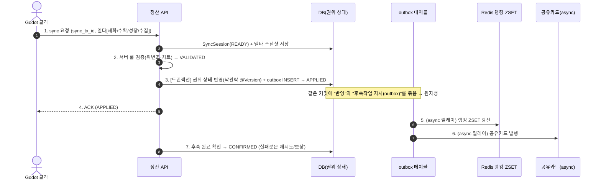

# ④ 세이브 정산 파이프라인 + ⑤ 동시성 — exactly-once 정합성

선생님이 **제일 좋게 본 항목.** 단, 그 가치는 "토스 연동"이 아니라 밑의 엔지니어링이다:
**멱등성 / exactly-once / 보상 트랜잭션 / 상태머신 / 위변조 검증.** 이 기술들은 도메인 무관이라,
가짜 웹 굿즈샵 대신 **싱글플레이 게임에 진짜로 필요한 자리** — *세이브 동기화 시점의 정산/지급* — 에 그대로 얹는다.

> 🔁 이 재편의 근거는 `adr/0003-meta-server-no-commerce-save-settlement.md`. 웹 굿즈샵·토스·거래소·선착순 한정판은 "싱글 게임에 없는 온라인 기능"이라 들어냈고(ADR-0002·0005·0008과 충돌), 결제의 엔지니어링만 정산 파이프라인으로 이전했다.

## 왜 세이브 정산이 결제와 같은 문제인가

```
Godot 클라 (오프라인 플레이) ──"오늘 골드 1200·영혼호박 30개 수확"──▶ 메타 서버
                                                                  │ 검증 후 정확히 한 번만 권위 상태에 반영
                                                                  ▼
                                              DB(권위 재화·인벤토리) + Redis(랭킹 ZSET) + async(공유카드)
```

클라(Godot)가 오프라인 진행분을 올리면, 서버는 그걸 **검증해서 정확히 한 번만 권위 상태에 반영**해야 한다.
클라가 재시도하거나 중간에 끊겨도 **중복 지급/유실이 나면 안 된다.** 이건 결제 confirm과 **구조가 똑같다.**

| 결제에서 (옛 문서) | → 세이브 정산 파이프라인에서 |
|---|---|
| `order_id` UNIQUE (더블클릭 방어) | **`sync_tx_id` UNIQUE** — 클라 재시도/네트워크 단절 시 중복 반영 방지 |
| 주문/결제 State (READY→DONE→REFUNDED) | **`SyncSession` 상태머신** (아래) |
| 금액 위변조 검증 | **서버 룰 검증** — 클라가 보낸 재화/수확량을 룰로 검증(치트 방지, 메타서버 명분) |
| PG 호출을 트랜잭션 밖, 웹훅이 source of truth | **DB 커밋 + Redis/async 비동기 반영** → **outbox/보상** |
| 환불(보상 트랜잭션) | 부분 반영 실패 시 **롤백/보상** |

## ④ 정산 — 멱등성 중심 (외부 PG 없음, 내부 분산 정합성)



### `SyncSession` 상태머신 (State 패턴 — `05` 참조)

```
READY ──검증──▶ VALIDATED ──반영(tx)──▶ APPLIED ──후속완료──▶ CONFIRMED
  │                  │                      │
  └──검증실패──▶ REJECTED            └──부분실패──▶ ROLLED_BACK(보상)
```

- 각 상태에서 허용된 전이만 캡슐화 → 잘못된 전이(예: `ROLLED_BACK→CONFIRMED`) 차단
- 정산 도메인의 무결성을 코드로 강제

### 중복 지급/유실 방어

| 중복/유실 경로 | 방어 |
|---|---|
| 클라 더블 sync / 재시도 | `sync_tx_id` UNIQUE → 멱등 |
| 같은 세션 재호출 | `SyncSession` 상태 가드(이미 `APPLIED`면 skip) |
| outbox 릴레이 중복 발행 | `outbox.id` 기준 멱등 소비(처리 표시) |
| 부분 반영 후 크래시 | outbox가 source of truth → 재시도로 최종 정합성, 불가 시 보상 |

```java
@Transactional
public SyncResult apply(SyncCommand cmd) {
    if (sessionRepository.existsBySyncTxId(cmd.txId())) {   // 멱등: 이미 처리됨
        return SyncResult.alreadyApplied();
    }
    SyncSession session = SyncSession.start(cmd);            // READY
    validator.validate(cmd);                                // → VALIDATED (위변조/치트 검증)
    // [같은 트랜잭션] 권위 상태 반영 + outbox 기록을 원자적으로 묶음
    deltaApplier.applyAll(cmd.deltas());                    // 종류별 Strategy (재화/수확/성장/수집)
    outbox.enqueueRankingUpdate(session);                   // 후속작업을 "지시"만, 실행은 릴레이가
    outbox.enqueueSharedCard(session);
    session.markApplied();                                  // → APPLIED
    return SyncResult.applied(session);
}
```

> **면접 가산점:** "후속 반영(랭킹·공유카드)을 같은 트랜잭션에서 직접 호출하면, Redis/외부가 느리거나 실패할 때
> DB 커넥션을 오래 잡고 정합성이 깨진다." → **outbox 패턴**으로 *권위 반영*과 *후속작업 지시*를 한 커밋에 원자적으로 묶고,
> 실제 발행은 비동기 릴레이가 멱등하게 처리 + 실패 시 재시도/보상. **외부 PG 없이도 "트랜잭션 경계를 넘는 분산 정합성"을 증명**한다.
> "외부 PG가 없으니 보상 트랜잭션이 없는 거 아니냐"는 비판에는 — *DB↔Redis↔async라는 서로 다른 정합성 경계*가 바로 그 무대라고 답한다.

## ⑤ 동시성 — 동일 계정 동시 세이브 충돌

선착순 한정판(실유저 다수가 희소 자원 경쟁)은 싱글플레이엔 없는 무대라 들어냈다.
**싱글플레이에 실재하는 동시성은 딱 하나** — *같은 계정의 동시 세이브*:

> 유저가 **두 기기**(집 PC·노트북)에서 같은 계정으로 플레이하거나, sync가 **재시도/네트워크 단절**로 겹치면 →
> 두 sync가 같은 권위 행(재화·인벤토리)을 동시에 덮어써 **lost update**가 난다.
> (Steam Cloud의 "클라우드 세이브 conflict" 다이얼로그가 바로 이 문제.)

- **낙관적 락(`@Version`)** — 권위 세이브 행에 버전. 후발 sync가 충돌 감지 → 거부 후 재조정(최신 우선 or merge)
- 비교 대상: 낙관락(`@Version`) vs 비관락(`SELECT FOR UPDATE`)
- → **두 방식 부하테스트 비교(TPS·lost update 0건 검증)** 가 포폴 근거
- **분산락(Redisson)은 의도적으로 안 쓴다** — 단일 권위 DB에서 단일 행 충돌은 낙관락이 정답.
  "왜 분산락을 안 썼나"를 설명하는 것이 "분산락을 썼다"보다 **시스템 이해도를 더 보여준다.**
- 닉네임/팜 이름 등 선점은 DB UNIQUE 제약으로 처리

> 게임이 싱글이라 *게임 내* PvP 동시성은 없지만, **멀티기기 클라우드 세이브 충돌**이 진짜 동시성 무대다.
> "유저 0명" 비판은 k6로 같은 계정에 동시 N sync를 던져 **lost update 0건을 측정값으로** 답한다.
