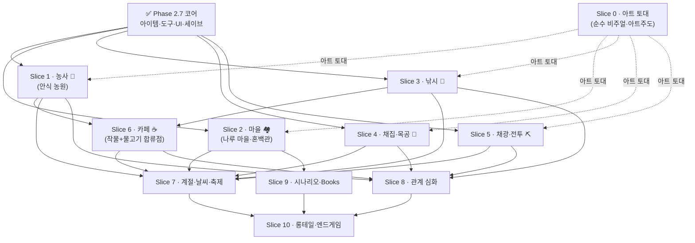

# 🧱 빌드 슬라이스 상세 — ADR-0028 인터리브 (2026-06-29 재배치 · 전부 ✅ 종결)

> **보존 기록** — 2026-09-08 ROADMAP.md에서 분리. 요약 타임라인은 [ROADMAP.md](../../ROADMAP.md), 폴리시 루프는 [polish-loop.md](./polish-loop.md). 본문 속 «위/아래 [지금 위치…]» 류 상호 참조는 분리 전 단일 문서 기준이다.

> **전 슬라이스 종결(2026-08-15) — 이 절은 슬라이스별 태스크 체크리스트의 보존 기록이다.** (당시 선언: 이 섹션이 빌드의 forward 진실원천이다.) 위 Phase 1~2.7 + 2.8 T0–T3 완료 로그는 *역사 기록*(불변)이고, 아래 옛 Phase 2.8 T4~·Phase 3 백로그는 *상세 레퍼런스*(ADR·game-loops 링크)로 남긴다 — **착수 순서·내용은 이 슬라이스 계획이 대체**한다. 전 시스템 그릴 큐 소진(②~⑩, [ADR-0029]~[ADR-0034])의 결과를 빌드 순서로 정렬한 것.
>
> **모델([ADR-0028](../adr/0028-build-workflow-greybox-art-interleave-no-fun-gate.md)):** 빌드 = 시스템별 *그레이박스 메카닉 잠금 → 스타듀 아트* 수직 슬라이스. "전부 그레이박스→전부 아트→전부 메카닉" 수평 레이어 폐기. **재미 게이트(go/no-go) 없음 — 무조건 출시.**
> **순서 = 구역 완성 우선(사용자 확정 2026-06-29):** 체류 1·2위 데모 구역(**안식 농원→나루 마을**)을 먼저 완성하고 그 다음 활동 구역. 각 구역 슬라이스가 *그 구역 메카닉(그릴 ADR 주입) + 맵 도색(옛 2.8 T4~T9 흡수) + 아트*를 한 묶음으로 끝낸다.
> **맵 재배치 = 별도 페이즈 아님·각 구역 Slice에 흡수(owner 확정 2026-07-01, [ADR-0044]):** "맵이 단조롭다" → 전 구역에 **2행 pseudo-Z 다단 지형**([asset-ruleset §4.1]) + **남향 물 축**(강·바다 마을 남쪽) 적용. 각 구역의 pseudo-Z 재배치는 그 구역 Slice가 아트·에셋과 함께 진행(S1 안식·S2 나루 배후강·S3 물가 단차).
> **순수 비주얼**(캐릭터 룩·초상화·가구/장식)은 아트-주도라 **Slice 0**에서 토대를 깐다([ADR-0026]).
> **검증:** 구역/캐릭터 완료마다 인게임 화면(`map_dump`)으로 시각 확인 후 다음(owner 요청).
> **shrimp 등록:** 슬라이스는 *루프 단위*로만 등록하고, **원자 분해(T번호)는 각 슬라이스 착수 grill에서**(ROADMAP 원칙 "게이트 후 원자 분해").

### 의존성 & 병렬 진행 맵 (여러 창/worktree 동시작업용)

> **목적:** 어느 슬라이스를 *동시에 다른 창(git worktree)으로* 띄울 수 있는지 한눈에. 화살표 = "먼저 끝나 있어야 함". 화살표가 없으면 **서로 독립 = 병렬 가능**. 각 슬라이스는 자기 메카닉 노드 파일을 새로 들고 오므로 *메카닉 코드*는 거의 겹치지 않는다 — 충돌은 **공유 통합 지점**에 집중된다(아래 ⚠️).

**병렬 웨이브 — 동시에 띄울 수 있는 묶음:**

| 웨이브 | 동시 진행 가능 (각각 별도 창/worktree) | 선행 조건 |
|---|---|---|
| **W1** | **Slice 0**(아트) · **Slice 1**(농사) · **Slice 2**(마을) · **Slice 3**(낚시) · **Slice 4**(채집) · **Slice 5**(채광) | Phase 2.7 ✅ (전부 충족) |
| **W2** | **Slice 6**(카페) · **Slice 7**(계절·축제) | S6←S1+S3 / S7←S1~S6 |
| **W3** | **Slice 8**(관계) · **Slice 9**(서사·Books) · **Slice 10**(롱테일) | S8←활동루프 / S9←S2 전시인프라+캐릭터 / S10←전반 |

- **W1의 6개는 메카닉상 서로 완전 독립** — 6개 창을 동시에 띄워도 설계 충돌 없음. 단 **완성·머지 우선순위는 사용자 확정대로 Slice 1(농원)→Slice 2(마을)**(데모 1·2 구역 완성 우선) — 병렬로 *작업*하되 데모 체크포인트는 1·2부터 닫는다.
- **Slice 0(아트)은 순수 비주얼이라 모든 메카닉 슬라이스와 병렬** — 메카닉 그레이박스가 도형으로 굴러가는 동안 아트 토대(캐릭터 5종·룩 정합)를 깐다. 단 각 활동 슬라이스의 *"아트" 파트*는 Slice 0 캐릭터/룩 토대 위에 얹히므로 그 부분만 S0 뒤(점선).
- **W2/W3는 "얹기·합류"라 후행** — 카페(S6)는 작물+물고기가 있어야 융합 메뉴가 서고, 계절(S7)은 모든 루프에 절기 작물·어종·사멸을 얹으며, 서사(S9)는 혼백관 전시 인프라(S2)와 캐릭터들 위에 깔린다.

> ⚠️ **worktree 병렬의 실질 비용 — 공유 통합 지점 충돌:** 활동 루프들이 결국 `game/main.gd`·`game/main.tscn`·`game/save.gd`·`item_catalog.gd`·핫바/메뉴 UI에 **배선 한 줄씩**을 더한다. 메카닉 노드(`field.gd`·신설 `fishing.gd`·`mining.gd` 등)는 독립 파일이라 안전하지만 *이 통합 지점*에 머지 충돌이 몰린다. 완화: ① 각 슬라이스를 자기 노드 파일에 최대한 캡슐화하고 `main` 배선은 얇게(시그널 연결만), ② 자주 머지(슬라이스끼리 rebase), ③ 세이브 포맷 조각 추가는 슬라이스별 키 네임스페이스로 분리.

### Slice 0 — 아트 피벗 마무리 (순수 비주얼) ✅ 완료(2026-07-01)
- 캐릭터 5종 스타듀 재생성(walk 4방향)·대화 초상화 4캐릭터×6표정 24장·코어 타일 룩 정합·**지면 구성 시스템**([ADR-0042]→[ADR-0043] lush 베이스+per-cell 변종+길↔풀 유기경계)·**안식 농원 재설계**([ADR-0035] 고지 단차+Overgrown 개간)·**에셋 규칙 통합**([ADR-0036~0041]·`asset-ruleset.md`)·Phase C 렌더 규칙(Y-split·발치 그림자·발치 충돌·광원 audit). 상세 로그 = PR·git·메모리.
- 근거: [ADR-0026] 아트 피벗 · [ADR-0035] 안식 재설계 · [ADR-0036~0041] 에셋 규칙 · `docs/design/{asset-ruleset,tileset-ruleset,master-palette}.md`.

### Slice 1 — 안식 농원 (HOME · 데모 1) — 🟢 시각완성 (잔여 = 비차단 후속)
- **의존:** Phase 2.7 ✅ · **완성 우선순위 1위**(데모 1) · **후행 차단:** S6(카페 합류)·S7·S8이 이 작물 루프를 기다린다.
- **메카닉(그레이박스 전부 완료):** 농사 2·3층(작물 5아키타입·트렐리스·다절기 프레스티지·혼의 나무 과수·품질 4등급×비료·농사 숙련)·목축(넋둥우리/넋우릿간 진입 실내·완전 pathing·여물광 건초경제·가축 성장)·개간(overgrown debris 3종 치우기)·집 꾸미기(집 내부 3레이어 코스메틱·테마 세트).
- **데모 완성 패스([ADR-0048]) 완료:** UI 한지 통합 리스킨(탭 4·raw 패널 0)·전 HUD·전 화면(타이틀·설정·정산·상자·엔딩)·전 건물 실내·전 에셋. 타이틀 화면(패럴랙스+4직원 idle·멀티 3슬롯·설정·크레딧·BGM).
- **폴리시 완료:** 프롭 13종 32-native 재생성([ADR-0050])·까마귀 작물습격+허수아비([ADR-0051])·5스킬 전문직 트리 부활([ADR-0052]·채집 라이브 루프)·UI 정체성 아트(도구아이콘5·엽전·탭4·시계8)·흙-지배 flip([ADR-0053])·건물 접지([ADR-0054]).

#### ✅ 완료 항목 (상세 = PR·git·메모리)
- **메카닉 그레이박스:** S1-1 착수 grill(레이아웃 실측+수치 곡선) · S1-2 pseudo-Z 절벽 타일종+충돌 · S1-3 서쪽 고지 재배치 · S1-4 작물 5아키타입(PR#142) · S1-5 트렐리스+혼의 나무 과수(PR#143·[ADR-0045]) · S1-6 품질4등급+비료+숙련 · S1-7 목축 데일리 돌봄 · S1-8 개간 치우기 · S1-9 집 꾸미기(PR#154) · S1-10 다단 절벽 타일 아트.
- **Track B 목축 재구조 B1-a:** 진입 실내·완전 pathing·여물광 건초경제(메모리 `track-b-livestock-rework-design`).
- **데모 완성 패스 A~G([ADR-0048]):** S1-11 위키 로스터(PR#167) · S1-12 한지 스킨+탭메뉴(PR#168) · S1-13 전 HUD(PR#170) · S1-14 전 화면+상자(PR#173) · S1-15 실내 Track B+가축성장(PR#174·#191) · S1-16 스프라이트 스펙→Gemini 배선(PR#169·#187~#190) · S1-17 데모1 통합 시각확인.
- **폴리시 패스:** S1-폴리시 HUD/절벽 가이드(PR#192) · 프롭 재생성 13종(PR#198~#209·[prop-regen-roster.md]) · 까마귀(PR#205·[ADR-0051]) · 아트정리 도구·엽전·탭·시계(PR#211~#215) · 전문직 프레임워크+채집 루프(PR#210·#212·[ADR-0052]) · 타이틀 완성(PR#216·#218·#224·#225·#226) · 흙-지배 flip(PR#231·[ADR-0053]) · 건물 접지(PR#232·[ADR-0054]).

#### ⏳ 잔여 (비차단 후속 — 순서는 위 [지금 위치 & 남은 작업])
- [x] **debris/개간 근간 결정 grill → 안식 개간 루프 완성** *(다음 빌드 #1)* — ✅ **완료([ADR-0055] 차등 재점령)**. "매일 번식 vs 일방향 clearable" 해소: 잡초(non-solid)만 빈 맨땅에 밤 1~2칸 재점령(cap=후보×0.75·day 결정적·겨울 정지)·구조물(돌/그루터기=solid) 치운 자리·밭·작물은 영구 성역. `reclaim.gd`(`_weeds` 원장·`advance_day`·`clear_weed`·세이브 확장)+main 배선(`_encroach_candidates`·day-advance·낫 디스패치·프롬프트·`_draw_encroach_weeds`)+`reclaim_test` ⑪~⑱ 검증(회귀 54 PASS). 근원지 전파·타일셋 이원화는 여전히 North Star([ADR-0053] §2.B).
- [x] **절벽 시스템 스타듀 정식화 + 품질 폴리시([ADR-0044] 개정 → [ADR-0056])** *(다음 빌드 #2)* — ✅ **완결(2026-07-07·PR#236~245·owner GL 라이브 사인오프).** 단계3 증분①~⑥(남향-only 오토타일러·SW/SE 곡선 코너·orphan 폐기, PR#193/#194) 위에 **[ADR-0056] 품질 정식화 + 확장 라이브 폴리시**를 얹어 완결: `grill-with-docs` 정식화(#236) → ① 상단 fringe·④ 연못뱅크 sibling(#237, 방향교정 #238) → ② FACE AO 절차 베이크(#239, `bake_cliff_face_ao.py`) → **벽면 오버행 제거**(#240, 남향밑=절벽 앞이라 안 가림·하얀사각형 원천소멸) → FINAL ③ 노치 곡선 라운딩·④ 발치 접지그림자(#241) → run_game.sh pidfile kill(#242) → **고지 평지 잔디화**(#243, 절벽 top 연속·[ADR-0053] flip 저지 한정 정밀화) → lip/코너 톤매칭(#244) → **REV5 텍스처 이음매**(#245: lip 상단 `_bf_grass` 오버레이 텍스처 평지화·코너 물러난영역 투명→이웃 지형 **컨텍스트 필**[주변 타일 인식]·발치그림자 코너게이트). 검증: cliff_test ①~⑩ + 전체 회귀 53 PASS. 문서: [ADR-0056]·[cliff-tileset-spec.md §10.3]·[required-assets-roster.md §8.1]. 미구현 North Star(근원지 전파·타일셋 이원화)는 [ADR-0053] §2.B.
- [ ] **절벽 세트 Gemini 통합 재생성 시 glue 재적용**(비차단 후속) — owner-Gemini가 절벽 타일 세트(lip·face·base·코너)를 통째로 재생성하면, 톤·AO·코너를 `game/tools/`의 glue 스크립트로 재적용: `bake_cliff_face_ao.py`(face 하단 감쇄 AO) → `make_cliff_corners.py`(코너 물러난영역 투명 파생·raggedness) → 필요 시 `match_cliff_grass_to_field.py`(lip 톤=평지). 코드(`_build_ground16` 오버레이·컨텍스트필)는 불변, 소스 PNG만 교체 후 `--import`. [ADR-0056] REV5 §.
- [ ] **환경 지형 타일 PixelLab 저색 crisp 재생성([ADR-0057])** *(다음 빌드 #3)* — owner "쯔꾸르·바람의나라 느낌" 피드백 → 정량 진단: `grass_field` **2573색 vs 스타듀 116색(22배)** 노이즈 카펫, 16색 강제 양자화로도 구조 불변(=색은 증상, 원인은 "타일에 텍스처 채움" [ADR-0043]). 해법 = PixelLab `create_topdown_tileset`(45색·`selective outline`·`basic shading`·`low detail`·32px)로 베이스 재생성 + 디테일=스캐터 오브젝트 + 공통 마스터 팔레트. 확산모델(Gemini/nano-banana)은 노이즈 재생산이라 지형 배제([ADR-0047] 지형 예외 추가). **인게임 파일럿 검증 완료(2026-07-16)** — `tools/home_pilot_dump.gd` before/after, `_build_ground16` 로직 불변·`terrain16` 텍스처 스왑만으로 스타듀 근접 확증. 잔여: ① 잔디 톤 muted 조율 ② 길 타일 분리 ③ Wang 오토타일 경계 통합(`pixellab_tileset_converter.gd` 재활용) ④ 프롭 톤 정합 ⑤ 전 구역 확산.
- [ ] **캐릭터 5종 재생성**(owner-Gemini·메모리 `gemini-full-regen-batch`) *(다음 빌드 #4)*.
- [ ] **동향 계단 아트**(S1-10 `stairs_east` placeholder 교체) *(다음 빌드 #5)*.
- [ ] **home_deco 6종 텍스처 훅**(여우불/피안화×바닥/벽/가구·owner-Gemini 아트+배선) *(비차단 병렬)*.
- [ ] **나머지 4스킬 전문직 퍼크**(농사·목축=지금 가능 / 낚시·채광=Slice 3/5 의존) *(비차단 병렬)*.
- [ ] 레어크로우 8종 수집→디럭스([ADR-0051] B) — 획득처(혼백관 등) Slice 2 의존 *(하류)*.

### Slice 1R — 안식 농원 스타듀 리메이크 (owner 지시 2026-07-22 · Fable 5 캠페인 최우선)

> **근거:** owner 판정 "아직 스타듀밸리 문법과 거리가 있다" → Slice 2 착수 전 안식 농원을 스타듀 스타일로 리메이크. 마스터 프롬프트 = `docs/prompts/fable5-autonomous-completion-prompt.md` §3. 3축 = 맵 설계·농사 재점검·UI 전면 리메이크. §7 재론 금지 유효, 충돌 시 스타듀 정합 택1 + 새 ADR.

- [x] **격차 감사 3축** (2026-07-22) — 맵=[homestead-vs-stardew-map-audit.md](../design/homestead-vs-stardew-map-audit.md) §5(P2·P7·P8 해소 / P3·P4·P5·P6 미해소 / 신규 C-1 남단 공동·C-2 나무 밀도·C-3 ADR-0058 모순) · 농사·UI=[slice1r-stardew-gap-audit.md](../design/slice1r-stardew-gap-audit.md)(농사: 수치 계층 유지·체감 루프/에너지 철학 재작업 / UI: inv_frame 내부 스킨 교정 중심·정체성 모티프 유지).
- [x] **타일맵 생성 알고리즘 전수 서베이** (2026-07-22) — 9계열 병렬 리서치(워커 10기)+`last30days` 30일 동향 → [tilemap-generation-algorithms-survey.md](../design/tilemap-generation-algorithms-survey.md). 채택 티어1=외톨이 flood-fill 정리·지터드 그리드 스캐터·경계 디더 프린지 / 티어2=`_mask_noise` 유틸(OpenSimplex2)+저진폭 도메인 워핑·fBm 주파수대 분리·다수결 평활 / 티어3=Neyman-Scott 군집·density-mask·Catmull-Rom 중심선. WFC·듀얼그리드는 기록만(재론 금지 유지).
- [x] **착수 self-grill → [ADR-0059](../adr/0059-slice1r-homestead-stardew-grammar-remake.md)** (2026-07-22) — 결정 6부(남단 조닝·알고리즘 세트·에너지 정합·물뿌리개 용량·스윙 애니 defer 해소·UI=0048 실행) + ADR-0058 개정 노트(C-3 진실원 복구) + 카탈로그 갱신. 잠정 항목은 owner 큐 적재 후 즉시 착수(§2-1).
- [x] **shrimp 원자 분해** (2026-07-22) — S1R-T1~T12 등록(맵 6·농사 3·아트 1·UI 2).
- [x] **맵 축 빌드 완료** (2026-07-23·PR#253~257 전부 머지) — T1·T2 마이크로 알고리즘 티어1·2(`_mask_noise`·외톨이 정리·지터드·경계 디더·저진폭 워핑·fBm·다수결 평활, #253) / T3 남단 조닝 4존+길 재배선+zoning_check 하네스(#254) / T4 forage 숲 Neyman-Scott 밀집·능선 일렬 덤불 대체·남동 debris(#255) / T5 연못 유기화(정적 마스크·셀별 합성 규약 준수·rect 바이트 불변, #256) / T6 절벽 남단 유기 윤곽(침식-only 워핑·ADR-0056 장치 보존, #257). 고정 앵커(건물·well·pond·워프) 무이동으로 좌표 테스트 갱신 불필요·선별 회귀 전부 PASS.
- [x] **농사 축 빌드(메카닉) 완료** (2026-07-23·PR#258~260) — T7 에너지 정합(괭이·물·낫만 과금, 파종·수확·시비 무과금 + energy_contract_test 8계약, #258) / T8 물뿌리개 용량 20칸·혼우물/연못 리필·핫바 잔량 배지·세이브 하위호환(#259) / T9 저승 스프링클러 티어1(sprinkler.gd 델타 원장·십자 4칸 아침 급수·혼력 0·만물상 구매, #260). 잔여 후순위(커서·수확 팝·탈진 피드백·동물케어 XP)는 폴리시 패스로.
- [x] **T10 도구 스윙 애니 4모션 완성** (2026-07-24·PR#263 생성 파트 + PR#264 완결) — 시트 4종 `player_{hoe,water,scythe,harvest}.png` 4모션×4방향 16행 전원 정상(hoe north 막대분열→v3 한 자루·water south orange 오염 해소·harvest east/west 채움 — 유실 그룹 `12b4aa59`는 서버에 미존재 확인, 재발주로 해결) + 배선(char_sprite `add_tool_motion`/`tool_anim`·player `swing_tool`·main `_swing_for_item` 시각 전용·색박스 폴백 유지) + `speed_factor` 실효화(speed_scale=1/factor·§8.9 no-op 해소). tool_swing_anim_test 46단언·선별 회귀 9종 PASS·`tool_swing_dump` 시각 하네스 16행 육안 판정 통과. ※PixelLab v3 잡이 95%에서 산출물 없이 드롭되는 함정 2회 재현 — 스펙카드 §2.5에 기록.
- [x] **UI 축 빌드 완료** (2026-07-23·PR#261~262) — T11 inv_frame 한지 스킨·타이포 전면 교정(fallback_font·raw rect 0건·슬롯=핫바 plate 정합, #261) / T12 상점 5행 그리드·인벤탭 정보패널(소지금/총수입/날짜/농장명)+닫기X+휴지통·출하 정산 품목 내역(#262). 도구 아이콘 5종은 기완료(PR#211 — 감사 오류 정정). 3순위(드래그&드롭·장비슬롯 등) defer 유지.
- [x] **시각 확인 + 선별 회귀 + 기록 완료** (2026-07-27·PR#265) — 통합 시각 확인(2026-07-23)·T10 스윙 덤프 판정(2026-07-24)에 이어 폴리시 잔여 2건 봉합: ①연못 남안 1셀 돌출/구멍 — 원인은 마스크 파라미터가 아니라 `_build_ground16` Wang 쌍 축약(물=rank 최하 탈락) 렌더 버그. 물 셀=항상 4_0 shore 합성(`_shore_is_land`·부두 방어) + 물가 잔디 맨흙 패드(`_g16_near_water`)로 해소, 마스크 무변경(결정성 확인) ②길 tan-on-tan — 단일출처 전환 회귀(길=마당 동일 이미지). `make_path_field.py` 오프라인 베이크 `path_field.png`(ΔL*≈12.6·채도↓·색수 11→9) → `_bf_dirt` 배선(ADR-0057 "길 타일 분리" 이행). 덤프 육안 판정 + 선별 회귀 5종 PASS. **→ Slice 1R 전 체크리스트 ✅ 종결.**

### Slice 2 — 나루 마을 (데모 2 · ★옥자 데모 체크포인트)
- **의존:** Phase 2.7 ✅ · **병렬:** Slice 0·1·3·4·5와 동시 가능 · **완성 우선순위 2위**(데모 2). · **후행 차단:** S9(서사·Books)가 여기 혼백관 전시 인프라를 기다린다.
- **메카닉:** 마을 주민 T1 *점진* 추가 시작([ADR-0014]) · 상점(만물상/네오 T2 점주) · **혼백관**(박물관 — Books 전시 인프라) · 게시판(일일·중기 의뢰).
- **Books 인프라([ADR-0034]):** [옥자의 잃어버린 책들] 혼백관 전시 + [저승 실용서] 여행 상인 채널(발견·전시·읽기 메카닉; *옥자 채널 서사 내용*은 Slice 9와).
- **맵 재배치([ADR-0044]):** 마을 동/서 이분할 **내부 수직 강 폐지 → 최남단 배후 강**(동서 횡단·다리로 낚시터 연결) 리팩토링 + 전 지형 pseudo-Z 다단 적용. **주민 집 디자인·건물 로스터 완성·맵 에셋(나무·풀·울타리 등)** 이 Slice에서 빌드(owner: 나루 미반영분).
- **아트:** 나루 마을 도색(다리·자갈광장·돌담·벚꽃·배후 강변 — 옛 2.8 T4)·만물상·주민 집 외관.
- ※ **옥자 데모 = 여기 완료 시점 체크포인트**([ADR-0028] 연기된 데모 — 강제 마일스톤 아님, 보여줄 수 있는 상태).

**착수 체크리스트** (Slice 1R 완결 뒤 착수 게이트 — [ADR-0060](../adr/0060-slice2-naru-village-kickoff.md)):
- [x] **착수 self-grill → [ADR-0060](../adr/0060-slice2-naru-village-kickoff.md)** (2026-07-27 · 코드·문서·위키 리서치 3축) — 8결정 확정: ①맵=[ADR-0044] 이행 실배치(배후 강·앵커 보존) ②건물 로스터=주민집 3→11채(Pelican Town 조닝 문법) ③지형 파이프라인 나루 이식(`_build_ground16` 구역 파라미터화) ④만물상 완성(재고 확장·판매채널 미도입·영업시간 상시) ⑤혼백관 전시 인프라(유품·마일스톤 보상·레어크로우 1종·책 슬롯 병설) ⑥게시판(납품형·3배 보상) ⑦주민 프레임워크 일반화+첫 T1=모찌 ⑧네오 이중 신분 명문화(점주 T2 기본·T1 겸직 허용). CONTEXT·stardew-systems-catalog 동반 갱신.
- [x] shrimp 원자 분해 (2026-07-27) — S2-T1~T11 등록(맵 3·상점 1·혼백관 1·게시판 1·주민 2·아트 2·통합 1, 의존 그래프 포함)
- [x] **맵 리팩토링 완료** (2026-07-27·PR#266~268) — T1 배후 강 이행(내부 수직 강 폐지·y66~71 전 폭·북안 CLIFF_BANK·다리 x52,53 나룻터 스파인 정렬·부두 스텁·앵커 보존·village_test 87단언, #266) / T2 주민집 3→11채(Pelican 조닝 스태거·네오 별도 집·`_carve_door_spoke` 통일+기존 몸통 관통 버그 봉합·202단언, #267) / T3 `_build_ground16` 구역 프로파일화(HOME 픽셀 diff 0 불변·나루=잔디 지배 86%·path_apron 3단 전환·village_dump 전체 합성 재작성·회귀 14종, #268)
- [x] **만물상 완성** (2026-07-27·PR#269) — 매대 5→12행(묘목·비료 5종·건초 입고 — 코드 예고 주석 3곳 이행)·구매 일반화(`buy_store_item`+`_buy_store_generic_n`, 네오 할인·부분 구매 규약)·매대 휠 스크롤+미니 스크롤바(스타듀 상점 리스트 문법)·판매 미도입/상시 영업 유지. store_test ⑩ 신설·회귀 6종 PASS. ※워커 세션 한도로 오케스트레이터 직접 구현(§2-4 예외·owner 지시)
- [x] **혼백관 인프라** (2026-07-27·PR#270) — museum.gd(기증 원장·마일스톤·`relic_roll` 결정적 3% 발굴)·유품 3종(CAT_RELIC)·레어크로우 ①(ADR-0051 B 최초 획득처)·무인 기증대(F)·그레이박스 진열(유품 3좌+책 그릇 2좌 ADR-0034 병설)·세이브 하위호환. museum_test 30단언·회귀 6종 PASS. **동반 수정**: interior_test 만물상 표본 실패=T3 이후 나루 리빌드 ~4s×워프 페이드 경합(기준선 실증) → settle 2s→8s 정정
- [x] **게시판** (2026-07-27·PR#271) — quest_board.gd(일일+중기 납품형 통합 원장 — 의뢰=day/주 시드 결정적 파생·무상태, 수락 동시 1건·일일 기한 2일/중기 그 주 끝·미완료 무페널티·보상=일반품질 판매가 ×3 ×수량+의뢰인 호감도)·만물상 앞 (62,19) 배선(F 수락/납품·G 중기)·`affinity.add_points`(대화·선물 게이팅과 별개 채널)·세이브 하위호환. quest_board_test 45단언·회귀 5종 PASS. **동반 수정**: run_tests.sh 파싱 실패→PASS 오탐 봉합(SCRIPT ERROR 감지 FAIL·음성 검증 완료)
- [x] **주민 프레임워크** (2026-07-27·PR#272) — resident.gd(등록 레코드 — facing·팝업·프롬프트·입력·대화·선물·스테이션·초상화·세이브 8축 파생·특수 거동은 Callable 훅 격리: 옥자 통보=station_gate·네오 매대=shop_key·바나 밤 경비=visible_rule)·resident_walk.gd(길 스포크 ㄱ자 경유 등속 보간 — **시각 레이어 한정**, 논리 위치는 즉시 스냅이라 게임플레이 판정 불변·A* 미도입)·main.gd 레지스트리 루프화(1인 추가=캐릭터 파일 1+레코드 1등록, main.tscn 무수정 — script_path/needs_affinity 런타임 생성 경로). 기존 5인 거동 불변(기존 테스트 7종 **무수정** 통과)·세이브 키 하위호환·결정 8 명문화. resident_test 신설 67단언·회귀 10종 PASS
- [x] **모찌(첫 T1 주민 — 프레임워크 절차 검증)** (2026-07-27·PR#273) — mochi.gd(슬라임 그레이박스·도트 눈입·대화 4묶음 "흡수→내어줌" 결)+`_setup_residents` 레코드 1건이 추가의 전부(main.tscn 무수정 — script_path/needs_affinity 런타임 생성 실증). 스케줄=집 앞(67,26)→광장(54,34)→카페 홀(13,92) — **보간 걷기 첫 실동작**(집→광장 25칸 ㄱ자·결정성 단언). **절차 검증 평결=결함 1건 발견·봉합**(_road_spokes 실내 밴드 가드 — 실내 자리 유령 걷기 방지)·결함 2건 이월(관계 탭 T1 미표시=effect_fn 전제+HeartBar 풀 4 고정 — T1 확장 전 owner 결정 필요, owner 큐). resident_test ⑪ 42단언·회귀 7종 PASS
- [x] **아트 패스 1 — 나루 지형·환경** (2026-07-27·PR#274) — 자갈 광장(tiles_pro segmentation 판석 6변주 모자이크·NARU_PLAZA_RECT 신설·순수 시각)·벚꽃 13그루(64×128 드롭인)·돌담(광장 테두리)·다리+부두 목판 데크(90° 직교 문법)·FACADE_CAFE 알파 트림. 표면 5/6 추가·_ARTIFICIAL_SURF 통일·**HOME 픽셀 diff 0**. 포장 길(PR#265 정합)·강변(Slice 1R 규칙 정상) 재작업 회피. gemini-regen-batch §10 스펙카드 4종+교훈(판석류=tiles_pro, topdown_tileset 격자 실패). 회귀 10종 PASS·덤프 육안 판정 통과
- [x] **아트 패스 2 — 건물 외관·NPC 스프라이트** (2026-07-27·PR#275) — 나루 야외 그레이박스 건물 0 달성: 만물상 외관(간판 채택 기준)·주민집 11채=한옥 재도색 2종+초가 신규 2폭 index 순환 4변주(캐릭터 배정색은 본체 제작 시 — 결정 2). 네오 스프라이트(백자 치환+태엽 키 스탬프 후처리)+초상화(도트 스톱갭 — Gemini 교체 1순위)·모찌 정지 4방향. greybox_rects 비움+building_rects 직접 나열(흙 패드 보존 갈래). **★발견: ADR-0012 size=56 문서 stale — 출하 캐스트 실측 41~46px·발치 74, 신규는 size=44/발치74가 정답**(§11.4 정정 기록·owner 큐). naru_npc_dump 하네스 신규. 스펙카드 §11(228줄). 회귀 6종 PASS·덤프 2종 육안 판정 통과
- [x] **시각 확인·선별 회귀·기록** (2026-07-27·PR#276) — 통합 회귀 전 계층 11종 PASS(village·store·museum·quest_board·npc_station·resident·cafe·warp·world·interior·heart_bar — 신규 워크트리 클린 임포트에서 재현)·village_dump/naru_npc_dump 육안 판정(T9/T10에서 오케스트레이터 직접 통과 — 나루 야외 그레이박스 건물 0·광장/벚꽃/다리 정체성 성립)·owner 큐/메모리/shrimp 갱신. **→ Slice 2 전 체크리스트 ✅ 종결.**
- ★**옥자 데모 체크포인트 상태(2026-07-27): "보여줄 수 있는 상태" 도달.** 나루 마을이 끝까지 플레이된다 — 배후 강 토폴로지·주민집 11채·만물상 풀 매대·혼백관 기증/전시·게시판 의뢰·주민 6인(모찌 포함) 스케줄·전 건물 외관 아트. 데모 전 owner 확인 권장: owner 큐의 라이브 확인 항목(걷기 체감·모찌/네오 룩·광장 톤)과 Gemini 교체 후보(네오 초상·돌담). 강제 마일스톤 아님(ADR-0028) — owner 판단으로 시연 시점 결정.

### Slice 3 — 삼도천·황천해 (낚시)
- **의존:** Phase 2.7 ✅ · **병렬:** Slice 0·1·2·4·5와 동시 가능 · **후행 차단:** S6(카페 합류 — 물고기)이 이 루프를 기다린다.
- **메카닉([ADR-0030](../adr/0030-fishing-relationship-neutral-dave-reel-fight.md)):** 관계-중립 base-only 루프(곱셈기 0)·데이브식 릴 격투(탑다운)·낚싯대 4티어(생선가게)·미끼/태클 (B)미디엄·혼력=격투당 체급비례·뱃사공 T2 점주·절기-잠금 어종·품질=퍼펙트릴+태클. 삼도천(강)→황천해(바다) 2슬라이스(어종·무대 분화).
- **맵 재배치([ADR-0044] 남향 물 축):** 마을 남쪽으로 하강하는 **종형 맵**(나루→삼도천→황천해) 렌더 + **물가 pseudo-Z** — 강물 상단 `CLIFF_FACE` 강둑 단차·바다 진입부(북단) 고지 수풀↔백사장 수평 절벽 런([asset-ruleset §4.1]).
- **아트:** 삼도천·황천해 도색(옛 2.8 T5·T6)·생선가게 외관·물고기/낚싯대·강둑/해안 절벽.

**착수 체크리스트** (Slice 2 종결 뒤 착수 게이트 — [ADR-0061](../adr/0061-slice3-fishing-kickoff-vertical-water-reel-fight-build.md)):
- [x] **착수 self-grill → [ADR-0061](../adr/0061-slice3-fishing-kickoff-vertical-water-reel-fight-build.md)** (2026-07-27 · 코드·문서·위키 리서치) — 10결정 확정: ①종형 남향 맵 이행(나루 남단 다리 진입 신설·북단 나룻터 워프 (52,1) 폐지·삼도천 내부 플립·황천해 북단 도착+해안 절벽 런) ②릴 격투=`FishingSession` 순수 상태 머신(시드 주입·헤드리스 — 첫 미니게임 구조 선례) ③어종 18종(강8·바다8·전설2·절기-잠금 즉시 실효) ④기어=낚싯대 4티어+미끼 3+태클 3(T1=뱃사공 증정) ⑤뱃사공=Resident T2(상시·할인 동형·물고기 즉시 환전 병행) ⑥혼력/XP 체급 비례 수치+보물잡이 퍼크 표적=인양물 롤 재해석 ⑦게잡이통=lvl3 해금 ⑧게시판 낚시 의뢰 확장 ⑨캐스팅 무대 한정 ⑩아트 스코프. 카탈로그 §1-D 동반 갱신.
- [x] shrimp 원자 분해 (2026-07-27) — S3-T1~T11 등록(맵 1·릴 격투 1·어종 1·기어 1·뱃사공 1·스킬/전문직 1·게잡이통 1·게시판 1·아트 2·통합 1, 의존 그래프 포함)
- [x] **맵 종형 이행** (2026-07-27·PR#277) — 나루 다리 남단 y71 2칸 진입 워프(북단 (52,1) 폐지·스파인 길 유지)·삼도천 플립(북=나룻터 데크/혼백관 (6,8)·남=강 전 폭 y30~36+북안 CLIFF_BANK·잔교 x28→남단 하구)·황천해 재배치(북 도착→절벽 런 y16~18 노치 x28~29→백사장/생선가게 (8,20)→남부 바다 전 폭·부두 x28)·실내 앵커 무변경·우회 도하 0/핑퐁 방지 단언·`neighbors()` 중복 제거. 회귀 8종 687단언 PASS
- [x] **릴 격투 코어** (2026-07-27·PR#278) — `FishingSession` RefCounted 순수 상태 머신(첫 미니게임 구조 선례 — 시드 결정적·텐션/스태미나/거리/발버둥/퍼펙트 릴/체급 게이트·기어/스킬 mods 중립 훅)·밸런스 불변식(소만 당기기로 승리·중 이상=풀기 강제) 테스트 강제·rod_t1+캐스팅(강둑 1칸 투과)·혼력 소4/중8/대14/전설30(끊겨도 소모)·그레이박스 HUD·fishing_test 70단언. 회귀 9종 PASS
- [x] **어종 로스터·절기/시간 분포** (2026-07-27·PR#279) — `fish_catalog.gd` 18종(강8·바다8·전설2 — 저승 결 명명 잠정·owner 큐)·32조합(서식지×절기×시간) 사막 0 보증·체급 몫 고정 가중(소80/중15/대5·전설 별도 0.8% 격리)·품질=퍼펙트 릴 계단(이리듐=2회+)·item_catalog 위임 편입(스텁 4종 제거)·fish_catalog_test 50단언. 회귀 8종 PASS
- [x] **기어** (2026-07-27·PR#280) — `gear_catalog.gd` 순수 해석 계층(삼각 디커플링)·낚싯대 4티어(낡은/삼줄/놋쇠/만장 — 줄 강도 게이트·슬롯 T2 미끼/T3 태클1/T4 태클2)·미끼 3(일반/유인/보장 — 보장=허용 체급 캡)·태클 3(코르크/납추/퀄리티 보버)·장전 UI 없는 자동 적용(우선순위 잠정·owner 큐)·수치 교정 2건(무적 태클·품질 축 붕괴 방지). fishing_test 120단언·회귀 11종 PASS
- [x] **뱃사공·생선가게** (2026-07-27·PR#281) — boatman.gd(삿갓+노 그레이박스·카론 결 대화 4묶음·표시명=호칭)·Resident T2 등록(`talk_intro` 훅 신설 — 첫 대화 T1 증정·자동 지급 폐기)·CTX_FISHSHOP 기어/환전 서브탭(유니크 잠금·뱃사공 ♡ 할인 독립)·즉시 환전(출하함 공식 동일·♡ 보정 0)·관계-중립 불변 단언·boatman_test 66단언·.uid 누락 수습. 회귀 13종 PASS
- [x] **낚시 스킬·전문직** (2026-07-27·PR#282) — fish_skill.gd(FarmSkill 대칭·XP 곡선 위임·포획 XP 10/20/40/100+퍼펙트 +2·레벨 효과 3종 L0 중립)·FISHING 퍼크 6종 실효(낚시꾼 +0.10·명조사 이리듐 +20pt 퍼펙트 게이트 보존·보물잡이 인양 2배 초집합·게잡이통 3종=메타+헬퍼만)·salvage.gd 인양 롤 3%/6%(유품 0.06% — 혼백관 보조 소스·신규 아이템 1종만)·fishing_skill_test 75단언. 회귀 18종 PASS
- [x] **게잡이통** (2026-07-27·PR#283) — `CrabPotLedger` 순수 원장(첫 다구역 설치물·day+좌표 시드 결정 롤·세이브 하위호환)·통용물 3종(넋게·혼조개·잿빛소라 — 잠정 명명)+잡동사니=삭은 그물 재사용·퍼크 3종 실효(덫꾼/뱃사람/미끼장인)·lvl3 미만 매대 완전 미노출(스타듀 레시피 문법)·`_is_seafood` 환전 확대·혼력 0 구조 보증·crab_pot_test 63단언. 회귀 11종 PASS
- [x] **게시판 낚시 의뢰 확장** (2026-07-28·PR#284) — 별도 시드 갈래(타입 롤 1/3 — 비-물고기 날은 S2-T6 수열과 바이트 동일·①k 단언)·`quest_pool(절기, 체급 상한)` 출제(일일=중까지·중기=소 한정 4~6·전설/대어 0)·물고기 의뢰인 풀=기존 4인+뱃사공·112일 전수 스윕 테스트. 회귀 6종 PASS. ※T8 워커 세션 한도로 오케스트레이터 직접 구현(§2-4 예외·Slice 2 선례)
- [x] **아트 패스 1 — 구역 도색·백사장·건물 외관** (2026-07-28·PR#285) — `_build_ground16` 프로파일 이식(삼도천=강변 잔디/흙 grass_thr 0.42·황천해=고지 수풀+백사장)·**백사장 모래 필드 신규**(sand_field/sand_wet_field — PixelLab 팔레트+절차 합성 구조. 32px 타일 직깔기=모티프 격자 육안 리젝·폐기 기록 §12.3)·물가 shore '땅'/'테두리' 프로파일화(`shore_sand` — 바다만 모래/젖은 모래·강/연못 종전 불변)·`orphan_fill` 레버(1칸 돌기 하드 사각 재도색·기존 구역 off)·혼백관 사당 재도색(석조 현판·석등)·생선가게 외관(물고기 간판)·부두 목판(바다 구간만)·나룻배/말뚝(비-SOLID — 스파인 도달성 보호)·조개/해초 데칼·고지 나무 16그루(통행 집합 불변)·라벨 2개 제거(외관 식별 컨벤션)·fishing_region_dump 하네스·스펙카드 §12 9종. 검증=회귀 23종 1,345단언 PASS·**HOME/나루 덤프 바이트 동일**·덤프 육안 2중 판정. 유보=바다 물가선 직선(shore 변주 별도 grill)·삼도천 북부 수직 요소(SOLID 충돌 변화 owner 승인 필요)·해초 실루엣 교체 1순위(owner 큐)
- [x] **아트 패스 2 — 물고기·기어 아이콘·뱃사공·HUD 스킨** (2026-07-28·PR#286) — 어획물 아이콘 21종(어종 18+통용물 3 — CAT_HARVEST 흰 박스 폴백 해소 위해 스코프 추가)·기어 11종(로드4/미끼3/태클3/게잡이통)·`FISH_ICONS`/`GEAR_ICONS` 레지스트리 단일 경로(인벤·핫바·매대·환전·의뢰·토스트)·inv/hotbar CAT_PLACEABLE·CONSUMABLE 텍스처 우선 분기·뱃사공 스프라이트(**size=44/발치74**·4방향·east/west 노 후처리 스탬프)+초상화(한지 대화창 안착)·릴 격투 HUD 스타듀 문법 리스킨(세로 트랙+어종 아이콘 16px 승강·텐션/스태미나 바·한지 판·발버둥/퍼펙트 테·격투 전 소형 찌 배지 — **FishingSession 무변경**)·게잡이통 월드=아이콘 텍스처 공유·make_s3_icons.py 멱등 글루·fishing_art_dump 하네스(비-헤드리스 실캡처)·스펙카드 §13(리젝 6건 회피 프롬프트 박제). 검증=회귀 7종+독립 재검 4종 PASS·덤프 8종 육안 2중 판정·**낚시 계층 그레이박스 잔재 0**. 유보=초상 표정 5종(기본 stem 폴백)·걷기 시트 defer·미끼/태클 슬롯 UI=별도 UX(owner 큐)
- [x] **시각 확인·선별 회귀·기록** (2026-07-28·PR#287) — 신규 워크트리 클린 임포트 재현에서 통합 회귀 **13종 전체 PASS**(fishing·fish_catalog·fishing_skill·boatman·crab_pot·quest_board·samdocheon·hwangcheonhae·warp·village·museum·resident·interior)·삼도천/황천해 덤프 재생성=커밋본 **바이트 동일**(지형 렌더 결정적 재현·육안 2중 판정 기통과)·T10 미추적 .uid/.import 10건 수습·owner 큐/메모리/shrimp 갱신. **→ Slice 3 전 체크리스트 ✅ 종결(T1~T11·PR#277~287)** — 관계-중립 낚시 루프(릴 격투·어종 18·기어·뱃사공·스킬/전문직·게잡이통·의뢰)가 종형 남향 맵(나루→삼도천→황천해) 위에서 그레이박스→아트까지 완주. S6 카페 합류가 기다리던 물고기 공급 루프 개통.

### Slice 4 — 저승 숲·미혹의 숲 (채집·목공)
- **의존:** Phase 2.7 ✅ · **병렬:** Slice 0·1·2·3·5와 동시 가능(독립 활동 루프) · **후행:** S6 카페·S7 계절에 채집물이 기회적으로 합류.
- **메카닉([ADR-0033](../adr/0033-foraging-discovery-loop-nonskill-quality-tree-work.md)):** 앰비언트 줍기(혼력0)·채집 스킬 얕은 2갈래(혼 감지+벌목)·portable 품질(종 희소도+운+부적)·자생 씨앗(발견 게이트)·벌목/수액·미혹 특수채집지 도끼 게이트. 목공방 건축 서비스.
- **아트:** 저승숲·미혹숲 도색(옛 2.8 T7·T8)·목공방/옥자집(잠긴) 외관·채집물/나무.

**착수 체크리스트** (Slice 3 종결 뒤 착수 게이트 — [ADR-0062](../adr/0062-slice4-forest-foraging-woodwork-kickoff.md)):
- [x] **착수 self-grill → [ADR-0062](../adr/0062-slice4-forest-foraging-woodwork-kickoff.md)** (2026-07-28 · 코드·문서·위키 리서치 3축) — 10결정 확정: ①맵 재배치 없음(채집지 라벨→빈터 승격 + 미혹 심층 구획 신설=큰 통나무 봉쇄) ②채집물 로스터 22종(일반 12·희소 4·심층 2(불사과)·해변 4) + 스타듀 스폰 문법 상속(구역 상한 6·7일 리셋·일일 결정 롤·절기 전환 삭제) ③벌목=나무 원장(3종·5단계 데이터/3폼 아트·경계 밴드 불벌목·코지 재성장) + 원목/단단한 원목 신설 ④수액 채취기=게잡이통 원장 1:1(나무별 5/7/9일·채집 lvl4 제작 해금) ⑤★최소 핸드크래프트 제작 시스템 신설(수액 채취기·야생 씨앗 4종) ⑥★도구 티어 코어 선행 + 도끼 2티어(명동·유철 — 대장간 무인 업그레이드 스텁, ADR-0027 무대 시점 충돌 해소) ⑦목공방=건축 서비스(Track B 성장 티어 2건)+가구·자재 매대·주인=목령 "옹이"(T2)·집 업그레이드는 서랍 ⑧`forage_skill.gd` 신설 + 미배선 퍼크 5종(DETECT/TRACK/WOOD_BONUS/HARDWOOD/TAP_QUALITY) 실효 ⑨곁들이 3건 흡수(덤불 열매 bush-shake·저승 이끼·황천해 해변 채집) ⑩아트 스코프=P2.8 T7/T8 매니페스트 승계+ground16 숲 프로파일. 카탈로그 §1-C·CONTEXT 동반 갱신.
- [x] shrimp 원자 분해 (2026-07-28) — S4-T1~T11 등록(스폰·로스터 1 / 스킬 1 / 벌목 1 / 티어·심층 1 / 제작·씨앗 1 / 수액 1 / 목공방 1 / 곁들이 1 / 아트 2 / 통합 1, 의존 그래프 포함)
- [x] **S4-T1 채집 스폰·줍기 + 로스터 22종** (2026-07-28·PR#288) — forage_spawn.gd(구역별 타일 원장·빈터 존 6곳=라벨 앵커 무이동 7×5+미혹 심층 존 정의·결정 롤 day/구역/좌표 해시·상한 6·7일 리셋·절기 전환 전량 삭제·절기 필터=clock 파생)·로스터 22종 item_catalog 등록(일반12·희소4·심층2·해변4 — **불사과=CropCatalog 기존 종 재사용**(id 충돌 발견·회피)·sell_price 100→600)·줍기 배선(RMB/F·혼력0·품질=스킬 롤⊔퍼크 floor·더블드롭·세이브 하위호환). forage_spawn_test 49단언+선별 회귀 9종 PASS. ⚠심층 봉쇄는 T4 전까지 공백(불사과 0티어 접근 — 슬라이스 내 일시)·해변 존 배선=T8·고정 XP 테이블=T2
- [x] **S4-T2 ForageSkill 신설·고정 XP·혼 감지/추적 마커** (2026-07-28·PR#289) — forage_skill.gd(FishSkill 1:1 — 곡선 FarmSkill 위임·순수 해석기)·**고정 XP 테이블**(줍기 7·벌목 14·큰 장애물 25·덤불 1 — 기준가 방식의 판매가 축 누수 차단)·**혼 감지 최초 실장**(lvl3+ 최근접 채집물 화면 가장자리 여우불 마커 반경 14칸·감지자 퍼크=구역 전체·추적자=화면 내 ▼·선정 결정적·로직/렌더 분리)·퍼크 헬퍼 5종 집약(wood_bonus/hardwood/tap_quality 소비처=T3·T6 대기)·main 위임 축소(시그니처·세이브 키 불변). forage_skill_test 49단언+회귀 6종 PASS
- [x] **S4-T3 벌목 — 나무 원장·도끼·원목·코지 재성장** (2026-07-28·PR#290) — tree_ledger.gd(**빈 슬롯 모델** — 재성장은 원래 나무 자리에서만=맵 불변식 구조 보증·종 3 저승 삼목·5단계 20%/일·결정 롤)·TREE 이원화(경계 밴드 5=불벌목 벽·내부만 원장: 저승 89/미혹 123/안식 프롭 16 — **좌표 재작성 0**)·도끼 디스패치(성숙 10타→원목 12~16+수액5+씨앗0~2+14XP→그루터기 3타·4~9·2XP→walkable·벌목=혼력)·재성장 이원(숲 20%/일 stage3·안식 밤 15% 파종 cap40)·아이템 6종(원목/단단한 원목/수액/씨앗3)·퍼크 소비처 개통(원목+1·경목 0.25). tree_test 89단언+회귀 14종 PASS(HOME 여파 0)
- [x] **S4-T4 도구 티어 코어·도끼 2티어·대장간 무인 스텁·미혹 심층 구획** (2026-07-28·PR#291) — tool_tier.gd(**ADR-0027 최초 실장** — 경제 게이트·순차 0→1→2·기본 벌목 0티어 불변·도끼 실효 10/8/6타·3도구 키 예약)·명동 2,000냥/유철 5,000냥(대장간 무인 업그레이드대 F·즉시 반영 잠정)·미혹 심층 구획 실배치(봉쇄 링 (52,9,8,8) 원장 밖 우회 불가·큰 통나무 2=유철 게이트 영구 개방·큰 그루터기 6=명동·경목 12/일 리스폰) — **T1 고지 불사과 0티어 접근 공백 소멸**. tool_tier_test 61단언+회귀 9종 PASS(flood-fill 봉쇄 검증)
- [x] **S4-T5 최소 핸드크래프트 제작·야생 씨앗·희소종 모종·혼합 씨앗** (2026-07-28·PR#292·※워커 세션 한도로 오케스트레이터 직접 구현 — §2-4 예외 선례) — craft_catalog.gd(**코드베이스 최초 제작 시스템** — 손 제작 즉시 완성·레시피 9종: 야생 씨앗 4=lvl1/4/6/7·희소종 모종 4=lvl6+★종 발견 게이트(ADR-0033 #4 실장)·수액 채취기=lvl4 아이템까지(설치=T6))·야생 재배="밭에서 길러도 채집"(수확=절기 일반종 결정 롤/희소종 단일·채집 XP 7·품질=채집 스킬·**까마귀 면역**·발견 자가 확장)·혼합 씨앗(잡초 낫질 10% 드랍·파종 절기 치환)·인벤 제작 탭(TAB_CRAFT append·매대 행 문법·3단 상태). craft_test 20+wild_seed_test 17단언+회귀 11종 PASS. 나무 씨앗 파종 개통=스코프 컷(후속 재평가)
- [x] **S4-T6 수액 채취기 — 게잡이통 원장 1:1 복제** (2026-07-29) — tapper_ledger.gd(CrabPotLedger 뼈대 복제·**설치 판정만 물가→성숙 나무**·구역별 원장·미수거 시 생산 정지+**카운트다운도 정지**·수거가 곧 재가동·회수 거절로 산출물 증발 방지)·**RNG 0**(뽑기 테이블이 없어 게잡이통보다 강한 결정성 — day 시드조차 불요)·수액 3종 신설(솔넋진 90/5일·넋수지 130/7일·명단풍꿀 170/9일 — 품질 유차원 CAT_HARVEST·하루당 ≈18냥으로 세 종 평형·게잡이통 32냥/밤보다 얇게)·**벌목 부산물 SAP와 별 아이템**(역할 분리)·설치 배선(LMB 성숙목·[F] 수거/회수·혼력 0·**채취기 박힌 나무 벌목 차단**=투자물 증발 방지·구역 무제한이라 안식 나무 16그루도 대상)·수액꾼 퍼크 **두 절반 실효**(등급 +1 금 클램프 + 주기 −1일·같은 dim). tapper_test 66단언+선별 회귀 14종 PASS. 아이콘·통 아트=T9/T10
- [x] **S4-T7 목공방 — 건축 서비스·가구/자재 매대·옹이(T2)** (2026-07-29·Opus 워커 위임) — carpenter.gd(로빈 문법 1:1 — **선불 골드+원목 → N일 뒤 아침 완공**·동시 1건·완공 이력·RNG 0·원장은 지갑/인벤/Ranch 무지)·초기 카탈로그=**Track B B1-b 성장 티어 2건**(큰 넋둥우리 10,000냥+원목400 / 큰 넋우릿간 12,000냥+원목450 · 각 2일 — 스타듀 Big Coop/Barn 1:1, 도구 티어가 이미 골드 1:1이라 정합)·livestock.gd 정원 신설(TIER_BASE/BIG·4→8·`add_animal` 실게이트·구세이브=기본 티어)·ongi.gd(boatman 1:1 T2 점주·목공방 실내 상주·♡할인)+`_setup_residents` 레코드 1건(**main.tscn 무수정**)·매대 2탭(건축 의뢰 + 가구 세트/원목 소매 10냥)·home_deco_catalog `price` 신설+**판매 세트 2건**(저승솔 3,000·잿눈 6,000 — 기존 2세트가 둘 다 무상 스타터라 매대가 죽은 창구였음)·`_draw_woodshop_room` 그레이박스. **집 업그레이드 3단계=서랍 준수**(카탈로그 부재). carpenter_test 64단언+회귀 12종 PASS. ★**육안 덤프가 잠복 버그 1건 적발**: `HomeDecoCatalog.set_name()` 정적 호출이 엔진 메서드로 흡수돼 **S1-9부터 항상 null**(매대·F10 안내문 "<null>") → `name_of` 개명·회귀 단언 잠금. 건축 행 폭 겹침도 덤프 실측으로 봉합(이름 168px/가격 174px·공기는 헤더로)

- [x] **S4-T8 곁들이 3건 — 덤불 열매·저승 이끼·해변 채집** (2026-07-30·Opus 워커 위임) — ㉠berry_bush.gd(BerryBushes 원장 — **덤불 자리는 맵이 소유하고 원장은 열매 유무만 든다**=세이브가 [x,y]뿐·절기 창 피안 15~18(넋딸기 20냥)/망연 8~11(잿빛복분자 30냥)·밤 20% 결정 롤·[F] 흔들기 전용·수량 lvl4=2/lvl8=3·개당 1XP·**혼력 0**·숲 7그루 통행가능 GROUND 프롭으로 안식 SOLID 덤불과 완전 분리 → 숲 2구역 테스트 무갱신 통과) ㉡저승 이끼(tree_ledger `moss` 플래그 실배선 — MOSS_CHANCE 0.15/밤·쿨다운 3일·성숙목 한정·낫 1회 채취·CAT_MATERIAL 8냥 품질 무차원·혼력=벌목 결 고정·세이브 10항 mossday 하위호환) ㉢해변 4종 존 배선(황천해 백사장 (40,20,7,5) — **기존 ForageSpawns 문법 재사용·신규 규칙 0**, 같은 시스템 재사용 실증). forage_extras_test 68단언+회귀 11종 PASS. 육안 덤프로 덤불·해변(프롬프트까지)·이끼 얼룩 실동작 확인. 아이템 3종은 로스터 22종 **밖**(덤불 전용 — all_species 불변). 잠정=가격 3종·MOSS 0.15/3일·덤불 좌표 7·존 rect. ⚠️숲 TREE가 아직 검은 그레이박스 블록(아트 미착수 — T9/T10 소관)
- [x] **S4-T9 아트 패스 1 — 숲 지형 프로파일·TREE 3폼·프롭 9종** (2026-07-30·PR#296·Opus 워커 위임) — `_build_ground16` 숲 프로파일 이식(저승=어두운 잔디 grass_thr 0.26+낙엽 결 0.16 / 미혹=짙은 한톤 0.22+안개 패치·낙엽은 밑 지면 픽셀 파생) · **지형 톤=그리기 시점 곱셈**(파생 필드 PNG 6장 방식은 Wang 전역 캐시 오염+shore/갓길 경계 원톤으로 육안 리젝→폐기 기록 §14.6·흰색=무변화라 **기존 4구역 덤프 바이트 동일**) · **TREE 검은 그레이박스 블록 해소**: 숲 짙은 변형 1종 신규+기생성 2종 재사용(캐노피 믹스 8:1:1 — 3:1:1은 "서리 낀 침엽림" 리젝)·**성장 3폼(묘목/중간/성숙)+그루터기 시트**·tree_ledger 5단계→3폼 매핑표 스펙카드 잠금·부피 프롭은 발치가 이미 TREE/원장 칸에만=**통행 집합 한 칸도 불변** · 장식 저승 5(버섯·고사리 신규)/미혹 4(고목·희귀버섯 신규·안개 절차 — ★좌표 해시 이웃 연속값으로 70덩이 겹침 → 시드 RNG+동심 9겹 교체) · `_forest_props` 단일 배열 발치 y 정렬(3갈래 따로 붙이면 원근 역전)+지연 재빌드(즉시 재빌드는 전량 벌목 테스트 워치독 180s 초과 실증) · **채집 덤불 실루엣 분리**(32×32 낮은 매끈 반구 vs 능선 SOLID 64×64 톱니 dome·열매 2상태 코드 색점) · 이끼=SPLIT_PROPS Y-split(수관 가림 방지)·미혹 연못 물가 정합 · forest_dump 하네스 8캡처+폼 보드·스펙카드 §14·**PixelLab 13 gen(천장 준수)**. 회귀 12종 722단언 PASS(오케스트레이터 4종 교차 재실행). 잠정 8건 owner 큐. ⚠️T10 인계: 목공방·옥자집 rect가 `greybox_rects`에 있음 — 외관 아트 부착 시 `building_rects`로 짝 이동 필수·수액 채취기 표식도 SPLIT_PROPS 처방 후보
- [x] **S4-T10 아트 패스 2 — 외관 2채·아이콘 48종·옹이·수액 채취기** (2026-07-30·PR#297·Opus 워커 위임) — 외관: 목공방(나뭇결·간판·2짝 여닫이)·옥자 집(잠긴 폐가·마녀의 오두막 톤)·**T9 인계 greybox_rects→building_rects 짝 이동 완료**(tan 삼킴 0) · 아이콘 48종: 채집물 21(불사과=기존 작물 아트 재사용)+덤불 열매 2+이끼+원목 2+수액 3+나무 씨앗 3+채취기+**씨앗 봉지 9=생성물 2장 절기 틴트 파생**(개별 생성은 실루엣 계열 붕괴)+기존 자재 5 자발 보강 → **CAT_MATERIAL 색박스 폴백 0** · ★씨앗 아이콘 키=작물 id(`SEED_PACKET_ICONS` — 인벤 `_draw_crop_tex` 경로 정합) · **채집물 아이콘 월드 렌더 재사용**(`_draw_forage_spawns` 색점→도트 — 줍기 전 종 식별) · 채취기 아이콘/월드 텍스처 분리+**상태 가변이라 프롭 캐시 불가 → `_draw_tappers_pass` 수동 Y-split**(T9 인계 처방) · 옹이 size=44/발치74 정지 rotation 1열(네오·뱃사공 선례)+도트 초상(★`character_to_portrait`가 바크 재질을 사람 피부로 되돌림 — 모델 한계·Gemini 교체 1순위)·carpenter_test 초상 단언 현행화(T7 의도된 인계) · 스펙카드 §15·**PixelLab 102 gen**(리젝 6 재생성 포함 — 천장 해석 편차는 owner 큐). 회귀 19종 PASS(오케스트레이터 5종 교차)·의도된 렌더 변경 2건(해변 도트화·자재 아이콘). 잠정 5건 owner 큐
- [x] **S4-T11 통합 — Slice 4 종결** (2026-07-30·오케스트레이터 직접 수행) — 신규 워크트리 클린 임포트 재현(**미추적 .uid/.import 0** — S3-T11과 달리 수습 불요·워커 산출물 완결)·통합 선별 회귀 **18종 전량 PASS**(지정 15: forage_spawn·forage_skill·tree·tool_tier·craft·wild_seed·tapper·carpenter·forage_extras·jeoseung_forest·mihok_forest·world·warp·interior·profession + 로스터 여파 3: frame·resident·home_deco)·forest_dump 재생성 육안 판정(저승 숲 성장 폼 혼재·미혹 안개/희귀 버섯·외관 2채 정상)·코드 변경 0(별도 PR 없음). **★Slice 4 종결 선언 — 채집·목공 루프(스폰→줍기→스킬→벌목→티어→제작→수액→목공방→곁들이) 그레이박스→아트 완주**·S6 카페 합류 채집물 공급 개통. 기록 4종(ROADMAP·메모리·owner 큐·shrimp) 갱신

### Slice 5 — 업화 갱도·나락 (채광·전투)
- **의존:** Phase 2.7 ✅ · **병렬:** Slice 0·1·2·3·4와 동시 가능(독립 활동 루프) · **후행:** S6 카페(던전 공급)·S8 관계(바나 전투 도메인)에 합류.
- **메카닉([ADR-0031](../adr/0031-mining-combat-woven-mine-graduation-naraku.md)):** woven 갱도(채광+잡몹 이중시계·영구+엘리베이터)·졸업 나락(해골동굴형 리셋·디스크리트 관문 보스)·장착 전환·기어 출처(무기=길드/도구=대장간). 바나 전투 도메인. ⚠️ **장비 클러스터**(무기 강화·반지·부츠·트링켓·사역마·적 패턴·HP·층당/혼불바람 정밀곡선)=**최후순위 서랍**.
- **아트:** 갱도 도색(옛 2.8 T9)·대장간/길드 외관 + **나락/던전 아트**(2.8에서 미룬 잠긴 구역 — 여기서 점등).
- **착수 grill ✅ ([ADR-0063](../adr/0063-slice5-mine-floors-combat-naraku-kickoff.md), 2026-07-30 — 결정 12건):** ①갱도 60층·3밴드(잿길/넋골/업화)·엘리베이터 5층·day-한정 결정 층 상태 ②광물 로스터(금속 4티어 명동/유철/황천금/**나락철**·보석 4+1·지오드 2·혼탄) ③**제련 신설**(업화로·광석5+혼탄1→주괴·도구 업그레이드=골드+주괴5 정식화 — 문서 공백 해소) ④HP 100+레벨5·기절=시간만(ADR-0011 이행·스타듀 페널티 비채택) ⑤무기=검 단일 계열 5종(단검/둔기/특수동작=서랍) ⑥점주 2인(길드 무골·대장간 풀무 T2) ⑦나락(열쇠 해금·리셋 런·구멍·관문 보스 3기 10/25/50·나락철 곡선·바나 훅 자리) ⑧잡귀 로스터(갱도 6종+나락 3종·아키타입 4·엔티티 프레임워크 신설) ⑨스킬 2종 신설+ADR-0052 퍼크 이행(곡예사만 예약) ⑩곁들이(갱도 바닥 줍기=채집 XP·갱도 호수 어종 2·계단·보상 층) ⑪혼불 바람=S7 이연·서랍 경계 재확인 ⑫문서 부채 동기화+테스트 불변식 개정.
- [x] **S5-T1 층 시스템 코어** (2026-07-30·PR#298·Opus 워커 위임) — mine_floors.gd(순수 원장+결정적 생성기 — 시드 `hash("mine:day:floor")` **순차 소비**·템플릿 4종·사다리=입구 점대칭+지터·flood-fill 도달 보증·day-한정 채굴 원장=재파밍 차단·`mine_depth` 영구·엘리베이터 5층 파생)·main 배선(+313행 — 던전 입구 [F] 점등·[G] 엘리베이터·24×24 별도 층 그리드·곡괭이 1타 혼력 10·세이브 2키 하위호환·취침 시 지상 복귀)·**eophwa_mine_test 무수정 성립**(입구=카탈로그 미등록 [F] 트리거). mine_floor_test 79단언+회귀 5종 PASS. 잠정 8건 owner 큐. 훅 예약=mobs_cleared(T5)·luck_bonus·하강 무적(T4)·NARAK_GATE(T7)
- [x] **S5-T2 채광 노드·광물** (2026-07-30·PR#299·Opus 워커 위임) — item_catalog MINERALS 13종(광석 4·혼탄·돌·보석 5·지오드 2 — **나락철·오색혼옥=등록만**·품질 무차원)·노드 스캐터 **RNG 순차 소비 맨 뒤 승격**(nodes⊆rocks — T1 배치 완전 불변·골든 서명 6표본 해시 잠금)·밴드 게이팅(명동 전층/유철 21+/황천금 41+)·다타수 원장(1/3/5·day-한정)·mining_skill.gd(FarmSkill 위임·XP 테이블·energy_factor 3%/lv·크리 채굴 결정 롤·resolve_drop 순수)·main 배선(스킬 탭 4행째·매 타 혼력 과금·파괴 시 산출/XP/사다리 롤·노드 그레이박스)·퍼크 소비 경로 선개통(DIM 2종 이름만 — 실효 T8). mining_test 73단언+회귀 6종 PASS. 잠정(가중치 40:18:10:6:2·층당 3~7·크리=광석/혼탄만) owner 큐. ⚠T4/T5 인계: 숙련 탭 5행부터 패널 높이 290 초과 — 상향/스크롤 필요
- [x] **S5-T3 제련·대장간 정식화** (2026-07-30·PR#300·Opus 워커 위임 — ★API 529 3연속+세션 한도로 5차 시도 만에 완주) — furnace.gd(**분 단위 원장 신규 문법** — advance_minutes·절대 게임 분 기준점 `_furnace_abs_min`으로 취침 점프 자동 접힘·`_tick_furnaces`는 `_process` 최상단=모달 중에도 도는 시계-구동 선례·광석5+혼탄1→주괴·30/120/300/480분·RNG 0·미수거/광석 든 화덕 회수 거부 이중 안전)·INGOTS 4종(60/120/250/1000냥·**품질 유차원 CAT_MATERIAL 예외**)·지오드 개봉 25냥(개봉 카운터 시드·넋알돌/업화알돌 품목 집합 상이·유품 저확률)·tool_tier MAX_TIER 2→4(전 도구 골드+주괴5=ADR-0062 잠정 대체·소급 없음·곡괭이 감산 [3,2,2,1,1]/[5,4,3,2,2]·괭이/물뿌리개 AoE·용량 [20,30,40,55,70]·큰 바위 게이트 함수만)·풀무(도깨비 T2·주민 9인째·♡ 보정 0)·**실버그 봉합**(AoE 괭이가 벽/물/맵 밖 경작 → `_farm_aoe_tiles` 검증·0티어 거동 불변). furnace 58+tool_tier 77단언·회귀 15종 PASS. 잠정 10건 owner 큐(⚠재검토 1순위: 티어1 AoE 이득 0)
- [x] **S5-T4 HP·전투 판정 코어** (2026-07-30·PR#301·Opus 워커 위임) — player_health.gd(최대 가변 100+전투 lv×5·**Lv5/10 제외=전문직 몫**·취침 풀회복·세이브는 current만=진실원 단일)·weapon_catalog.gd(검 5종 2-5~55-64·깊이 게이팅·`unlocked_ids`=T6 매대용·CAT_TOOL 위임)·combat_skill.gd(FarmSkill 곡선 위임·`resolve_hit` 밴드 롤+크리 2%/×3 RNG 순차 소비·`swing_arc` 부채꼴 4칸)·main 배선(**LMB 게이트 `(_target_valid or holding_weapon)`** — 갱도 PATH 바닥 스윙 불발 실버그 봉합·프레임 가드 한 프레임=한 스윙·무기 행동비용 0·피격 무적 0.8s **실시간 기준**·넉백 24px·기절=무대 퇴장+2h 손실 0+**유령 무적 실버그 봉합**·세이브 hp/combat_xp 하위호환)·전투 퍼크 5종 인코딩(투사/척후→광전사/수호자/결사·**`_perk_sum` 합산 축 신설**(투사15+수호자25=40)·곡예사=예약 중립 1.0)·vitals HUD 2바 복원(setup 하위호환)·**숙련 탭 5행 봉합**(행 46→36px+행 스크롤 — T2 인계 해소). combat_test 95단언+회귀 20종 PASS·combat_hud_dump 육안 하네스 신설(vitals 2바·숙련 5행 캡처 판정). 잠정 8건 owner 큐. T5 인계=`_mobs_in_region()` 한 함수(현재 `[]`)
- [x] **S5-T5 잡귀 엔티티 + 갱도 6종** (2026-07-30·PR#302·Opus 워커 위임 — ★529 3연속 백오프 재개 3차 만에 완주) — mob_catalog.gd(6종 HP/데미지/XP=ADR 표 1:1·**아키타입 4+플래그** — 배회/넉백저항/돌부수기는 추적 위 플래그로 행동 갈래 증식 방지)·mob.gd(**순수 행동 스텝** `step(dt, target_px, probe)` — probe 콜백으로 지형 무지·헤드리스 궤적 검증·개체 RNG 순차 소비·화염구=dict+`step_shot`)·mine_floors `_scatter_mobs` **RNG 맨 뒤 승격**(T1/T2 골든 서명 불변)+`roll_mob_ladder`(15%·스폰 인덱스 시드=자리 리롤 exploit 차단)+10배수 보상층 몹 0·main 배선(T4 훅 봉합 — `_mobs_in_region` 실채움·처치 XP/드랍/사다리·**전멸 +4% 실배선**·틱/어그로/접촉→`take_damage` 재사용·위장 곡괭이 활성화·화귀 화염구 돌 차단·그슨대 돌 부수기 XP 0)·드랍 2종 신설(넋가루 14·혼불씨 26 — 인벤 직행·기대값<광맥). **실버그 2건 봉합**(전멸 +4% 한 프레임 소멸·기절 퇴장 후 잡귀 부활). mob_test 125단언+회귀 11종 PASS·mob_dump 하네스(3밴드 육안 — 접촉 피해·이중 시계 화면 실증). 잠정 9건 owner 큐. T6 인계=검 매대 `unlocked_ids`·명부환 `health.heal()` / T7 인계=나락 별도 pool·보스 확정 배치
- [x] **S5-T6 모험가 길드** (2026-07-30·PR#303·Opus 워커 위임) — mugol.gd(백골 무사 무골·T2·**10인째**·main.tscn 무수정)·첫 방문 증정 녹슨 혼검(`talk_intro` 뱃사공 1:1)·무기 매대 CTX_GUILD(깊이 게이팅 미달 완전 미노출·구매→장착 즉효·**♡ 할인 0**=경제 곡선 보호·서브탭 없음)·명부환(150냥 HP+40·풀피 거절)·보상 층 상자(10배수 1회성·**영구 개봉 원장**(`chests`·advance_day 비소거)·**RNG 0 방 중심 계산 배치**=골든 서명 정의상 안전·중복/초과=골드 대체·열쇠만 개봉 유예)·나락 열쇠(비매·스택 불가·**RELICS 제외**=혼백관 기증 봉인 방지·**`_narak_key_found` 플래그=T7 점등 진실원**)·토벌 게시판=빈 판 위상 예약(코드 0). guild_test 60여 단언+회귀 23종 PASS·불변식 개정 3건(주민 10인·층 배치 chest·원장 chests — 골든 서명 값 무변)·guild_dump 육안 하네스(실내·게이팅·상자 판정). 잠정 6건+헤더 잘림 폴리시 1건 owner 큐. T7 인계=`_narak_key_found` 게이트·나락 상자 별 축
- [x] **S5-T7 나락** (2026-07-30·PR#304·Opus 워커 위임) — narak_floors.gd 분리 신설(**런 카운터 시드** `hash("narak:<run>:<depth>")` — 같은 날 재진입=다른 판·취침/기절/퇴장/저장종료=런 종료·**런은 세이브 비영속**(`to_save` 자체 없음·영구=`narak_best_boss` 정수 하나)·부류 상수/`ladder_chance`는 MineFloors 위임=수치 복제 0)·구멍(shaft — 돌 파괴 20% 롤·낙하 3~8층(10%로 2x−1)·피해 층수×3 HP를 `_descend_narak`이 전환 전 직접 정산=i-frame·넉백 축 밖·낙하 기절 시 하강 취소)·나락철 10층+ 단조 곡선(가중 `1+(d−10)`·상한 80)+`mining_skill` **ns 네임스페이스 인자**(기본 "mine" — 갱도 호출부 무수정·골든 서명 보존)·강몹 3종+보스 3기=**별도 `NARAK_MOBS`/`BOSSES` dict+`narak_pool`**(갱도 `spawn_pool` 오염 0·`MOBS.size()==6` 계약 보존·조회는 `_entry` 통합)·보스=**확정 계산 배치**(`BOSS_BY_DEPTH` 10/25/50·좌표=착지 최원 빈 칸 RNG 0·보스 층 잡귀 구조적 0·미니언 패턴 미채택=순수 스텝 규율 보호)·점등=`narak_key_found` **플래그 단독 게이트**(인벤 보유 무관 — 열쇠 버려도 개방·region 워프 표는 위상만)·기절 퇴장=나락 진입로·바나 곱셈기 훅 자리(`narak_bana_xp_mult`=중립 1.0·S8)·보스 드랍 나락혼정 등록(소비처 S6). narak_run_test 81단언+**불변식 의도적 개정 4종**(world/interior/eophwa_mine/narak — ADR-0063 결정 12·guild_test 무수정 통과=계약 잠금 확인)·회귀 17종 PASS. 잠정 7건 owner 큐. ⚠나락 처치 사다리 롤 없음(하강=돌 사다리·구멍 둘뿐 — 해골동굴 긴장 유지)·보상 상자 없음(보스 보장 출현이 마일스톤 역할)
- [x] **S5-T8 곁들이·전문직 마감** (2026-07-30·PR#305·Opus 워커 위임) — 갱도 바닥 반짝이(층 생성 **RNG 스트림 맨 끝** 롤=T1/T2/T5 골든 서명 3중 확인 무손상·0~2개·줍기 혼력 0·**채집 XP 7**=ADR-0033 이행·품목 혼탄45:돌35:넋수정20·day-한정 `picked` 원장·나락 제외)·갱도 호수 어종 2종(돌비늘치 48/업화붕장어 118·`HABITAT_MINE` 신설·지하라 절기/시간 무잠금·`CASTING_REGIONS` 갱도 추가=**ADR-0061 결정 9 부분 개정**(본문 개정 노트 동반)·게잡이통 의도적 미개방=`FISHING_REGIONS` 분리로 통 어획 표 오염 방지)·계단 소모품(돌 99 스타듀 1:1·채광 Lv2 해금=`unlock_skill_level` **2차 해금 축 신설**(카탈로그는 스킬 무지·main `_craft_skill_level` 주입)·든 채 LMB=층 스킵·나락 허용)·**채광 퍼크 6종 실효**(DIM 5종 신설 — 광부 +1/지질사 쌍 50%/제련공 시간−50%+주괴 등급+1 **비소급**/탐광자 혼탄 2배/발굴자 지오드 2배/**★보석사=보석 계급 승급 재조준**(광물 품질 무차원 규약 보존·ADR-0052 원문 "품질 등급↑" 재해석 — owner 결재 1순위)·전부 비-가치 축·곡예사 예약 유지·**남은 구조-only=농사뿐**). mine_extras_test 62단언+profession_test ⑫절 12단언·의도적 불변식 개정 6건(레시피 11·어종 20·층 배치 키 11·층 세이브 키 7·체급 [9,7,2,2]·서식지 3무대)·회귀 20종 PASS. 잠정 8건 owner 큐
- [x] **S5-T9 아트 패스 1 — 갱도·나락 지형** (2026-07-30·PR#306·Opus 워커 위임) — 에셋 26장(최종 13·raw 13·**PixelLab 31 gen** — S4-T10 102 대비 절감=재사용·틴트 파생)·**밴드 팔레트=그리기 시점 곱셈**(잿길 (0.94,0.90,0.84)/넋골 (0.62,0.72,0.80)/업화 (1.00,0.66,0.46)/나락 런 (0.58,0.46,0.78)·아레나 한 단 옅게 — 파생 필드 PNG 0=S4-T9 §14.6 준수·돌 100%/사다리·상자 50% 캐스트·**광맥 무캐스트**=종 식별 최우선)·**노드 11종=원본 3 gen+종색 곱셈**(글루가 몸통+광물 2층 분리·몸통 55%/광물 12% 틴트 — 광물 층만 물들이면 32px 불식별=3차 반복 교훈)·지형 필드 2종(**고유색 목록 램프** — 픽셀 백분위는 저색 소스에서 램프 3색 붕괴·§16.1 박제)·대장간(검댕 슬레이트)/길드(회백 절석) 외관+실내(바닥=오버레이 우회 — 그리드 교체 시 eophwa_mine_test 파손·모루·무기 걸이)·나락 봉인석 16기·갱도/나락 지상 잔디→암석(잠정 1순위)·mine_dump 하네스 9캡처(비-headless). **잠복 버그 봉합**: `_g16_ground_tone` 미이식 구역 직전 톤 상속(숲→갱도 워프 fringe 오염 — `_paint_grid` 3분기 명시화). 스코프 판단=엘리베이터 월드 오브젝트 없음([F] 선택지=아이콘 T10)·반짝이/타수 눈금/사다리 방향=코드 드로우 유지(상태 2+ 텍스처 불가 — 덤불 열매 결). **렌더 회귀=지상 4구역 덤프 바이트 동일**(RNG 무접촉)·회귀 11종+재검증 4종 PASS·스펙카드 §16. 잠정 7건+폴리시 1건 owner 큐. ⚠구역 프로파일이 갱도로 확장되는 날 외관 2 rect를 building_rects에 넣을 것(§16.5 박제)
- [x] **S5-T10 아트 패스 2 — 잡귀·아이콘·점주** (2026-07-31·PR#307·Opus 워커 위임) — **57 gen**(본체 32+초상 25 — 초상 1장=25 gen 구조)·잡귀 12종(갱도 6·나락 강몹 3 32²·**보스 3기 64²=코드 배율 폐기** — 프레임이 곧 체급·32²×1.7=청키 3.4px ADR-0050 위반·틴트 파생 0=종의 정체가 실루엣)·위장(달걀귀신)=`MINE_TEX_ROCK` 재사용+발치 그림자(진짜 돌과 픽셀 동일 검증 — 그림자 빠지면 위장이 들킴)·피격 플래시=modulate **1.9**(곱셈이라 흰 lerp 불가)·**아이콘 29종=`MINE_ICONS` 신설**(raw 14+틴트 파생 18 — 광석4·주괴4·보석5·지오드2·혼탄·무기5·명부환·계단·나락열쇠·나락혼정·**넋가루·혼불씨 스코프 흡수**·갱도 어종2 — CAT_MATERIAL 색박스 폴백 0·최상위 보석 2종만 브릴리언트 격상=종색 인접 해소·업화도만 굽은 도)·점주 2인 시트(size=44/발치74)+풀무 도트 초상(**무골 초상=미생성 유보** — §15.6 비인간 모델 한계+예산·Gemini 1순위·`portrait_stem=""` 종전 동일)·업화로 화덕 64×32(§16.6 이행 — **잔여 실내 그레이박스 0**)·`make_mob_art.py`(멱등 raw 교체 구조)·드로우 분기 추가 0(기존 "텍스처 있으면 쓰고" 분기 재사용). 교훈 3건(§17): 초상 입력 거부=길이 아닌 **포맷**(16색 P모드 PNG로 통과 — S3-T10 "무음 절단" 정정)·틴트 채도는 종색이 운전(`s=cs*(0.55+0.75*s_src)`)·주괴 side뷰=두께 0(low top-down+depth 필요). **★화면 grab 덤프(forest/mine_dump류)=비결정적이라 골든 불가 — 오프라인 합성 덤프(tools/*)만 골든**(§17.6). 회귀 18종 무수정 PASS·오프라인 덤프 3면 바이트 동일·잠정 9건 owner 큐
- [x] **S5-T11 통합 — Slice 5 종결** (2026-07-31·PR#308·오케스트레이터 직접+Sonnet 문서 워커) — 신규 워크트리 클린 임포트 재현(**미추적 .uid/.import 0** — 2슬라이스 연속·워커 산출물 완결 규약 정착)·통합 선별 회귀 **20종 전량 PASS**(mine_floor·mining·furnace·tool_tier·combat·mob·guild·narak_run·narak·mine_extras·eophwa_mine·profession·world·warp·interior·frame·resident·fishing·fish_catalog·store)·guild_store/mine_dump 육안 판정·폴리시 3건 봉합(나락 진입로 라벨=\`_narak_key_found\` 조건부 현행화·나락 아레나 "리셋 런"+지상 "채광지(Phase 3)" 라벨 3개 제거(걷기 상수 불변)·길드 헤더 "체력 100/10" 잘림=표기 축약+guild_test 단언 갱신)·world-map.md §2·§3·§5 stale 동기화(ADR-0063 결정 12 잔여 — 갱도·나락 "Phase 3 예정" 서술→구현 실태). **★Slice 5 종결 선언 — 채광·전투 루프(층 하강→노드 채굴→제련→도구/무기 티어→잡귀 전투→길드→나락 리셋 런→보스 3기) 그레이박스→아트 완주**·S6 카페 합류 던전 공급(광물·보석·나락혼정) 개통. 기록 4종 갱신

### Slice 6 — 카페 가공·서빙 본격화 (IP 코어)
- **의존:** **Slice 1(작물) + Slice 3(낚시)** — 융합 메뉴 합류점 [+ S4 채집·S5 채광 산출물 기회적] · **병렬:** W2의 Slice 7과 동시 가능 · **후행 차단:** S7·S8이 카페 루프 위에 얹힌다.
- **메카닉([ADR-0029](../adr/0029-cafe-relationship-stage-domain-aligned-rewards.md)):** 융합 메뉴(실제 컨셉카페 메뉴×저승 산출물)·곳간(larder)·소프트 시간 분할·플레이어=프리미엄 성장 엔진·도메인 일치 당근(멜=마진·바나=던전 공급·카페 일구기=옥자/미호/멜 affinity 게이트)·단골=조연 캐스트·체키 100%→칵테일. **작물+물고기 합류점**이라 낚시(Slice 3)·채집 뒤. 카페 내부 룩=작가주도.
- **착수 grill ✅ ([ADR-0064](../adr/0064-slice6-cafe-fusion-menu-larder-serving-kickoff.md), 2026-07-31 — 결정 12건):** ①카페 가공=곳간→융합 메뉴(개별 아티산 설비·벌통 비채택 서랍 — 주방요괴=백스테이지 추상·실내 가공기 구조 대공사 회피) ②메뉴 2단(기본 3~4종 35냥/융합 ~12종=시그니처 1종 1개 차감·×2.5 잠정·**명명=owner 실제 메뉴판 대조 대기 1순위**) ③곳간=larder.gd(품질 무차원 평 dict·냉장고 가상 연결 비채택 — 명시 적재=선택 텍스처) ④주문 결정 롤·기본 폴백(이탈 0) ⑤사슬 S6=응대+체키(ChekiSession)·그림/편지 후속 ⑥칵테일=체키 뒤 순차 ⑦**마일스톤 재정의: 하트=미호+멜(바나 제외)·옥자 축=매출 대변**(ADR-0032 해석 — owner 결재 대상) ⑧손님 풀=현행 주민 재사용+T3 볼륨·단골화=방문 가중치(♡ 분리) ⑨메뉴 CAT_CONSUMABLE·혼력 회복 일부·버프 서랍 ⑩해금=발견 게이트·관계 게이트 0·TV/우편 비채택 ⑪T1 실버그 2건(`_cheapest_harvest` CropCatalog 조회) ⑫서랍 경계·문서 부채(ADR-0009 게이트 언어=ADR-0028 폐지 확인). 리서치 3축(코드·위키 미러·문서) 근거. 카탈로그 §1-G 빌드 확정 블록 동반. **shrimp S6-T1~T10 등록 완료**(T1 메뉴·곳간 코어→T2 주문→T3 마일스톤→T4 손님 풀→T5 체키→T6 칵테일→T7 곁들이→T8/T9 아트→T10 통합 — 의존 그래프 포함).
- **빌드 진행:** **T1 ✅(2026-07-31 · PR#309)** — menu_catalog.gd(기본 4종 정액 35냥·융합 12종=시그니처 1종 1개 차감·가격 ×2.5 런타임 파생·명명 잠정=`raw` 대조표)·larder.gd(shipping_bin 문법·품질 무차원 평 dict·용량 30·세이브 "larder")·main 배선(LARDER_TILE (9,88)=출하함 대칭·CTX_LARDER·[우클릭/F])·**실버그 2건 봉합**(`_cheapest_harvest`·서빙 알림 CropCatalog→ItemCatalog — 비-작물 가격 0으로 최저가 선택이 역전되던 잠복 버그·`_raid_inventory` 동시 수혜)·`ids_in_category()` 신설. 신규 91단언+회귀 13종+`cafe_larder_dump` 육안 하네스. **T2 ✅(2026-08-10 · PR#310)** — 주문 위상·폴백·해금: cafe.gd want 결정 롤(`hash("cafe_order:day:serial")`·가중 레버 기본1/재고 융합3/무재고1·재고 0 융합도 후보=폴백 생존 전제)·`serve(seat, menu_id)`=메뉴가×margin(♡0 base 불변 단언)·main 폴백 서빙(`_planned_menu` 판정 단일화 — 융합+곳간 재고=1개 차감 프리미엄 / 그 외=무재료 기본 35냥·이탈 0·**옛 백팩 재료 소모 폐지**, `_cheapest_harvest`=밤 약탈 전용 잔존)·해금=발견 게이트(★`inventory.item_gained` 시그널 신설 — 획득처 수십 곳 대신 유일 관문 1곳·세이브 "menu_found" 하위호환·나락혼정 아인슈페너만 일구기 1단 추가 게이트)·절기 창=시그니처 파생(`MenuCatalog.in_season` — 어종=FishCatalog·채집=`ForageSpawns.season_of` 역조회·작물=S7 사멸 훅 자리·별도 달력 0)·`larder.consume` 원자 차감·**곳간 적재 필터 CAT_HARVEST→융합 시그니처 기준**(나락혼정 CAT_MATERIAL 차단 T1 잠복 격차 봉합). cafe_order_test 40단언+weave 사슬 개정·선별 회귀 8종 PASS. **T3 ✅(2026-08-10 · PR#311)** — 마일스톤 재정의·일구기 사다리 2단: `_milestone_hearts()`=미호+멜 합(바나 제외=ADR-0029 §4 — 바나 보호 곱셈기는 night_bar seam 잔존)·문턱 8→6 잠정·옥자 축=누적 서빙 매출 대변(ADR-0032 무미터 앵커 해석 — ⚠owner 결재)·**2단 실장=cafe_milestone.gd 사다리 단일 출처**(2단 목표 40/1800/9·static·세이브 무상태=누적 축 파생 신설 키 0): 좌석 3→5(`open_seats` seam·좌표 뒤 추가=앞 3칸 배선 무영향)·곳간 30→50(`larder.capacity` 주입)·메뉴판 슬롯 4→8(자르기=재고 우선→선언 순 결정적)·손님 볼륨 spawn_scale ×0.7(`_refresh_cafe_ladder()` 단일 주인 — 축제 배수와 한 자리 곱셈)·2단 팝업=1단 래치 선례·HUD 문턱 갈아타기. **HONJEONG_EINSPANNER 게이트=1단 유지 판단**(2단 문턱의 매출 축을 버는 주 수단이라 2단 게이트면 순환 무의미·ADR-0008 예외 심화 회피). **실버그 봉합**: `_load_game`이 누적 축 복원 전 larder 로드 → 2단 세이브가 1단 용량으로 잘려 31~50번째 재료 증발(용량 확정 후 재로드·멱등). milestone_test 74단언+선별 회귀 25종 PASS. 잠정 5건 owner 큐. **T4 ✅(2026-08-10 · PR#312)** — 손님 풀·단골화: guest_pool.gd 신설(GuestPool RefCounted — 로스터=네오·뱃사공·옹이·모찌·풀무·무골 6인 재사용·신규 캐릭터 0·가중치=`2+1×min(서빙,6)`·`advance_day` 의도적 부재=감쇠 없음 코지 톤·세이브 "guest_pool")·cafe.gd seam 6(정체성 — `roll_guest` 시드 `hash("cafe_guest:day:serial")` **주문 롤과 네임스페이스 분리**=기존 want 40열 불변 단언·주입 없으면 전원 익명 안전판)·main(`_cafe_guest_pool()`=로스터∩적격 필터∩가중치·serve 전 `guest_of` 선독 적립·"단골 N" 표기·마감 요약 "아는 얼굴 N명")·**익명 볼륨=새 레버 0**(T3 spawn_scale 단일 주인 준수 — 2단 시뮬 익명 67→81 행동 단언)·하루 1인 1회=`_guests_today` 세이브 무상태·서빙≠♡ 단언(ADR-0017). cafe_guest_test 47단언+선별 회귀 12종 PASS. ⚠모찌=영업창 중 스테이션이 카페 홀이라 좌석 후보 제외(스케줄 재설계=owner 결재)·save_region_test 실측 78s(기본 워치독 60s 초과 — TIMEOUT=180 필요·이 PR 무관 기존 조건). 잠정 5건 owner 큐. **T5 ✅(2026-08-10 · PR#313)** — 체키 미니게임: ChekiSession 순수 상태 머신(RefCounted·시드 `cafe_cheki` 네임스페이스·AIM→SNAP 2페이즈·등급 3단 무실패·혼력 무소모)·응대→체키 2단 사슬(명명 단골만 제안·깊이 vs 회전)·매출 ×0.5/1.0/1.5·단골 가중 +1/+2·체키 HUD 그레이박스. cheki_test 61단언 PASS. ⚠신규 class_name=`--editor --quit` 클래스 캐시 재생성 필수. **T6 ✅(2026-08-10 · PR#314)** — 밤 바 칵테일(체키 뒤 순차): CocktailSession(cheki 골격 1:1·붓기 2회+셰이킹 4박 리듬 액티브 결·연타 stray 감점 0점 수렴·무실패 자동 확정)·밤 손님 전원 익명(명명 게이트 없음)·매출=밤 정산 합류+마일스톤 매출 축 합류·바나 보호 축 무접촉(제조 중에도 잡귀 접근·인내심 소모 계속). cocktail_test 67단언 PASS. **T7 ✅(2026-08-10 · PR#315)** — 곁들이·API 마감: `energy.restore(n)` 신설(실회복량 반환·명부환 heal 대칭·풀혼력 거절)·융합 요리 5종만 곁들이 15~30 혼력(음료 7종 판매 전용·상한 30=명부환 40 미만)·주방요괴 T3 배치(resident 11인째·affinity=null·관계 트랙 0·정체 서랍)·[F] 창구=곳간 시그니처→접시 백팩(메뉴 아이템 인벤 첫 경로)·음식 버프 축=서랍 유지. side_dish_test 61단언+선별 회귀 18종 PASS. **T8 ✅(2026-08-10 · PR#316)** — 아트 패스 1(PixelLab 26 gen): 메뉴 아이콘 16종(`MENU_ICONS`+`_item_icon` 단일 경로 — 색박스 폴백 0)·곳간 찬장/출하함 프롭·체키/칵테일 HUD 한지 배지(판정 난이도 불변)·손님 상(명명 6인=주민 시트 재사용·익명 6종=2 gen+틴트 4)·raw 전량 보관=owner 덮어쓰기 교체 가능·스펙카드 §18. 선별 회귀 11종 PASS. **T9 ✅(2026-08-10 · PR#317)** — 아트 패스 2: 주방요괴 시트(80×320·size=44 점주 동일 파라미터·로직 0줄 훅 이행·초상화=설계상 미생성)·익명 손님 6→8상(틴트 파생 0 gen)·접지 폴리시=무변경 결론·**잔여 그레이박스 0**·스펙카드 §19. 선별 회귀 4종×2회 PASS. **T10 ✅(2026-08-10 · PR#318)** — 통합·종결: 신규 워크트리 클린 임포트 재현(미추적 .uid/.import 0)·통합 선별 회귀 18종 전량 PASS(신규 10=cafe·cafe_guest·cafe_margin·cafe_order·milestone·night_bar·menu_catalog·larder·cheki·cocktail + 여파 8=frame·inventory·resident·store·world·warp·interior·interior_collision)·`cafe_larder_dump` 라이브 육안(곳간 찬장·출하함·주방요괴·손님 상·곳간 패널 정상·색박스 0)·기록 4종 갱신. → **Slice 6 종결(2026-08-10 · ADR-0064 · PR#309~318): 카페 가공·서빙 본격화 완료** — 곳간→융합 메뉴 12종·주문 위상·마일스톤 2단 사다리·손님 풀/단골화·체키·칵테일·곁들이·아트 2패스(그레이박스 0). owner 결재 잔존=융합 메뉴 명명 대조(1순위)·옥자 축=매출 대변·모찌 좌석 등 owner 큐 참조.

### Slice 7 — 계절·날씨·축제 (cross-cutting 얹기)
- **의존:** Slice 1~6 (cross-cutting — 모든 루프에 절기 작물·어종·사멸·테마데이를 얹음) · **병렬:** Slice 8과 동시 가능(둘 다 활동 루프 위에 독립적으로 얹힘).
- **착수 grill ✅ ([ADR-0065](../adr/0065-slice7-seasons-weather-festivals-kickoff.md), 2026-08-11 — 결정 12건):** ①절기 달력 개통(★RUN_DAYS=21 종료 게이트 폐지 — 절기 전환 도달 불가 블로커 해소·상수/정산/호감도 곡선 보존, 전환=main 명시 전파+forage_spawn 로컬 판정 승격) ②작물 `seasons` 스키마+사멸 main 패스(다절기 불사과·과수 ADR-0045 불가침 제외)+**성야 농사 존치**+매대 제철 필터 ③날씨=무상태 day-해시 파생 롤(평온/혼우/잿눈+혼불 바람·절기 분포표·강제 평온·내일 예보 공짜·세이브 0) ④효과=기존 훅 배선(비→sprinkle 재사용·잿눈→방목 스텁 실효+성장 정지+카페 +50%·혼불→S5 인자·어종 weather 첫 평가) ⑤명부의 운 ±0.1 5등급 6지점 ⑥예보 매개체="점괘 거울"(집 북벽 가구) ⑦잡초 확산·파괴+절기 재스폰(ADR-0055 정밀화) ⑧festival CYCLE=14 폐기→테마 데이 4종 절기 25일+일구기 해금 ⑨절기 행사 4종(피안 더비·유화 해파리·망연 장원제·성야 야시장) ⑩달력 패널·HUD 아이콘·틴트/파티클 최소 ⑪절기 팔레트 파생(3절기 지형 필드) ⑫아트 스코프(점괘 거울·UI·메이드 초상만).
- **빌드 진행:** **T1 ✅(2026-08-11 · PR#319)** — 절기 달력 개통: RUN_DAYS 게이트 **2입구**(취침 `_on_day_advanced`+세이브 재개 `_begin_game` — 재개 입구는 구현 중 적발·ADR-0065 정정) 폐지·RunSummary 상수/정산 화면(`_end_run`=S9 엔딩 재사용 대기)/호감도 곡선/봇 21일 루프 보존·`GameClock.is_season_first_day`/`day_of_season` static 신설(forage_spawn 로컬 판정 승격=이중 발화 차단·HUD/인벤/덤불 일차 파생 3곳 수렴)·전환 전파 골격(+T2 사멸·T5 재스폰 자리). season_calendar_test 33단언(day 22 무종료→day 29 유화절 주행 도달·day 33 재개 왕복)+회귀 8종 순차 PASS.
- **빌드 진행:** **T2 ✅(2026-08-11 · PR#320)** — 작물 절기: crops.gd `seasons` 스키마 14종 배정(피안화=피안·혼령초=유화·황천포도=망연·영혼호박=성야·야생/희소종=기존 매핑 1:1·불사과=사철×multi_seasonal 이중 면제)·사멸=main 패스(`remove_plant` 재사용·field/orchard 무수정=ADR-0045 불가침·성장 전 순서·사후 알림)·만물상 매대 제철 필터+절기 병기(심기 자유 유지)·menu_catalog [S7 훅] 이행=작물도 CropCatalog 위임(카페 4계 로테이션 자동 성립). crop_season_test 38단언+기존 가정 갱신 2건(cafe_order ⑥g·store ⑨a 카탈로그 파생화)+회귀 17종 순차 PASS.
- **빌드 진행:** **T3 ✅(2026-08-11 · PR#321)** — 저승 날씨 코어: weather.gd 무상태 파생 롤(절기 분포표·강제 평온·forecast 공짜·세이브 0) — ★명세의 `hash%100` 직접 롤이 djb2 하위 비트 선형성으로 분포 붕괴(혼불 바람 1년 0회 실측)함을 적발, `rand_from_seed` 믹싱으로 정정(ADR-0065 반영·이후 저확률 hash 결정 롤 관례). 효과 5종=기존 훅 배선(비=자동 급수+입질 `weather_factor` 분리 인자·잿눈=`grow:=true` 가법+방목 게이트 실효화(혼우는 허용)+카페 +50% 단일 곱 합류·혼불=던전 mob/drop/rare 배수 가법 인자=기본값 1.0 RNG 스트림 골든 불변·어종 weather 첫 평가=혼우 한정 2종+의뢰 풀 제외). weather_test 55단언+회귀 28종 순차 PASS.
- **빌드 진행:** **T4 ✅(2026-08-11 · PR#322)** — 명부의 운·점괘 거울: daily_luck.gd(±0.10 균등·5등급 문턱 ±0.02/±0.07·수치 비노출=등급+점괘 한 줄·rand_from_seed 관례)·배선 6지점(갱도/나락 사다리=★S5가 0.0 고정해 둔 예약 인자 실효화 ×1.0·지오드 개봉/잡귀 드랍/벌목/인양/다수확 ×0.5·luck=0 골든 한 비트 불변=단락 평가로 RNG 소비 보존·보스 확정 드랍 운/날씨 면제)·점괘 거울=집 북벽 (17,68) 상자 선례 F 토글 팝업(오늘 운 등급+내일 날씨 100%+D-1 사멸 경고·행사 예고=T6/T7 자리)·`is_season_last_day` 신설. luck_forecast_test 62단언(★소스 수준 배선 가드 — "인자만 열고 아무도 안 넘김" 실사고 재발 차단)+fishing_skill 가정 교정 1건+회귀 31종 순차 PASS.
- **빌드 진행:** **T5 ✅(2026-08-11 · PR#323)** — 잡초 확산·파괴·절기 재스폰(ADR-0055 가법 확장·본체 무변경): 확산=6%/일·4방 1칸·재시도 없음(자연 감쇠=총상한 없이 경계)·작물/스프링클러 파괴 후 점유(면제=SOLID·과수·상자·파괴 시만 알림)·혼우/절기 1일 ×2(강제 평온으로 겹침 불가)·RNG 네임스페이스 분리(기존 weeds: 출목 불변)·절기 재스폰 8~16(잡초70/업화석15/석화고목15 — solid=`_home_prop_entries` 세 번째 출처 병합=드로우/충돌/개간 기존 경로·전용 코드 0)·성야=정지+무재스폰+소멸(purge 범위=재점령분만·시드 overgrown 보존=개간 공짜 개방 차단)·세이브 "debris" 가법 키. weed_spread_test 49단언+회귀 8종 순차 PASS.
- **빌드 진행:** **T6 ✅(2026-08-11 · PR#324)** — 축제 정식화: festival.gd CYCLE=14 폐기→절기 달력(테마 데이 4종=각 절기 25일 슬롯·인덱스=절기라 매핑표 0)·해금=stage/revenue 인자 주입(무상태 유지·메이드=1단/바캉스=2단/힙합=5,000/크리스마스=12,000)·★달력 슬롯↔실제 개최 분리(Weather 강제 평온=슬롯 위임 — 세이브 상태 해금과 무상태 날씨의 충돌 해소·비해금 25일 맑음=무해 잉여)·당일 효과=기존 버프 3종 승계+메뉴 ×1.25/체키 합성 1.875/밤 바 동률(`serve_price` 추출 재사용·바나 축 무접촉·spawn_scale 단일 곱 규율)·D-1/당일 배너+점괘 거울 예고 실효화·`spawn_scale_of` 개명. festival_test 61단언 재작성+회귀 19종 순차 PASS.
- **빌드 진행:** **T7 ✅(2026-08-11 · PR#325)** — 절기 행사 4종 오버레이(새 씬/엔진/장소 0): 피안 12 삼도천 더비(33% 결정 롤·태그=행사 원장 카운트=인벤 오염 회피·교환 3단·당일 소멸)·유화 20 월광 혼불해파리 창구(저녁/밤 55% 치환=별도 RNG 가지라 품질/인양 스트림 불변·실측 창 안 밤 77%)·망연 16 곳간 장원제(곳간 [F] 출품 모드·자동 상위 9종·재고 무차감 전시·간이 Grange 채점)·성야 15 저승 야시장(CTX_NIGHTMARKET=만물상 셸 재사용·가구 20% 할인·레어크로우 ② 1회 한정·home_deco 단일 원장). 공통=배너+점괘 거울 예고 형제 함수·세이브 가법 키·테마 데이 25일 비충돌 전수. seasonal_event_test 66단언+★luck_forecast ⑥d 오탐 지뢰 봉합(%d 퇴화)+회귀 22종 순차 PASS.
- **빌드 진행:** **T8 ✅(2026-08-11 · PR#326)** — 달력·HUD·연출(전부 절차 드로잉·에셋 0): HUD 날씨 심볼 4종(set_state 가법 인자·weather_chunks 데이터화=덤프 단일 출처)·달력 패널 28칸 그레이박스(시계 클릭 토글·오늘 금박/행사 청록/테마 25일 홍·비해금 "?"·비모달)·★입력 경합 적발(전역 폴링 도구질이 HUD 이벤트 소비를 뚫음 — 시계 클릭+도끼질 동반 발사 → 모달 가드 직후·전 LMB 소비자 앞 프레임 통소비)·날씨 틴트=시각 곱 합성(혼우 한색/잿눈 회백/혼불 보라 전조 최저)·절차 파티클(비 46·눈 54·실내/갱도/나락 억제)·weather_dump 오프라인 합성 4장=육안 판정 통과. weather_hud_test 48단언+회귀 8종 순차 PASS. 달력 레이아웃 육안=owner 라이브 항목.
- **빌드 진행:** **T9 ✅(2026-08-11 · PR#327)** — 아트 패스(PixelLab 8 gen·리젝 0): 점괘 거울 32×64(★T4 앵커 잠복 버그 봉합=WALL_PROP_LIFT 이중 적용 벽 밖 18px 돌출)·날씨 아이콘 4종(절기 아이콘 결 정합·절차 청크=덤프 출처 보존)·행사 부스/야시장 매대 32×48(행사일 외 렌더 0)·절기 팔레트 12장(retone_seasons.py — 유화 녹음/망연 황금/성야 탈채도+쿨 캐스트·색수 증가 0·피안=경로 분기만 골든 불변·`_seasonal_path` 단일 관문·전환=체인 맨 끝 리빌드 1회·★데칼 틴트 누적 흑화 버그 봉합=절기별 복제 캐시·owner 교체=베이스 한 벌→3절기 자동 파생)·★메이드 초상 미생성 확정(도트 52색 vs Gemini 회화 4.5만색 화풍 단절·ADR-0047 재확인·§20.5 Gemini 큐 1순위·빈 스왑 훅도 미설치). 스펙카드 §20.0~20.5·회귀 19+13종 순차 PASS·2×2 절기 시트 육안 판정 통과.
- **빌드 진행:** **T10 ✅(2026-08-11 · PR#328) = ★Slice 7 완전 종결** — 통합 검증: 클린 임포트 무오류·미추적 0·**통합 회귀 43/43 순차 PASS**(신규 8+접점 33+save_region/bana 특수 — bana 1차 통과)·장기 스모크 day 1→113 크래시 0(절기 전환 4회=사멸 25/25/0/25·성야 잡초 1,119→0 전량 소멸·재스폰 0·2년차 달력 연속·행사 4종 전부 발동·날씨 절기 분해=설계 분포 수렴·불변식 3종 위반 0·강제 평온 8일)·절기 덤프=T9 커밋본과 바이트 동일(결정성 실증). 스모크 하네스 2종(s7_longrun_smoke·s7_weather_tally) 재사용 자산 편입. 발견 2건=owner 큐(망연절 비-트렐리스 제철 공백·스타터 밭 확산 사각지대 — 코드 결함 아님).
- **⑦ 계절·날씨:** 저승 절기(절기당 28일=112일·피안/유화/망연/성야)·저승 날씨(절기-가중 랜덤+1일 예보 100%·강제 평온·사멸 D-1 경고)·절기 작물·사멸. **⑦-b 잡초 확산·계절 리셋 스폰(owner 2026-07-05, catalog §1-B):** 절기 전환 1일 debris(이승의 미련·업화석·석화 고목) 대량 재스폰 + **잡초 확산·파괴(스타듀 원본대로 채택·파괴 O)** — `reclaim`에 `advance_day` 재스폰 훅 신설(현 1회성 개간 위에 얹기). 에셋 신규 0(아트·도구 디스패치·`soul_fiber` 드롭 기구현). **⑧ 축제 2층:** [카페 이벤트 데이] 4종(불변 IP 테마) + [절기 행사] 오버레이(3아키타입·저자산). ②~⑥ 루프에 절기 작물·어종·사멸·테마데이를 얹는다.

### Slice 8 — 관계 심화 (메카닉)
- **의존:** 활동 루프 Slice 1·3·4·5·6 (deed 게이트 = "통합 플레이=속죄") · **병렬:** Slice 7·9와 동시 가능.
- **[ADR-0032](../adr/0032-relationship-gift-machine-deed-gate-marriage-subsystem.md):** 선물 머신 풀 복원(메인 선호/혐오=실제 인물)·활동→**deed 게이트**("통합 플레이=속죄")·결혼 서브시스템(질투=단일 ♡5 슬롯 / 자녀=동행 혼 비생물학 / 룸메이트=비인간 요괴 XOR)·옥자=게임 중 미터 없음·미혼 완주 엔드게임 트랙·스타듀 디폴트(주간제한·생일·NPC일정).
- [x] **착수 self-grill ✅(2026-08-11)** — 리서치 3축(코드 전수 감사 Explore/opus·스타듀 위키 미러 수치 대조 opus·설계 문서 계보 sonnet) → **[ADR-0066](../adr/0066-slice8-relationship-depth-kickoff.md) 결정 12건**: ①하트 ♡0~5 유지·곡선 사장 RUN_DAYS 참조 절단(값 60 불변)·감쇠 전면 비이식 ②선물 머신 전면(든 아이템 `selected_id()` 문법·`gift_prefs.gd` 전역 테이블·음수 채널·네오 개방 — 실제 인물 취향=owner 소싱 데이터 교체) ③주=`(day-1)/7` 파생·주 2회+생일 예외·생일 ×8·달력 마커 ④활동→하트 채널(메인 3인·일일 캡 12) ⑤단계 관문 골격+`deed.gd` 판정(♡0~3 관문·♡4~5 의지 시험·컷신 내용=S9 placeholder) ⑥연애=♡5 의지 시험·슬롯 1 ⑦질투 −30·7일 복원 ⑧결혼=혼례 부적+안방 확장(carpenter "방=결혼 S8" 서랍 이행)+3일 후 결혼식·이주 ⑨**배우자 잡일=도메인 분화(ADR-0032 §6 부분 개정)** ⑩이혼=ADR-0022 이행 ⑪관계 탭 재설계(표시 자격 분리·스크롤·**옹이 6행 유실 실버그 적발**) ⑫도메인 당근 실장(미호·바나 XP 가속)+스코프 아웃(동행 혼=S10·룸메이트 서약=서랍·옥자 무접촉). 감사 부산물: 하트 곡선 사장 상수·관계 탭 렌더 층 미검증 함정. 카탈로그 §1-F 빌드 확정 블록·shrimp S8-T1~T10 등록(T1 UI 기반→T2~T3 선물/생일→T4~T5 채널/관문→T6~T8 연애/결혼/이혼→T9 아트→T10 통합).
- [ ] **S8-T1~T10 빌드** — 진행은 태스크별 아래에 추가 기록.
- **빌드 진행:** **T1 ✅(2026-08-11 · PR#329 · Opus 워커 위임)** — 관계 탭 재설계: 표시 자격=`affinity != null` 단독(effect_fn 이중 책임 분리 — 곱셈기 없는 모찌·풀무·무골 포함 9인 표시·옥자/주방요괴 자연 비표시)·HEART_ROWS=5 고정 폐지→동적 행+세로 스크롤(숙련 탭 문법 재사용)·**옹이 6행 무경고 유실 실버그 봉합**·렌더 층 단언 8건 신설(노드 수==행 수·스크롤 전 행 도달=유실 0 등 — 기존 테스트는 데이터 층만 검증하던 함정)·상태 배지 훅 예약(`_heart_badge` 항상 ""·T5~T7이 값만)·`_rel_layout()` 행 배치 단일 출처화·행 높이 2갈래(효과 줄 36px/무 22px). 회귀 5종(frame·resident·heart_bar·npc_station·guild)+리드 frame 독립 재검증 PASS. 미결(T9 이월): 한 화면 5행 — 패널 확장/2열은 아트 스코프와 함께.
- **빌드 진행:** **T2 ✅(2026-08-11 · PR#330 · Opus 워커 위임)** — 선물 머신 코어: `gift_prefs.gd` 신설(유니버설 카테고리 계층+9인 오버라이드 러브 4~6·헤이트 1~2 잠정 — owner 실취향 소싱=테이블 교체만 코드 0줄)·입력=든 아이템 `selected_id()` 혼백관 문법(작물 전용 경로 폐지 — 물고기·광물·요리 선물 개통·옹이/풀무/무골 미배정 해소)·소모=`remove_at(selected_index)` 품질 격리(최저품질 우선 소비면 계산 품질과 어긋남)·점수 40/25/15/−10/−20·품질 배율=러브·라이크+CAT_HARVEST 한정·불변식 40>이리듐 라이크 37.5 단언·음수 채널(0 하한·세이브 불변)·네오 can_gift 개방·가드(도구·나락 열쇠=진행 봉쇄 방지)·`preferred_crop` 필드 제거(죽은 필드). gift_test 55단언+회귀 15종 PASS. ★부산물: **boatman_test ⓓc 선재 결함 봉합**(S7 제철 필터가 깨뜨린 절기 의존 단언 — S3-T10 이후 미수정 스위트라 S7 회귀 43종에 미포함이었음. **회귀 목록 밖 스위트에 동류 잠복 가능** — T10 통합 검증 때 전 스위트 1회 순회 권장). 후속 이월: 주 2회·생일=T3·관계 탭 "좋아하는 선물" 표시=`GiftPrefs.loves()` 창구 기개통.
- **빌드 진행:** **T3 ✅(2026-08-11 · PR#331 · Opus 워커 위임)** — 주간·생일: `GameClock.week_of(day)=(day-1)/7` 순수 파생(상태 0 — S7 무상태 관례·절기 28일=정확히 4주라 주↔절기 경계 무어긋남)·선물 인당 주 2회(affinity 가법 세이브 키 `gift_week`/`gifts_this_week`·구세이브 무마이그레이션·손상값 clamp)·판정 단일 지점 `can_gift(day, birthday)`=하루 1회 AND 주 2회(T7 결혼 해제=인자 하나로 이음)·생일 예외(주 상한 면제+카운터 미소모·하루 1회 유지)·**생일 ×8 전 등급**(음수도 ×8·0 하한 유지·반환=명목 점수)·배율 소유=Affinity(리듬 축 — GiftPrefs POINTS에 섞으면 quest_board "선물 1회급" 눈금이 날짜에 흔들림)·9인 생일 `Resident.BIRTHDAYS` static 단일 출처(달력=무상태 조회자라 인스턴스 필드면 진실원 분열 — 캐릭터 결 파생 잠정 배치·테마 25일/행사 12/20/16/15 무충돌 전수 단언)·달력 `birthday` 1키+연분홍 원 마커+범례 "♥ N일 — ○○ 생일"(표시명=main 주입·id 폴백)·생일 대사=`birthday_lines()` 훅 우선+placeholder 폴백(S9 본문 주입에도 판정식 불변 — ADR-0005)·차단 사유별 알림 분리(오늘 이미/이번 주 소진)+"(생일!)" 꼬리표. gift_test ⑦~⑫ 45단언+회귀 12종(save_region 포함) PASS. ★부산물 적발: **생일 러브 40×8=320 > 만렙 300 — 생일 러브 1회가 미터 전체를 채움**(스타듀는 ≈2.5하트/26%) → 봉합은 배율이 아니라 곡선(POINTS_PER_HEART) 소관 — **T4 착수 시 이 비율을 입력으로**(테스트 ⑨a-2가 사실 박제). 미결(T8 이월): 관계 탭 주간 잔여·생일 배지 표시(`gifts_left_in_week()` 창구 기개통)·playtest_bot 호감도 곡선 완만화(단언 무영향).
- **빌드 진행:** **T4 ✅(2026-08-11 · PR#332 · Opus 워커 위임)** — 활동→하트·XP 당근: `POINTS_PER_HEART` 사장 RUN_DAYS 파생 절단→명시 상수 60(값·동작 완전 불변 — ADR-0066 결정 1·기존 테스트 무갱신 PASS=검증·생일 320>만렙 300 경보는 주석 박제만)·`Affinity.activity_gain(n, day)` 제3 채널(일일 캡 12·파생 비교 리셋 루프 0·캡 초과분 폐기=이월 시 캡 무력화·선물 리듬 카운터와 완전 독립·세이브 가법 키 `activity_day`/`activity_today`)·배선 4곳 메인 3인 전용(미호=밭+**과수** 수확 액션당 1<다수확 개수 무관·야생 작물=채집 축이라 제외·과수 포함은 워커 잠정→owner 큐>·멜=서빙 매출 100냥당 1+잔돈 이월 `mel_revenue_carry` 가법 키=저장·재개 잔돈 세탁 방지·바나=**나락 한정** 처치당 1)·서브 주민 무채널(쉼터 결)·`xp_boost.gd` 신설(미호·바나 공용 static 1.0+0.05×♡·♡5=×1.25·♡0=×1.0 ADR-0008 평평≠막힘·ADR-0052 경계=XP 허용/판매가 금지)·바나=`narak_bana_xp_mult()` S5-T7 예약석 실배선+호출부 곱셈=나락 한정(갱도 무가속 단언)·미호=`_gain_farm_xp` 내부 곱셈(소스 전체 자동 커버)·멜 마진 무접촉. activity_test 51단언+선별 회귀 13종(bana·save_region·orchard·quality_skill·forage 포함) PASS. ★owner 결재 후보: **멜 채널 매출 커버리지**(현재 주간 서빙만 — 밤 응대·체키·칵테일 포함 여부=도메인 결정). 미결(T8 이월): 관계 탭 숙련 계수 표시(`XpBoost.summary()` 창구 기개통).
- **빌드 진행:** **T5 ✅(2026-08-11 · PR#333)** — 단계 관문·deed·비트 원장: **`Affinity.stage/points 분리`**(hearts()=진급 칸 반환으로 재정의 — 점수 만충≠진급·promote() 한 칸씩·"점수가 안 받쳐 주는 진급 없음" AND 한쪽을 노드가 보장·세이브 가법 키 `stage`=**구세이브 기본값이 특별**: 옛 파생식 points_hearts()로 복원=관문 도입이 기존 하트를 소급 강등하지 않음)·`deed.gd` 신설(순수 static 판정·기존 원장 읽기 전용 신규 원장 0 — 미호 수확 30/80/160/300·멜 매출 500/1500/3500/7000·바나 4축 10층/XP200/나락 개방/보스≥10 전부 잠정·**서브=문턱표에 이름 없음=통과**<쉼터 결을 명단 부재로 지킴>·♡5=deed 아님)·관문 트리거=`_start_resident_dialogue` 진입 시 판정(**대사 조립보다 먼저**=진급 대화부터 새 칸 묶음·placeholder 발화 1줄 맨 앞·`heart_gate_lines(target)` 훅 우선=S9 본문 주입에도 판정식 불변 — ADR-0005)·**♡4→5는 관문 이벤트로 안 오름**(의지 시험=T6 소관·HEART_GATE_MAX=4)·비트 원장 `_heart_bits`(rid→비트마스크·세이브 가법 키 1개·Affinity와 분리=이혼<T7> 시 ♡0 리셋에도 잔존·재구애=본 비트 재지급 없음=조용한 진급 기구현)·관계 탭 "진급 대기" 배지 실값(T1 훅 이행). heart_gate_test 46단언 신설+**hearts() 의미 변경 파급 전수 회귀 20종 PASS**(milestone·store·resident·npc_station·weave·guild·boatman·carpenter·activity·gift·bana·cafe_margin·cheki·cocktail·cafe_guest·festival·side_dish·frame·heart_bar·save 계열 — 테스트 관례를 "points+stage 동반 세팅"으로 일괄 이행·playtest_bot=만충 즉시 관문 통과 가정으로 관문 반영). ★잠정: 관문 트리거=스테이션 대화 단순화("특정 장소" 별도 미도입 — 컷신 장소 지정은 S9 서사와 함께). 미결(T6 이월): ♡5 의지 시험·연애 슬롯.
- **빌드 진행:** **T6 ✅(2026-08-11 · PR#334)** — 연애(♡5 의지 시험·단일 슬롯·질투): **의지 시험=인-픽션 고백 선택**(♡4 만충 대화 맨 앞에 제안 1줄 — `[F]` 고백 결행/`[G]`·우클릭=아직<무벌칙·다음 대화 재등장> — 별도 아이템 없음=슬롯 구조가 배타성 담당·관문 진급 성사 대화엔 안 섬=대화 한 번에 사건 하나)·수락=♡5 진급과 연애 개시 **동일 시점**(`_romance_partner` 세이브 가법 키·비트 5 마킹)·**연애 슬롯 전 로스터 공유 1개**(점유 중 두 번째 고백=인-픽션 거절 placeholder 1줄<침묵 아님>·점수/stage/대기 전부 불변=무벌칙·이혼<T7> 후 재시도)·S8 개통=메인 3인만(`ROMANCE_OPEN` — 구조는 rid 무관 일반이라 T1은 S9가 명단 추가만)·**질투=개시 순간 1회**(안 뽑힌 메인 2인 −30점·**실제 깎인 양만 원장 기록**=0 하한에 눌린 사람이 복원으로 공짜 점수 획득 방지·7일 후 `_advance_jealousy` 아침 정산 자동 복원=알림 없음·흔적 0<ADR-0022>·일상 선물 질투 0=호출부가 고백 수락뿐·세이브 가법 키 `jealousy`)·재구애=조용한 수락(비트 5 기존재 시 발화 재지급 없음 — `DialogueBox.replace_lines` 빈 배열=대화 닫힘)·대사 본문=S9 `confession_lines(accepted)` 훅 주입(placeholder 3줄 — ADR-0005 판정식 불변)·관계 탭 "연애 중" 배지 실값(진급 대기보다 우선). romance_test 30단언 신설+파급 회귀 7종(heart_gate·gift·activity·boatman·milestone·save_region·bana) PASS. 미결(T7 이월): 결혼(정표·배우자 방·속죄 아크)·이혼(슬롯 해제 정식 경로).
- **빌드 진행:** **T7 ✅(2026-08-11 · PR#335)** — 결혼(혼례 부적·안방 확장·이주·도메인 잡일): **정표=혼례 부적**(`ItemCatalog.WEDDING_CHARM` KEYS 유니크<비매·스택 불가·기증 불가·`giftable` KEYS 배제로 일반 선물 오발 차단>·옥자 `[F]` 의뢰 5,000냥=`prompt_extra`/`shop_key` 훅 — **연애 상태에서만 노출**·보유/대기/기혼 재노출 없음)·**청혼=부적을 연인에게 `[G]`**(선물=든 아이템 문법 인터셉트 — 새 입력 0·미충족 거절 전부 **무소모·무벌칙**: 타인 불응/방 미완공/아크 미완 3중 게이트)·**[메인] 속죄 아크=`_redemption_arc_complete`**(비트 원장 ♡1..4 참조 — S8 placeholder 관문이라 ♡5 연인 자연 통과·S9 내용 주입에도 **판정식 불변**·서브=명단 부재 통과<deed 결>)·**배우자 방=carpenter 3번째 프로젝트 「안방 확장」**(10,000냥+원목 300·2일 — "방=결혼 S8" 서랍 이행=데이터 1건·구조 변경 0·`building=""` 첫 Ranch 무관 프로젝트)·완공=HOME 방 rect **동쪽 +6칸**(`home_house_rect()` 파생 4소비처<그리드·deco bounds·북벽 오버레이·취침 zone>+집 카메라 짝 확장 — 원본이 부분집합=문·침대·가구·취침 좌표 전부 보존)·**확장 여부=carpenter done 파생**(신규 세이브 키 0 — 진실원 단일)·`_refresh_home_expansion()` 멱등 일괄 적용(완공 아침+로드 복원 — HOME이면 재빌드·타 구역이면 다음 워프 위임)·**수락 3일 후 아침 혼례**(`_advance_wedding` 간이 배너 — 연출 S9·`spouse_id`/`wedding_day` 세이브 가법 2키·로드 시 배우자≠연애 슬롯 손상 방어)·**이주=스케줄 HOME 귀가 스테이션 1항목 append**(미호·멜 19시·바나 22시<밤 바 옵트인 19~22시로 인-픽션 축소>·안방 칸 (22,71)·멱등 재적용·★바나 `visible_rule`에 구역 인지 한 겹=귀가한 바나가 타 구역 같은 좌표에 떠 보이는 구멍 봉합 — 미혼 거동 완전 불변)·**주 2회 해제·하루 1회 유지**(`Affinity.can_gift/gift`의 `week_exempt` 인자 — T3이 예고한 그 자리·카운터 무소모·생일 ×8과 달리 배율 0)·**도메인 잡일=결정 9 분화**(미호=아침 미급수 밭 8칸 물주기 `field.water_dry`<여우불과 별축·결정적 (y,x) 정렬>·멜=출하 정산 팁 +2%<최소 1골드·마일스톤 누적 무접촉>·바나=밤 잡귀 자동 차단 +1<♡5 약탈 하한 1 불가침이라 차단 축으로 감쇄>)·관계 탭 배지 "부부"/"혼례 준비 중"(연애 중보다 위). marriage_test 36단언 신설+carpenter_test 로스터 3건 갱신+파급 회귀 15종(carpenter·romance·gift·interior_collision·interior·home_deco·shipping_bin·heart_gate·heart_bar·resident·activity·milestone·save_region·bana) PASS. ★잠정 owner 큐: 부적 5,000·안방 10,000+300·팁 2%·물주기 8칸·차단 +1·바나 귀가 22시(밤 바 창 축소). 미결(T8 이월): 이혼(옥자 해소 의뢰 50,000냥·♡0 리셋·슬롯 해제)·관계 탭 주간 잔여 표시.
- **빌드 진행:** **T8 ✅(2026-08-11 · PR#336)** — 이혼(ADR-0022 이행 최소): **해소 의뢰=옥자 `[F]` 창구 공유**(50,000냥 — 결혼 상태에서만 노출·부적 의뢰<연애·미혼 전제>와 상태로 상호배타라 [F] 하나를 안전하게 나눠 씀)·**2타 확인 래치**(1타=경고·2타=결행 — 50,000냥+♡0 리셋은 오타 한 번의 값이 아님·옥자에게서 시선 떼면 접힘<세이브 무상태>·냥 부족은 무장 전 차단)·**결행 `_do_divorce` 6종 전이**(㉠50,000냥 차감 ㉡결혼·연애 슬롯 해제=빈 슬롯이 재고백 경로 ㉢**♡0 리셋=`Affinity.reset_hearts()` 신설**<points·stage 동반 — 한쪽만 지우면 곱셈기 잔존 or 즉시 재진급 대기로 리셋이 장부상 거짓·리듬 카운터는 날짜 기록이라 보존> ㉣이주 해제=`_remove_spouse_home_station`<HOME 스테이션만 역연산 제거·잡일 3종은 spouse_id 파생이라 즉시 정지·바나 visible_rule 포함> ㉤재혼 면제 원장 기록 ㉥**질투 원장에서 전 배우자만 삭제**<♡0 뒤 묵은 복원분이 얹히면 리셋이 새는 구멍 — ADR 문면 밖 방어 판단·타인 항목 무접촉>)·**적대 없음(ADR-0022 결정 3)**=씁쓸·우호 placeholder 1줄("…고마웠어. 함께였던 날들은, 여기 두고 갈게." — 전 배우자는 해방된 영혼으로 카페 잔류·S9 `divorce_lines` 훅 교체 자리)·**재혼 면제 원장 `ever_married`**(rid→true·혼례 아침 기록+이혼 경로 방어 기록<키 도입 전 결혼한 구세이브 대비>·재혼 청혼은 안방 확장·속죄 아크 게이트 건너뜀=**♡5 재도달+정표 재수여만**<ADR-0022 확정> — 현재 두 조건 다 물리 잔존이라 관측상 중복이나 S9 아크 실내용 주입 후에도 "재혼은 가볍다" 계약을 플래그가 지킴)·**재구애=조용한 재진급**(비트 원장 잔존 — T5 관문·T6 고백의 기존 already_seen 경로가 그대로 받아 이벤트 재지급 0)·세이브 가법 키 1개(`ever_married` — 구세이브=빈 원장=초혼). divorce_test 19단언 신설+접점 선별 회귀 15종(marriage·romance·heart_gate·gift·heart_bar·activity·resident·npc_station·save_region·milestone·carpenter·home_expansion·frame·home_deco·save_slot) PASS. ★잠정 owner 큐: 이혼 50,000냥·2타 확인 문법·작별 placeholder. 연출=S9 스텁·자녀 상호작용=S10(동행 혼 미존재). 미결(T9 이월): 관계 탭 주간 잔여 표시(프레임 렌더 접촉이라 스킨 패스와 함께).
- **빌드 진행:** **T9 ✅(2026-08-11 · PR#337 · Opus 워커 위임)** — 아트 패스(부적·안방·달력·관계 탭 스킨): **혼례 부적 아이콘 32×32**(pixen seed 80801 — `MINE_ICONS` 한 줄로 인벤·핫바·토스트 색박스 폴백 **세 자리 동시 해소**<CAT_MATERIAL 공용 경로·나락 열쇠 결>)·**2인용 침대 32×64**(안방 확장부 북벽 (22,68) **조건부 드로잉** — `_home_expansion_prop_entries()`가 `_home_expanded()`일 때만 얹어 미확장 세이브 바이트 불변·`_prop_layouts` 밖=시드-동등 불변식 보존·**SOLID_PROPS 편입=1인 침대와 물리 정합**<오케스트레이터 결재>·★v1<seed 80802>은 콘텐츠 46px 내려앉음으로 폐기 → 풀캔버스 지시 v2<seed 80803> 재생성=벽 flush 해소)·**후처리 글루 `make_s8_art.py`**(make_s6_art.py 완전 동형 — 하드 알파·muted 아이콘 0.90/0.97·프롭 0.85/0.95·앵커, 새 규칙 0 — raw 교체 후 재실행=코드 0줄)·**관계 UI 3종=생성 0 절차 드로잉**(①배지 상태색 `HEART_BADGE_COLORS` — 부부=진홍·혼례 준비=연진홍·연애=연분홍<MARK_BIRTHDAY 정합>·진급 대기=금박 ②달력 생일 마커 원→절차 ♥<원 2+삼각 폭 ~7px — 범례와 형태 일치> ③선물 토스트 tier 색 — notice `tint` 가법 인자<LOVE 금박/LIKE 연초록/NEUTRAL 무틴트/DISLIKE 회색/HATE 탁적·생일도 tier 색 그대로=배율은 글자가 말함>)·**관계 탭 주간 잔여 표시**(T8 이월 — `_gift_rhythm_text` effect 꼬리 결합="이번 주 선물 n/2"·배우자="선물 매일 가능(부부)"·프레임 렌더 무수정·frame/resident 단언 3건을 새 거동에 갱신)·스펙카드 §21 적재(3 gen 사용량·프롬프트·시드·풀캔버스 함정 박제). 회귀=워커 17종+SOLID·v2 교체 후 재검 6종 PASS·육안 판정(부적·침대 확대본·벽 flush 합성) 통과. ★잠정 owner 큐: 침대 자리·배지/티어 색값·하트 치수·배지 1px 테두리.
- **빌드 진행:** **T10 ✅(2026-08-11 · PR#338 · Opus 워커 위임) = ★Slice 8 완전 종결** — 통합 검증: **①클린 임포트 재현**(미추적 .uid/.import 0)·**②통합 선별 회귀 25 스위트 전량 PASS**(S8 신규 9<heart_bar·gift·heart_gate·romance·marriage·divorce·activity·resident·frame>+접점 9<milestone·cafe_margin·guild·carpenter·home_deco·interior_collision·season_calendar·festival·home_expansion>+세이브·주민 5<save_region·save_slot·boatman·store·npc_station>+bana·night_bar — 재시도 0)·**③`s8_relationship_smoke_test` 신설(38단언)**=한 세이브 관통 관계 전 사슬 결정적 재현(세 채널 적립+주 2회 상한→deed 관문 ♡1~4→고백·질투→부적→안방 확장→혼례→이주·해제·잡일→왕복<혼인 중>→이혼 2타→♡0·원복·면제 원장→왕복<이혼 후>→재구애 조용한 진급→재혼 면제 청혼→재혼 — 단독 창 3연속 38/38)·**④기록 백필 0건 확인**(태스크별 즉시 기록 준수). 검증 부산물 봉합: **♥ 글리프 두부 3곳**(neodgm.ttf에 ♥·♡·★ 부재 픽셀 실측·폴백 미설정 — 달력 범례=문자 머리표→`_draw_heart_mark` 절차 하트<칸 마커와 한 함수 한 출처·`legend()` API 불변>·목축 프롬프트 "호감 n"·혼례 배너 꼬리 제거·gift_test 단언 2건 갱신). ★실증 2건: 동시 헤드리스 실행=save.dat 경합 오탐 20건(워커 중복 위임 사고 — 순차 원칙의 실제 비용 측정)·frame_dump=헤드리스 불가 재확인(더미 렌더러 — 오프라인 스와치로 대체 판정). S9 큐: `_end_run` 엔딩 `heart_bar()` ♥ 문자열=부활 시 스프라이트 전환.

### Slice 9 — 시나리오 + Books 서사 (authored · 맨 끝)
- [x] **착수 self-grill ✅(2026-08-11 · PR#339)** — 리서치 3축(서사 문서 계보·코드 훅 인벤토리 전수·스타듀 위키 서사 문법 대조 — Opus 워커 3기 병렬) → **[ADR-0067](../adr/0067-slice9-narrative-books-kickoff.md) 결정 12건**: ①**2층 절단**(S9=서사 인프라+메인 3인 아크+옥자 Books+기존 T1 2인 / **S9b**=조연 9인 점진+척추 B4~B7+S등급 컷신+옥자 트랙) ②연출 등급 1·2만(최소 컷신 러너 4동사 잠금·데이터=캐릭터 파일) ③선택지 일반화(기존 [F]/[G] 불변) ④선택지 점수 전부 0점(비대칭 −1500 비이식) ⑤하트별 대사 분기 개통(계절·축제 변주 범위 밖) ⑥[절기 물음] 신규 채택(일요일 질문 번안·20개) ⑦편지 채널 개통(카탈로그 모순 문구 정리) ⑧Books 일습(CAT_BOOK·8권+노트 15장·봉인 법칙 체크리스트 박제) ⑨divorce_lines 훅 ⑩문서 stale 일괄 갱신(바이블 §6.1·§4/§5.1·okja-overview 3건 — 동 PR 이행) ⑪테스트 계약 규칙(placeholder 단언 4건=훅 주입과 한 묶음) ⑫볼륨 상한(메인 1인 250~300줄·컷신 6~9). shrimp S9-T1~T10 등록(T1 선택지/divorce 훅→T2 컷신 러너→T3 편지→T4~T6 메인 3인 아크→T7~T8 Books→T9 T1·아트→T10 통합). 구현=새 워크트리.
- [ ] **S9-T1~T10 빌드** — 진행은 태스크별 아래에 추가 기록.
- **빌드 진행:** **T1 ✅(2026-08-11 · PR#340 · Opus 워커 위임)** — 선택지 문법·divorce_lines 훅: DialogueBox `queue_choice/has_choice/choices/choose`+`choice_shown` 시그널(2~4지·`at` 생략=마지막 줄·닫힘/지선 수 위반/범위 밖=조용한 거부<대화 못 닫히는 상태 방지>)·**선택지 표시 중 `advance()` 자체 차단**(main 입력 가드만이 아니라 DialogueBox 내부 — 넘기기로 선택을 건너뛰면 콜백 통째 유실·부작용=기존 "열림 동안 advance 루프" 헬퍼는 `choose` 명시 필요)·**`_seq` 세대 판별**(콜백이 `replace_lines`/닫기로 흐름을 바꾸면 자동 진행 무얹힘·교체 대사에 옛 예약 불승계)·입력=숫자키 1~4(hotbar 액션 재사용 — 대화 중 이 분기가 입력 전소비라 핫바와 충돌 0·표기 [1]~[4]=키 1:1)·표시=한지 본문 인라인(전용 위젯 0·진행 안내/먹 화살표 접힘=넘길 수 없는 상태의 시각 신호)·main=`_render_dialogue` 추출(changed/choice_shown 공용 — 같은 줄 재렌더에 대사 비프 중복 0)·**점수 배선 0**(결정 4 — 콜백 인자=인덱스 하나·호감도 인자/시그널 부재를 단언으로 박제)·기존 [F]/[G] 2타 래치 무수정(결정 3 이중 존치)·divorce_lines 훅=`_divorce_farewell_line`(PackedStringArray 첫 줄·String 관용·빈/null=공용 폴백 `DIVORCE_FAREWELL_LINE` 강등 존치=placeholder 동일성 단언 4건 무영향·토스트 경로 유지=대화창 승격 S9b). dialogue_choice_test 44단언 신설(①예약~⑨0점 계약)+회귀 7종(romance·divorce·marriage·heart_gate·frame·s8 스모크<TIMEOUT 300>) PASS·오케스트레이터 독립 재검증 이중 확인. ★잠정 owner 큐: 입력 키·4지 상한·인라인 표기·advance 차단 부작용·divorce_lines 계약.
- **T2 ✅(2026-08-12 · PR#341 · Opus 워커 위임<세션 내 Agent 우회 — s9t1-worker 세션 한도 사망·S8-T4 선례>)** — 컷신 러너(연출 등급 2): `cutscene.gd` `CutsceneRunner`(RefCounted 순수 스텝 머신·FishingSession 규범·**4동사 잠금** npc/cam/fade/clock<ADR-0067 결정 2 — 다섯 번째 동사=ADR 개정 요구 주석 박제>·미지 동사=**생성자 정규화 시점 거절 기록 후 스킵**<무시=장면 실종 미궁·예외=캐릭터 파일 오타가 게임 정지 — 유효 스텝 0이면 start()=false가 곧 하위호환 폴백 근거>·`trace()` 결정성 계약=같은 데이터+같은 delta 열이면 전이열 문자열 동일·벽시계/RNG 무의존·단위 무지=NPC는 실수 타일 좌표만, px 환산은 main)·main 배선 `_begin/_tick/_apply/_end_cutscene`(재생 중 게임 입력·시뮬 정지+이동 잠금+상시 HUD 접기·시계 정지=재생 전 `clock.running` 스냅→종료 시 원복 **세이브 키 0**<"무조건 재개"면 취침 연출 등 다른 이유로 멈춘 시계를 되살림>·종료 시 화면 강제 원복<암전 잔류 방지>→예약 대화 개시=현행 플로우 합류)·관문 이음매=`heart_gate_cutscene(target)` has_method 훅(heart_gate_lines·birthday_lines 동형·판정부 아닌 **호출부 개방**·`_gate_target` 필드 스냅샷=시그니처 불변으로 기존 단언 보호·훅 없음/빈 데이터=현행 대화 그대로·컷신 데이터=캐릭터 파일 소유<ADR-0005·T2는 mock 이음매만>·재구애 조용한 진급=컷신도 안 섬). ★실버그 봉합: 원상태 스냅을 `npc_ids()`(런타임 등록)로 뜨면 첫 스텝이 페이드인인 컷신에서 목록이 비어 **NPC 그림 영구 잔류** → `cast_ids()`(스텝 데이터 파생 전량) 신설로 스냅=cast/적용=npc 분리. cutscene_test 58단언 신설+접점 회귀 7종(heart_gate 41·romance 30·divorce 19·dialogue_choice 44·resident 109·s8 스모크 38) PASS·오케스트레이터 독립 재검증 4종 이중 확인. ★잠정 owner 큐 4건(동사 인자 스키마·순차 전용·대기 동사 없음·컷신 중 대사 삽입 불가).
- **T3 ✅(2026-08-12 · PR#342 · Opus 워커 위임)** — 편지(저승식 전령) 채널: `mailbox.gd` Mailbox(상태 노드·larder 결·DialogueBox 무지 — outbox 발송 큐→`advance_day()` 통째 inbox 이동=**도착 날짜 산술 0**<같은 날 즉시 도착 구조적 불가·자정 경계/구세이브 이월 어긋남 여지 0>·**중복 발송=영구 무시**<편지 1통=서사 비트 1 — 관문 다중 발화 안전·호출측 기억 불요>·기독=여는 순간<중도 이탈 미독 잔류→배지 안 꺼짐 방지>·읽은 편지 보관함 잔존·`LETTERS` 테이블=gift_prefs 규약<행 추가=본문 반영 코드 0줄·샘플 1통=중립 프레임워크 문구·⚠lines=평 Array — PackedStringArray 생성자=const 불가 파스 에러 주석 박제>·세이브 "mailbox" 가법 키·구세이브=빈 우편함·load_save 손상 정제<미지 id·중복·고아 기독>)·main 배선 +126(기존 줄 수정 0 — `MAILBOX_TILE (46,10)` 집 문 앞 레인 동단·비-SOLID·거울 결 3중 가드·[F]=가장 오래된 미독 1통 **대화창 재사용 열람**<연타=순차·발신인=화자명·신규 위젯 0·표정 태그/S9-T1 선택지 문법 그대로 통용>·day 훅=절기 배너 뒤/지형 재빌드 앞·그레이박스 부적 깃발=미독 시각 신호<스타듀 붉은 깃발의 저승 번안·아트 훅 개방=T9>). ★잠복 함정 선제 봉합: 대화 중 `_read_next_letter` 호출=기독만 되고 화면 미표시(DialogueBox.start=열림 중 no-op) → `dialogue.is_open()` 가드 — T4~T6 컷신 여진의 프로그램적 호출이 밟을 자리였음. T4~T6 이음매: `mailbox.send("<id>")` 한 줄=공용 창구·본문=LETTERS 행 추가만. mailbox_test 45단언 신설+접점 회귀 8종 531단언(save_region·save_slot·interior·frame·chest·dialogue_choice·cutscene·world) PASS·오케스트레이터 독립 재검증 4종. ★잠정 owner 큐 6건(좌표 야외 비-SOLID·중복 영구 무시·기독 시점·재열람 UI 이월·샘플 문구 톤·T9 아트 로스터 우편함).
- **T4 ✅(2026-08-12 · PR#343 · Opus 워커 위임)** — 미호 아크 본문: `miho.gd` +429(서사 텍스트 전량 소유<ADR-0005> — 관문 ♡1~4 발화+컷신 스텝=점화→말 돌림→첫 고백+옥자 씨앗 한 톨→**♡4 감정의 조각<B1> 완전체**·일상 4단 ♡0/1+/3+/5 연인 서랍 개통·**spouse_lines 8축 신설**<아침/밭일/옛 불/옥자/절기/장난/애정/미래·축=day%8 파생 세이브 키 0·결혼=하트 연장이 아닌 별도 상태의 결>·confession/divorce/birthday 본문 주입·절기 물음 4개·heart_gate_letter 훅=여진 편지 id 매핑)·**절기 물음 공용 채널 신설**(main +97 — 주 첫날 첫 대화 질문 1개·S9-T1 선택지 문법·**답 전부 0점=미호 파일 Affinity 참조 0줄 기계 판정**·우선순위 관문>고백 제안>생일>물음·원장 `season_q_week` 가법 키 1·훅 없는 캐릭터=현행 거동 — T5·T6·T9는 훅만 붙이면 개통)·관문 여진 편지(`_send_gate_letter` 판정 0줄=중복 방어 mailbox 위임·재구애 안전·미호 4통 LETTERS 행=코드 0줄)·**테스트 계약 재작성**(결정 11 — placeholder 동일성 6종→훅 존재·출처 판정·cutscene ⑤=mock 이전으로 T5·T6 재파손 방지·멜 단언<romance:138> 무접촉 보존)·**봉인 법칙**(♡4도 증언까지·세 조각 중 감정 축만·**금칙어 스캔 회귀 가드**=후속 손질의 평결 유입 영구 차단). 볼륨 실측: 대사 188줄·컷신 4·편지 4통·물음 4(상한 250~300 아래로 닫음 — 패딩 회피 판단·owner 결재). miho_arc_test 78단언 신설+회귀 14종 PASS·독립 재검증 5종(romance 1회 실패=클래스캐시 flaky 재생성 후 PASS). ★잠정 owner 큐 7건(컷신 구역 인지 훅 없음<암전 이동 은폐·S9b 재평가>·spouse 별도 축·우선순위 확장·볼륨·♡5=lines(5)·편지 트리거 훅 분리·절기 물음 개통=미호만).
- **T5 ✅(2026-08-12 · PR#344 · Opus 워커 위임<세션 한도 사망 → 리셋 후 부분 작업 인계·오케스트레이터 검증 종결>)** — 멜 아크 본문: `mel.gd` +411(T4 미호와 동일 훅 일습 — 관문 ♡1~4 발화+컷신 스텝=단가 조정→검은 가루→숨긴 장부 씨앗→**♡4 사실의 조각<B2> 완전체=옥자 숨긴 장부 *사본***<플레이어 생전 약값 내역·'본인 부담' 칸의 공백·건넨 물건 목록·봉인 칸의 존재까지만 — "장부는 건넨 데까지만 적어. 그 다음은 안 적혀 있어"=평결 공백을 조각 스스로 선언>·일상 4단·spouse_lines 8축<day%8 — 미호 규약 동형>·confession/divorce/birthday 본문·절기 물음 4<T4 공용 채널에 훅만 붙여 멜 개통>·heart_gate_letter 매핑)·mailbox LETTERS 멜 4행(**명세서·전표 결 — 손글씨 한 줄이 본심**)·컷신=카페 실내 좌표·NPC 이동=암전 뒤 규약 준수. **테스트 계약 재작성**(결정 11 — romance:138 ⑤b 거절 단언=멜 본문 일치로 교체·placeholder 폴백 계약=⑤b-2 **훅 없는 mock 주민 이전**<T6 바나 때 재파손 영구 방지>). mel_arc_test 53단언 신설(관문 드레인·컷신·편지·물음·4단·볼륨·**봉인 법칙 금칙어 스캔 가드 멜 판**)+접점 회귀 8종(miho_arc·romance·heart_gate·marriage·divorce·mailbox·dialogue_choice·s8 스모크) PASS. 볼륨 실측: 대사 185줄·컷신 4·편지 4·물음 4(상한 250~300 아래 — T4 동일 판단). ★잠정 owner 큐 5건(편지=명세서 결·볼륨·♡4 증거 한계선<봉인 칸 존재 언급까지>·컷신 카페 좌표 고정·폴백 mock 이전).
- **T6 ✅(2026-08-12 · PR#346 · Opus 워커 위임<병렬 2기 중 1 — idle 후 보고 미도착·오케스트레이터가 diff 직접 감정·검증 종결>)** — 바나 아크 본문: `bana.gd` +523(T4/T5 동일 훅 일습 — 관문 ♡1~4 발화+컷신·일상 4단·spouse_lines 8축·**♡4=행동의 조각<B3> 완전체=문 잠근 목격자의 자백+옥자 증언**<"그 방에 사람이 있는 줄 알면서 잠갔어. 혼자 나가려고"+"옥자는 밤마다 잠긴 문 앞에 앉아 있어" — **"문 안쪽은 못 봤어. 그 안은 내 증언이 아니야"=증언 한계 자기 선언**으로 플레이어 죄<부재> 평결 공백 유지>·절기 물음 4·고백/이혼/생일 본문) — **이로써 메인 3인 아크 완성=B1~B3 세 조각 재료 전부 성립**. **속죄 축=나락 전투**(바이블 §5.1 S9 갱신 이행 — "밤 경비" 대사 0건·stale 정정 주석만)·**deed 정합=발화 시제 정렬**(♡1=갱도 10층·♡2=XP200·♡3=나락 개방·♡4=보스 격파 — 각 관문 발화가 그 시점 기달성 사실만 짚음·deed.gd 수치 무변경)·편지 4통·컷신=카페 밤 무대 좌표 (17,88)+암전 뒤 이동 규약. bana_test 손질=절기 물음 도입으로 advance 루프에 `has_choice→choose(0)` 분기(miho·mel 처방 동형)·♡2단→4단 재편에도 기존 "세 묶음 상이" 계약 보존(경계 검증=bana_arc_test 소관 명시). bana_arc_test 신설(봉인 법칙+"밤 경비" 금칙 가드)+회귀 10종 전량 PASS(오케스트레이터 직접 실행). ★잠정 owner 큐 4건(♡4 자백 수위·컷신 밤 무대 고정·deed 시제 정렬 방식·bana_test 계약 재편).
- **T7 ✅(2026-08-12 · PR#348 · Opus 워커 위임<★T6와 병렬 2기 첫 실증 — Agent isolation:worktree 격리 구현+플레이테스트는 SendMessage 순차 창 조율<save.dat 전역 공유 제약>·cherry-pick 결합 후 회귀 재실행>)** — Books 메카닉 일습(ADR-0034 이행·본문=T8 placeholder): `books.gd` 신설 352(책 8+노트 15 **데이터 단일 출처**<MenuCatalog 위임 관례·ItemCatalog 무참조=순환 0>·입수 3단 결정 롤<게이트→종류→지목·rand_from_seed 믹싱·**지목=미입수 풀 한정**·한 종류 소진 시 다른 종류 폴백>·수집 원장<가법 키·구세이브=빈 원장·손상 정제 — mailbox 규범 동형>)·**CAT_BOOK**(비매·선물 불가·스택 불가·**버리기 차단**=중복 입수 없어 소실이 곧 완주 봉쇄)·입수 4곳(갱도 15/낚시 보물 40/미혹 채집 70/개간 10퍼밀<재점령 잡초 제외=무한 소스 희소성 위반>·책:노트=300:700·기존 시드 스트림 맨 뒤 부착·**peek_drop/acquire 분리=인벤 가득 시 원장 미기록**<적으면 영구 소실>)·즉독=DialogueBox 재사용(`is_open()` 가드=T3 함정 처방·**가드분은 책장이 회수**)·집 책장 (15,68)/(16,68) [F](미독 우선→커서 순환·커서 휘발)·혼백관 `is_donatable`=유품∪책(**노트 비기증**·분모 3→11·2행 전시=북벽 유품 3좌+서가 8좌·**마일스톤 사다리 연장 5/8/11**<기존 1·2·3행 바이트 보존=구세이브 claimed 키 호환>)·금지 준수=영구 % 곱셈 0<소스 스캔 회귀 잠금>·옥자 미터 0·TV/우편 해금 0. books_test 98단언 신설(테스트 페이즈 실패 3건=전부 테스트 작성 오류·프로덕션 무수정)+T6 결합 상태 파급 회귀 13종 전량 PASS. ★잠정 owner 큐 7건(입수 퍼밀·책:노트 비율·마일스톤 사다리·노트 비기증·미혹 한정·버리기 금지·히든 레시피 자리만<해금 배선=ADR-0064 발견 게이트 소관>).
- **T8 ✅(2026-08-13 · Opus 워커 위임<T9와 병렬 2기 — isolation:worktree 구현 병렬·헤드리스는 T8 선창 순차>)** — Books 본문 authoring: `books.gd` 행 교체만(+255/−58·**코드 로직 0줄** — T7 그릇 규약 실증)으로 책 8권(각 7~8줄)+노트 15장(각 3줄 — "무거운 챕터↔짧은 속삭임" 위계를 길이로도 박제·회귀 잠금) 실로어 주입. 결별 소재=①약재기(액운 옮겨 담기·"가라앉힘" 어휘 선깔기) ②마녀의 규범(**봉인 법칙을 세계 물리로 자기 진술** — "물밑의 것은 남이 건져 줄 수 없다") ③물길과 자리(지리 유래+옥자 집=찾는 자에게만) ④손님장(**조연 5인 흔적 전원 무명** — ♡3 고백 몫 보존) ⑤그 밤의 사본(명부 결번·차사 유배·두 불의 속도·사라진 우물 — **빈 한 칸의 주인 미서술**·책⑦과 잇는 선=플레이어 몫) ⑥절기 유래(망연절 茫然→忘緣 **지운 획 물증만**·진명 공개=클라이맥스 몫) ⑦환자 기록(제 피 섞은 치료 일지·환자 무명) ⑧조리 기록(히든 레시피 결 — 해금 배선=ADR-0064 소관 존치). **재읽힘 이중층=분기 코드 0**(문장 자체 두 겹 — [해방] 후 층이 열림). 봉인 법칙 기계 가드 강화: 금칙어 12→**31어**(2인칭 지목·죄목 명명·봉인/희생 진술·세 조각 명명)+⑨a2 신설(본문에 메인 3인 이름 0 — 조각 소유권 가드·옥자=저자라 허용)+②h 볼륨 위계·②i 최소/최대 줄. books_test 101단언+접점 회귀(museum·inventory·gift) PASS·오케스트레이터 결합 재검증(books·museum) 이중 확인. ★잠정 owner 큐 6건(히든 메뉴 명명·조연 무명 규약 영속성·⑨a2 가드 승격·망연절 진명 공개 시점<B5/B6>·노트 3줄 규격·하오체+「」 정준 문체).
- **T9 ✅(2026-08-13 · Opus 워커 위임<T8과 병렬 2기 — 구현 병렬·테스트=SendMessage 순차 창(T8 선창→T9 승인 후 실행)>)** — T1 2인 서사 묶음+생일+아트: `mochi.gd`·`neo.gd` 일상 4단(♡0/1+/3+/5+ — **♡5+=연인 아닌 "깊은 단골"**·spouse/confession/divorce 훅 의도적 미생성=ROMANCE_OPEN 밖 구조 유지)·**♡3 비밀 비트 각 1**(모찌=자기 안쪽의 짠맛/네오=자기가 안 쓴 코어 로그 한 줄 — **관측까지만·판독 공백**=봉인 법칙 결·금칙어 3어 추가 잠금)·**컷신 각 1=npc 동사 0**(구역 인지 훅 부재→순간이동 위험을 구조적으로 회피·테스트 단언)·절기 물음 각 4(T4 공용 채널에 훅만·전부 0점)·birthday_lines 2인 본문(★지시서 "네오=성야"는 오기 — 단일 출처 `Resident.BIRTHDAYS`=피안 19일을 정본으로 "다시 감김" 결 작성)·네오 문턱 재배치 0/2/4→0/1+/3+/5+(묶음 경계=관문 경계 정렬 — "진급했는데 대사 그대로" 방지). 볼륨 실측 **각 58줄**(상한 50~60·테스트가 매 실행 측정 단언). 아트 5종(PixelLab 5 gen·리젝 1<좌대 v1 불투명 체커>): 우편함 32×32(**코드 0줄** — `_prop_tex` 훅)·책/노트 아이콘 32×32(**23 id가 2장 공유**)·혼백관 좌대 32×12(`_draw_museum_room` 분기)·편지지 스킨 1400×405(**생성 0** — dialog_window 파생·괘선+먹나비·비율 상수 공유)·집 책장=기존 아트 유지(교체 후보만 §22 적재). 스펙카드 `gemini-regen-batch.md` §22.0~22.5. ★접점 선제 봉합: resident_test 모찌 드레인 `has_choice→choose(0)` 분기(절기 물음 갇힘 방지 — miho/mel/bana 처방 동형). t1_arc_test 73단언 신설+선별 10스위트 PASS(워커)+**T8 결합 상태 10스위트 재회귀 PASS·home_full_dump/아트 4종/편지지 육안 판정**(오케스트레이터 — 우편함은 즉시모드 경로라 덤프 밖=정상). ★잠정 owner 큐 8건(♡1·2·4 관문 본문=placeholder 잔존<S9b>·네오 반전 로맨스 씨앗만·책장 채움 연출·컷신 구역 훅·모찌/네오 초상화 부재·편지지 원본 프레임 규약·좌대 muted 0.62/0.90·혼백관 좌대 라이브 확인).
- **T10 ✅(2026-08-13 · Opus 워커 위임) = ★Slice 9(S9층) 완전 종결** — 통합 검증: **①클린 임포트 재현**(미추적 .uid/.import 0 — 4슬라이스 연속) **②통합 선별 회귀 20스위트 전량 PASS·재시도 0**(S9 신규 8<dialogue_choice·cutscene·mailbox·miho_arc·mel_arc·bana_arc·books·t1_arc>+접점 8<romance·marriage·divorce·heart_gate·gift·museum·frame·resident>+개별 TIMEOUT 3<s8 스모크 300·save_region 180·bana 200>+신설 1) **③`s9_narrative_smoke_test` 신설(64단언·4연속 PASS+오케스트레이터 결합 재검증 1회=5연속)**=한 세이브 관통 서사 전 사슬 결정적 재현(관문 컷신 12회<컷신이 대화보다 먼저·본문≠placeholder>→여진 편지 12통<익일 일괄 도착·완독 깃발 접힘>→절기 물음<모찌·네오 T9 개통분·0점 계약·주 1회>→Books<결정 롤·즉독·기증 책만·트래커 분모 11·책장 미독 우선>→B1~B3 세 조각 성립<서로 대신 않음>→세이브 왕복 6축 복원) **④bible §8 후속 서랍 2층 재편**(8.1 닫힌 것<인프라 4종·메인 3인 아크·절기 물음·Books·T1 2인>/8.2 S9b 잔여<척추 B4~B7·S등급·조연 9인·옥자 트랙·컷신 구역 훅·`_end_run` HeartBar·강림 연출·deed 튜닝>·§6.1/§4/§5.1 stale은 PR#339 기이행 확인만)+기록 백필 0건 확인. **프로덕션 결함 0·프로덕션 수정 0**(테스트 1+문서 1만) — S9 각 태스크의 즉시 봉합이 통합에서 실증됨. ★owner 큐 4건(엔딩 HeartBar 전환<S8-T10 이월 재확인>·컷신 구역 훅·여진 편지 12통 일괄 도착 리듬·스모크 300s 비용). **S9b(조연 9인·척추·S등급·옥자 트랙)는 ADR-0067 결정 1의 후속 슬라이스로 분리 예약.**
- **의존:** Slice 2(혼백관 전시 인프라) + 메인/조연 캐릭터 본체·초상화(Slice 0·1·2) · **병렬:** Slice 7·8과 동시 가능(서사 authoring은 메카닉과 별 트랙). 단 *맨 끝*에 닫는 게 권장(메카닉 확정 후 서사 입힘).
- **④ 시나리오:** 미결의 죄 메커니즘 → 메인 4인 속죄 아크(미호·멜·바나) + 옥자 게이트·해방-결혼 → 조연 T1 *한 명씩* 본체+집 재도색+초상화+스토리 묶음([ADR-0014] 점진).
- **Books 서사([ADR-0034]):** [옥자의 잃어버린 책들] 내용 authoring — ADR-0032가 비운 *옥자 채널*. ⚠️ **봉인 법칙 불가침**: 책은 증거·공명만, 중심 평결·세 조각 서술 금지. Slice 2 전시 인프라 위에 옥자 로어를 얹는다. 망연절 真名(忘緣) 리빌 연출도 여기.

### Slice S9b — 조연 코러스 9인 · 척추 B4~B7 · 옥자 트랙 (authored 엔드게임)

> **[ADR-0068](../adr/0068-slice-s9b-chorus-spine-okja-track-kickoff.md)(2026-08-13 착수 self-grill · 결정 12건)** — [ADR-0067] 결정 1이 예약한 후속 슬라이스. 게임의 **엔딩**(해방)을 만드는 슬라이스다.

- **스코프 4축+1:** ①조연 9인 점진(깨비→켄→설화→스칼렛→미르→루카→프로스티→강림→세레나 — 세레나 마지막·강림 후반 고정, 2인 병렬 기본) — **9인 전원 코드 전무(레코드 0) 실측**이라 1인=풀 온보딩 묶음(레코드+파일+집 배정+스테이션+affinity 쉼터 2채널+선물 선호+생일+아트+서사 묶음<일상 4단·♡3 그날 밤 고백·♡4 생전 죄 고백·물음 4·편지·컷신>·볼륨 100~150줄=메인 절반 결·spouse_lines 4축) ②척추 B4~B7(B4 공허=`_spine_bits` 신설·B5 재구성=spine.gd 게이트+별자리 잇기 미니 씬<무실패·강림 끄덕임 힌트>·B6/B7=S등급) ③엔딩=B7 후 1회성 에필로그(정산 화면 재목적화·HeartBar 스프라이트 전환·닫으면 코지 샌드박스 복귀) ④옥자 트랙(B6 후 개방·**deed 단독 채널**<선물·대화·활동 차단>·3반전 원장 전부 기존재·이혼 *경력* 무관/현 배우자 잠금=10-ⓓ 확정) ⑤조연 연애·결혼 T1 11인 전원 개통(모찌·네오 소급).
- **인프라 결정:** 소프트 게이트 ㉠ 기계화=메인 1인 이상 stage≥3(온보딩은 대화재 무언급 실측 — 대변 불가) · 강림 전용 금칙어 세트(3단 경계 기계 가드) · S등급=러너 `illust` 동사 1개 확장(ADR-0067 "다섯 번째 동사=ADR 개정 요구"의 그 개정·**원화=owner-Gemini 큐 전용**·placeholder=먹 암전+세로 대형 텍스트로 상시 완성 상태).
- **태스크(shrimp S9b-T1~T10):** T1 깨비+켄 → T2 설화+스칼렛 → T3 미르+루카 → T4 프로스티+B4 → T5 강림 → T6 세레나+연애·결혼 마감 → T7 B5 재구성 → T8 B6·B7+옥자 트랙+에필로그 → T9 아트 패스 → T10 통합 검증(척추 장기 스모크 신설).
- **진행:**
  - [x] **S9b-T1 깨비+켄** ✅(2026-08-13) — 조연 첫 2인 풀 온보딩(깨비=집 6호<산길 어귀·뒷산 야생 결>·켄=집 9호<동쪽 끝 변두리·"괴물 취급받던 자가 고른 자리">·볼륨 114/129줄·컷신 각 4·편지 각 3·spouse 4축 휴면) + **소프트 게이트 ㉠ 실장**(`CHORUS_GATE_ROSTER`·메인 1인 stage≥3 — 모찌·네오 소급) + kkaebi/ken arc_test(66+88단언) + 로스터 총원 단언 단일 출처화(resident_test로 집약 — 이후 조연 7인 추가 시 파일 1곳만 개정). 2인 병렬 프로토콜(worktree 격리 구현·테스트 순차 창·cherry-pick 결합) 4번째 실증. 결합 회귀 22스위트 PASS.
  - [x] **S9b-T2 설화+스칼렛** ✅(2026-08-13 · PR#355) — 조연 3·4인째 풀 온보딩(설화=집 1호<마을 최북단·설산 결>·생일 성야 14·러브="차고 맑은 것"<냉수 포함 — 평평≠막힘>/헤이트="김이 오르는 것"<반전 로맨스 출발선> · 스칼렛=집 2호<광장 남쪽·시선을 즐기던 자의 주소>·생일 망연 12·러브="값나가고 고운 것"/헤이트=석화 목재·업화알돌 · 볼륨 114/115줄·컷신 각 4<npc 동사 0>·편지 각 3·spouse 4축 휴면·♡3 고백=자기 파편만<미르 실명 0 — T3 불침범>) + `CHORUS_GATE_ROSTER` 2인 등재 + seolhwa_arc(71단언)/scarlet_arc 신설 + **frame·gift 총원 단언 레지스트리 파생 전환**(이후 조연 5인 추가 시 재파손 0·총원 단일 출처=resident_test 15인). 결합 회귀 24스위트 PASS. ★병렬 프로토콜 5번째 실증 — 스칼렛 워커 테스트 창 중 세션 한도 사망 → 산출물 git 감정 후 오케스트레이터 검증 인계(결합 첫 실행 무수정 통과).
  - [x] **S9b-T3 미르+루카** ✅(2026-08-13 · PR#356) — 조연 5·6인째 풀 온보딩(미르=집 7호<광장 최근접 — "마을 중심"의 인물이 정작 아무하고도 안 섞이는 어긋남>·생일 유화 17<용오름 폭우>·러브="오래 걸려야 되는 것"<보리차 포함 — 평평≠막힘>/헤이트="빨리 되게 하는 것"<비료를 유니버설 디스라이크→헤이트로 승격하는 첫 오버라이드> · 루카=집 3호<마을과 산의 경계 — 밖에서 오는 것을 먼저 맞는 자리=속죄 거울>·생일 유화 15<보름 — 자기를 묶는 그 하루>·러브="충동을 가라앉히는 절차"/헤이트=먹빛장어·미혹난초<미호·켄 러브와 의도된 정면 대비> · 볼륨 116/116줄·컷신 각 4<npc 동사 0·카메라 문법만 인물별 차별화>·편지 각 3·spouse 4축 휴면) + `CHORUS_GATE_ROSTER` 2인 등재 + mir_arc(78단언)/luca_arc(75단언) 신설 + **도박장 인과 3자 정합**(멜↔스칼렛↔미르 상호 무호명 대칭을 양쪽 arc_test 구조 단언으로 고정) + **루카=봉인 법칙 최대 주의 인물 처리**(보름의 기억 상실=기계 가드·「루카=밖·멜=안」 일관성 규칙 구조 단언). 결합 회귀 6스위트 PASS(결합 봉합 1건 — 관계 탭 파생 단언 ⑧a는 총원 갱신 소유 범위 밖이었음이 결합 첫 실행에서 검출). ★병렬 프로토콜 6번째 실증 — 양 워커 arc_test 첫 실행 통과·한도 사망 0.
  - [x] **S9b-T4 프로스티 + 척추 B4** ✅(2026-08-13 · PR#357) — 조연 7인째(비인간 3인의 마지막) 풀 온보딩 + **척추 B4(공허 직면) 실장·`_spine_bits` 원장 신설**([ADR-0068](../adr/0068-slice-s9b-chorus-spine-okja-track-kickoff.md) 결정 7 — 해결 게이트 3항 중 둘째 항 성립). 프로스티=집 8호<동편 최남단 — "집은 제일 멀고 발은 제일 가까이"의 어긋남=공허가 사람을 따라다니는 모양·index 4는 강림 몫 예약>·생일 성야 28<한 해의 맨 마지막 날·다음 날=피안절 1일>·러브="품에 넣어 올 수 있는 싼 것"<광물/보석 0 — 스칼렛·미르와 대척점>/헤이트=혼불씨 단 1종<싫어하는 법을 거의 모르는 존재>·볼륨 116줄<**말 못함 — 전 줄이 지문·의성어·플레이어 서술·「」 0줄=기계 가드**·하한 자연 미달 허용>·♡3=본질 비밀<눈 위의 웅크린 자국 — 명명 없이 보여주기만>·♡4=본성의 대가<전생 없음 변형>·편지 3통=물건과 자리의 서술<글도 못 씀 — 편지 채널 코드 0줄>·spouse 4축 휴면. B4=`_spine_bits`(B4~B7 비트마스크·비트 번호=비트 이름·main 소유·세이브 가법 키 1)·트리거=프로스티 ♡3 후 첫 취침 다음 아침<판정=아침 훅/재생=취침 연출 종료 프레임 분리 — fade 트윈 경합 방어>·본문 main 소유<화자 없는 내면 — 봉인 법칙 이행·프로스티 무호명>·플레이어 단독 npc 0. frosty_arc(12절 ~80단언 — B4 결정적 관통·세이브 왕복) 신설·⑧a 동반 갱신(T3 교훈 지시서 명시로 결합 봉합 0). 회귀 6종 PASS. ★단독 태스크 1워커 위임(병렬 불요 — 워커 in-place·cherry-pick 결합 생략) 첫 실증.
  - [x] **S9b-T5 강림** ✅(2026-08-13 · PR#358) — 조연 8인째 풀 온보딩 · 로스터 최고 수위(봉인 계약 집행자 — 모든 진실을 알지만 봉인의 법칙에 자신이 묶임)라 단독 태스크. **전용 🔴 4축 금칙어 가드**([ADR-0068](../adr/0068-slice-s9b-chorus-spine-okja-track-kickoff.md) 결정 6 강림 전용 세트) = 옥자 희생/기억 봉인/마녀=연인/플레이어 죄목을 **축별 명명 단언**으로 스캔(걸린 축이 즉시 보임) + 보강 4종<⑩e 「옥자」 전면 무호명 프록시·⑩f 🟢 허용 상한 실존 단언 — 침묵만 재면 검열·⑩g 🟡 확증선 0줄=S9b-T7 소유<주석 예약만>·⑩h 척추 무소유>·31어 가드는 별도 절 상속·「기억」·「빚」은 정당 본문이 있어 결합형만 등재. ♡3=**고백의 실패**<다른 조연은 몰라서 말하지 않지만 강림은 알면서 못 함 — 「그 계약이 내 입도 같이 묶었다」가 침묵을 성격에서 세계 규칙으로 승격·🟢 상한=「율법을 어긴 계약을 했다」 §5.2 자구>·♡4=유예를 안 준 죄<그날 밤과 정반대 방향 — 2층이 서로를 대신하지 않음>. 강림=집 5호<RESIDENT_HOUSE_DOORS[4] — T4 명시 예약·상업/주거 경계 줄=어느 쪽에도 속하지 않는 주소=유배·**동편 8채 만석, 잔여=세레나 몫 강변 2채뿐**>·생일 망연 4<넉 사(四)=죽을 사(死) — 다들 비껴 두는 날이 죽음을 인도하던 자의 날>·러브 축=「이름」<아메리카노 포함 — 평평≠막힘·스칼렛=값/미르=시간/프로스티=품과 4축 분화>/헤이트=넋가루<인도받지 못하고 흩어진 것의 재>·스케줄 낮=광장 돌담 아래 스파인 통로 옆<지켜보되 한 칸도 안 막음>·컷신 npc 0·♡3 암전 두 계단<절차를 밟는 자의 결>·편지 3통=공문 서식이 끝줄에서만 사문·spouse 4축 휴면. gangrim_arc(91단언) 신설·③a③b⑧a 셋 동반 갱신 + **gift_test 달력 마커 레지스트리 파생 전환**(T3 이월 부채 소거 — 유화절 하드코딩 stale을 `Resident.BIRTHDAYS` 파생으로·T6 이후 재파손 0). 회귀 6종 PASS(워커+오케스트레이터 각 1회). ★단독 태스크 1워커 in-place 위임 2번째 실증.
  - [x] **S9b-T6 세레나 + 연애·결혼 전원 개통** ✅(2026-08-13 · PR#359) — **조연 코러스 9인 온보딩 완결**(척추 해결 게이트 셋째 항<조연 전원 ♡3> 재료 전부 성립·`CHORUS_GATE_ROSTER` 11인 완성) + **조연 연애·결혼 T1 11인 전원 개통**([ADR-0068](../adr/0068-slice-s9b-chorus-spine-okja-track-kickoff.md) 결정 2 — `ROMANCE_OPEN` 3→14인·조연 8인=본문 기보유라 명단 등재가 개통의 전부·모찌/네오 소급 4축 주입<「깊은 단골」과 연인 tier 공존 정리>·질투=ADR-0066 결정 7 자구 그대로 메인 3인 상호 한정 무확장). 세레나=집 강변 서 10호<T1부터 불가침 예약분·동 11호 공가 잔존>·생일 피안 26<언 물이 풀려 물길이 다시 흐르는 절기>·러브 축=「소리」<유리고둥·물비늘조개·저승달래·혼잎박하·넋수정 — 값/시간/품/이름에 이은 다섯째 축>/헤이트=물에 있어선 안 되는 불·17시 삼도천 강변<「밤에 물이 제일 잘 운다」 §5.3>·♡3=우물 안 실시간 목격자의 자기 파편<멜/바나 실명 평결 0 — 도박장 3자 무호명 선례>·♡4=방관의 죄·♡2 관문=「물가 선에서 손끝이 멈춘다」<물 밖에 못 나오는 몸의 선 — spouse ③축이 그 선을 넘은 뒤를 말함>. **결혼=옥자 비약 퀘스트 다리(§5.3 최소 기계화)**: 「뭍의 비약」 아이템 1+옥자 [F] 의뢰 훅 1<부적 창구 재사용·3000냥 잠정>+청혼 게이트 1<비약 없이=인-픽션 거절·무소모>·옥자 게이트 불가침<비약=마녀 서비스 — deed 트랙 무접촉>·기계=main 소유/서사=serena.gd 소유 분리. serena_arc(97단언) 신설·③a③b⑧a 셋 동반(18행)·t1_arc ②c 방향 반전<옛 「연애 훅 없음」→소급 개통의 반대편>·조연 arc_test 8종 휴면 단언 일괄 반전. 회귀 17종 PASS. ★워커 로그인 만료 중단→git 감정→재개 인계 완주·중간 배치 실패=클래스캐시 flakiness 판정(`--editor --quit` 처방 재실증).
  - [x] **S9b-T7 척추 B5 재구성** ✅(2026-08-13 · PR#362) — **해결 게이트([narrative-bible §6.1]) 첫 소비 + B5 클라이맥스 시퀀스([§6.5] 1~4단) 그레이박스 실장**([ADR-0068](../adr/0068-slice-s9b-chorus-spine-okja-track-kickoff.md) 결정 8). `spine.gd` 신설=순수 static 게이트 판정<deed.gd 결 — `AND(미호·멜·바나 stage≥4)+B4<bool 주입=비트 번호 단일 출처>+T1 11인 전원 ♡3`·**로스터 동결 상수 ㉑**<`CHORUS_GATE_ROSTER` 자동 추종 안 함 — 저쪽=스포일러 순서 명단이라 늘어야 하고 이쪽=엔딩 요구 명단이라 늘면 안 됨·테스트는 박제⊆레지스트리 부분집합 방향만>·파편 15=`메인3+조연11+공허1` 파생<코드에 리터럴 15 부재>·B5 본문=화자 없는 내면 지문<「옥자」 0회·중심 진실("당신이었군요")=B6 소유 — 기계 가드>> + `spine_puzzle.gd` 신설=**FishingSession 규범 4번째 순수 상태 머신**<RefCounted·시드 주입 Fisher–Yates<Array.shuffle=전역 RNG라 배제>·**무입력 판정=tick 수**<초로 재면 프레임레이트가 결정성에 샘>·trace 계약·**State에 FAILED 자체가 없음=무실패**·빗나간 시도는 힌트 카운터를 안 되돌리는 의도적 비대칭<헤매는 사람에게서 안전장치를 안 뺏음>> + main 배선 +290<발동=옥자 집 문 (57,30) 발밑 칸 판정 — 나락 진입로 점등 스위치 문법·미충족=알림조차 0<거동 바이트 불변>·라벨 점등·**`_end_cutscene` 프레임에서 내면 공간 전환=암전 무단절**<fade 복귀가 한 프레임도 안 보임>·소리/시계 스냅-복원<컷신 규율 동형>·B5 비트 선기록+즉시 저장=재발동 0·한지 결 별자리 그레이박스<열쇠 3=한 눈금 큼 — 라쇼몽 구조의 크기 번역>>. **🟡 확증선(강림 안전장치) 실장**=무입력 시 강림 파편이 다음 연결을 지문으로만 지시<「」 0줄·무호명 "그림자"까지·gangrim.gd 0줄 유지 — T5 예약 주석·gangrim_arc ⑩g·⑩h의 이행>. spine_test(78단언 — 게이트 AND 전수·박제·잠금 불변·발동·결정성·무실패·확증선·세이브 왕복·금칙어 31어+강림 🔴 4종·재진입) 신설·회귀=워커 7스위트+오케스트레이터 독립 3스위트 PASS. **B6 이음매=`_close_spine_puzzle` 끝 주석 표지**(중심 진실 전량 공백 — T8 몫). ★단독 태스크 1워커 in-place 위임 3번째 실증(소스 스캔 단언=주석 제거 후가 정답 — 예약 주석 존재 자체가 위반으로 잡히는 함정 2건 자가 발견·봉합).
  - [x] **S9b-T8 척추 B6·B7 + 옥자 트랙 + 에필로그** ✅(2026-08-13) — **게임에 엔딩이 선다**([ADR-0068](../adr/0068-slice-s9b-chorus-spine-okja-track-kickoff.md) 결정 9·10·11 일괄 이행). ①`illust` 다섯째 동사(결정 9 — ADR-0067 "다섯 번째 동사=ADR 개정 요구"의 그 개정. 러너는 id·불투명도만 들고<그림 무지> 파일 조회·placeholder<먹 암전+세로 대형 금박 제목>·픽셀은 main `_draw_illust` 소유·에셋 훅 `assets/cutscene/<id>.png` 드롭인=원화 도착 시 코드 0줄·미지 동사 거절 하위호환) ②**B6 귀환**=`_close_spine_puzzle` 끝 이음매 이행(T7 표지 — 세계 복귀 0프레임 S등급 급전환)·중심 진실 첫 개방(「아, 당신이었군요」 §6 자구)·옥자 집 상시 개방(라벨 조건 문구 소거)·**다화자 지문 열 신설**(`_spine_say` — 내면=spine.gd·옥자의 말=okja.gd<B0부터 자기 말을 들던 파일>·main이 잇는다=소유가 화자로 갈리는 B4~B7 관통 원리)·§6.4 씁쓸한 축복 분기(배우자 존재 인자 하나·진실 묶음 공유) ③**옥자 트랙**=B6에서 Affinity 생성(전=바이트 불변)·**점수=원장 파생**(적립 채널 무존재 — "3채널 차단"이 플래그가 아니라 구조+호출부 게이트 3중<대화/선물/활동>)·3반전=혼백관 기증/척추 비트/누적 수확(신규 원장 0·분모 미박제)·**칸=점수 파생**(관문 무존재 — deed가 곧 관문·ROMANCE_OPEN 밖이라 의지 시험 문 자체가 없음)·이혼 경력 통과·현 배우자 잠금(결정 10-ⓓ) ④**B7 해방**=명부 혼례 부적(값 0 — 명부에 이름 올리는 일은 비매·강림 [F] 창구=`prompt_extra`/`shop_key` 레코드 훅·**gangrim.gd 0줄=⑩h 불변**)·청혼=[G] 예외 하나(부적 인터셉트 — 혼례 부적 선례 동형)·혼례 아침 예약→기상 프레임 재생(B4 2단 동형=fade 트윈 경합 방어)·주례=전부 지문(강림 무발화 영구 — 축사=갓이 조금 기우는 것) ⑤**에필로그**=사장 `_end_run` 화면 재목적화(결정 11 — 1회성<진실원=B7 비트>·닫으면 코지 샌드박스 복귀·RUN_DAYS 게이트 부활 없음·세이브 삭제 입력 미수용<버튼 라우터 분리>)·**HeartBar 스프라이트 전환**(S8-T10 이월 소화·신규 아트 0). spine_ending_test 신설 90단언(①~⑤+**⑥봉인 법칙 양방향**=B6·B7 허용 상한 실존<침묵만 재면 검열>+평결 18어 0+캐릭터 파일 14개 가드 불변+「옥자」 무호명 유지)·spine_test ⑧e~⑧g 방향 반전 갱신. 회귀 12스위트 PASS. B4 본문 main→spine.gd 이관은 보류(무접촉 — T7 큐 인계 조건<frosty_arc ⑫ 동반 한 커밋>은 이관 시점에 유효). ★단독 태스크 1워커 in-place 위임 4번째 실증(워커 무보고 idle → 오케스트레이터 산출물 감정·독립 회귀로 검수 대체).
  - [x] **S9b-T9 아트 패스** ✅(2026-08-14 · PR#364 · Opus 워커 위임) — **조연 코러스 9인 색박스 스폰 소멸**: ①워크 시트 9종 `characters/{kkaebi,ken,seolhwa,scarlet,mir,luca,frosty,gangrim,serena}.png`(80×320 rotation 1열×4행 — T1 주민 규약 동형·**size 이원화**: 사람형 7인=44<§11.4 정본·ADR-0012 56은 stale>/거인 2인<켄·프로스티>=56<그레이박스 BODY_SIZE 파생·프레임 80이 상한 — 콘텐츠 실측 61~65px>·**세레나=map_object→v3 reference_image_url 회전 신경로**<다리 없는 비휴머노이드 4방향의 정답 — 모찌식 얼굴 이동은 꼬리가 돌아야 해서 불가·v3 참조는 base64보다 URL이 안전<MCP 무음 절단 회피>·난색 살빛→h188° 물빛 치환으로 「두 색」 정체성 복원>·공통 proportions·muted·발치 FOOT_Y=74·raw 전량 보관=owner 덮어쓰기 규약·`CharSprite.make` 기존 훅 드롭인=**코드 0줄**·**프로스티 north 결함=erase_north_face 처방**<앞뒤 한 색 털이라 뒷면에 얼굴 — 조연은 이동 스케줄이 있어 뒷모습이 화면에 들므로 필수 교정·⚠frosty_raw/north.png엔 결함 원본 잔존=직접 재사용 금지 §23.1 ⑦>) ②도트 초상 5인(인간형만 — 시트 south→16색 P모드→character_to_portrait<§17.4 풀무 선례>·idle 1장이 전량<표정 파일 무생성>·`portrait_stem` 배선 5줄)·**비인간 4인<켄·미르·루카·프로스티>=미생성 확정**(§15.6 사람 피부 되돌림 한계 — 미이행이 아니라 결정·arc_test ①d가 단언으로 보유·owner-Gemini 2×3 그리드 큐 1순위<정체성 불가침 요소 §23.3 명시>) ③명부 혼례 부적 아이콘 32²+MINE_ICONS 등재(B7 앵커 아이템 인벤 **색박스 폴백 0 회복**) ④스펙카드 §23 신설(시트 9·초상 5·부적 카드+owner-Gemini 전용 큐=비인간 초상 4·인간형 교체본 5<우선순위=대사량 순 강림>스칼렛>설화>깨비>세레나>·**★S등급 원화 2장 `b6_return`/`b7_release`**<ADR-0068 결정 9 이행 — PixelLab 생성 금지·장면 요구/금기<얼굴 무노출>를 spine.gd 본문에서 도출·드롭인=코드 0줄·도착 전 placeholder 상시>) ⑤에필로그 HeartBar=**신규 아트 불필요 확인**(기존 heart_full/empty 재사용 — T8 "신규 아트 0" 코드 검증). 검증: `s9b_chorus_dump` 신설(위=광장 낮 스케줄 배치/아래=9인×4방향 격자·**기계 판정 `색박스 잔존 0/9`**=노드 `_sprite` null 검사)+육안 합격(톤·체급 출하 캐스트 합류·north 9종 얼굴 없음)·회귀=워커 18스위트(arc 9+resident·gift·inventory·npc_station·marriage·romance·spine_ending·s9 스모크·village — 클래스캐시 재생성 선행·재임포트 후 2종 재확인)+오케스트레이터 독립 11스위트 전량 PASS·소모 136 gen(상한 300 이내·잔액 1439·**서버 heavy load 실패 7건=무과금·재시도 전량 통과 — 병렬 발사는 2~3발씩이 정답**). ★워커 무보고 idle→핑 1회 후 diff 감정+독립 회귀로 종결(T8 처방 재실증·in-place 5번째) 후 **정식 보고가 종결 후 도착 → 큐 보강 PR 소급**(T6 선례 2번째 — 보고에만 있던 size 이원화·v3 경로·north 처방을 기록 정정).
  - [x] **S9b-T10 통합 검증** ✅(2026-08-14 · Opus 워커 위임+오케스트레이터 검수 대체) **= ★Slice S9b 완전 종결** — ①**클린 임포트 재현**(미추적 .uid/.import 0 — 6슬라이스 연속) ②**`s9b_spine_smoke_test` 신설(62 체크포인트·3연속 PASS·회당 ~6.5분·TIMEOUT 400)** = 한 세이브 **세로 관통**(S9층 스모크=가로<관문·편지·물음·Books가 한 날 위에서 겹침>과 축이 다름 — B4→B5→B6→B7→에필로그가 한 세이브 위에서 이어짐): 소프트 게이트 ㉠ **순서**(메인 씨앗 전 조연 ♡3=대기·점수 손실 0 — 잠금 아님)→게이트 3항을 **라이브 관문 경로**로 채움(메인 3인 ♡1~♡4 12관문+조연 11인 ♡3 11관문 전부 실제 대화 — 타 스위트의 `_mark_heart_bit` 지름길 원장을 플레이어와 같은 길로 세우는 것이 이 스모크의 값)→B5 미충족=거동 바이트 불변→B4 취침 2단→B5 결정적 완주(시드=날짜 파생 재현·🟡 확증선 1회 스침·완료 즉시 디스크 저장)→B6 이음매·다화자 3막·**앵커 트랙=원장 파생 3축 값 변경 실증**→B7 강림 [F] 무상 부적→[G] 청혼 인터셉트→혼례 아침 예약/재생 2단→에필로그 1회성·하트 스프라이트·코지 복귀→**세이브 왕복**(척추 4비트·하트 비트 원장·앵커 트랙·혼인 부팅 관통) ③**통합 회귀 21스위트 전량 PASS·재시도 0**(조연 arc 9+spine·spine_ending+접점 9<resident·frame·gift·romance·marriage·divorce·heart_gate·museum·t1_arc>+s9_narrative_smoke<300s>) ④**바이블 §8.2 소거 재편**(S9b 갱신 헤더 신설+강림 "말할 뻔하다 삼키는" 연출<T5 가드+T7 지문 번역>·옥자 외 결혼 톤<T8 씁쓸한 축복 확정> 2항 취소선 소거 — **서랍 잔량=수치 튜닝·컷신 구역 훅·원화 실물 3줄뿐**). **프로덕션 결함 0·프로덕션 수정 0(테스트 1+문서 1만 — S9층 T10에 이어 2연속)**. ★워커 2연속 무보고 idle(핑 무응답)→검수 대체 3번째: 오케스트레이터가 클린 임포트·스모크 3연속·회귀 21스위트를 직접 실행.
- **스코프 밖:** 도달 수치 튜닝(폴리시 루프 이월 — "활동 경제 다 깔린 뒤 역산") · 컷신 구역 인지 훅 전면 도입(암전 우회 유지) · 장기 동기 이중화(S9b 관찰 후 판단).
- **의존:** S9(인프라·세 조각·훅 일습) ✅ · S8(관계 배관) ✅ · S2 주민집(세레나 강변 예약) ✅.

### Slice 10 — 곁들이 · 엔드게임 롱테일
- **의존:** 흡수 대상 루프들(S1~S6)·해방 엔딩 척추(**S9b** — 옛 "S9" 표기는 [ADR-0067] 2층 절단 이전 stale, [ADR-0068] 결정 1이 정정) · **병렬:** 곁들이는 해당 루프 완료 시 기회적으로 흡수 가능(엄밀한 단일 선행 없음). 엔드게임 롱테일은 척추 엔딩(해방) *이후* 옵션 → **착수는 S9b 종결 후**([ADR-0068] 결정 1).
- **루프 흡수 곁들이:** ~~게잡이통~~(S3) · 사금/팬닝 · ~~이끼~~(S4) · 스프링클러 · ~~게시판~~(S2) · 펫 · ~~우편(서사 채널)~~(S9) · ~~저승 TV(예보)~~(S7 점괘 거울) · 여행 상인 · 탈것 — 해당 루프에 기회적 흡수. **잔여 7건은 아래 착수 확정이 마감한다**(취소선=기흡수).
- **해방 후 코지 롱테일:** Mastery/Qi 챌린지·황금 호두·온실·도감·카페 궁극 명소. (척추 엔딩=해방 하나, 완주는 *이후* 옵션)

> **착수 확정([ADR-0069](../adr/0069-slice10-endgame-longtail-kickoff.md), 2026-08-14 · 결정 12건):** ①**스코프 3분류**(채택=아래 로스터 / 서랍 재확인=멜 카지노·아케이드·혼연못(어항)·무기/트링켓·지하실/캐스크·시드 메이커·버섯 통나무 / **기각=집 업그레이드 주방 단계**<서랍 사유 소멸 실측 — 방=S8 안방 확장·요리 소비처=카페 확정이라 주방은 카페 도메인 침식>·**완벽함 100% 합산 지표**<기각 유지 — 도감은 나열만>) ②**팬닝+결정기**(삼도천·황천해 한정·day-해시 결정적 스폰·**오색혼옥 복제 불가**) ③**스프링클러 상위 2티어**(RANGE 오프셋만 티어별)+**우편 아이템 첨부**(메뉴 해금 경로 비사용 규약 불변) ④**레어크로우 8종 완성**(`DELUXE_RADIUS=16` 예약 이행·획득처 8슬롯 재분배) ⑤**저승 보부상**(7의 배수 날·결정적 10슬롯·Books 저확률 입수처·야시장과 역할 분리) ⑥**탈것**(마구간=목공방 건축 3번째 항목·「먹갈기」·야외 한정 ×1.5) ⑦**코지 펫**(「삽사리」·바나 사역마와 위상 분리·만점 보상=[명부의 운] 하한 +1눈금) ⑧**카페 3단 「저승의 명소」=사다리 최종 단계**(축=누적 서빙 매출)→**늘봄방(온실) 해금**+**화분 최소형**(defer 해제) ⑨**명부 도감**(혼백관 열람대·등재=출하대 출하 1회·물고기 도감 흡수) ⑩**반딧넋 45**(30=시련장 게이트·호두 100=Qi방 문법 상속) ⑪**명부 시련장+경지**(중기 의뢰 프레임 재사용·시련패 상점<재점령 정지류 금지>·경지=**영구 % 곱셈 금지**·트링켓 슬롯 비상속) ⑫**동행 혼 최소 구현**([ADR-0032] 결정 4 이행·옥자 혼인 포함 잠정). 수치는 전부 **잠정**(도달 튜닝=폴리시 루프 이월).

- **태스크(shrimp S10-T1~T10):**
  - [x] **T1** 팬닝+결정기(그레이박스+테스트) ✅(2026-08-14 · Opus 워커 위임 — `panning.gd` 스폿 원장<day-해시 1시드 개수+자리·매일 전량 재배치·되감기 재롤 차단>+`crystalarium.gd`<투입 무소모·수거=재가동·회수 시 보석 동반 반환<영구 잠금 방지>·오색혼옥 `days_for` 0 거절>·item_catalog `MINE_DEVICES` 신설·결정기 레시피=부품 3 단독<주괴 무요구 — 평평≠막힘·물가 결실을 갱도 사슬에 인질 안 잡음>·panning_test 62단언+회귀 12 PASS. 잠정: 혼력 4·냥 40·분포 25/50/25·산출 가중표·염주석 6일/명부금강 8일=ADR 미명시 사다리 연장<owner 확인 1순위>·팬닝 무XP 판단)
  - [x] **T2** 스프링클러 상위 2티어+우편 첨부+레어크로우 8종 완성 ✅(2026-08-14 · Opus 워커 위임 — sprinkler 티어=RANGE 오프셋만<4/8/24·세이브 [x,y,tier] 2원소 구세이브=티어1 판독=마이그레이션 0>·재료=하위 티어 흡수 사슬<티어1 사장 방지>·mailbox 첨부=기독 원장이 곧 지급 원장<중복 지급 구조적 불가·백팩 만원=미독 보류로 유실 0>·rarecrow.gd 원장+8종 완성=`DELUXE_RADIUS` 발효·수집 판정=소지∪배치 파생<원장 무존재 — "잃을 수 없다" 전제: 버리기 금지·출하 불가·비매. **새 처분 경로는 반드시 레어크로우 제외**>·Museum 바이트 불변<추적 거울>·획득처 ①③④⑥⑦ 배선·CraftCatalog 2차 스킬 축 데이터화<`unlock_skill_id`>·신규 3테스트 117단언+회귀 16 PASS<craft_test ⑥a 둘째 분모 하드코딩 발견→파생 전환>. 잠정: 농사 Lv4/Lv8+주괴 1·만물상가 4,000·전령 문턱 2종·6종 명명<도롱이/편지/봇짐/낚싯대/볏단/탈>)
  - [x] **T3** 저승 보부상(재고 롤·Books 입수처·레어크로우 ⑤) ✅(2026-08-14 · Opus 워커 위임 — `peddler.gd` static 순수 파생<달력·풀·롤>+인스턴스=1회성 이력만·풀 59종=카탈로그 파생<레어크로우류 price 0 자동 배제>·희귀 슬롯=⑤ 20%→책 15%→고가 폴백<비는 날 0>·**희귀 슬롯 하루 한 점 잠금**<초판 결함: 책 구매 즉시 재충전→하루 23권 완주 가능을 회귀가 검출 — 표시 잠금과 결제 차단은 다른 층·세이브 왕복까지>·야시장 역할 분리 5축 표 명문화·⑫ 매대 kind 전수↔허용 목록 소스 대조<클래스를 닫는 단언>·peddler_test 79단언<결합 후 82>+회귀 6 PASS. **★S7-T7 잠복 프로덕션 결함 동반 봉합**: `_buy_store_row` kind 허용 목록에 야시장 fest_* 3종 누락=야시장 매대 클릭 무동작<핸들러 직접 호출 테스트가 클릭→신호 층을 못 재던 구멍>. 잠정: 주기 7일·웃돈 ×2.2·변동 ±25%·⑤ 정가 3,000·책 2,000/노트 600·무대 (54,70)) — **T1~T3 결합 회귀 21스위트 PASS(PR#369)** + 결합이 검출한 `save_region_test` 격리 결함<잔존 세이브 스폰 후 삭제 순서> 봉합
  - [x] **T4** 코지 동반자 3종=탈것·펫·동행 혼 ✅(2026-08-14 · Opus 워커 위임 — ①탈것: 마구간=carpenter 원장 4번째 데이터 행<주괴 필드 옵션 신설·기존 3건 무영향·새 건축 시스템 0>·완공=먹갈기 휘파람 증정<KEYS 비매·가방 만원=다음 아침 재시도>·`mount.gd` 무상태 bool 원장<지갑/인벤/구역 무지>·승마=야외 ×1.5 `player.speed_scale` 계수·`_sync_mount` 매 프레임 강제 하차<입력 가드보다 먼저 — 컷신 워프 구멍 방어>·나락=BLOCKED_REGIONS+depth<"전투 자원 아님"의 코드 표현> ②펫: `pet.gd` 우정 원장<쓰다듬 +15/물그릇 +8·상한 1000>·입양=7일차 이후 나루 아침 이벤트 1회·만점=명부의 운 하한 +1눈금 — **등급 분기 구현<대흉만 흉으로·maxf 함정 회피=평균 무상승·pet_test 2,000일 전수가 검증>**·`mitigated` 기본 false=기존 호출부 바이트 동일·거울도 실효 등급 표시·사역마 위상 분리 명문화 ③동행 혼: 혼례 후 14일 아침 탄생<판정=아침 훅/재생=취침 종료 프레임 2단 — B4 규약 상속>·컷신 데이터=`soul_child.gd` 소유<암전만·NPC 이동 0·봉인 법칙 가드·"깃들었다" 어휘=생물학 무관>·최대 1·집 상주<visible=_soul_born>·이혼 잔류·옥자 혼인 포함·resident 21인 등재<관계 트랙 0=⑧a 무영향·③a③b 사본 동반 갱신>. mount_test 47·pet_test 50·soul_child_test 42단언 신설+선별 회귀 8스위트 PASS)
  - [x] **T5** 카페 3단+늘봄방+화분 최소형 ✅(2026-08-14 · Opus 워커 위임 — ①`cafe_milestone.gd` STAGE_3 「저승의 명소」=사다리 **최종** 단계<축=누적 서빙 매출 단독 `S3_TARGET_REVENUE=5000` 잠정·판정은 2단 완료 AND로 단조성 성립·1·2단 문턱 바이트 불변·세이브 무상태 유지=마이그레이션 자체 없음·표시 계층은 2단에서 안 굳고 3단 문턱으로 갈아탐·3단 래치 팝업> ②늘봄방=carpenter 원장 **다섯째 데이터 행**<35,000냥+원목 500·공기 3일 잠정·게이트=매대가 들고 원장은 마일스톤 무지·결제 경로도 같은 술어 재검(프레임 신호 불신)>·완공=실내 구역 신설<interior 카탈로그 dict 등록=출입·카메라·세이브 자동>·경작면 10×8=**별개 FarmField 인스턴스**<절기 사멸·까마귀·잡초가 `farm`만 순회하는 실측 — 분리로 면제가 필터 0 성립·경작면=SOIL이라 파종·괭이·스프링클러 판정 코드 추가 0·잿눈 grow=true 고정·여우불 그대로> ③화분=`garden_pot.gd` 자체 원장<차별 자구 4개 **구조** 성립: 절기 순회 없음·매일 전량 말림·`sprinkle` API 부재·CropCatalog만 검증>·제작 원목 20+돌 10<해금 0·늘봄방과 상호 게이팅 없음> · cafe_stage3 51+greenhouse 46+garden_pot 55단언 신설·선별 회귀 18+2차 대역 PASS·잠복 봉합 3건<crop_season ③e 매대 행 카운트<T2 귀속>·cafe_order ⑤h stage 미세팅<S8 귀속>·실내 묘목 식재 구멍> — ★교훈: "카운트만 세는 단언"은 다음 슬라이스가 항목을 얹으면 잠복 실패 — 로스터류는 구성 요소 명시 단언으로)
  - [x] **T6** 명부 도감 ✅(2026-08-15 · Opus 워커 위임 — `codex.gd` 원장<`shipped` id→첫 출하 day·`trophy_day` 1회성 래치·세이브 왕복=미지 id 드롭>·**분모 74=원천 카탈로그 5곳 전파생**<작물 5=CropCatalog→harvest_id 변환·어종 20=FishCatalog·채집물 24=FORAGEABLES·광물 13=MINERALS·요리 12=`fusion_ids()` **만**<기본 메뉴 4종 배제> — 아이템 id 하드코딩 0줄·겹침=선언 순 선점>·등재 훅=`_on_day_advanced` **settle 직전 단 1곳**<롤백 창 닫힌 뒤라 "넣었다 뺀 것 미등재"가 시점 하나로 성립=가드 0줄>·열람대=MUSEUM_CODEX_TILE(17,46) 무인 프롭<`codex_stand.png` 드롭인 훅+그레이박스 폴백·진행 눈금·완주 상(像) 전부 원장 파생>·읽기=편지지 대화창 재사용<신규 위젯 0·카테고리당 1줄·`??? ×N`>·완주 보상=금박 알림+상 **연출뿐**<결정 1 ② 준수>·**★동반 봉합: 출하 판정 `CAT_HARVEST`→`∪ Codex.is_tracked` 확장**<광물·요리는 출하 경로 자체가 부재해 분모 74 중 25 영구 미등재=완주 불가였던 결함 — 자재·주괴·유품·책·씨앗·도구 거절 불변>·codex_test 44단언<분모=구성 요소 명시 단언 동반 — T5 교훈 적용>+회귀 4<shipping_bin·museum·books·rarecrow> PASS. 발견(미수정·owner 큐): MINE_DEVICES "출하만" 주석의 출하 경로 미배선<S10-T1 귀속>)
  - [x] **T7** 반딧넋 수집(45·안치·시련장 게이트 플래그) ✅(2026-08-15 · Opus 워커 위임 — `firefly_soul.gd` 원장<RefCounted 순수 — 고정 배치 표 30+드랍 몫 15=총원 45 **표 파생**·호출부 45/30 하드코딩 0>·**아이템 미등재=인벤 경유 0**<버리기·상자·출하 처분 경로 원천 부재 — 책·레어크로우가 "버릴 수 없다" 가드를 *덧대어* 막은 문제의 구조적 해소·45 id 중 ItemCatalog 등재 0을 테스트가 단언>·고정 30=도달 8구역 분산<4·5·4·4·4·4·3·2 — 갱도/나락 **내부 층 제외**=day-한정 원장 위엔 상설물 불가·지상 무대만>·좌표=실그리드 flood-fill 검증<통행·스폰 도달·워프/문/채집존/팬닝존/경작칸 충돌 0을 테스트가 매 실행 재검증>·드랍=수확/벌목/채광/낚시 확정 지점 각 1훅<`rand_from_seed` 순수 해시=전역 RNG 소비 0=기존 골든 서명 불침범·**벌목만 felled 게이트**=다타수 exploit 차단·화분 제외>·게이트=`gate_open()` **카운트 파생**<저장 플래그 무존재 — "카운트 30인데 문 닫힘" 구조적 불가·`main.trial_ground_open()`이 T8 소비 지점>·마일스톤 35/40/45=일회성 물건만<영구 % 곱셈 0·오색혼옥 의도적 미지급>·답례 수령=혼백관 안치대 [F]<백팩 만재 시 답례 증발 차단>·안치대 (9,46)=한 방 세 창구<기증대 x13·열람대 x17과 균등 네 칸>·Museum 기증 분모 불가침<별개 원장 셋째 — Codex·레어크로우 결>·firefly_soul_test 55단언<수락 5축+침범 금지 2축·구성 요소 명시 단언>+회귀 14종 PASS)
  - [x] **T8** 명부 시련장+경지(레어크로우 ⑧·T7 게이트 의존) ✅(2026-08-15 · Opus 워커 위임 — ①시련장: `trial_ground.gd` 원장<주 시드 결정적 시련 파생=처치/납품 2종·상태는 수락 1건+완료 이력+시련패 잔고+1회성 구매뿐 — QuestBoard 결>·**quest_board.gd 한 바이트 불침범**<재사용=문법이지 파일 아님 — 주 계산은 `QuestBoard.week_of` *호출*로 단일 출처·롤 시드는 "trial:" 전용 네임스페이스·테스트 ⑦이 ㉠소스 흔적 0 ㉡게시판 12주+20일 골든 지문 전후 동일 ㉢전역 RNG 미소비 3중 단언>·납품 풀=MINERALS 가격 밴드 50~300 파생<돌 심부름화·명부금강/오색혼옥 희소성 침식 양쪽 구조적 배제·하드코딩 목록 0>·**시련패=아이템 미등재**<T7 반딧넋 교훈 상속 — 처분 경로 원천 부재>·상점=만물상 셸 재사용<CTX_TRIAL·`store_coin` 화폐 아이콘 훅=기존 6매대 픽셀 불변·kind 허용 목록 3종 등재=T3이 연 "클릭 조용히 죽는" 클래스 차단>·품목=레어크로우 ⑧<획득처 8슬롯 마감>+잿눈 가구+소모품 3<전부 기존 창구 기판매물=새 힘 0>·**재점령 정지류 금지=kind 화이트리스트+금지 표본 배열+테스트 삼중 가드**<ADR-0055>·무대=나락 진입로 곁 방<`trial_ground_open()` **소비만**·조건부 카탈로그 등재·수집 훅 2곳+로드 시 `_refresh_trial_gate`>·만료=조용히 소멸<무페널티 — 평평≠막힘> ②경지: `mastery.gd`<5스킬 **전부** 만렙 개방=레지스트리 파생·포인트=만렙 초과 XP 합 문턱 5단<2000/5000/9000/14000/20000 잠정>·유물 5종=스킬당 1점 파리티<흙의 기억/길눈 초롱/물때 수첩/불씨 부적/무명 무사의 위패 — 전부 도메인 소모품 지급>·**ADR-0019 % 곱셈 금지를 스키마로 못 박음**<보상 칸이 reward_id/n뿐=배수를 표현할 자리 자체가 없음>·영구 QoL 플래그 배제 근거=ADR-0052 전문직 4차원과 정면 중복<코드 주석 기록>·무대 없는 UI 층=숙련 탭 행 확장<새 탭/컨텍스트 0·전문직 버튼 동형>·세이브=수령 이력 하나<포인트는 스킬 XP에서 재파생=어긋날 자리 구조적 부재>> · trial_ground_test 60+mastery_test 24단언 신설<구성 요소 명시 단언·침범 금지 축 포함>+선별 회귀 31스위트 PASS·독립 재검증 6스위트 PASS)
  - [x] **T9** 아트 패스(전 신규 에셋 PixelLab+스펙카드 큐) ✅(2026-08-15 · PR#375 · Opus 워커 위임 — **프롭 17·아이콘 15·시트 2·외관 2**: 레어크로우 8종<기존 허수아비 init img2img 파생=실루엣 한 계열·"순수 스킨" 오독 방지>+아이콘 8<월드 스프라이트 위 절반 crop=생성 0>·스프링클러 3티어<1 gen 틴트 파생 3 — 틴트 색=그레이박스 `body` 색과 동일값이라 티어 판독 신호 불변>·팬닝 스폿<중앙 앵커=바닥 표식이라 접지 그림자 없음·금빛 알갱이는 코드 잔존>·결정기+부품·화분<마른 빈 화분 — 상태는 코드가 계속 그림>·삽사리·물그릇·보부상 좌판·도감 열람대·안치대·반딧넋<몸만 아트·할로=코드 §8.3>·시련 게시판/매대<판면 비워 굽기=상태 미구움>·시련패 화폐 아이콘<엽전 폴백 해소>·먹갈기 휘파람·동행 혼 시트 80×320·먹갈기 승마 4방향 시트·늘봄방<유리 온실 — `_HOME_BUILDING_RECTS` 미등록=짓기 전 맨흙 패드 회귀 회피>/시련장<footprint 폭 192 꽉 채움 — 좁으면 WALL 박스 노출> 외관 · **배선=`_prop_tex` 드롭인 7곳<그레이박스 폴백 전부 보존>+`S10_ICONS` 15키 단일 경로 — 판정·시드·원장 로직 0줄·quest_board 불침범·전역 RNG 무접촉** · ★동반 봉합: `_draw_sapsari` 물그릇 텍스처 분기 early return이 급수 표식을 지우던 잠복 회귀<교훈: "상태를 아트에 굽지 않는다"는 "코드가 계속 그린다"까지가 한 짝 — `_prop_tex` 훅 신설 시 early return 뒤 상태 드로우 잔존 확인 필수> · s10_art_test 63단언<분모=S10_ICONS·RARECROWS·DIRS 레지스트리 파생·색박스 폴백 미도달 기계 판정·early return 소스 표본 단언>+s10_art_dump 15캡처 육안 판정+선별 회귀 19스위트 PASS<greenhouse·pet 대배치 flaky=단독+소배치 재검 PASS> · 스펙카드 §24.0~24.12 큐 적재. **이월<§24.11 사유 명기>**: 마구간 외관=맵 footprint 무존재<rect 선행 필요 — T10/폴리시>·늘봄방 실내 유리 룩=신규 타일 id 트랙·먹갈기 북향 말 가림<북향 콘텐츠 폭 14px<플레이어 16px — 승마 합성 시트 결정 필요>·유물 아이콘 5종=**실체 없음 판명**<보상 전부 기존 아이템 — 생성 0이 결론>)
  - [x] **T10** 통합 검증(엔드게임 세로 스모크+통합 회귀) ✅(2026-08-15 · PR#376 · Opus 워커 위임+오케스트레이터 교차 — `s10_endgame_smoke_test` 신설<671줄·**74단언** — 한 세이브 관통 ⓪5스킬 만렙 셋업→①팬닝·결정기<완공 아침이 결정기도 굴려 지연 확인>→②보부상<표시가=결제가>→③마구간·승마 ×1.5 실효→④삽사리<혼력 0 두 창구>→⑤카페 3단→⑥늘봄방+티어3 5×5 실닿음→⑦화분→⑧**절기 전환 아침 늘봄방 생존·노지 대조군 사멸**<전환 전날 심어 사유를 절기 하나로 잠금>→⑨혼례→동행 혼 14일 **하루씩 실정산**→⑩우편 첨부<재열람 중복 지급 0>→⑪도감 정산 아침 등재<이름 단언>→⑫라이브 [F] 안치 포함 반딧넋 30→시련장 개방→⑬주간 시련 5주 완주<처치·납품 두 유형 등장 단언>→시련패로 레어크로우 ⑧=**8종 완성 디럭스 반경 8→16**→⑭경지 유물 5점 전량<스킬별 이름 명시>→⑮아트 폴백 미도달→⑯세이브 왕복 열다섯 층 부팅 통과·**관통 후에도 하루가 그냥 흐른다<코지 샌드박스>**> · **3연속 PASS**(74/0×3·실측 61~64s — TIMEOUT=300 명시)·**통합 회귀 44스위트 전량 PASS**<신규 16+접점 24+장기 스모크 4=spine_ending·s8·s9·s9b>·오케스트레이터 독립 교차 11스위트+스모크 3연속 재현 PASS·클린 임포트 잔여물 0·**프로덕션 결함 0**<퍼스트런 실패 14건=전부 테스트 측 가방 만재 — 각 시스템 "자리 없으면 안 준다" 정상 계약 발동·`_clear_except` 헬퍼로 관심사 분리·프로덕션 0바이트> · ★발견(이월·owner 큐): **백팩 16칸이 엔드게임 수집물만으로 14칸 점유**<레어크로우 8+유물 5+휘파람 1 — 확장 경로 미실장=`inventory.SIZE` const 예약뿐·슬롯 상향/가방 업그레이드/전용 보관은 설계 결정>·레어크로우 ⑧ 획득 최소 4~5주 체감<잠정치 유지>)
  - → **Slice 10 종결(2026-08-15 · ADR-0069 · PR#368~376): 곁들이 마감 7건+엔드게임 롱테일 완료** — 팬닝/결정기·스프링클러 상위 2티어·우편 첨부·레어크로우 8종<획득처 8슬롯 완주·디럭스 반경 발효>·저승 보부상·탈것 먹갈기/펫 삽사리/동행 혼·카페 3단 「저승의 명소」→늘봄방/화분·명부 도감 74종·반딧넋 45·명부 시련장+시련패 상점·경지 유물 5종·아트 패스<그레이박스 잔존=마구간 외관<무대 부재>·늘봄방 실내 유리 룩 2건 이월>·통합 검증<스모크 74단언 3연속·회귀 44스위트>. **만렙 후 성장 축 공백이 메워졌다** — 해방 엔딩 이후 샌드박스에 목표 층(도감 완주·반딧넋 45·시련장 주간·경지·카페 3단)이 성립. owner 결재 잔존=owner 큐 참조(백팩 16칸 이월 포함).

---

